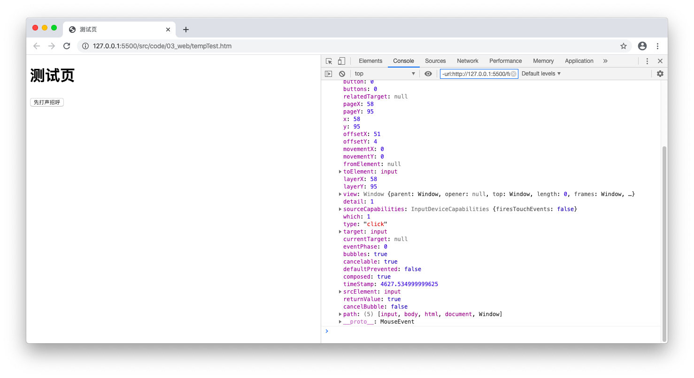
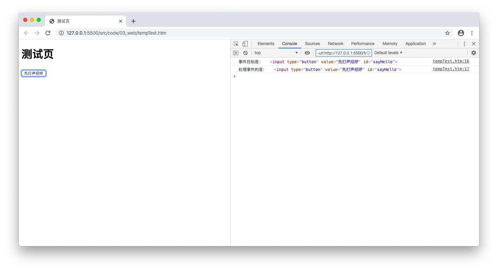

#! https://zhuanlan.zhihu.com/p/681104779

# 前端编程接口：事件处理

> 本文部分内容节选自笔者于 2021 年出版的[《JavaScript 全栈开发》](https://book.douban.com/subject/35493728/)一书。

在接下来的这篇笔记中，我们要来讨论一下 Web 浏览器支持的**事件驱动编程模型**。在这种模型的支持下，无论是 HTML 文档，还是 Web 浏览器本身都能以与桌面应用程序相同的方式处理用户的操作，从而使用户在使用 Web 应用程序时能沿用自己从使用桌面程序以来所形成的计算机操作习惯，不必从头开始熟悉新的操作方式，这很好地降低了 Web 应用程序的使用门槛。希望在阅读完这篇笔记之后，读者能：

- 了解前端事件的类型及其相关概念。
- 了解前端事件的传播方式与处理机制。
- 了解如何注册事件处理函数。
- 使用事件处理函数响应用户操作。

## 了解前端事件机制

虽然，笔者在[[JavaScript 学习笔记：进阶篇]]中已经介绍过了事件驱动模型的作用及其背后的运作原理，但对基于 JavaScript 的全栈开发来说，分清楚前/后端事件之间的界线，并让它们各自的职能也是一件非常重要的事。接下来，我们会先来具体讨论一下前端浏览器中的事件处理机制。

### 前端事件概述

按照标准规范的定义，与前端事件相关模块的实现规范应该属于 DOM 2 的一部分（后来 DOM 3 又做了一些增强），但由于历史原因，BOM 也同样支持一些事件，这些事件与 DOM 中定义的事件之间的关系长期以来都有些含糊不清。所以，前端事件在 Web 应用程序开发中一直是一个较为复杂的议题，颇需要花点时间来学习。下面，让我们先来厘清事件处理机制在执行过程中会涉及到的一些重要概念。

#### 事件处理中涉及的概念

首先，就像我们人类经常需要为“早上六点”设置闹钟，为“老婆生日”设置备忘录一样，浏览器在运行 Web 应用程序的过程中也会希望能在某个特定运行情景发生时收到类似的提示，这个需要设置提示的运行情景在编程术语上就被称之为“事件（event）”。在通常情况下，这些需要被特别关注的事件往往都与一些用户操作相关，例如鼠标单击、键盘输入、文档或窗口载入等操作。在这些操作发生或完成的瞬间。浏览器就会启动其预先设置的提示机制，这个启动提示机制的动作在编程术语上通常被称之为“事件触发（event trigger）”。

当一个事件被触发时，它就会被添加到被我们称之为“事件流（event stream）”机制中，该机制会负责在 DOM 树结构上传播该事件。而“事件传播（event propagation）”则主要有两种方式，它们分别是由 DOM 树结构的叶子节点向上传播的“事件冒泡（event bubble）”，和由 DOM 树结构的根节点向下传播的“事件捕获（event capturing）”。就目前实际运用情况来看，Web 浏览器在各页面元素之间传播事件时，基本上是两种方式并用的，先是采用事件捕获的阶段，再是采用事件冒泡的阶段。有关这些方面的内容，我们会在具体介绍前端事件传播方式时再做详细说明。

然后，事件传播路径上的各种页面元素上预先注册的响应函数就会“监听”到事件流中的相应事件，故而这些响应函数有时候也被称之为“事件监听器（event listener）”。事件监听器判断是否要对某一事件作出反应的依据有两个：首先是“事件类型（event type）”，它用于判断当前时间是否为该响应函数所要关注的运行情景，譬如鼠标单击、键盘输入等；其次是“事件目标（event target）”，它指的是当前事件具体针对的页面元素，例如被鼠标单击的按钮、接收键盘输入内容的文本框等。

最后，就像我们听到早上六点的闹钟响起时要“起床”、看到老婆生日的备忘提醒之后要赶紧去“买礼物”一样，我们注册的响应函数除了监听指定的事件何时被触发之外，还必须对该事件做出相应的反应动作，处理相关的任务。所以，这些响应函数在编程术语中更多时候被称之为“事件处理函数（event-handler function）”，而以上整个过程则被我们称之为“事件响应（event response）”。

#### 了解`event`对象

诚如各位所知，在 JavaScript 代码中，一切皆为对象，因此，事件在 JavaScript 脚本程序中也是以`event`类的实体来表示的。当然，与其他类型的对象不同的是：`event`对象**在通常情况下**不是一个由开发人员来定义的对象（在少数特定情况下，我们也会需要在脚本中用代码的形式直接模拟事件的触发，这时候就要手动创建`event`对象了），而是一个由浏览器在事件被触发的消息时自动生成的全局对象，它将作为实参被传递给事件处理函数。例如，下面我们可以稍微修改一下第 5 章曾经用过的那个前端示例，看看事件处理函数收到的怎么样的`event`对象：

```html
<!DOCTYPE html>
<html lang='zh-cn'>
    <head>
        <meta charset="UTF-8">
        <title>测试页</title>
        <script>
            function sayHello(eventObj) {
               console.log('Hello', eventObj);
            }
        </script>
    </head>
    <body>
        <h1>测试页</h1>
        <input type="button" 
            value="先打声招呼" 
            onclick="sayHello(event);">
    </body>
</html>·
```

我们可以在 Google Chrome 浏览器中打开上述代码所在的 HTML 文档，并鼠标单击页面上的按钮，然后就可以在浏览器的 JavaScript 控制台中看到如下输出：



如你所见，`event`对象的属性众多，并且根据具体的事件类型会有一些特点的属性，譬如对于鼠标单击或双击触发的事件，`event`对象中就会存在用于记录鼠标指针位置的属性，对于键盘输入触发的事件，`event`对象中就会设置用于记录用户按键的属性。关于这些属性，我们将会在介绍具体事件类型时再做说明。现在先来介绍一些所有事件都支持的常用属性和方法：

- **`detail`属性**：该属性返回的是`event`对象所代表事件的详细信息。

- **`isTrusted`属性**：该属性返回的是`event`对象所代表事件是否浏览器自动生成，如果是就返回 true，否则就返回 false，代表该`event`对象是由开发人员自己创建的。请注意，允许开发人员自行在 JavaScript 代码中创建`event`对象，是 DOM 3 新增的特性，由开发者自定义的`event`对象在以往的 JavaScript 代码中并不常见。

- **`type`属性**：该属性返回的是当前`event`对象所属的事件类型，例如`click`表示鼠标单击事件、`load`表示元素或文档加载事件等。

- **`target`属性**：该属性返回的是`event`对象所针对的事件目标，例如`input`表示的是当前 HTML 文档中的`<input>`元素。（请注意，在 IE 的早期版本中，相同的功能有可能使用的是`srcElement`属性。）

- **`currentTarget`属性**：该属性返回的是处理当前`event`对象的事件处理函数所属的页面元素，它与`target`属性是否指向同一个页面元素，取决于事件处理函数的具体设置，关于这一点，我们将在后面具体介绍前端事件处理时再做详细说明。

- **`bubbles`属性**：该属性返回的是当前`event`对象所代表事件的传播状态，返回 true 表示事件处于冒泡传播，返回 false 则代表浏览器已经禁止了该事件的冒泡传播。请注意，这是一个只读属性，也就是说，该属性的值是不能直接修改的，我们只能通过`stopPropagation()`方法来改变它的值。

- **`eventPhase`属性**：该属性返回的是当前`event`对象所处的事件传播节点，如果是捕获阶段，返回 1，如果位于事件目标上，则返回 2，如果处在冒泡阶段，就返回 3。

- **`defaultPrevented`属性**：该属性返回的是浏览器是否禁止了`event`对象所代表事件的默认行为，如果已经被禁止就返回 true，反之则返回 false。请注意，这也是一个只读属性，它的值只能通过preventDefault()`方法来更改。

- **`stopPropagation()`方法**：该方法用于通知浏览器禁止`event`对象所代表事件的冒泡传播，即将`bubbles`属性的值设置为 false。（请注意，在 IE 的早期版本中，相同的功能可能需要用`event.cancelBubble=false`这样的代码来实现。）

- **`stopImmediatePropagation()`方法**：当`event`对象所针对的事件目标上注册了多个事件处理函数时，这些函数在事件被触发时就会按照其注册的顺序全部执行。如果我们希望在执行了某个事件处理函数后就不再继续了，就应该在这个事件处理函数的最后调用该方法，这样在它后面注册的事件处理函数就不会被执行了。

- **`preventDefault()`方法**：该方法用于通知浏览器禁止执行`event`对象所代表的事件的默认行为（请注意，在 IE 的早期版本中，相同的功能可能需要用`event.returnValue=true`这样的代码来实现。）

关于`event`对象的传播方式，以及如何注册时间处理函数之类的问题，我们稍后会再做详细说明。在这里，我们希望读者能先对事件处理过程中所涉及到的概念，以及事件在 JavaScript 代码中的存在形式有个初步的认知。当然了，除了这些与事件有关的概念以及其在 JavaScript 代码中存在的形式之外，在执行真正的事件处理任务之前，我们还是需要先弄清楚`event`对象所属的具体事件类型。所以接下来，我们将以 Web 应用程序前端所支持的事件类型为切入点，逐步深入地介绍整个前端事件的具体处理机制及其使用方式。

### 前端事件类型

要想处理好前端事件，我们首先要了解浏览器环境支持哪些事件类型，毕竟对于不同的事件类型，我们有不同的处理方式。根据 DOM 3 的规范，在 Web 应用程序的前端可触发的常用事件主要可被分为用户界面事件、鼠标操作事件、键盘操作事件与焦点得失事件几大类不同的事件类型，每一类事件类型中都包括了几个由相同来源所触发的事件，下面就让我们来按照以上分类详细介绍一下这些事件类型：

#### 用户界面事件

用户界面事件通常指的是一些与用户操作没有直接关系的事件类型，例如针对窗口或文档的载入，窗口大小的调整等，这一类事件的触发来源不一定直接来自用户的操作，它们也可能由应用程序自己执行的操作来触发。而且严格来说，这类事件也不一定完全属于 DOM 标准的管辖范围，其中某些事件类型的目标很明确就是针对`window`对象的，而且早在 DOM 标准出现之前就已经被大量使用了，DOM 标准只不过在规范上对其进行承认，某种程度上更像是一种向后兼容。下面，我们逐一来介绍一下这些事件：

- **`load`事件**：该事件会在事件目标加载完成时被触发，其事件目标通常应该是一些加载到浏览器中需要一定时间的对象，它们既可以是 BOM 中的`window`对象，也可以是 DOM 中`<body>`、`<object>`、``等等元素对象。

- **`unload`事件**：该事件会在事件目标被完全卸载时触发，其事件目标既可以是 BOM 中的`window`对象，也可以是 DOM 中`<body>`、`<object>`、``等等元素对象，它们通常应该是一些需要在从浏览器卸载之后执行某种善后工作的对象。例如，在当前页面要跳转到下一页面时，当前页面中所加载的某些对象需要经历一个从浏览器中卸载的过程。这时候，我们如果需要接触这些对象对相关资源的引用，以防止某种程度的内存泄漏问题，就需要处理它们的`unload`事件了。
  
- **`abort`事件**：该事件会在事件目标被停止加载过时被触发，其事件目标既可以是 BOM 中的`window`对象，也可以是 DOM 中`<body>`、`<object>`、``等等元素对象，它们通常应该是一些加载时间较长的对象。例如，在实际 web 应用程序的设计中，开发人员会考虑到如果页面中的文件因体积过大、网速过慢等原因而导致加载时间过长的话，会损坏整个应用程序的用户体验。为了解决这个问题，他们通常会为这些可能需要加载很长时间的对象设置一个“停止加载”的选项，以便用户自行选择是否停止加载。这时候，如果我们想让应用程序在用户在选择停止加载时做出反应，就必须要处理相关对象的`abort`事件。

- **`error`事件**：该事件会在事件目标出错时被触发，其事件目标通常应该是一些需要在出错时让应用程序做出某些反应的对象。

- **`select`事件**：该事件会在事件目标中的内容被选中时触发，其事件目标通常应该是一些包含可被选中内容的对象，例如表单中的文本框元素。

- **`resize`事件**：该事件会在事件目标的大小被改变时触发，其事件目标通常是一些可在运行时调整大小的对象，例如 BOM 中的`window`对象。需要注意的是，各浏览器对该事件的理解存在着一些差异，例如 Google Chrome 的理解是事件目标的大小没变化 1 个像素就触发一次该事件，而 Mozilla Firefox 则认为要等事件目标调整大小的过程完成之后才触发该事件。这意味着，该事件的处理函数是有可能在事件目标调整大小的过程中被调用很多次的，所以该函数执行的操作不能太过复杂，否则将会严重影响应用程序的执行效率。

- **`scroll`事件**：该事件会在当前页面启用到滚动条功能时被触发，其事件目标即当前页面所对应的`window`对象。需要注意的是，和`resize`事件一样，由于各浏览器对事件的理解不一样，该事件的处理函数也同样会在启用滚动条功能的过程中被调用多次，因此它的操作也不能太过复杂，否则不利于应用程序的执行效率。

在用户界面类事件中，最常用的应该是`window`对象的`load`事件，通过为该事件注册处理函数，我们就可以确保相关操作是在当前页面中所有元素都加载完成之后执行的。例如在之前的代码中，如果我们不想将注册事件处理函数的动作直接放在“按钮”元素的 HTML 标签代码中，就可以将其放在`<head>`元素下面的`<script>`元素中，这时候，为了确保为“按钮”元素注册事件处理函数的动作在当前页面中的所有元素都加载完成之后执行，我们就得将该操作放在`window`对象响应`load`事件的处理函数中，具体代码如下：

```HTML
<!DOCTYPE html>
<html lang='zh-cn'>
    <head>
        <meta charset="UTF-8">
        <title>测试页</title>
        <script>
            window.onload = function() {
                const btn = document.querySelector('#sayHello');
                btn.onclick = function(event) {
                    console.log('Hello', event);
                }
            }
        </script>
    </head>
    <body>
        <h1>测试页</h1>
        <input type="button" 
            value="先打声招呼" id="sayHello">
    </body>
</html>
```

当然，这种注册事件处理函数的方式只是初步降低了 JavaScript 代码与 HTML 标签代码的耦合度，更完善的解决方案我们会等到具体介绍事件处理过程时再做详细说明。在这里，我们只是希望读者对`load`这类用户界面事件的作用有一个初步的认知。

#### 鼠标操作事件

鼠标是一种让计算机真正走入寻常百姓家的输入设备，正是因为它的出现，将抽象的计算机操作图形化的用户界面才能得以实现，并大大降低了计算机的使用门槛。而正如我们之前所说，在 Web 应用程序的开发中，前端扮演的正是用户界面的角色，因此处理鼠标操作触发的事件自然是它最重要的任务之一。下面，我们就逐一来介绍一下与鼠标操作相关的事件：

- **`click`事件**：该事件会在事件目标被被鼠标单击（通常是左键单击）时触发，其事件目标通常应该是当前页面上的所有可见元素，例如`<a>`、`<input>`、`<div>`等元素。当然，在相关元素获得焦点的情况下（我们稍后会介绍与焦点相关的事件），按下键盘上的回车键也同样可触发该事件。

- **`dblclick`事件**：该事件会在事件目标被被鼠标双击（通常是左键双击击）时触发，其事件目标通常应该是当前页面上的所有可见元素，例如`<a>`、`<input>`、`<div>`等元素。当然了，该事件在某些情况下也能通过在获得焦点的元素上按下键盘上的回车键或空格键来触发。
  
- **`mousedown`事件**：该事件会在鼠标在事件目标上按下任意键时被触发，它无法通过键盘来触发，其事件目标通常应该是当前页面上的所有可见元素，例如`<a>`、`<input>`、`<div>`等元素。

- **`mouseenter`事件**：该事件会在鼠标首次将屏幕上的光标移到事件目标所在区域时触发，它不支持冒泡传播，其事件目标通常应该是当前页面上的所有可见元素，例如`<a>`、`<input>`、`<div>`等元素。

- **`mouseleave`事件**：该事件会在鼠标将屏幕上的光标从事件目标所在区域移出时触发，它不支持冒泡传播，其事件目标通常应该是当前页面上的所有可见元素，例如`<a>`、`<input>`、`<div>`等元素。
  
- **`mousemove`事件**：该事件会在鼠标在事件目标所在区域内移动时触发，由于它会反复被触发，所以该事件的处理函数不能执行过于复杂的操作，否则可能会影响程序的执行效率。同样的，该事件无法用键盘触发，并且，其事件目标通常应该是当前页面上的所有可见元素，例如`<a>`、`<input>`、`<div>`等元素。  

- **`mouseout`事件**：该事件会在鼠标将屏幕上的光标从事件目标所在的元素移动到另一个元素时触发，在这里，其事件目标通常应该是当前页面上的所有可见元素，例如`<a>`、`<input>`、`<div>`等元素。而另一个元素既可以是事件目标的父元素，也可以是它的兄弟元素或者子元素。同样的，该事件无法通过键盘触发。

- **`mouseover`事件**：该事件会在鼠标将屏幕上的光标从另一个元素移动事件目标所在的元素时触发，在这里，其事件目标通常应该是当前页面上的所有可见元素，例如`<a>`、`<input>`、`<div>`等元素。而另一个元素既可以是事件目标的父元素，也可以是它的兄弟元素或者子元素。同样的，该事件无法通过键盘触发。
  
- **`mouseup`事件**：该事件会在鼠标在事件目标上释放任意按键时被触发，它无法通过键盘来触发。其事件目标通常应该是当前页面上的所有可见元素，例如`<a>`、`<input>`、`<div>`等元素。

- **`mousewheel`事件**：该事件会在鼠标在网页所在区域滑动滚轮时被触发，其事件目标可以是当前页面上的任意元素，并且采用冒泡传播方式向上传播，直至`doucment`对象和`window`对象。通常情况下，我们会在最顶层的`window`对象上注册该事件的处理函数。  

#### 键盘操作事件

键盘当然一直以来就是计算机的主要输入设备，即使在鼠标和触控设备大行其道的今天，键盘输入操作也是应用程序从用户那里获取相关数据的主要途径。所以，在 Web 应用程序的开发中，在前端处理好键盘操作以及文本输入触发的事件也是设计一个交互性良好的用户界面所必须的。下面，就让我们逐一来介绍一下这些与键盘操作相关的事件：

- **`keydown`事件**：该事件会在键盘上任何一个键被按下时触发，并且如果用户按住该键不松开，还会导致它被重复触发。其事件目标通常应该是当前页面中获得了焦点的元素，譬如文本框元素等。

- **`keyup`事件**：该事件会在键盘上任意一个键被松开时触发，其事件目标通常应该是当前页面中获得了焦点的元素，譬如文本框元素等。

- **`keypress`事件**：该事件会在键盘上任何一个字符键被按下时触发，并且如果用户按住该键不松开，还会导致它被重复触发。其事件目标通常应该是当前页面中获得了焦点的元素，譬如文本框元素等。
  
- **`textInput`事件**：该事件会在事件目标中被输入文本时触发，其事件目标必须是当前页面中可输入文本的元素。从某种程度上说，该事件可被视为视为是`keypress`事件的补充，它们之间的主要区别是，`keypress`事件会在所有获得了焦点的元素上被触发，而`textInput`事件则只能是可输入文本的元素，所以在响应文本框这类元素上的相关操作时，我们会建议优先注册`textInput`事件的处理函数。

#### 焦点得失事件

无论是鼠标还是键盘，在使用它们进行输入性操作之前，我们都必须要让操作对象进入等待输入的状态，譬如文本框获得输入光标、链接进入被选中状态等。在计算机操作术语中，我们将文本框中的输入光标、链接被选中后呈现的方框这类表示目标已经进入待输入状态的标记称之为“焦点”。程序用户界面上的各元素都可以在得失“焦点”时触发相关事件，以便告知用户自己是否处于可输入状态。下面，我们就逐一来介绍一下与焦点相关的事件：

- **`blur`事件**：该事件会在相关对象失去焦点时被触发，它在传播途径上不会采用冒泡方式。

- **`focus`事件**：该事件会在相关对象获得焦点时被触发，它在传播途径上不会采用冒泡方式。

- **`focusin`事件**：该事件会在相关对象获得焦点时被触发，但与`focus`事件不同的是，它在传播上会采用冒泡方式。

- **`focusout`事件**：该事件会在相关对象失去焦点时被触发，但与`blur`事件不同的是，它在传播上会采用冒泡方式。

通常情况下，我们会选择响应`focus`和`blur`这两个事件来处理与焦点相关的事务，毕竟它们存在于 JavaScript 代码中的历史较为悠久，所有的浏览器都对它们提供了完全的支持。只有在需要处理冒泡传播的焦点事件时，才会考虑后两个事件。例如，如果我们想在一个包含文本框元素的`<div>`元素上处理焦点得失事件，这时候就得注册`focusin`和`focusout`这两个事件的处理函数了。

当然，除了以上列出的这些常用事件，如今的 Web 页面还对触摸屏上的操作以及 DOM 上的节点变化做出事件响应。处于本章篇幅上的整体安排，这里就不对这些事件类型进行罗列了，如果读者在实际开发中需要处理这些事件，可自行去查阅相关的参考手册和标准规范。

### 前端事件传播

在了解了我们在 Web 应用程序的前端开发中可以响应哪些事件之后，接下来就可以具体地来介绍一下事件在 DOM 事件流中的传播方式，以及形成这种传播方式的技术与历史原因了。这些知识将是我们日后注册事件处理函数的重要基础。诚如大家所知。虽然 HTML 文档在内存中呈现的是一个树状的数据结构，但它在浏览器中实际呈现的是一个类似于同心圆的嵌套结构。这意味着，当我们在某一个页面元素上触发某个事件时，实际上也在该元素的外层元素上触发了相同的事件。例如，对于下面这个测试页面来说：

```HTML
<!DOCTYPE html>
<html lang='zh-cn'>
    <head>
        <meta charset="UTF-8">
        <title>测试页</title>
        <script>
            window.onload = function() {
                const btn = document.querySelector('#sayHello');
                btn.onclick = function(event) {
                    console.log('Hello', event);
                }
            }
        </script>
    </head>
    <body>
        <h1>测试页</h1>
        <div id="box">
            <input type="button" 
                value="先打声招呼" id="sayHello">
        </div>
    </body>
</html>
```

当我们单击`id`值为“sayHello”的按钮时，实际上也单击了`id`值为“box”的`<div>`元素和`<body>`元素，甚至也可以认为`document`和`window`这两个对象也被单击了，毕竟当你指着一组同心圆最内层那个圆的圆心时，事实上也指着所有圆的圆心。但问题是，到了 JavaScript 程序处理的 DOM 中，事件却是在一个树结构中传递，所以在处理事件时必须要考虑它在 DOM 事件流中的传播方式。如果事件从代表最外层元素的根节点向代表最内层元素的叶子节点传播，我们在外层元素上注册事件处理函数就会先于内层元素的事件处理函数被调用。在某种情况下，我们甚至可以在外层元素上“截获”事件，使其无法传递到内层元素，故而这种传播方式通常被我们称之为“事件捕获”。反之，如果事件从代表最内层元素的叶子节点向根节点传播，那么我们在内层元素上注册的事件函数就会先被调用，某种情况下也可以阻止事件“外溢”到外层元素上去，故而这种传播方式通常被称之为“事件冒泡”。

在 DOM 被标准化之前，微软 IE 浏览器的事件流采用的是“事件冒泡”的方式，具体到上述测试页面中，就是`click`事件会先在`id`值为“sayHello”的按钮元素上被触发，然后依次传递给`id`值为“box”的`<div>`元素、`<body>`元素、`document`对象（在某些情况下，某些事件还会被传递到`window`对象上）。而网景浏览器的事件流则采用了“事件捕获”的方式，传播路径正好相反。由于历史原因，这两大浏览器阵营都累积了不少项目，这些项目关系着许多企业和开发者的生计，因此 W3C 组织在制定 DOM 标准的时候无法轻易否定其中一种方式，于是采用了一种“向后兼容”的解决方案，即让事件先采用“事件捕获”的方式由代表最外层的根元素向内传，待事件抵达最内层叶子元素之后，再采用“事件冒泡”的方式将其传出来。这样一来，DOM 被标准化之前就存在所有的代码就都能继续工作了。

总而言之，DOM 标准将事件流的传播路径分成了三个阶段：首先是从根节点到事件目标节点的“事件捕获阶段”，然后是事件到达其目标节点时的“处于目标阶段”，最后是由事件目标节点再传回根节点的“事件冒泡阶段”。在这里，事件目标指的是事件被触发时其`event`对象的`target`属性所指向的元素节点。请注意，切实深入地理解事件在 DOM 中的传播方式是我们在具体处理事件之前必须做的功课，因为接下来，我们就该介绍如何根据事件在事件流中的传播方式来为相关的元素注册事件处理函数了。

## 注册事件处理函数

在了解了前端事件处理机制的运行方式之后，我们就可以来具体介绍如何注册事件处理函数了。在这一节的内容中，我们会为大家演示各种不同的注册事件处理函数的方法，并比较这些方法，以便读者能根据自己面对的具体情况来选择最合适的注册事件处理函数的方法。简而言之，在注册事件处理函数的过程中，我们主要将面对的是两个问题：首先要从编码层面上决定要在哪里注册事件处理函数，这个问题解决的是 HTML 与 JavaScript 之间的代码耦合度问题。然后我们还要从 DOM 结构层面决定应该讲事件处理函数注册在哪一个元素节点上，这个问题解决的是事件处理的具体业务逻辑。下面，我们先来解决编码层面的问题。

### 事件处理函数的编码方式

从编码层面来说，注册事件处理函数最简单粗暴的编码方式就是将用于响应事件的 JavaScript 代码直接写在 HTML 元素标签的事件处理属性中，这些属性的命名就是在相关的事件名称之前加上一个“on”前缀。正如我们之前所示范的，要想按钮元素响应`click`事件，就直接将用于响应的 JavaScript 代码写在代表按钮元素的`<input>`标签的`onclick`属性中，例如，我们想让按钮被单击时弹出一个消息对话框，就可以这样做：

```HTML
<!DOCTYPE html>
<html lang='zh-cn'>
    <head>
        <meta charset="UTF-8">
        <title>测试页</title>
    </head>
    <body>
        <h1>测试页</h1>
        <input type="button" 
            value="先打声招" onclick="alert('hello')">
    </body>
</html>
```

请注意，HTML 元素标签的事件处理属性本身就是一个事件处理函数，所以我们赋予它的值是该函数要执行的代码，而不是真正在定义一个函数，所以如果我们不想弹出对话框，而是想在控制台中输出相关信息，就可以将`onclick`属性的值改为`console.log('hello')`。但这种编写事件处理函数的方式就等于将 JavaScript 代码与 HTML 标签完全耦合在了一起，非常不利于代码的重复使用和后期维护。

幸运的是，HTML 标签的事件处理属性和其他标签属性一样，在对应的 DOM 元素对象上也有相应的事件处理函数，所以我们也可以像处理其他 HTML 元素标签一样，先赋予上面的按钮元素一个`id`：

```HTML
<!DOCTYPE html>
<html lang='zh-cn'>
    <head>
        <meta charset="UTF-8">
        <title>测试页</title>
        <script src="test.js"></script>
    </head>
    <body>
        <h1>测试页</h1>
        <input type="button" 
            value="先打声招呼" id="sayHello">
    </body>
</html>
```

然后就可以在其外链的 JavaScript 脚本文件中编写以下代码了，需要注意的是，这一回我们赋值给`onclick`属性的应该是一个完整的事件处理函数，像这样：

```JavaScript
const btn = document.querySelector('#sayHello');
btn.onclick = function() {
    alert('hello');
}
```

以上述方式编写的代码在运行结果上与之前直接在 HTML 标签中编写的方式是一样的，都是弹出一个带有“hello”信息的对话框。虽然这种方式需要编写的代码量好像比之前要多一些，但它实现了 JavaScript 代码与 HTML 标签的分离，降低了程序代码之间的耦合度，提高了代码的可重用度和可维护性。以笔者个人经验来看，与事后减少的维护工作量相比，这种低耦合的编码方式所增加的这点代码量简直可以忽略不计，

然而，以上这种注册事件处理函数的编写方式依然来自于 DOM 标准规范出现之前，虽然因其简单直观的编码分工至今仍被开发人员大量使用，但它在如今的 DOM 中有两个问题需要解决，首先，这种方式无法让开发人员自己来决定是在“事件捕获”阶段还是在“事件冒泡”阶段响应事件。其次，使用这种方式也无法为同一元素的相同事件注册多个事件处理函数。而真正符合 DOM 标准的注册事件处理函数的编码方式是使用以下两个定义在 DOM 2 事件模块中的接口：

- **`addEventListener()`方法**：该方法用于为当前元素添加事件处理函数，它有三个实参：第一个实参应该是一个字符串类型的值，用于指定要处理的事件名称，例如“load”、“click”等。第二个实参是一个函数类型的值，用设定响应事件的处理函数。第三个实参应该是个布尔类型的值，用于决定在事件传播的哪个阶段响应事件，当该值为 true 时，事件处理函数会在“事件捕获”阶段响应事件，但该值为 false 时则在“事件冒泡”阶段响应事件。例如，如果我们想用该方法注册之前的事件处理函数，就应该这样写:

    ```JavaScript
    const btn = document.querySelector('#sayHello');
    btn.addEventListener('click', function() {
        alert('hello');
    }, false);
    ```

  并且正如之前所说，我们还可以为相同元素的相同事件注册多个事件处理函数，像这样：

    ```JavaScript
    const btn = document.querySelector('#sayHello');
    btn.addEventListener('click', function() {
        alert('hello');
    }, false);
    btn.addEventListener('click', function() {
        console.log('hello');
    }, false);
    ```

  在这种情况下，浏览器在按钮元素上的单击事件被触发时会依照事件处理函数的注册顺序调用它们，具体到这里，就是会先弹出带有“hello”信息的对话框，然后再将该信息输出到控制台中。当然，这里只是为了演示，在实际开发中我们并不建议这样做。

- **`removeEventListener()`方法**：该方法用于为当前元素移除之前被注册的事件处理函数，它的实参列表与`addEventListener()`方法相同，第一个实参代表要处理事件的名称，第二个实参代表的是之前用`addEventListener()`方法注册的某个事件处理函数，第三个实参则用于指明要删除的事件处理函数响应的是哪一阶段的事件。需要注意的是，要想正确移除一个事件处理函数，该方法接收到的实参必须与用`addEventListener()`方法注册该事件处理函数时传递的实参完全一致。这意味着，我们不能在注册事件处理函数时使用函数的直接量，因为我们无法用下面这种方式来移除之前注册的事件处理函数：

    ```JavaScript
    btn.removeEventListener('click', function() {
        alert('hello');
    }, false);
    ```

  在执行上述代码之后，我们会发现之前注册的事件函数并没有被移除，因为两个值相同的函数直接量在 JavaScript 中依然会认为是两个不同的函数实体，所以如果我们想注册一个可被移除的事件处理函数，就应该这样做：

    ```JavaScript
    const btn = document.querySelector('#sayHello');
    const eventFunc = function() {
        alert('hello');
    };
    btn.addEventListener('click', eventFunc, false);
    // 执行一些其他操作……
    btn.removeEventListener('click', eventFunc,false);
    ```

在实际的 Web 应用程序开发中，大部分元素上对于某一事件的处理通常只需要注册一个事件处理函数即可，所以通常情况下我们会继续使用之前那种通过 DOM 属性的编码方式来注册事件处理函数。当然，如果我们对事件处理的业务逻辑有更为精细和复杂的要求，还是应该采用 DOM 标准定义的接口来注册事件处理函数。下面，我们来具体讨论一下应该如何设计事件处理的业务逻辑。

### 事件处理的业务逻辑

首先，我们需要决定在哪个元素上响应事件。正如我们之前所说，HTML 文档呈现在浏览器中的是一个类似于同心圆的结构，元素之间是层层嵌套的。例如，在我们之前讨论的这个 HTML 文档中：

```HTML
<!DOCTYPE html>
<html lang='zh-cn'>
    <head>
        <meta charset="UTF-8">
        <title>测试页</title>
    </head>
    <body>
        <h1>测试页</h1>
        <div id="box">
            <input type="button" 
                value="先打声招呼" id="sayHello">
        </div>
    </body>
</html>
```

当`id`值为“sayHello”的按钮元素被鼠标单击时，事实上`id`值为“box”的`<div>`和`<body>`也被单击了。这意味着，我们并不一定只能在按钮元素上处理单击事件，也可以在`<div>`元素上处理该事件。这时候，就会涉及到之前介绍`event`对象时提到的`target`和`currentTarget`这两个属性，下面我们就通过分别为按钮元素和`<div>`元素注册单击事件的处理函数来具体看看两者的差异。为了方便演示，我们这回选择直接将 JavaScript 代码添加到上述 HTML 文档中，具体如下：

```HTML
<!DOCTYPE html>
<html lang='zh-cn'>
    <head>
        <meta charset="UTF-8">
        <title>测试页</title>
    </head>
    <body>
        <h1>测试页</h1>
        <div id="box">
            <input type="button" value="先打声招呼" id="sayHello">
        </div>
        <script>
            const btn = document.querySelector('#sayHello');
            const div = document.querySelector('#box');
            const eventFunc = function(event) {
                console.log('事件目标是：', event.target);
                console.log('处理事件的是：', event.currentTarget);
            };
            btn.addEventListener('click', eventFunc, false);
            div.addEventListener('click', eventFunc, false);
        </script>
    </body>
</html>
```

在浏览器中打开上述 HTML 文档，并打开控制台界面，然后单击页面中显示“先打声招呼”字样的按钮，就会在控制台中看到如下输出：


由于我们在注册事件处理函数时传递的第三个实参都是 false，即在“事件冒泡”阶段处理事件，所以当按钮元素被单击时，首先被调用的是注册在按钮元素上的事件处理函数。这时候，`event`对象的`target`属性和`currentTarget`属性的值是一致的。但等`event`对象按照冒泡方式继续往上传播`<div>`元素上，调用注册在该元素上的事件函数时，其`target`属性值依然是按钮元素，而`currentTarget`属性的值就变成了事件函数所在的元素。由此可见，尽管用户在触发事件时会指定明确的事件目标，但我们依然可以在不同的元素上处理该事件。

当然，在实际开发中，我们通常不会同时在这两个元素上注册同一个事件的处理函数。而且为了提高效率，我们也可以在使用`addEventListener()`方法注册事件处理函数时将第三个实参设置为 true，这样`<div>`元素就会在“事件捕获”阶段先于按钮元素响应单击事件。另外，在内外层都选择在“事件冒泡”阶段响应事件的情况下，如果内层元素不希望事件冒泡到其外层元素中，可以在其事件处理函数中调用`event`对象的`stopPropagation()`方法终止冒泡传播。例如，我们可以这样修改一下之前的 HTML 文档：

```HTML
<!DOCTYPE html>
<html lang='zh-cn'>
    <head>
        <meta charset="UTF-8">
        <title>测试页</title>
    </head>
    <body>
        <h1>测试页</h1>
        <div id="box">
            <input type="button" value="先打声招呼" id="sayHello">
        </div>
        <script>
            const btn = document.querySelector('#sayHello');
            const div = document.querySelector('#box');
            const eventFunc = function(event) {
                console.log('事件目标是：', event.target);
                console.log('处理事件的是：', event.currentTarget);
                event.stopPropagation();
            };
            btn.addEventListener('click', eventFunc, false);
            div.addEventListener('click', eventFunc, false);
        </script>
    </body>
</html>
```

现在，如果我们再次在浏览器中执行上述 HTML 文档，就会在控制台输出中看到`<div>`元素上的事件处理函数已经不会被调用了：



所以，在决定了使用哪个页面元素响应事件之后，在可能的情况下，我们还应该适当考虑一下在事件传播的哪个阶段响应事件，并且是否要终止事件的传播，阻止其他元素也对相同的事件做出相应，这是我们在设计事件处理的业务逻辑时要解决的另一个问题。
