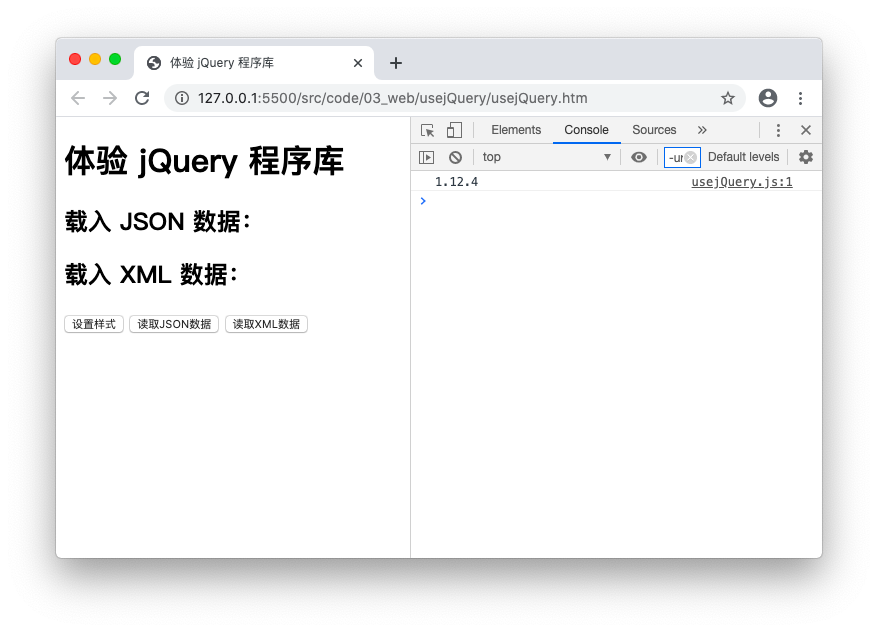
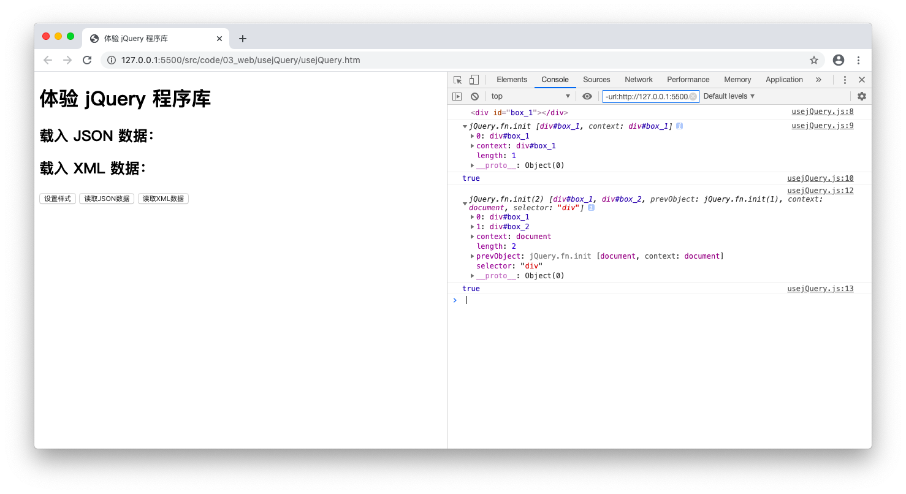
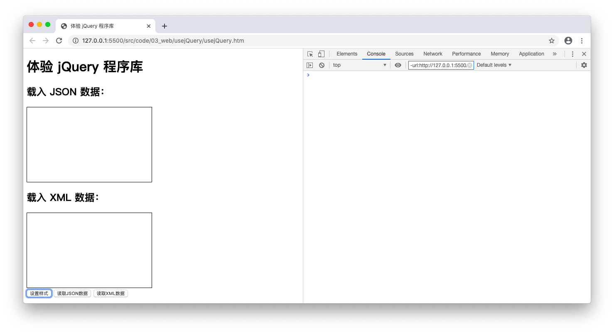

# jQuery 学习笔记

> 本文部分内容节选自笔者于 2021 年出版的[《JavaScript 全栈开发》](https://book.douban.com/subject/35493728/)一书。

众所周知，我们在使用 DOM 、BOM 以及`XMLHttpRequest`这些对象的接口进行编程时，很大一部分精力都花在将一些相关基础调用封装成工具函数这件事上，这样做有时单纯是为了提高代码的重用率，例如[[前端编程接口研究笔记：AJAX]]这篇笔记中封装的`ajax_get()`和`ajax_post()`这两个函数就是出于这方面的考虑，有时则是为了兼容新旧版本的浏览器，例如[[前端编程接口研究笔记：AJAX]]这篇笔记中用于创建`XMLHttpRequest`对象的`createXMLHttpRequest()`函数，和使用新老元素选择器接口来选择页面元素的`getElement()`函数都是基于这种考虑来设计的。从编程实践的角度来说，经常根据自己的任务需要来封装一些常用的函数和对象是一个不错的习惯，有助于提高我们的编码效率和程序本身对其执行环境的兼容性。

## 不要重复发明轮子

但在编程实践中，我们同时还应该遵守“不要重复发明轮子”这一基本原则。也就是说，在我们亲自动手封装一些函数之前，应该先查看一下当前 JavaScript 宿主环境的自带程序库以及一些流行的第三方 JavaScript 程序库中是否已经提供了类似功能的函数和对象。如果有的话，就不必再自己编写一个了，这样不仅可以避免重复劳动，节省时间，提高我们的编码效率，而且这些库提供的函数和对象往往具有更专业的实现，并经历过更严格的测试和优化，直接使用它们来完成相关任务也有助于改善程序本身的性能和安全性。

就本章讨论的 AJAX 编程来说，在如今琳琅满目的 JavaScript 前端程序库中，jQuery 是一个非常经典的存在，同时也是我们在实际编程中的一个不错的选择。下面，我们就以 jQuery 为例来演示一下如何用前端程序库来完成 AJAX 编程任务。

## 创建一个 jQuery 项目

要想体验 jQuery 提供的函数和对象，我们首先需要获取 jQuery 库的源文件，并将其加载到我们的 JavaScript 项目中。在实际编程实践中，我们获取 jQuery 库源文件的途径有很多种，既可以在命令行终端中打开项目目录并使用`npm install jquery`命令来下载它，也可以使用 CDN 的方式直接在`<script>`标签中引用它，例如下面就是几个我们经常会引用的 CDN 外链：

```HTML
<script src="https://cdn.staticfile.org/jquery/1.10.2/jquery.min.js">
</script>
<script src="https://apps.bdimg.com/libs/jquery/2.1.4/jquery.min.js">
</script>
<script src="https://upcdn.b0.upaiyun.com/libs/jquery/jquery-2.0.2.min.js">
</script>
```

但以上两种方式都比较依赖于开发者在工作当下所处的时空环境，毕竟我们谁也不能保证以上的 CDN 外链一直有效，或者 NPM 的资源仓库一直可用。所以最简单有效的方法，还是去`https://jquery.com/`这个 jQuery 的官方网站上去下载自己所需要的库源文件，该官方网站首页如下图所示：


如你所见，jQuery 的最新版本是 3.5.0，但我们这里是一个教学项目，通常会希望相关应用能兼容 IE8 之前的老版浏览器，且无需涉及 jQuery 库的最新特性，所以应该下载 jQuery的 1.12.4 这个版本，链接是：`https://code.jquery.com/jquery/#jquery-all-1.x`。需要注意的是，该库每个版本的下载都有压缩版和未压缩版两种。如果是在生产环境中，我们会希望项目中每个文件的体积都尽可能地小，以便浏览器能更快速的加载，这时候就应该选择压缩版。但如果是学习研究的用途，我们会希望库文件中的代码有很好的可读性，以及充分的注释信息，这时候就应该选择非压缩的版本。考虑到本项目的作用，笔者在这里选择了非压缩的版本，所以下载到了一个名为`jquery-1.12.4.js`的文件。

接下来，我们就可以来创建这个体验 jQuery 的项目了。首先，在`code/03_web/`目录下创建一个名为`usejQuery`的项目目录，并在该目录下再创建一个名为`js`的子目录，然后再将之气前下载的`jquery-1.12.4.js`文件放在这个子目录下。到了这一步，我们这个用于体验 jQuery 程序库的项目就算有了一个基本的架构，下面的问题就是该如何引用这个库在的函数和对象了。

首先要做的将 jQuery 库的源文件加载到程序中，我们可以在 HTML 文档中用`<script>`标签的`src`属性以外链的形式来加载它。具体步骤是，先在`code/03_web/usejQuery/`目录下新建一个名为`usejQuery.htm`的 HTML 文件，并在其中编写如下代码：

```HTML
<!DOCTYPE html>
<html lang="zh-cn">
    <head>
        <meta charset="UTF-8">
        <title>体验 jQuery 程序库</title>
        <script src="js/jquery-1.12.4.js"></script>
        <script defer="defer" src="js/usejQuery.js"></script>
    </head>
    <body>
        <noscript>
            <p>本页面需要浏览器支持或启用JavaScript。</p>
        </noscript>
        <h1>体验 jQuery 程序库</h1>
        <h2>载入 JSON 数据：</h2>
        <div id="box_1"></div>
        <h2>载入 XML 数据：</h2>
        <div id="box_2"></div>
        <input type="button" id="setStyle" value="设置样式">
        <input type="button" id="readJSON" value="读取JSON数据">
        <input type="button" id="readXML" value="读取XML数据">
    </body>
</html>
```

在这里需要注意的是，加载 jQuery 源文件的`<script>`标签必须放在所有存放或加载自定义 JavaScript 代码的`<script>`标签之前，以确保该源文件先于这些代码被载入到浏览器中。只有这样，我们才能正确引用 jQuery 库中定义的函数和对象。接下来，我们就可以在该项目的`js`子目录下新建一个名为`usejQuery.js`的脚本文件，并在其中编写使用 jQuery 库的代码了。例如，如果我们想验证该库的源文件是否已经成功，就可以在`usejQuery.js`文件中编写如下代码：

```JavaScript
console.log($.fn.jquery);
```

然后在浏览器中执行`usejQuery.htm`文件，如果在控制台中看到我们所使用 jQuery 库的版本号（在这里是 1.12.4），就说明该库的源文件已经成功载入了，效果如下图所示：



## jQuery 的简单入门

在使用 jQuery 库进行编程时。所有的动作都是从对`$()`函数的调用开始的。`$()`是 jQuery 库提供的一个全局工具函数，它的作用由其在被调用时接收到的具体实参来决定，具体情况如下：

- 当`$()`函数的调用实参是个 DOM 对象时，它就是一个对象封装器，负责将实参 DOM 对象封装成相应的 jQuery 对象，并将其返回，例如：

  ```JavaScript
  $(document);    // 将文档的 DOM 对象转换成相应的 jQuery 对象
  ```

  关于 DOM 对象与 jQuery 对象的区别，我们稍后会做详细说明。

- 当`$()`函数的调用实参是一个内容为 CSS 选择器的字符串时，它的作用就是一个元素选择器，在使用方式上基本与`querySelectorAll()`相同，但返回的是一个 jQuery 对象。我们可以用任何一种 CSS 元素选择语法来选取相关 HTML 文档中所有匹配的元素节点（可能是一个，也可能是多个），下面是`$()`函数在被当做元素选择器使用时的几个示范：

  ```JavaScript
  $('div');       // 选取页面上所有的 div 元素
  $('#box_1');    // 选取页面上所有 id 值为 box_1 的元素
  $('.call');     // 选取页面上所有的 class 值为 call 的元素
  $('div.call');  // 选取页面上所有的 class 值为 call 的 div 元素
  ```
  
  同样地，该函数返回的也不是 DOM 对象，而是一个将 DOM 对象重新封装过的 jQuery 对象。

- 当`$()`函数的调用实参是个内容为 HTML 代码的字符串时，它的作用就是创建并返回一个新的 jQuery 对象，其中封装了一个实参内容所描述的 DOM 对象。例如，如果我们想新建一个代表了`<h2>`元素节点的 jQuery对象，就可以这样做：

  ```JavaScript
  const newNode = $('<h2>二级标题</h2>');
  ```

- 当`$()`函数的调用实参是个匿名函数时，它的作用就是将该函数类型的实参注册为`document`对象的`ready`事件（在文档对象载入完成时触发））的一个事件处理函数，例如，如果我们在一个加载了 jQuery 库的 HTML 页面中编写如下 JavaScript 代码：

  ```JavaScript
  $(function() {
    alert('当前页面载入完成！')
  });
  ```

  那么当该页面被载入完成时，就会弹出一个显示“当前页面载入完成！”字样的对话框，我们常用它来替代`window.onload()`事件处理函数。

总而言之，无论`$()`函数的具体作用是什么，它在大多数情况下都会返回一个 jQuery 对象。正如我们在上面所说的，jQuery 对象是一个封装了 DOM 对象的实体。那么，它究竟是如何封装 DOM 对象的呢？对于这个问题，我们可以在之前创建的 jQuery 小项目中做个小小的分析，请在`usejQuery.js`文件中编写如下代码：

```JavaScript
const box_1 = document.querySelector('#box_1');
console.log(box_1);
console.log($(box_1));
console.log(box_1 === $(box_1)[0]);  // 输出：true

const divs = $('div');
console.log(divs);
console.log(box_1 === divs[0]);      // 输出：true
```

然后在浏览器中执行一下`usejQuery.htm`文件，其执行结果如下图所示：



现在，让我们来分析一下这段代码与它的输出结果。首先，我们用`querySelector()`选择器从页面中获取了一个`id`值为“box_1”的`<div>`元素节点，通过将其输出，可以确认这就是一个普通的 DOM 对象。接下来，我们输出了将该 DOM 对象封装之后的 jQuery 对象，从输出结果可以看到，该对象是一个类数组结构的实体，而被封装的 DOM 对象则似乎成为了该类数组对象中索引值为 0 的元素。为了证实这一猜想，我们直接对该 jQuery 对象使用了数组索引语法，取出其索引值为 0 的元素，并将其用`===`操作符与原先的 DOM 对象进行了比较，果然得到了输出 true 的结果。最后，我们又用`$()`作为选择器获取了页面中所有的`<div>`元素，并将其得到的 jQuery 对象输出。在输出结果中，我们果然看到了一个包含了两个 DOM 对象的类数组对象，并且其第一个元素也与我们最初获取到的 DOM 对象相等价。至此，我们就可以基本得出一个结论：**jQuery 对象是一个以元素形式封装 DOM 对象的类数组结构体**。

jQuery 将 DOM 对象重新封装成一个类数组对象，不仅可以重新定义一组操作 HTML 页面元素的方法，还可以利用数组结构的特性，让我们在 jQuery 对象调用的方法，对其数组结构中的每个元素产生作用。这种隐式迭代的效果免去了让我们许多需要显式编写循环迭代的麻烦。下面，我们就以为`usejQuery.htm`页面中的两个`<div>`元素设置统一的大小和边框为例，演示一下使用 jQuery 编程的基本风格，以及隐式迭代所带来的的方便、首先，让我们在`usejQuery.js`文件中添加如下代码：

```JavaScript
$('#setStyle').click(function() {
    $('div').css({
        'width' : '300px',
        'height': '180px',
        'border': '1px solid black'
    });
});
```

在上述代码中，我们首先为`id`值为“setStyle”的按钮元素注册了一个单击事件的处理函数。在 jQuery 编程方式中，为页面元素注册事件处理函数，只需要按照`[jQuery对象].[事件名称]([事件处理函数])`的语法格式编写即可。在这里，`[jQuery对象]`就是`$('#setStyle')`这个选择器调用返回的结果，而`[事件名称]`则是`click`事件。然后，在`[事件处理函数]`中，我们通过调用`$('div')`这个选择器调用获取到了包含页面中所有`<div>`元素的 jQuery 对象，然后对其调用`css()`方法。

在 jQuery 库中，`css()`方法的作用是获取和设置 jQuery 对象所对应 HTML 元素的`style`属性值。根据调用实参的不同，它有如下三种调用方式：

- 当我们需要获取 jQuery 对象所对应 HTML 元素当前的`style`属性值时，可以用无实参的方式调用`css()`方法，例如：

    ```JavaScript
    console.log($('#box_1').css());  
    ```

- 当我们需要为 jQuery 对象所对应 HTML 元素设置单个样式时，可以用两个字符串实参调用`css()`方法，第一个实参用于指定要设置的样式属性名，而第二个实参则用于指定对应的属性值，例如：

    ```JavaScript
    $('#box_1').css('backgroundColor', 'red');
    ```

- 当我们需要为 jQuery 对象所对应 HTML 元素设置多个样式时，可以用一个自定义对象作为实参调用`css()`方法，该对象的每个属性都是一个 CSS 样式，例如我们之前在`usejQuery.js`文件中使用的就是一个设置多个样式的调用：

    ```JavaScript
    $('div').css({
        'width' : '300px',
        'height': '180px',
        'border': '1px solid black'
    });
    ```

接下来，我们可以在浏览器中执行一下`usejQuery.htm`页面，然后单击该页面中显示“设置样式”字样的按钮，就看到其执行结果如下图所示：



如你所见，有了 jQuery 库的帮助，我们只需短短数行代码就完成了页面上所有`<div>`元素样式的设定。如果有兴趣的话，读者可以自行尝试一下，如果单纯使用 DOM 接口来未完成相同的任务，我们需要编写多少行代码。下面让我们回归主题，看看如何利用 jQuery 库来进行 AJAX 编程，实现浏览器与服务器之间的异步数据通信。

## 使用 AJAX 相关的接口

和我们之前在[[前端编程接口研究笔记：AJAX]]这篇笔记中封装的`ajax_get()`和`ajax_post()`函数一样，jQuery 库也对`XMLHttpRequest`对象的基本操作进行了封装，并将其定义成了`$`对象的`get()`、`post())`、`ajax()`等一系列采用`XMLHttpRequest`对象进行异步数据通信的方法。这意味着，基于“不要重复发明轮子”原则，其实我们是不需要自己来封装这些函数的，在实际编程中只需要引入 jQuery 这样的第三方库，就可以使用到这些封装得更专业，且经历过严格测试的工具。下面，我们就用`$.get()`方法分别来异步获取一下我们之前存储在`code/data`目录下的 JSON 数据和 XML 数据，并将这些数据加载到`usejQuery.htm`页面中，以此为例来演示一下如何使用 jQuery 库来进行 AJAX 编程。

首先，我们要在`usejQuery.js`脚本中为`usejQuery.htm`页面中`id`值为“readJSON”和“readXML”的两个按钮元素分别注册一个单击事件的处理函数，并在其中调用`$.get()`方法，具体代码如下：

```JavaScript
$('#readJSON').click(function() {
    $.get('../../data/hero.json', function(data, status) {
        if(status === 'success') {
            let jsonData = new Array();
            for(const item of data) {
                jsonData.push([item.name, item.age].join(':'));
            }
            $('#box_1').html(jsonData.join('<br>'));
        } else {
            $('#box_1').text('数据请求失败了！');
        }
    });
});

$('#readXML').click(function() {
    $.get('../../data/hero.xml', function(data, status) {
        if(status === 'success') {
            let xmlData = new Array();
            const heroes = data.querySelectorAll('hero');
            for(const hero of heroes) {
            const name = hero.querySelector('name').textContent;
            const age = hero.querySelector('age').textContent;
            xmlData.push(name + ':' + age);
            }
            $('#box_2').html(xmlData.join('<br>'));
        } else {
            $('#box_1').text('数据请求失败了！');
        }
    });
});
```

如你所见，`$.get()`方法的调用方式与我们自己封装的`ajax_get()`函数大同小异。相同之处是，它们都只需要提供两个实参，第一个实参用于指定被请求数据所在的 URL，第二个实参用于设置处理响应数据的回调函数。不同之处在于，这里的回调函数除了有一个接收响应数据的`data`形参之外，还有一个用于接收异步请求状态的`status`形参。异步请求的状态包括有"success"、"notmodified"、"error"、"timeout"、"parsererror"五种状态，我们在这里只用到了代表请求成功的状态，其他几种状态都或多或少地涉及到服务器端的处理，我们将会在本书的第三部分讨论它们。

除此之外，这里的回调函数接收到的响应数据是一个已经被解析好的对象。也就是说，当我们请求的是 JSON 数据时，`data`形参接收到的就已经是一个完成了解析、存储有 JSON 数据的普通 JavaScript 对象了。同样地，当我们请求的是 XML 数据时，`data`形参接收到的也已经是一个完成了解析、存储有 XML 数据的 DOM 对象了，这就免去了我们之前解析数据所花费的精力。

最后，读者应该也可以观察到调用 jQuery 对象方法所带来的变化。例如，我们在这里用 jQuery 对象的`text()`和`html()`方法代替了 DOM 对象`innerText`和`innerHTML`这两个属性，以此排除了因个别浏览器对 DOM 对象的个别属性不支持的情况（例如`innerText`属性）所带来的兼容性的问题。

接下来，我们就可以浏览器中执行一下`usejQuery.htm`页面，然后分别单击该页面中显示“读取 JSON 数据”或者“读取 XML 数据”字样的按钮，就会看到相应的数据显示在`id`值分别为“box_1”和“box_2”的`<div>`元素中，如下图所示：


当然，jQuery 库提供的方法远不止这些，即使是用于 AJAX 编程的方法也不止这些，如果想要更全面地介绍这个第三方程序库，可能需要另外写一本书。在这里，我们只是希望通过简单介绍 jQuery 库的基本用法和编程思维，让读者了解到“不要重复发明轮子”这一原则的重要性。如果读者需要更深入地了解并使用 jQuery 程序库，还需要去阅读更具针对性的专着。除此之外，读者还可以关注一些封装粒度更大的前端框架，例如，VueJS、AngularJS、ReactJS 等这些框架都提供了功能丰富的工具，给 Web 应用程序开发者们带来了很大便利，使他们从琐碎的基层调用及其兼容性问题中解脱出来，将更多的精力放在应用程序本身的功能设计与实现上。
