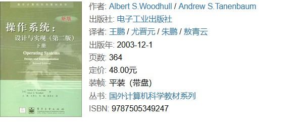
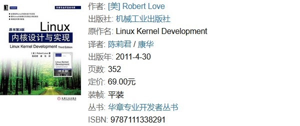
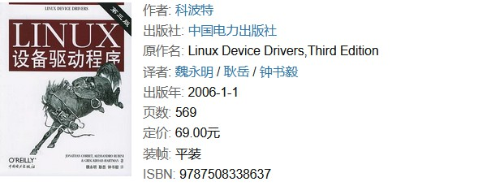
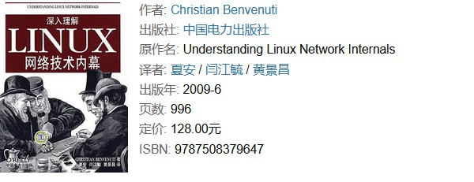
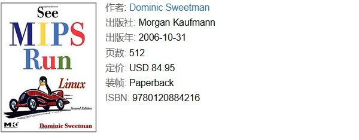
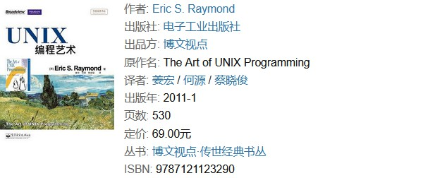

# 关于类 UNIX 系统的学习及其推荐书目

只要稍加留意，读者可能就会发现这样一个事实：在我们日常所使用的各类计算设备中，除了采用 IBM PC 体系的个人计算机之外，几乎所有的设备上运行的操作系统大多都属于类 UNIX 系统，例如 Apple 设备、许多路由器产品中运行的几乎都是 *BSD 的操作系统，各种 Android 设备、主流服务器上运行的都是以 Linux 为内核的操作系统。关于类 UNIX 系统在非 PC 端操作系统的市场中所占据的这种主导地位，很多解释都倾向于认为是 Windows 系统的可扩展性差、不够安全之类等缺点导致的，个人认为这种说法多少有点倒果为因了，事实上不过是因为这两类操作系统在相关领域存在着先来后到的历史事实，且先来者有权制定行业标准罢了。下面，就让我们先来简单回顾一下类 UNIX 系统的发展历史吧。

## 发展历史及其影响

总体而言，人类研发操作系统的动力主要源自于我们在使用计算机时的“偷懒需求”。在计算机发展的启蒙时代，计算机上执行的任务都是靠人工来编排的。而随着要执行的计算任务越来越多，这种人力编排的方式就越来越无法体现使用计算机的效率优势了，于是能实现自动化任务编排的批处理系统就应运而生了，而这就是最早的计算机操作系统。但这类系统也只是解决了任务在执行顺序上的编排问题，解决不了任务在等待用户输入期间的计算资源闲置问题，于是人们就继续研发出了能更合理分配计算资源的分时任务系统。而分时系统的出现也赋予了计算机同时应对多个用户的功能，这项功能使得不同的用户可以在同一时间段内共享同一台计算机上的资源，这正是当今绝大部分非 PC 端操作系统的原型。

再然后，随着越来越多型号各异的计算机设备被生产出来，且这些设备的厂商都会为其配上专用的操作系统（例如，今天的 Apple 公司依然在坚持这个做法），这意味着用户一旦需要更换不同型号的计算机，就不得不学习新的操作系统，这是非常不利于计算机设备的普及的。为了解决这一问题，可移植的、分时操作系统的概念就应运而生了。这一概念倡导让操作系统独立于硬件来实现，以求在不同硬件上提供相似的用户体验。这类操作系统的开发最早源自一个叫做 Multics 的项目，结果这个项目因为在设计目标上的野心过大，开发进度过于缓慢而被撤销 。贝尔实验室的 Brian Kernighan 和 Dennis Ritchie 二人在撤出 Multics 项目之后，在该项目的设计上做了减法，搞出了 UNIX 系统（附带着发明了 C 语言）。

令人遗憾的是，后来 UNIX 因为美国的反垄断法令和 AT&T 一系列错误的决策导致了该系统在市场上的推广问题。于是，为了绕开相关法律对科研工作的干扰，加州大小伯克利分校重新实现了 UNIX 的 API，发展出了被称之为 *BSD 的类 UNIX 系统，包括 FreeBSD、NetBSD、OpenBSD 等，其中有个系统叫 Darwin，Apple 公司就是基于它开发出了 macOS、iOS、tvOS 等一众产品的操作系统。除此之外，还有一位荷兰的大学教授 Andrew S. Tanenbaum 出于教学的需要，也基于 UNIX 的 API 开发出了一个叫做 MINIX 的操作系统，而该系统又启发 Linus Torvalds 开发出了 Linux 内核项目，而后者正是 Ubuntu、RedHat、Android 等一众操作系统的内核。

在上述发展过程中，业界共同制定出了 POSIX 标准。POSIX 这个名称是由 Richard Stallman 应 IEEE 的要求而提议的一个易于记忆的名称。其中，POSI 是 Portable Operating System Interface（中文可译为“可移植操作系统接口”）的英文缩写，而 X 则表明其对 UNIX API 的传承。这个名称实际上是 IEEE 为要在各种 UNIX 操作系统上运行软件，而定义的一组相关 API 标准的总称， 该标准可以使得各个类 UNIX 操作系统之上的 C 程序重新编译即可运行，无需修改代码。也正是因为有了 POSIX 标准，原本就致力于重新实现 UNIX 接口的 Linux 项目、BSD 项目才能凭借着开源的优势迅速在非 PC 端的操作系统市场上占据了主导地位。另一方面，Windows 系列操作系统则因为早期专注于 PC 领域，忽视了对 POSIX 标准的遵守，因而失去了进入服务器、移动设备以及路由器等网络设备市场的先机，成为了后来者。

关于上面这一段历史的详细细节，读者也可以通过《UNIX 传奇》这本书来聆听一下 Brian Kernighan 作为历史亲历者的讲述。

## 规划学习路线图

在了解了类 UNIX 系统在计算机世界中的影响力之后，读者就应该目标了学习和研究它的必要性，但紧接着要面对的一个问题是：类 UNIX 系统是一个非常庞大的知识体系，我们该从何处入手呢？在笔者个人看来，从 Linux 内核项目的研究开始是一个参考资料充足，可行性很高的选择。接下来，我将会以推荐书目的形式来为读者规划一个研究 Linux 内核项目的学习路线图，以供参考：

如果读者要想在操作系统这个领域行稳致远，首先需要对它的基本概念有一个全局性的了解，这方面的研究可参考《操作系统：设计与实现》这本书， 该书的作者  Andrew S. Tanenbaum 基于教学目的开发出了 MINIX 这个经典的承载着头，个人认为他的讲解是非常具有说服力的。  

在深入地理解了操作系统的基本概念以后，接下来就可以开始研究 Linux 的内部运行机制了。在这个方面可参考《Linux 内核设计与实现》这本书，该书将从概念上讲解 Linux 的运行机制。  

- 在 Linux 内核运行机制有了一定的了解之后，就可以开始具体研究 Linux 内核源码了。这方面最值得推荐的书籍是《深入理解 Linux 内核》这本书。在学习这本书时切记需要搭配 Linux 的内核代码一起研究，这将会是一个非常漫长，且需要一步一个脚印的过程。  
    

- 在理解了 Linux 的内核实现之后，我们就可以选择一个具体的开发方向来进行下一步深入研究了。如果想研究设备驱动程序的开发，就可以参考《Linux 设备驱动程序》这本书。如果想从事网络方面的开发，则可以参考《深入理解 Linux 网络技术内幕》这本书。需要指出的是，如今与 Linux 内核相关的工作，大多集中在一些嵌入式开发领域。所以，我们通常还需要阅读一些介绍主流 CPU 体系架构的资料。例如，ARM 就看对应的芯片手册，而 MIPS 可以参考 《See MIPS Run》这本书（第一、第二版都可以）。  
    

    

    

除此之外，如果读者想在类 UNIX 系统的应用层编程方面有所作为，也可以选择性地阅读以下书籍：

- 在编程思想方面，我要推荐的是《UNIX 编程艺术》，该书会系统性地为读者介绍类 UNIX 系统的设计哲学、思想文化体系、编程原则与经验。  
    

- 在编程实践方面，我要推荐的是《UNIX 环境高级编程》，如果能把该书中的示例都实践一遍，我们就会对整个 UNIX/Linux 的应用层编程有系统性的认识。  
    

- 如果条件允许，我也会建议系统性地学习一下《UNIX 网络编程（卷 1-2）》这套书，这样一来，在应用层面上从事与网络应用相关的开发工作就基本上应该不会有太大的问题了。  
    

    

## 结束语

在本文的最后，我想与读者共勉的是：请时刻提醒自己，千万不要因为类 UNIX 系统的复杂性而产生畏难情绪，我们要做的只是一步一个脚印地心无杂念地研究下去即可，研究本身就会给人带来极大的快乐与成就感。重点是不要被当下浮躁的社会风气影响，多把时间花在对自己更有意义的事情上。
