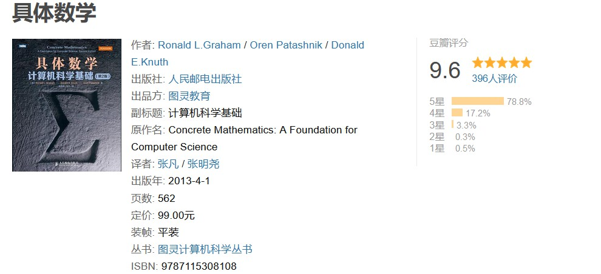
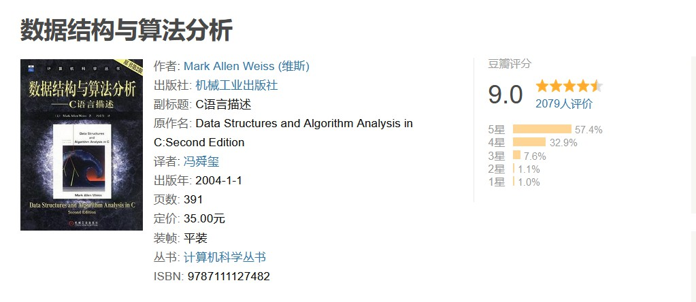

# 关于计算机算法及其书籍推荐

如果提起最近火爆了整个互联网的 ChatGPT 聊天机器人，我们会发现人们的讨论大部分都集中在它**疑似**接近于突破图灵测试的使用体验，以及由此引发的科学伦理等问题上。这些讨论虽然看起来很热闹，但实际上却陷入了“娱乐至死”的媒体陷阱（关于这些议题，我曾经在另一篇题为《[[人工智能的可怕与不可怕]]》的文章中讨论过，读者如有兴趣可自行参考），真正能起到决定性因素的应该是该机器人的研发团队所采用的机器学习模型。而无论机器学习模型采用的是基于决策树的实现，还是基于人工神经网络的实现，它本质上都取决于计算机科学家们的算法设计与实现能力。

但令人遗憾的是，如今大部分的算法教学都只关注于如何应付学校的考试、公司的面试或者 LeetCode 之类的竞赛游戏，因而在学习方法上往往就流于对一些经典算法的死记硬背，以及应试教育中常见的题海战术。虽然这些做法能满足一些“授之以鱼”的即时需求，但从长期来看，如果我们的专业教学做不到“授之以渔”，以至于让我们的专业人才缺乏在面对实际生产或科研环境时的算法设计技能，是无法在人工智能领域中掌握核心竞争力的。毕竟，无论我们的目的是想安抚自身的恐惧并对机器的学习能力加以限制，还是决定让它自由发展并将结果交由演化论来决定，需要的技能是一样的。在这篇文章中，我们将聚焦于算法领域的讨论，并以推荐书目的形式来为读者规划在这一课题上的学习路线图，以供参考。

## 计算机算法简介

在计算机科学上，算法（Algorithm）指的是一组被预先定义好内容与先后顺序的、并可交由计算机执行的有限操作步骤，目的是用计算机解决与数值计算、数据处理、自动推理等相关领域的问题。具体而言，我们可以将算法视为一个将交由计算机设备执行的指令清单，计算机设备在执行该清单时通常会从一个初始状态和初始输入（如果存在初始输入的话）开始，然后经过一系列有限且清晰定义的状态，最终产生输出并归于某个终止状态。根据 Donald Knuth 在他的著作《计算机程序设计艺术》里的描述，我们在进行算法设计时需满足以下要求：

- 该算法必须要有零个或以上输入量，用于提供计算机执行指定操作步骤之时所需要的数据。
- 该算法通常还应有一个或以上输出量，用于反馈计算机执行指定操作步骤之后得到的结果。
- 对算法的描述必须做到无歧义，保证算法的实际执行结果是精确地符合其设计者的预期。
- 对算法的定义必须在有限的操作步骤内完成，且这些操作必须具备实际可行性。

对于算法设计的成效，我们通常会用一种被称之为“复杂度”的度量衡来进行评估。而算法复杂度的计算方法又可分为时间复杂度与空间复杂度两种，具体如下：

- **时间复杂度**是一个函数，用于表示计算机执行一个算法所需要消耗的时间资源，常用大 O 渐进上界记法来表述。在具体使用时，由于相同大小的不同输入值仍可能造成算法的执行时间不同，因此我们通常会选择采用算法在最坏情况下的时间复杂度，并将其记为 $T( n ) = O( f( n ) )$。在这里，$T( n )$代表的是该算法执行需要的最大时间，而$f( n )$则是它具体执行时间的计算公式中所用到的首项式（去除其中的低阶项和首项系数）。例如，如果一个算法的输入规模为`n`，它需要的具体执行时间是$2n^2+5n$，那么我们就可以将该算法的的时间复杂度标记为：$T ( n ) = O ( n^2 )$。在日常算法设计工作中，常见的时间复杂度如下：

    

- **空间复杂度**是一个与时间复杂度类似函数，由于表示计算机执行一个算法所需要消耗的空间资源。空间复杂度的计算与时间复杂度基本相同，我们通常也使用大 O 渐进上界记号来表述一个算法最坏的情况。在日常算法设计工作中，常见的空间复杂度有： $O( n )$、$O( n \log n )$、$O( n^α )$、 $O(  2^n )$等；其中`n`用来表示输入的长度。就像时间复杂度的计算不考虑算法所使用的空间大小一样，空间复杂度也不考虑算法运行需要的时间长短。

总体上来说，同时间复杂度相比，空间复杂度的分析要简单得多。

## 学习路线规划

在了解了计算机算法的基本概念、设计要求及其评估方法之后，我们就可以根据自己的需要来进行学习路线的规划了。根据个人的经验。我在这里会建议读者：首先，夯实在进行算法设计工作时所需要的数学基础，这部分的主要内容包括微积分、线性代数、离散数学与概率论；然后，在数据结构的设计与实现能力上要有一个扎实的基本功，至少要了解数组、链表、哈希表、树、图等数据结构在计算机内存中的存在形式，以及它们在存取数据时各自所拥有的优势；最后，从设计方法的角度来学习算法，掌握面向具体问题来设计并实现算法的能力，至少要了解遍历法、分治法、动态规划、线性规划以及贪心算法等常见的算法设计模式。下面，让我们基于上述建议来做一些具体的学习建议和书籍推荐，以供读者参考。

### 数学基础

关于学习计算机算法是否需要专门进行一些数学基础的学习，人们一直以来都有一些不同意见，其中有很大一部分意见认为，算法只是我们用计算机解决问题的步骤设计，与数学并没有什么直接的关系。但事实上，设计使用计算机解决问题的步骤需要我们具备很好的逻辑思维，而这种逻辑思维的训练本质上都需要通过数学来完成。例如，平面几何训练的是空间建模的能力，我们在解决与树结构、图论相关的算法时会用得着它们。线性代数训练的是求取最优解的能力，我们在使用动态规划等方式设计算法时使用的就是这样的能力。另外在大数据和人工智能领域，我们的许多算法更是需要直接基于马尔可夫模型、贝叶斯函数等统计学理论来进行设计。所以，如果读者想要在算法设计的能力上行稳致远，扎实的数学功底是必须要要具备的基础能力。

在培养上述基础能力时，我个人会强烈推荐读者阅读 Donald Knuth 的另一本著作：《具体数学》。这本书将会很好地帮助读者整理并加强计算机专业所需的数学知识，其中的内容会涉及求和函数、取整函数、数论、二项式系数、特殊数、母函数（发生函数）、离散概率、渐近等专项问题的解题思维，非常适合于从事计算机科学、计算数学、计算技术诸方面工作的人员，以及高等院校相关专业的师生。

### 数据结构

由于一直以来许多计算机基础教程都会将数据结构和算法放在一起来教学，以至于让很多初学者先入为主地认为数据结构的设计与实现就是算法设计的一部分。但事实上，这种理解是不准确的，因为数据结构和算法在我们使用计算机解决问题时起到的作用是完全不同的。众所周知，我们在使用计算机解决一个问题时，编写程序通常需要经历以下两个步骤：

- 分析问题，从问题中提取出有价值的数据，将其以某种便于操作的形式存储到计算机中；
- 根据计算机中存储的数据制定解决问题的操作步骤，并让计算机执行这些操作，从而获得问题的答案；

在上述步骤中，数据结构主要负责的是第一步，即数据在计算机中的存储形式。这一部分中，我们需要做的就是针对数据不同的逻辑结构和物理结构选出最优的结构形式来存储这些数据。而剩下的第二个步骤，则就属于算法设计的职责范围了。由此可见，数据结构用于解决数据存储问题，而算法用于处理和分析数据，它们是彼此独立的两门学科。

当然，也因为这两门学科在编程过程中所发挥的上述作用，我们应该更倾向于将数据结构和算法理解成“互利共赢、1+1>2”的关系。具体来说就是，在解决问题的过程中，数据结构的设计要配合算法设计，尽可能地选择一种最适合于执行算法的结构形式来存储数据，而算法的设计也要充分考虑各种数据结构在数据存取操作上的优点和缺点，用最优的策略来分析并处理数据，由此可以最高效地解决问题。在这一方面，我个人会推荐读者认真阅读一下《数据结构与算法分析（C 语言描述）》这本书。

值得一提的是，虽然这本书也提到了一些与数学基础与算法设计相关的内容，在本文推荐的书单中也具有不错的、承前启后的作用，如果读者只有浅尝辄止的需求，单就这一本书也能解决大部分问题。但也务必要记得，我们对这本书的关注重点依然应该放在数据结构的设计与实现上，即在这一部分的学习中，读者需要重点了解的是：数组这类顺序存储的结构在数据遍历上的优势、链表这种链式存储的结构在数据随机插入和删除上的优势，亦或是哈希表、二叉树在数据搜索方面的优势等。

### 算法学习

在学习算法的过程中，我们需要重点学习的不是如何在面试时快速、优雅地实现快速排序、冒泡排序、二分搜索等常用算法（这些技能帮助你得到一份工作，但不能保证你在 35 岁之后不被裁员)，而是要掌握在执行算法设计时常用的设计模式，并选择合适的实现方法将这些模式运用到实际的生产与科研环境中去。其中，常用的算法设计模式包括：

- **遍历法**：当我们确定问题的解属于某个有限的离散解空间，且是可以被验证正确性和最优性时，最简单的做法就是把该解空间的所有元素完全遍历一遍，逐个检测元素是否是目标问题的解。这是最直接的算法设计方式，实现往往最简单。但是当解空间特别庞大时，这种算法很可能导致工程上无法承受的计算量。
- **分治法**：该设计模式主张把一个问题分割成互相独立的多个部分分别求解的思路，这种求解思路带来的好处之一是便于进行并行计算。
- **动态规划法**：当目标问题的整体最优解就是由局部最优解组成的时候，我们就会经常采用这一设计模式来设计算法。
- **线性规划法**：在数学中，线性规划（Linear Programming，简称LP）特指目标函数和约束条件皆为线性的最优化问题。
- **贪心算法**：当目标问题的整体最优解不是（或无法证明是）由局部最优解组成，且对解的最优性没有要求的时候，可以采用的一种方法。

而在算法的具体实现方面，我们常常使用的方法包括：递归/迭代方法、顺序计算、并行计算和分布式计算等，它决定的是算法使用计算机设备的方式及其可能用到的资源。关于这两个方面的学习，我个人推荐读者去阅读《算法导论》这本经典著作。这本书作为麻省理工学院在计算机算法教学上的御用教材，它很好地将严谨性和全面性融为一体，深入讨论各类算法，并着力使这些算法的设计和分析能为各个层次的读者接受。全书各章自成体系，可以作为独立的学习单元；算法以英语和伪代码的形式描述，具备初步程序设计经验的人就能看懂；说明和解释力求浅显易懂，不失深度和数学严谨性。

## 结束语

最后，如果读者是时间比较充裕的、对编程工作有着极大兴趣和热情的年轻人，我个人会建议你们应该要找一段时间，静下心来好好地阅读一下《计算机程序设计艺术》这套尚未完结就已经堪称伟大的著作（至少读完它的第一卷），让 Donald Knuth 带着你们对计算机算法的数学基础，设计理论等方面来一次全面彻底的、脱胎换骨式的学习。

当然了，算法设计的工作性质就注定了这是一条漫长而又苦涩的学习之旅。之所以漫长，是因为有关算法的学习是无穷无尽的。之所以是苦涩，是因为算法的学习过程与数学非常类似，它对人的耐心和智力是有一定要求的，相较于一些“开箱即用”的开发框架而言，算法学习在编程能力上的提高效果是不会那么立竿见影的。但是，如果你们不想经历程序员之间口耳传说的“35 岁之劫难”，掌握好算法的设计与实现能力，是非常有助于提高自己在企业和科研单位中的不可替代性的，这是每一个真正的程序员必须要经历的历练。

----
#待深入
