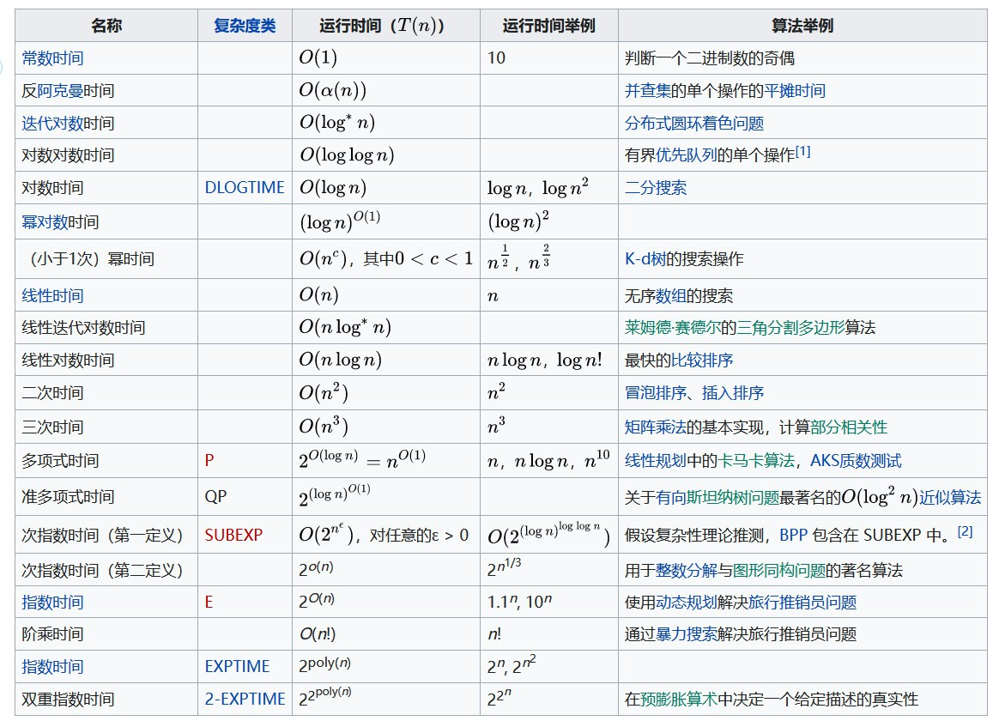

# 关于计算机算法及其书籍推荐

如果提起最近火爆了整个互联网的 ChatGPT 聊天机器人，我们会发现人们的讨论大部分都集中在它**疑似**接近于突破图灵测试的使用体验，以及由此引发的科学伦理等问题上。这些讨论虽然看起来很热闹，但实际上却陷入了“娱乐至死”的媒体陷阱（关于这些议题，我曾经在另一篇题为[《聊聊人工智能的可怕与不可怕》](https://zhuanlan.zhihu.com/p/369256342)的文章中讨论过，读者如有兴趣可自行参考），真正能起到决定性因素的应该是该机器人的研发团队所采用的机器学习模型。而无论机器学习模型采用的是基于决策树的实现，还是基于人工神经网络的实现，它本质上都取决于计算机科学家们的算法设计与实现能力。

但令人遗憾的是，如今大部分的算法教学都只关注于如何应付学校的考试、公司的面试或者 LeetCode 之类的竞赛游戏，因而在学习方法上往往就流于对一些经典算法的死记硬背，以及应试教育中常见的题海战术。虽然这些做法能满足一些“授之以鱼”的即时需求，但从长期来看，如果我们的专业教学做不到“授之以渔”，以至于让我们的专业人才缺乏在面对实际生产或科研环境时的算法设计技能，是无法在人工智能领域中掌握核心竞争力的。毕竟，无论我们的目的是想安抚自身的恐惧并对机器的学习能力加以限制，还是决定让它自由发展并将结果交由演化论来决定，需要的技能是一样的。在这篇文章中，我们将聚焦于算法领域的讨论，并以推荐书目的形式来为读者规划在这一课题上的学习路线图，以供参考。

## 计算机算法简介

在计算机科学上，算法（Algorithm）指的是一组被预先定义好内容与先后顺序的、并可交由计算机执行的有限操作步骤，目的是用计算机解决与数值计算、数据处理、自动推理等相关领域的问题。具体而言，我们可以将算法视为一个将交由计算机设备执行的指令清单，计算机设备在执行该清单时通常会从一个初始状态和初始输入（如果存在初始输入的话）开始，然后经过一系列有限且清晰定义的状态，最终产生输出并归于某个终止状态。根据 Donald Knuth 在他的著作《计算机程序设计艺术》里的描述，我们在进行算法设计时需满足以下要求：

- 该算法必须要有零个或以上输入量，用于提供计算机执行指定操作步骤之时所需要的数据。
- 该算法通常还应有一个或以上输出量，用于反馈计算机执行指定操作步骤之后得到的结果。
- 对算法的描述必须做到无歧义，保证算法的实际执行结果是精确地符合其设计者的预期。
- 对算法的定义必须在有限的操作步骤内完成，且这些操作必须具备实际可行性。

对于算法设计的成效，我们通常会用一种被称之为“复杂度”的度量衡来进行评估。而算法复杂度的计算方法又可分为时间复杂度与空间复杂度两种，具体如下：

- **时间复杂度（Time complexity）**是一个函数，用于表示计算机执行一个算法所需要消耗的时间资源，常用大 O 渐进上界记法来表述。在具体使用时，由于相同大小的不同输入值仍可能造成算法的执行时间不同，因此我们通常会选择采用算法在最坏情况下的时间复杂度，并将其记为 $T( n ) = O( f( n ) )$。在这里，$T( n )$代表的是该算法执行需要的最大时间，而$f( n )$则是它具体执行时间的计算公式中所用到的首项式（去除其中的低阶项和首项系数）。例如，如果一个算法的输入规模为`n`，它需要的具体执行时间是$2n^2+5n$，那么我们就可以将该算法的的时间复杂度标记为：$T ( n ) = O ( n^2 )$。在日常算法设计工作中，常见的时间复杂度如下：

    

- **空间复杂度**是一个与时间复杂度类似函数，由于表示计算机执行一个算法所需要消耗的空间资源。空间复杂度的计算与时间复杂度基本相同，我们通常也使用大 O 渐进上界记号来表述一个算法最坏的情况。在日常算法设计工作中，常见的空间复杂度有： $O( n )$、$O( n \log n )$、$O( n^α )$、 $O(  2^n )$等；其中`n`用来表示输入的长度。就像时间复杂度的计算不考虑算法所使用的空间大小一样，空间复杂度也不考虑算法运行需要的时间长短。

总体上来说，同时间复杂度相比，空间复杂度的分析要简单得多。

## 学习路线规划

在了解了计算机算法的基本概念、设计要求及其评估方法之后，我们就可以根据自己的需要来进行学习路线的规划了。根据个人的经验。我在这里会建议读者：首先，夯实在进行算法设计工作时所需要的数学基础，这部分的主要内容包括微积分、线性代数、离散数学与概率论；然后，在数据结构的设计与实现能力上要有一个扎实的基本功，至少要了解数组、链表、哈希表、树、图等数据结构在计算机内存中的存在形式，以及它们在存取数据时各自所拥有的优势；最后，从设计方法的角度来学习算法，掌握面向具体问题来设计并实现算法的能力，至少要了解遍历法、分治法、动态规划、线性规划以及贪心算法等常见的算法设计模式。下面，让我们基于上述建议来做一些具体的学习建议和书籍推荐，以供读者参考。

### 数学基础

关于学习计算机算法是否需要专门进行一些数学基础的学习，人们一直以来都有一些不同意见，其中有很大一部分意见认为，算法只是我们用计算机解决问题的步骤设计，与数学并没有什么直接的关系。但事实上，设计使用计算机解决问题的步骤需要我们具备很好的逻辑思维，而这种逻辑思维的训练本质上都需要通过数学来完成。例如，平面几何训练的是空间建模的能力，我们在解决与树结构、图论相关的算法时会用得着它们。线性代数训练的是求取最优解的能力，我们在使用动态规划等方式设计算法时使用的就是这样的能力。另外在大数据和人工智能领域，我们的许多算法更是需要直接基于马尔可夫模型、贝叶斯函数等统计学理论来进行设计。所以，如果读者想要在算法设计的能力上行稳致远，扎实的数学功底是必须要要具备的基础能力。

在培养上述基础能力时，我个人会强烈推荐读者阅读 Donald Knuth 的另一本著作：《具体数学》。这本书将会很好地帮助读者整理并加强计算机专业所需的数学知识，其中的内容会涉及求和函数、取整函数、数论、二项式系数、特殊数、母函数（发生函数）、离散概率、渐近等专项问题的解题思维，非常适合于从事计算机科学、计算数学、计算技术诸方面工作的人员，以及高等院校相关专业的师生。

### 数据结构

由于一直以来许多计算机基础教程都会将数据结构和算法放在一起来教学，以至于让很多初学者先入为主地认为数据结构的设计与实现就是算法设计的一部分。但事实上，这种理解是不准确的，因为数据结构和算法在我们使用计算机解决问题时起到的作用是完全不同的。众所周知，我们在使用计算机解决一个问题时，编写程序通常需要经历以下两个步骤：

- 分析问题，从问题中提取出有价值的数据，将其以某种便于操作的形式存储到计算机中；
- 根据计算机中存储的数据制定解决问题的操作步骤，并让计算机执行这些操作，从而获得问题的答案；

在上述步骤中，数据结构主要负责的是第一步，即数据在计算机中的存储形式。这一部分中，我们需要做的就是针对数据不同的逻辑结构和物理结构选出最优的结构形式来存储这些数据。而剩下的第二个步骤，则就属于算法设计的职责范围了。由此可见，数据结构用于解决数据存储问题，而算法用于处理和分析数据，它们是彼此独立的两门学科。

当然，也因为这两门学科在编程过程中所发挥的上述作用，我们应该更倾向于将数据结构和算法理解成“互利共赢、1+1>2”的关系。具体来说就是，在解决问题的过程中，数据结构的设计要配合算法设计，尽可能地选择一种最适合于执行算法的结构形式来存储数据，而算法的设计也要充分考虑各种数据结构在数据存取操作上的优点和缺点，用最优的策略来分析并处理数据，由此可以最高效地解决问题。在这一方面，我个人会推荐读者认真阅读一下《数据结构与算法分析（C 语言描述）》这本书。

值得一提的是，虽然这本书也提到了一些与数学基础与算法设计相关的内容，在本文推荐的书单中也具有不错的、承前启后的作用，如果读者只有浅尝辄止的需求，单就这一本书也能解决大部分问题。但也务必要记得，我们对这本书的关注重点依然应该放在数据结构的设计与实现，读者需要重点了解的是：数组这类顺序存储的结构在数据遍历上的优势、链表这种链式存储的结构在数据随机插入和删除上的优势，亦或是哈希表、二叉树在数据搜索方面的优势等。

### 算法学习

## 结束语

算法学习是一条漫长而又苦涩的道路。之所以漫长，是因为有关算法的学习是无穷无尽的，如果你不想经历程序员的35岁之劫难，那就要不断地学习算法，提高自己的不可替代性。之所以是苦涩，是因为算法更像是数学题，对智力是有一定要求的，学习算法的过程中总是会质疑自己，相较于一些学会就能用的技术而言，算法学习进步又不是那么显而易见，但是又是每一个程序员必须经历的。

所以学习的方法很重要，在自己智力、自制力以及一些其他我们无法控制的因素都是固定的情况下，因为这些因素都很难改变，方法的好坏直接决定我们学习的效率。

----- 以下为待整理的资料 --------

----第二批资料----

常用设计模式

完全遍历法和不完全遍历法：在问题的解是有限离散解空间，且可以验证正确性和最优性时，最简单的算法就是把解空间的所有元素完全遍历一遍，逐个检测元素是否是我们要的解。这是最直接的算法，实现往往最简单。但是当解空间特别庞大时，这种算法很可能导致工程上无法承受的计算量。这时候可以利用不完全遍历方法——例如各种搜索法和规划法——来减少计算量。

分治法：把一个问题分割成互相独立的多个部分分别求解的思路。这种求解思路带来的好处之一是便于进行并行计算。

动态规划法：当问题的整体最优解就是由局部最优解组成的时候，经常采用的一种方法。

贪心算法：常见的近似求解思路。当问题的整体最优解不是（或无法证明是）由局部最优解组成，且对解的最优性没有要求的时候，可以采用的一种方法。

线性规划法：见条目。

简并法：把一个问题通过逻辑或数学推理，简化成与之等价或者近似的、相对简单的模型，进而求解的方法。
常用实现方法

递归方法与迭代方法

顺序计算、并行计算和分布式计算：顺序计算就是把形式化算法用编程语言进行单线程序列化后执行。

确定性算法和非确定性算法

精确求解和近似求解
形式化算法

算法是计算机处理信息的本质，因为计算机程序本质上是一个算法来告诉计算机确切的步骤来执行一个指定的任务，如计算职工的薪水或打印学生的成绩单。一般地，当算法在处理信息时，会从输入设备或数据的存储地址读取数据，把结果写入输出设备或某个存储地址供以后再调用。
