# 学习 Pytest+Jenkins

在软件测试工作中，单元测试通常是由开发人员执行的、针对最小单元粒度的组件测试，在完成了单元粒度的测试任务之后，通常就需要交由专职的测试人员将这些单元级的组件放到粒度更大的功能组件或子系统中来进行整合性的测试了。在专业术语中，粒度介于单元测试与系统测试之间的测试工作通常被称作**集成测试**或**整合测试**。在接下来的这一篇笔记中，我将重点介绍如何使用这一类工具进行持续的集成测试。总而言之，希望读者在阅读完本章内容之后能够：

- 设计出面向集成测试的测试用例并实现它的自动化执行；
- 理解实现持续集成测试的必要性并掌握相关的自动化工具；

## 集成测试的自动化

正如本章开头所说，集成测试的目的是检查通过了单元测试的组件在被整合到一起之后是否依然能正常的通信和协同工作。因此在执行集成测试的任务时，测试人员通常会先将已通过单元测试的、彼此有直接协作关系的组件收集起来，然后将它们按照各自的接口规范来进行组装，并构建成一个粒度更大、功能更为完整的功能组件或子系统，最后再对其进行在这一粒度上的测试。接下来，本书将重点针对这一类型的测试任务来探讨一下测试用例的设计方法。

### 测试用例的设计方法

由于软件本身的构造通常是一个从单元组件被组合成功能组件，再逐级构建成各级子系统，直至形成完整的软件系统的分层结构，并且软件的规模越大，这种分层结构所涉及的组件粒度就越多。而集成测试就是要针对这种分层结构来展开针对不同组件粒度的测试工作。所以在设计面向集成测试的测试用例时，测试人员就有了自上而下和自下而上两种不同的设计方法。

- 如果想采用自上而下的方法来进行集成测试，测试人员就得从待测目标最顶层的功能组件或子系统开始测试，然后按照软件的分层结构逐级往下，直至测试到最底层的组件。
- 如果想采用自下而上的方法来进行集成测试，测试人员就得从待测目标最底层的功能组件开始测试，然后按照软件的分层结构逐级往上，直至测试到最底层的组件。

至于针对分层结构中各级件的具体测试用例，由于集成测试的侧重点是各组件在被整合之后接口能否正常通信，各自的功能是否能完成协同，所以本质上要进行的就是接口测试和功能测试，所以只需要采用针对这些测试任务来设计测试用例即可。但现在的问题是，一个软件自各个功能的子系统以降，每个分层中可能都包含有数十个甚至上百个功能组件，假设测试人员针对每个组件都编写了若干个接口测试用例和功能测试用例，那么该软件完成一次集成测试要执行的测试用例可能多达成百上千，甚至数万个以上。在这种情况下，实现集成测试的自动化执行就成为了一件亟待完成的事情。举个例子，假设笔者开发了一个名叫`onlineResumes`的 Web 应用程序（该示例的源码将被保持在`[配套资源]/[示例代码]/05_testOnlineResumes`目录中），该应用程序分层结构大致上如图 5-1 所示。

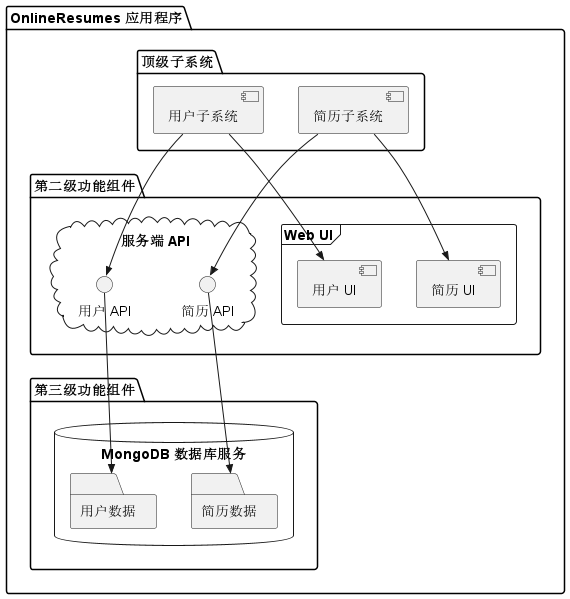

图 5-1：`onlineResumes`应用的分层结构

现在，如果要求读者采用自上而下的方法对该应用程序中与用户功能相关的子系统进行集成测试。那么其测试用例的设计步骤大致如下。

1. 首先对应用程序最顶层的子系统进行功能测试。根据示例程序的说明，这里需要进行测试的只有新用户注册、用户登录、查看/修改用户信息、注销用户这几项基本功能。对其进行测试用例的设计步骤与之前在第 4 章中示范的功能测试步骤相同，具体如下。

   - 在 Web 浏览器中使用 Selenium IDE 针对要测试的每一项功能录制一次正常的用户操作，并将录制的结果导出为可自动化执行的脚本。在这里，笔者将该脚本保存在`[配套资源]/[示例代码]/05_testOnlineResumes/testScripts`目录下，并将脚本文件命名为`test_userSystem.py`。
   - 基于等价类划分+边界值分析的策略设计具体的测试用例，并将它们整合到之前导出的自动化测试脚本中。

2. 接着属于第二级组件的 Web UI 进行测试。在 UI 测试中，测试人员也可以采用与功能测试相似的步骤来完成任务，即先使用 Selenium IDE 录制模拟使用`onlineResumes`示例程序的用户操作，并导出自动化处测试脚本，再辅以测试用例的方式来执行测试，只不过这一回设计的测试用例需要检查 Web  UI 自身的执行情况，例如确认它是否有应对 SQL 注入这类破坏性输入的能力、用户在正常登录之后是否能跳转到用户个人的信息页面等。同样的，笔者将导出的脚本文件保存在`[配套资源]/[示例代码]/05_testOnlineResumes/testScripts`目录下，并将其命名为`test_userUI.py`。

3. 接下来再对同属于第二级组件的服务端 API 进行接口测试。根据示例程序的说明，针对读者在第一步测试的每一项基本功能，其服务端都提供有一个基于 RESTful 架构的 API，对其进行测试用例的设计步骤与之前在第 4 章中示范的接口测试步骤相同，具体如下。

   - 在`[配套资源]/[示例代码]/05_testOnlineResumes/testScripts`目录下创建一个命名为`test_userAPI.py`的、基于 PyTest 规范的自动化测试脚本。
   - 在`test_userAPI.py`脚本中使用`requests`这样的扩展库模拟 Web UI，向各项功能的 API 发起请求，并检查接口调用的情况以及其返回的数据格式是否符合 RESTful 架构的规范，例如，发起 HTTP 请求时使用的方法是 GET 还是 POST，返回的数据格式是否为 JSON 等。

4. 最后对属于第三级组件的数据库服务进行接口测试。根据示例程序的说明，它在服务端使用的是 MongoDB 数据库服务，因此读者可以按照如下步骤来设计针对它的测试用例。

   - 在`[配套资源]/[示例代码]/05_testOnlineResumes/testScripts`目录下创建一个命名为`test_userDB.py`的、基于 PyTest 规范的自动化测试脚本。
   - 在`test_userDB.py`脚本中使用`PyMongo`这样的扩展库模拟服务端的 API，向应用程序的数据库发起数据操作请求，并检查接口调用的情况以及其返回的数据格式是否符合服务端 API 的处理规范，例如，数据的增、删、改、查操作是否成功，返回的数据格式是否为 JSON 等。

关于上述步骤生成的脚本文件，由于其中定义的测试用例较多，整体的代码规模也比较大，不便于直接在书中展示，读者可前往之前创建的`[配套资源]/[示例代码]/05_testOnlineResumes/testScripts`目录下，自行参考本书提供的测试脚本示例。接下来，读者的任务就是学习如何使用自动化工具来执行这些拥有一定数量的、针对各级组件的测试用例了。

### 使用自动化测试工具

在之前的示例中，本书一直在使用一款叫做 PyTest 的命令行工具来展示自动化测试脚本的执行结果，它实际上就是一套常被用于执行集成测试任务的自动化工具。虽然 PyTest 本身也是一款基于 Python 语言实现的单元测试框架，程序员们可以轻松且高效地使用它编写出各种用于单元测试的 Python 脚本（它还可以直接使用 Python 原生的`assert`语句来进行测试判断）。但与 Selenium 之类的测试框架相比，PyTest 在被用作一款自动化测试工具时所能提供的功能显然更受专业测试人员青睐，它可以利用自身可执行参数化测试的特性帮助程序员更好地组织和管理基于 Selenium、Appium、Requests 等第三方测试框架设计的测试用例，以提高测试工作本身的质量和效率。接下来，本书就以 PyTest 为例来向读者简单介绍一下自动化测试工具的使用方法，以帮助读者更好地实现集成测试的自动化执行。

和所有基于 Python 语言实现的第三方扩展库或工具一样，在使用 PyTest 来组织和管理测试任务之前，读者需要先在自己的计算机设备中打开 Powershell 这样的命令行终端环境，并执行`pip insatll pytest`命令来安装它。在该安装命令执行完成之后，读者就可以通过`pytest  --version`命令来验证安装是否成功。如果命令行终端输出了类似图 5-2 中所示的版本信息，就证明该工具已经处于可用状态了。现在，读者可以正式开始学习如何使用这款命令行工具来组织和管理测试用例了。


图 5-2：PyTest 的版本信息

当 PyTest 以命令行工具的形式被启动时，该工具会先自动递归式地遍历用户当前所在的目录及其所有子目录，并根据 PyTest 的用例识别规则来自动收集可纳入自动执行列表的测试用例；然后再按照该执行列表逐项执行测试用例。所以使用 PyTest 这款自动化测试工具的第一步，是按照它的用例识别规则来编写执行测试用例的 Python 脚本。在默认情况下，PyTest 的用例识别规则如下。

- 模块级规则：在 PyTest 中，如果想以模块的形式组织测试用例，定义模块的文件名就必须以`test_`开头或以`_test`结尾，例如：`test_login.py`、`login_test.py`等。

- 类型级规则：在 PyTest 中，如果想以`class`的形式组织测试用例，类名就必须以`Test`开头，且不能定义`__init__()`方法，其中的每个测试方法也必须以`test_`开头来命名，例如：

    ```python
    class TestCases:
        def testCase1(self):
            assert 100 == 100

        def testCase2(self):
            assert 101 == 100
    ```

- 函数级规则：在 PyTest 中，如果想以普通函数的形式组织测试用例，只需在定义函数时都采用以`test`开头的函数名即可，例如：

    ```python
    def testCase1():
        assert 100 == 100

    def testCase2():
        assert 101 == 100
    ```

在了解了上述用例识别规则，并按照该规则完成了测试脚本的编写工作之后。读者就可以在命令行终端环境中使用 PyTest 来实现测试用例的自动化执行了。根据上述测试用例的组织方式，读者可以分别采用对应的步骤来实现测试用例的自动化执行。例如，如果测试用例是以文件模块为单位来组织的， 就将该模块保存为以`test_`开头或以`_test`结尾的文件，然后使用 PyTest 执行该文件即可。例如，如果读者将下面这两条`assert`语句保存到一个名为`test_dome.py`文件中。

```python
assert 100 == 100
assert 101 == 100
```

然后在该文件所在的目录中打开命令行终端环境，并执行`pytest`命令，就会得到如下输出。

```bash
============== test session starts ===========================
platform win32 -- Python 3.10.10, pytest-7.2.2, pluggy-1.0.0
rootdir: D:\user\Documents\works\AutomatedTest_in_python\配套资源\示例代码\05_testOnlieResumes
collected 0 items / 1 error

============= ERRORS =========================================
_____________ ERROR collecting testScripts/test_dome.py ______
testScripts\test_dome.py:2: in <module>
    assert 101 == 100
E   assert 101 == 100
============ short test summary info ==========================
ERROR testScripts/test_dome.py - assert 101 == 100
!!!!!!!!!!!!! Interrupted: 1 error during collection !!!!!!!!!
```

而如果测试用例是以普通函数为单位来组织的，就在测试脚本中以`Test`开头来命名一组函数，然后使用 PyTest 执行这组函数所在的文件即可。例如，如果读者将之前创建的`test_dome.py`文件修改如下。

```python
def testCase1(self):
    assert 100 == 100

def testCase2(self):
    assert 101 == 100
```

然后，同样在该文件所在的目录中打开命令行终端环境，并执行`pytest`命令，就会得到如下输出。

```bash
============== test session starts ===========================
platform win32 -- Python 3.10.10, pytest-7.2.2, pluggy-1.0.0
rootdir: D:\user\Documents\works\AutomatedTest_in_python\配套资源\示例代码\05_testOnlieResumes
collected 2 items

testScripts\test_dome.py .F                                              [100%]

=============== FAILURES =====================================
_________________________ testCase2 __________________________

    def testCase2():
>       assert 101 == 100
E       assert 101 == 100

testScripts\test_dome.py:9: AssertionError
=============== short test summary info ======================
FAILED testScripts/test_dome.py::testCase2 - assert 101 == 100
=============== 1 failed, 1 passed in 0.09s ==================
```

最后，如果测试用例是以自定义类型为单位来组织的，就在测试脚本中以`Test`开头来命名自定义类型，然后使用 PyTest 执行该类型所在的文件即可。例如，如果读者将之前创建的`test_dome.py`文件修改如下。

```python
class TestCases:
    def testCase1(self):
        assert 100 == 100

    def testCase2(self):
        assert 101 == 100
```

接着只需同样在该文件所在的目录中打开命令行终端环境，并执行`pytest`命令，就会得到如下输出。

```bash
============== test session starts ===========================
platform win32 -- Python 3.10.10, pytest-7.2.2, pluggy-1.0.0
rootdir: D:\user\Documents\works\AutomatedTest_in_python\配套资源\示例代码\05_testOnlieResumes
collected 2 items

testScripts\test_dome.py .F                                              [100%]

=============== FAILURES =====================================
_________________________ TestCases.testCase2 ________________

self = <test_dome.TestCases object at 0x00000190CE18FD90>

    def testCase2(self):
>       assert 101 == 100
E       assert 101 == 100

testScripts\test_dome.py:14: AssertionError
=============== short test summary info ======================
FAILED testScripts/test_dome.py::TestCases::testCase2 - assert 101 == 100
=============== 1 failed, 1 passed in 0.06s =====================
```

读者可以看到，上面三种组织形式执行的测试用例是相同的，即使用`assert`语句检查`100 == 100`和`101 == 100`这两个等值表达式的执行，当表达式返回`true`就表示测试通过，返回`false`则表示测试不通过。因此 PyTest 输出的结果也大同小异，即第一个表达式通过了测试，而另一个表达式测试不通过。

另外，想必读者应该还记得，本书之前在使用 PyTest 命令来展示测试用例的执行结果时还使用了特定的参数，以便让测试用例输出更详细的信息。下面就带读者来具体了解一下在以`pytest [参数列表]`的命令形式来执行测试用例时可添加的常用参数，具体如下。

- `-v`参数：让 PyTest 在终端环境中输出更详细的测试报告，譬如使用`PASSED`和`FAILED`标签明确标记测试通过或不通过的测试用例。例如，如果我们使用`-v`参数重新执行之前的`test_dome.py`脚本，就会得到如图 5-3 所示的测试报告。
  
    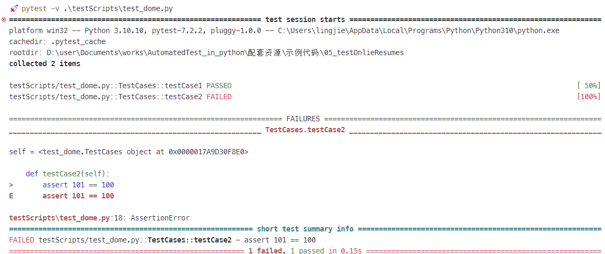

    图 5-3：PyTest 使用`-v`参数时的输出
  
- `-s`参数：让 PyTest 在终端环境中输出测试脚本产生的调试信息，包括脚本自身调用`print()`函数输出的信息。例如，如果我们在之前的`test_dome.py`脚本中添加两个`print()`函数的调用，具体如下。

    ```python
    class TestCases:
        def testCase1(self):
            print('\n------testCase1 正在执行------')
            assert 100 == 100

        def testCase2(self):
            print('\n------testCase2 正在执行------')
            assert 101 == 100
    ```

    然后使用`-s`参数重新执行该测试脚本，就会得到如图 5-4 所示的测试报告。

    

    图 5-4：PyTest 使用`-s`参数时的输出

- `-vs`参数：将上述两个参数叠加使用，以便让 PyTest 在终端环境中输出更详细的、带调试详细的测试报告，例如，如果我们使用`-v`参数重新执行之前的`test_dome.py`脚本，就会得到如图 5-3 所示的测试报告。

    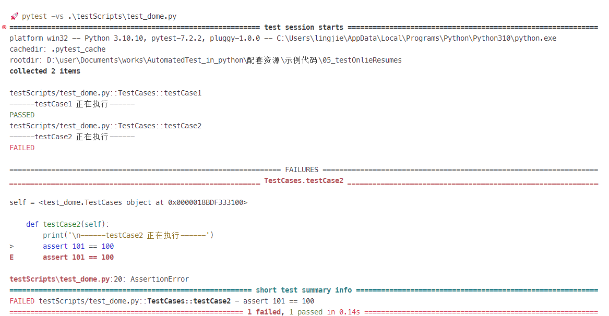

    图 5-5：PyTest 使用`-vs`参数时的输出

这里需要特别提醒的是，由于篇幅方面的限制，本书在这里介绍的只是在以自动化测试工具的形式使用 PyTest 时最常用的参数。如果读者想了解该工具更多可用的参数，也可以自行参考该工具的官方文档（获取文档的方式与本书在第 3 章中示范的基本系统），或在命令行终端环境中利用`pytest --help`命令来获取该工具自己提供给用户的使用说明，如图 5-6 所示。

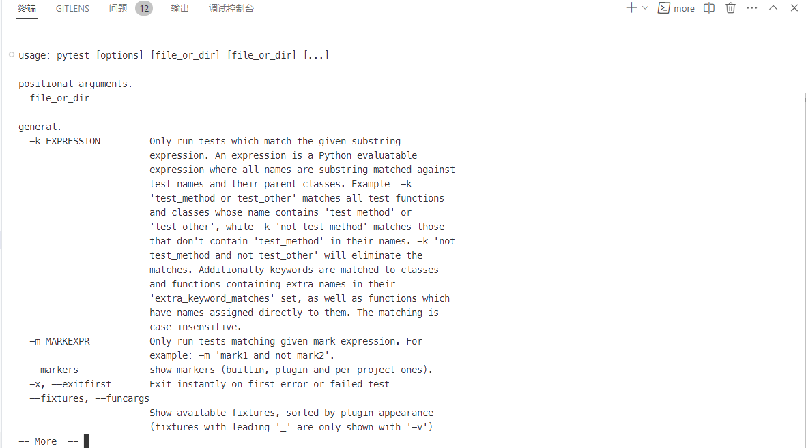

图 5-6：PyTest 提供的使用说明

除了执行参数之外，读者还用`pytest [目录/文件::函数 | 类::方法]`的命令形式来具体指定要执行的测试用例，下面是针对一些具体使用场景的`pytest`命令示例。

- 执行当前目录下一个名为`testScripts`的子目录中所有可识别的测试用例：`pytest ./testScripts/`；
- 执行当前目录下一个名为`test_dome.py`的文件中所有可识别的测试用例：`pytest ./test_dome.py`；
- 执行上述`test_dome.py`文件中一个名为`TestFunction`的方法所要执行的测试用例：`pytest ./test_dome.py::TestFunction`；
- 执行上述`test_dome.py`文件中由一个名为`TestClass`的类中定义的所有测试用例：`pytest ./test_dome.py::TestClass`；
- 执行上述`TestClass`类中一个名为`test_method`的方法所要执行的的测试用例：`pytest ./test_dome.py::TestClass::test_method`；

最后，如果读者想使用 PyTest 实现更强大的自动化测试能力，还可以学习一下如何使用 PyTest 的插件系统。该插件系统给这款自动化测试工具带来了许多功能强大的第三方插件，其中较为常用的包括：

- `pytest-xdist`插件：用于实现采用多核心并行或分布式的方式来执行测试用例；
- `pytest-ordering`插件：用于实现让测试人员自定义测试用例的执行顺序；
- `pytest-rerunfailures`插件：用于实现测试用例在测试失败后重启测试；
- `pytest-html`插件：用于生成 HTML 格式的自动化测试报告；
- `allure-pytest`插件：用于按照 Allure 格式生成更为美观的自动化测试报告；

在 PyTest 中使用插件的方式大同小异，通常只需先使用 pip 管理器安装要使用的插件，然后在执行 PyTest 命令时加上与该插件相关的参数即可。下面来举例说明：假设读者选择想让之前针对`test_dome.py`的测试报告以 HTML 格式输出，就可以执行以下步骤来安装并使用`pytest-html`插件。

- 打开 Powershell 之类命令行终端环境，并在其中执行`pip install pytest-html`命令来安装插件。

- 待插件成功安装之后，进入到`test_dome.py`文件所在的目录，并执行`pytest --html=./out.html test_dome.py`命令。在这里，`--html`的作用就是指示 PyTest 使用`pytest-html`插件生成测试报告，并设置测试报告的文件名与保存路径。

- 待 PyTest 完成测试用例的执行之后，`test_dome.py`文件所在的目录中就会自动生成一个名为`out.html`的文件，如果读者用 Web 浏览器打开该文件，就会看到如图 5-7 所示的测试报告。

    

    图 5-7：使用`pytest-html`插件生成测试报告

再例如，如果读者现在想按照自上而下的方式完成针对`onlineResumes`应用程序的集成测试，就得按照指定的顺序执行之前在 5.1.1 节中编写的四个测试脚本，这就得借助`pytest-ordering`插件来实现，其具体步骤如下。

- 打开 Powershell 之类命令行终端环境，并在其中执行`pip install pytest-ordering`命令来安装插件。

- 待插件成功安装之后，继续用命令行终端进入到`[配套资源]/[示例代码]/05_testOnlineResumes/testScripts`目录中，并分别修改之前创建的四个测试脚本，使用`@pytest.mark.run(order=[数字])`语句标注其中测试用例被执行的顺序，数字`1`代表最先被执行，然后随着数字的递增执行顺序依次延后。为了方便演示，这里将这四个脚本文件的内容简化如下。
  
    ```python
    # test_userSystem.py
    import pytest
    @pytest.mark.run(order=1)
    def testfunc(): 
        print("userSystem")

    # test_userUI.py
    import pytest
    @pytest.mark.run(order=2)
    def testfunc(): 
        print("userUI")
    
    # test_userAPI.py
    import pytest
    @pytest.mark.run(order=3)
    def testfunc(): 
        print("userAPI")

    # test_userDB.py
    import pytest
    @pytest.mark.run(order=4)
    def testfunc(): 
        print("userDB")
    ```

- 继续用命令行终端环境在`[配套资源]/[示例代码]/05_testOnlineResumes/testScripts`目录中执行`pytest -vs ./`命令（在此之前，未必要记得先注释掉`test_dome.py`文件中的所有代码，以免这部分纯粹用于临时测试的代码也被被写入针对`onlineResumes`示例程序的测试报告），就会看到如图 5-8 所示的测试报告。

    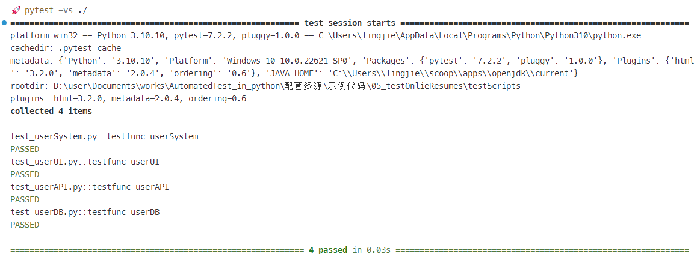

    图 5-8：利用`pytest-ordering`插件执行集成测试

和设计测试用例时一样，真正针对`onlineResumes`示例程序的集成测试报告要比上面所展示的内容复杂得多，它们也不便于直接在书中展示，读者可以在本书提供、该示例所在的目录中自行实践上述步骤，以便查看真正的测试报告。如果实践的过程一切顺利，就意味着读者初步掌握了使用 PyTest 实现自动化集成测试的方法。当然了，除了这里介绍的 PyTest 之外，类似的自动化测试工具还有 Unittest。它们最初都是基于 Python 语言实现的单元测试框架，后来更受人青睐的是其组织和管理测试用例的功能，以及与 Selenium、Appium 等第三方测试框架的集成能力。读者如有兴趣，也可以利用本书在第 3 章中教授的快速学习能力来了解一下 Unittest 框架作为自动化测试工具的使用方法。

## 持续集成测试

到目前为止，本书所演示的都是基于传统软件工程理论的测试工作，这意味着测试人员的集成测试任务必须要等待软件的开发团队完成所有相关模块的开发之后才能启动。这种流水线式的生产方式背后的管理理念显然是机械化生产时代的产物，它需要项目需求非常稳定、项目的时间和经济成本都非常充足，以便大家可以按部就班地各司其职，但在实际生产环境中，项目需求往往是模糊不清且随时变化的，项目的开发与测试之间不是单向运作的，留给软件生产团队的时间和经费也永远是不足的[^1]。更重要的是，传统的软件工程还存在着在许多脱离现实的问题。因为，绝大部分软件在生产初期根本不会有那么多人参与，通常都是两三个人要做所有的事情。在这种情况下，将生产过程划分为不同的阶段，然后进行相关的分工并没有多少实质意义。总而言之，如果在瞬息万变的互联网时代还继续采用这种方式，无疑会让软件的生产过程变得非常庞杂而僵化。

[^1]: 关于传统软件工程思想在实际项目运作的过程中遇到的问题，读者可以去参考弗雷德里克·布鲁克斯（Frederick Brooks, Jr）所著的文集—《人月神话：软件项目管理之道》。

### DevOps 工作理念

为了解决传统软件工程所带来的问题，业界在 2009 年前后基于敏捷开发、极限编程等现代软件工程理论进一步发展出了 DevOps 这个新的工作理念。从字面上来看，DevOps 是 Development 和 Operations 这两个英文单词的组合词，所以它事实上可以被理解成是一套主张将开发（Dev）与运维（Ops）这两项工作一体化的软件生产方式，其核心内容是希望通过制定一整套自动化流程，以便让软件生产的整体过程更加快捷和可靠。在这种工作理念的指导下，软件的集成测试工作通常会按照一种被称作**持续集成**的方式来进行。这种方式主张让软件的测试任务与其开发任务同步进行，即软件中的各种功能模块在被开发出一个原型时就会持续以增量的方式被整合到整个系统中，并同步进行集成测试，以便随时修复测试所发现的问题。在整个生产过程中，测试工作的任务就是确保软件的各个功能模块能尽快地被正确集成到软件产品中，以达到快速交付的目的，并在此后的整个软件生命周期中维持快速迭代的状态。这种理念能给软件的生产过程带来如下好处。

- 降低集成风险：在传统的软件工程理念中，同一个软件通常会分别交给多组人马来分阶段进行开发、测试和维护。而在各司其职且沟通不良的情况下，软件项目涉及的人员越多，其整合的风险越大，频繁地进行增量式集成测试将有助于降低此类风险。
- 降低沟通障碍：由于持续集成的理念主张让测试与开发工作交叉进行，这就需要双方深度了解彼此的工作内容，所以它有助于降低软件项目团队中不同成员之间的沟通障碍。
- 保障代码质量：由于持续集成的理念可以让开发人员随时修复测试所发现的问题，所以它有助于软件项目团队将精力集中在业务代码和功能上，从而获得更高质量的软件。
- 实现版本控制：由于持续集成的理念让测试人员可以随时发现软件在集成过程中出现的问题。所以软件项目团队通常都能更及时地发现有问题的代码，并赶在有问题的软件版本被发布之前修复这些问题，以降低无效的版本迭代。

简而言之，由 DevOps 所主张的软件生产方式是：鼓励软件项目团队先快速开发一个能满足客户最基本需求的、可供交付使用的软件原型，然后通过快速迭代版本的方式来满足不断变化的客户需求，并同时借助有效的持续集成测试发现并修复软件中存在着各种 bug、逐步提高其自身的性能和稳定性。这样一来，之前流水线式的生产流程就变成了一个周而复始的循环体系，开发人员在这个体系中需要各自独立完成各种不同的小目标，然后将所有的小目标合起来就能完成大目标。

需要特别强调的是，DevOps 工作理念主张的并不是简单地在软件生产过程中将开发、测试与运维等工作合而为一，这种简单粗暴地理解可能就是该工作理念一直以来难以被真正落实的主要原因。毕竟，这三种工作在传统思路上是相互冲突的，对于运维工作来说稳定是压倒一切的，而测试工作的任务是找出问题，开发人员则更倾向于找到富有创造力的解决方案。所以，如果想要将这一工作理念真正落到实处，首先要完成的是思想解放。换而言之，程序员们需要改变的并不仅仅是软件生产过程中的工作流程，更重要的是整个开发团队中的各个工作角色，从管理到开发、再到测试与运维都需要在思想观念上进行变革。如果不能做到这一点，即使将所有工作角色集于一人，不同工作之间的思维转换也依然会是个问题。

综上所述，程序员们在落实 DevOps 理念时需要重新制定软件生产流程中的一系列规范和标准。按照这些规范和标准，针对软件的测试工作需要积极介入到其各个功能模块的开发工作中，了解这些模块在被开发过程中所使用的宏观架构和技术细节，以便制定出与之相对应的测试方案。而开发人员在工作中也要及时修复测试过程中发现的 bug，并提供更有利于软件部署和后期维护的优化建议。在这种情况下，DevOps 工作理念所主张的软件生产方式考验的不仅是软件开发/测试的技术，更是项目的组织管理水平。

### 持续集成工具

在将 DevOps 理念运用到软件生产的实践过程中，开发者们往往需要经常性地对自己正在开发的功能模块执行系统集成的操作，在很多时候，项目管理员甚至会要求其团队的每个开发人员每天至少提交一次集成请求。这意味着在软件的整个开发周期中，每天可能会发生多次集成。而每一次的集成动作都必须要经历构建、测试和部署等一系列的操作，这其中会涉及大量的代码编译，测试用例执行和软件部署工作，这显然不是靠人力可以完成的，因此能否构建一套系统来实现持续集成的自动化就成为了本书接下来要探讨的问题。

如果想要构建一个自动化的持续集成系统，首先要做的是部署一个供项目内部使用的版本控制系统，以便团队常用能有可靠的方法来集中和保存他们的工作成果。然后，项目团队会专门部署一个持续集成服务器。在这里，持续集成服务器（也称为构建服务器）是一种能在各种平台上完成自动化构建操作的软件工具，通常具有很好的可配置性，通常用于为团队的项目提供可靠和稳定的环境。

具体到实际生产环境中，项目管理员通常会选择将版本控制系统和持续集成服务器部署在一台相对干净的服务器设备上，以免它受到不相关的工具、环境变量或其他配置的影响。待部署工作完成之后，持续集成服务器就会利用版本控制系统来监控项目的进度，并自动化地执行系统集成操作。具体来说就是：它会在开发人员成功提交代码之后，按照项目管理员设定的规则和被修改的部分来完成软件的自动化构建，并进行集成测试任务。在完成相关任务之后，该服务器系统就会向项目团队中的相关成员发送软件的集成报告，其内容包括项目的最新版本信息、它所运行的构建脚本、测试用例以及其他需要发送的通知信息。除此之外，代码分析、代码覆盖率、代码质量报告、agent pooling、pipeline、构建比较、IDE集成、第三方工具支持等也是持续集成服务器常有的功能。

到目前为止，市面上常用的持续集成系统主要包括 Jenkins、TeamCity、Travis CI、GO CD、Bamboo、Gitlab CI、CircleCI 等。接下来，本书将以 PyTest+Jenkins 这一工具组合为例具体为读者介绍一下如何实现基于 DevOps 理念的、自动化的持续集成测试。首先，读者需要按照以下步骤来安装 Jenkins 系统，并对它进行相应的配置。

1. 准备一台相对干净的服务器设备（如果读者没有条件部署物理设备，也可以使用虚拟环境来代替），服务器的操作系统可以是任意一种 Linux 发行版或 Windows Server 系统。在这里，本书将选择使用一台安装了 Windows 系统环境的虚拟机来示范后续步骤。

2. 安装版本控制系统，目的是让项目团队有可靠的方法提交他们的工作成果，并交由 Jenkins 系统进行自动化的持续集成。在这里，本书推荐读者安装 Git 这一款分布式的版本控制系统。

3. 安装 Java 运行时环境，由于 Jenkins 是一款基于 Java 语言开发的持续集成服务系统，它的运行依赖于 Java 运行时环境。

4. 前往 Google、百度等搜索引擎并搜索“Jenkins download”，找到 Jenkins 的官方下载页面，如图 5-9 所示。

    

    图 5-9：Jenkins 官方下载页面

5. 从上述页面中选择下载左侧 LTS 版本的 Windows 安装包（文件名为`jenkins.msi`），并将其上传到准备好的服务器上。

6. 进入到服务器中，并在`jenkins.msi`文件所在的目录中用鼠标左键双击该安装包，启动 Jenkins 系统的图形化安装向导，如图 5-10 所示。

    

    图 5-10：Jenkins 系统的图形化安装向导

7. 在上述界面中用鼠标左键单击“Next”按钮，就会看到如图 5-11 所示的安装路径设置界面，读者通常只需要保持默认选项，并直接用鼠标左键单击“Next”按钮即可。

    

    图 5-11：设置 Jenkins 的安装路径

8. 在接下来的如图 5-12 所示界面中，读者需要在这里设置当前服务器系统的管理员账户和密码，并通过用鼠标单击“Test Credentials”按钮来验证账户的有效性（通常情况下，这里输入的应该是项目内部网络的管理员账户）。

    

    图 5-12：设置 Jenkins 的管理员账户

9. 在管理员账户通过验证之后，继续在上述界面中用鼠标左键单击“Next”按钮，就会看到如图 5-13 所示的服务端口设置界面，读者通常只需要保持默认的`8080`端口，并直接用鼠标左键单击“Test Port”按钮来验证该端口的可用性即可（通常情况下，只要该端口没有被其他服务占用就会通过验证）。

    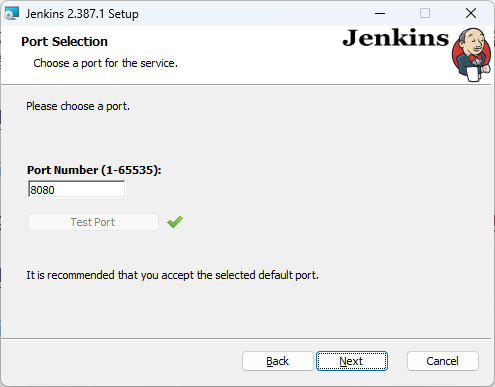

    图 5-13：设置 Jenkins 的服务端口

10. 在服务端口通过验证之后，继续在上述界面中用鼠标左键单击“Next”按钮，就会看到如图 5-14 所示的 Java 运行环境设置界面，读者通常只需根据之前在第 3 步中安装的情况来设置该目录即可。

    

    图 5-14：设置 Java 运行环境

11. 继续在上述界面中用鼠标左键单击“Next”按钮，就会看到如图 5-15 所示的组件安装界面，读者可以在这里指定要安装的 Jenkins 组件，但通常只需要保持默认选项，并直接用鼠标左键单击“Next”按钮即可。

    

    图 5-15：设置要安装的 Jenkins 组件

12. 最后只需在弹出的确认界面中用鼠标左键单击“Install”按钮即可开始 Jenkins 系统的安装。待安装过程完成之后，就会看到如图 5-16 所示的安装结束界面，读者用鼠标单击“Finish”按钮就可以关闭该安装向导。

    

    图 5-16：结束安装向导界面

13. 如果上述操作一切顺利，读者现在只需要使用服务器自带的 Web 浏览器打开该 Jenkins 服务在本地可访问的 URL（假设读者之前的安装步骤中为该服务指定的端口是`8080`，那么该 URL 就是`http://localhost:8080`，即可看到如图 5-17 所示的界面。在这里，读者需要根据该界面中的提示信息，找到 Jenkins 系统的初始密码，然后将该密码输入到下面的“管理员密码”输入框中并使用鼠标左键单击“继续”按钮，以便激活该系统。

    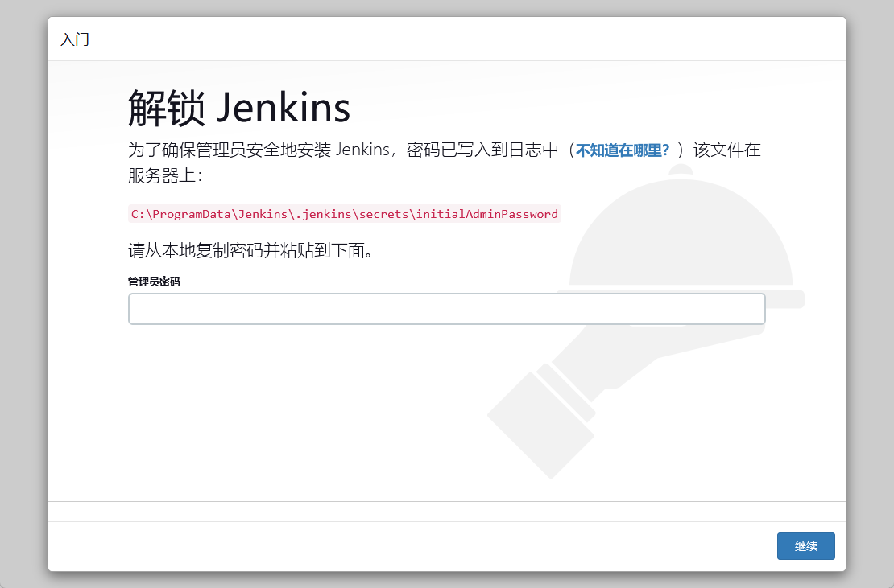

    图 5-17：Jenkins 系统的初始界面

14. 在 Jenkins 系统比成功激活之后，随即就会启动一个名为“新手入门”的配置向导程序，读者首先看到的是用于安装插件的页面（如图 5-18 所示）。对于初学者，本书建议选择“安装推荐的插件”，以便确保 Jenkins 系统的基本功能可以正常使用。

    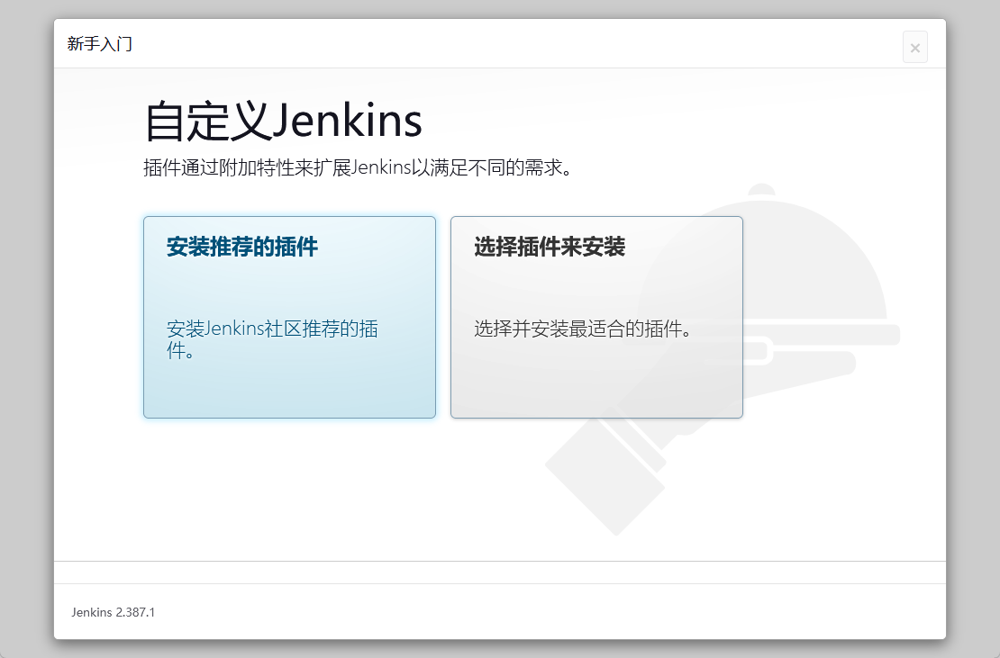

    图 5-18：选择要安装的 Jenkins 插件

15. 接下来，读者就会看到 Jenkins 系统推荐安装的插件，以及插件按的进度，如图 5-19 所示。

    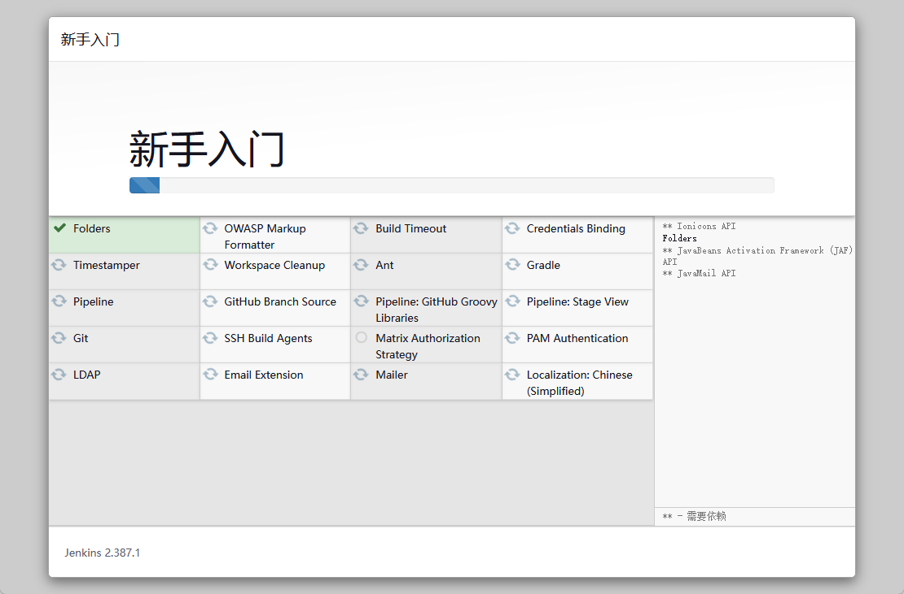

    图 5-19：安装系统推荐的插件
  
16. 待插件完成之后，Jenkins 配置向导就会来到如图 5-20 所示的管理员账户设置页面，在这里，读者需要设置一个由项目管理员使用的用户名、密码以及电子邮件等信息，然后用鼠标左键单击“保存并完成”按钮即可完成 Jenkins 系统的初始配置。

    

    图 5-20：设置系统的管理员账户

17. 在初始配置结束之后，读者就会正式进入到如图 5-21 所示的控制面板界面中。

    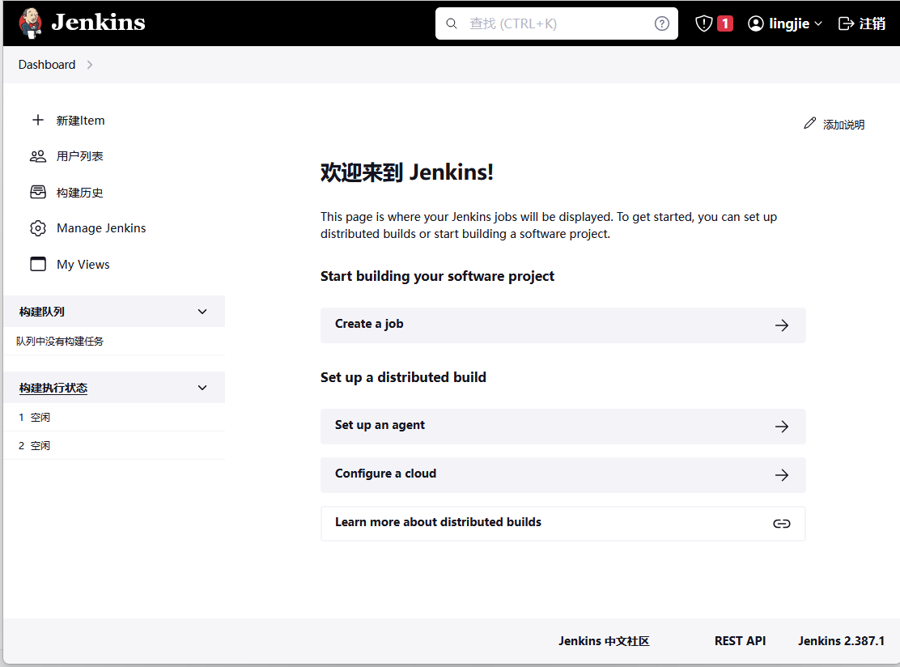

    图 5-21：Jenkins 系统的控制界面

18. 通常情况下。开发项目的管理员接下来要做的就是给这台持续集成服务器设置一个可供项目内部网络中其他工作机远程登录的 URL，这样就不必所有的管理操作都必须物理接触到这台服务器设备了。具体方法是：在上述控制界面中用鼠标左键单击其左侧的“Mange Jenkins”链接，并进入到如图 5-22 所示的 Jenkins 设置界面中。

    

    图 5-22：Jenkins 设置界面

19. 在上述界面中继续用鼠标左键单击“Configure System”链接，并在随后进入的页面中找到“Jenkins URL”设置项。在这里，读者可以根据自己所在的团队设置一个内部网络可用的 URL，如图 5-23 所示。

    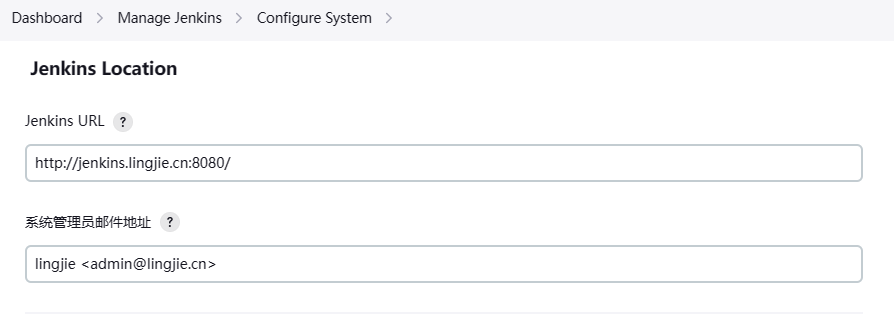

    图 5-23：设置 Jenkins URL

现在只要设置好相关域名的 DNS 表，项目管理员应该就可以在这台服务器设备所在的局域网内任意一台工作机上访问该 Jenkins 服务了。例如，图 5-24 所示的是笔者在另一台 Windows 系统上使用 Microsoft Edge 浏览器访问该持续集成服务器时的情况。当然，如果读者想在整个互联网的任何地方都能访问该服务，就需要专门购买面向全球互联网的域名服务了，然后在其“Configure Global Security”页面中完成更严格的安全设置了，由于这种需求在大多数软件项目的开发工作中并不常见，本书在这里就不展开介绍了，读者如有兴趣，可自行参考 Jenkins 的官方文档。

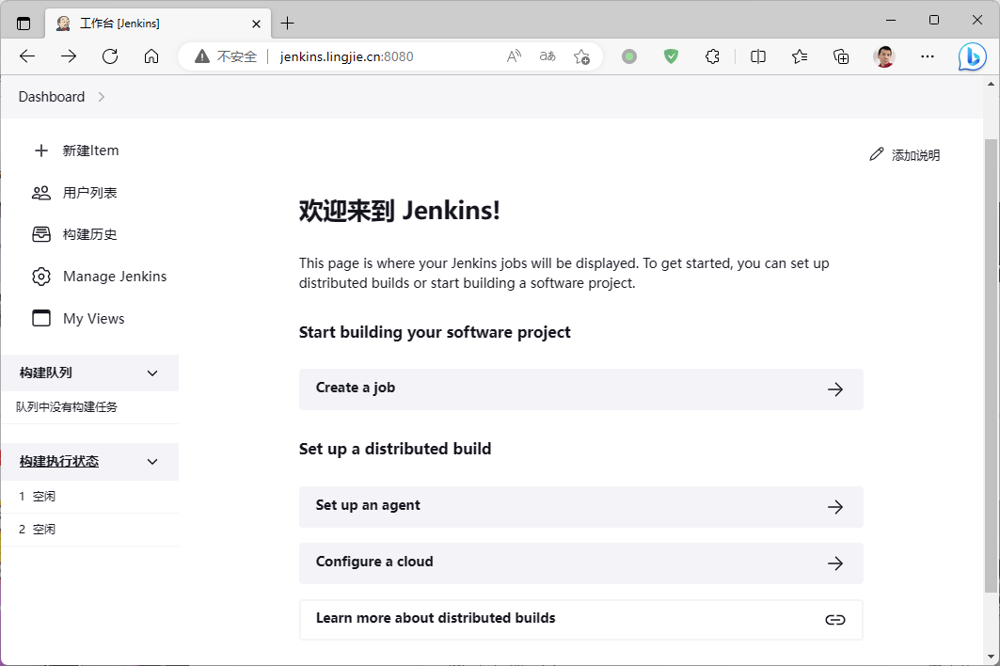

图 5-24：远程访问 Jenkins 服务

接下来，本书将继续以`onlineResumes`示例程序为目标来演示一下如何使用 PyTest+Jenkins 这一工具组合来实现基于持续集成方式的自动化测试。其主要步骤如下。

1. 在图 5-21 所示的控制界面中用鼠标左键单击其左侧的“新建Item”链接并进入的新建任务界面中。在这里，读者需要给要创建的自动集成任务设定一个名称，并选择下面的“Freestyle Project”选项，如图 5-25 所示。

    

    图 5-25：新建任务界面

2. 在用鼠标左键单击了上述界面中的“确定”按钮之后，读者就会来到如图 5-26 所示的任务配置界面。由于本书在这里要执行的是一个基于 Python 环境的此自动化测试任务，所以只需填写一些简单说明，其他保持默认选项即可。

    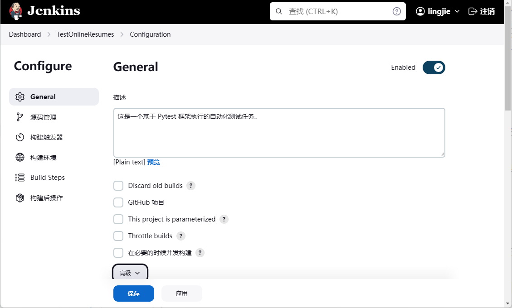

    图 5-26：任务配置界面

3. 在上述界面中继续用鼠标左键单击了“保存”按钮之后，读者就会来到如图 5-27 所示的任务配置界面。在这里，如果读者直接查看任务的工作空间是会报错的，我们必须先用鼠标左键单击一下任务管理界面左侧的“Build now”链接，先执行一次构建动作。

    

    图 5-27：任务管理界面

4. 在执行完第一次构建任务后，如果读者再次查看任务的工作空间，就会看到当前任务的工作空间是一个空目录。接下来要做的就是将之前在 5.1.1 节中创建的`05_testOnlieResumes/testScripts`目录下的文件复制到 Jenkins 系统在服务器上的`[Jenkins的程序目录]/workspace/testOnlineResumes`目录中（在 Windows 系统中，`[Jenkins的程序目录`在默认情况下通常即`C:\ProgramData\Jenkins\.jenkins`目录），然后再次刷新任务的工作空间页面，就会看到相关的自动化测试脚本文件了，如图 5-28 所示。

   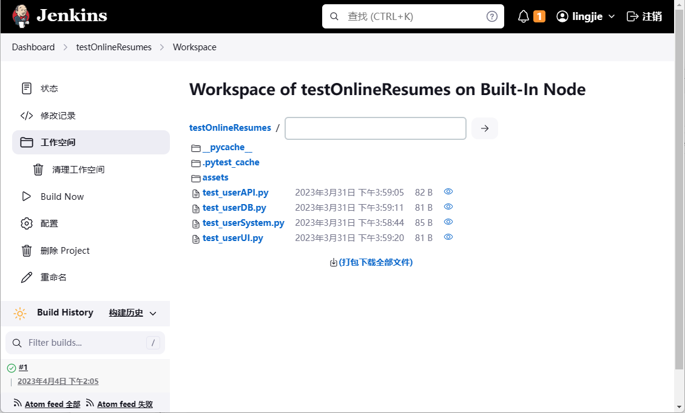

    图 5-28：任务的工作空间

5. 现在读者需要做的是：在`[Jenkins的程序目录]/workspace/testOnlineResumes`目录中创建一个名为`auto_run.py`的脚本文件，并在其中以调用`pytest.main()`方法来启动测试脚本，具体代码如下。

    ```python
    import pytest

    if (__name__ == "__main__") :
        pytest.main(["-v", "-s"])
    ```

6. 然后继续在`testOnlineResumes`任务的管理界面中用鼠标左键单击左侧的“配置”链接，回到任务的配置界面，并找到该页面中的“Build Steps”选项，添加一个 Windows 批处理类型的步骤，具体如图 5-29 所示。

   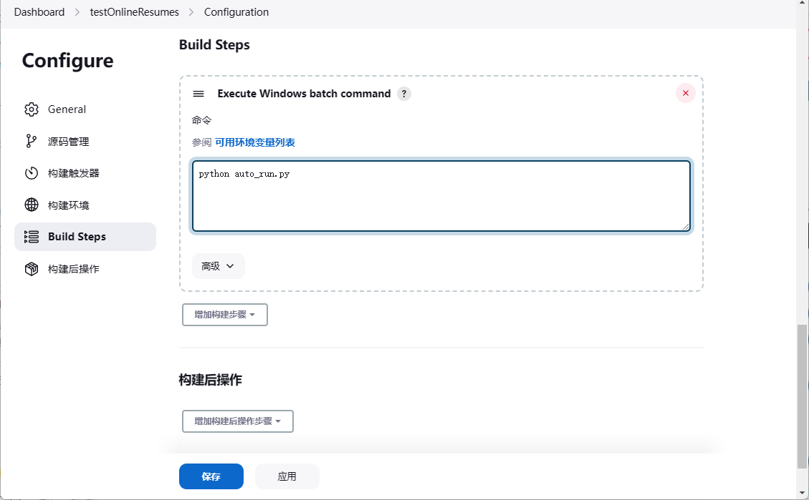

    图 5-29 设置构建步骤

7. 最后再次返回到`testOnlineResumes`任务的管理界面中，并继续用鼠标左键单击左侧的“Build Now”链接之后，读者就可以该管理界面左侧的“Build History”一        栏中看到由绿色对钩标记的成功构建操作（不成功的操作则由红色的错叉标记），如图 5-30 所示。

   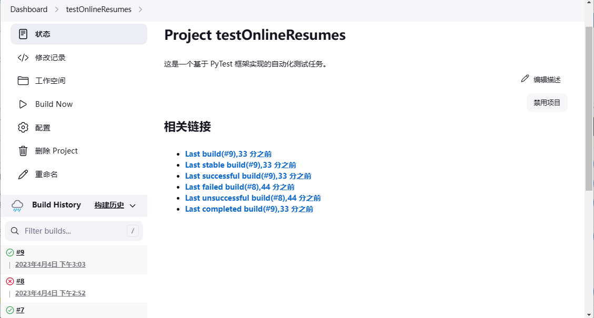

    图 5-30 Jenkins 的构建记录

8. 如果读者用鼠标左键单击最后一次构建操作（在这里是`#9`）并查看其“控制台输出”，就会看到与之前使用 PyTest 命令行工具时相同的自动化测试报告，如图 5-31 所示。

   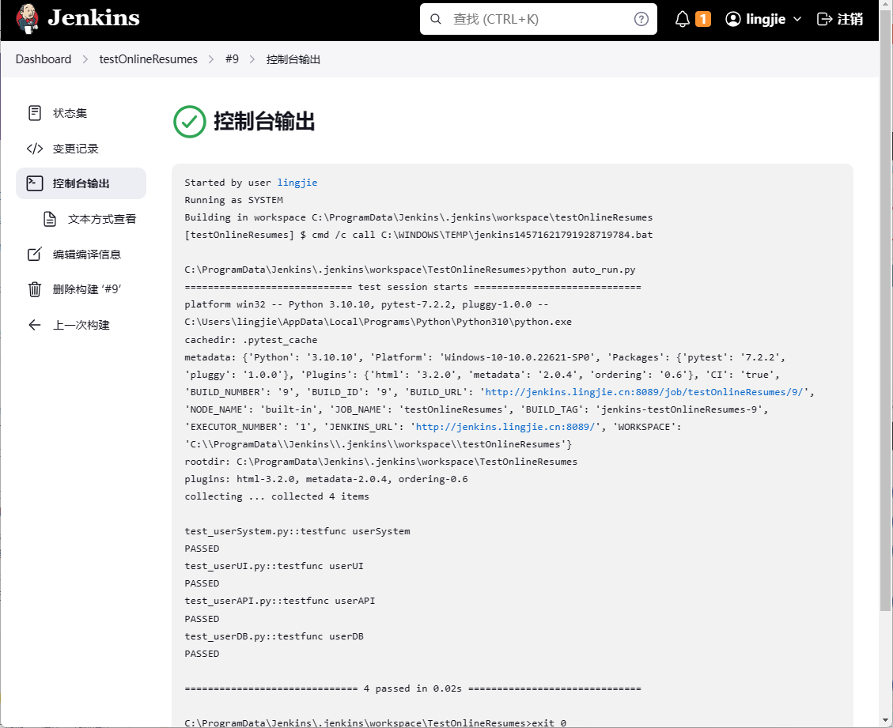

    图 5-31 构建步骤的控制台输出

到目前为止，读者已经完成了使用 Jenkins 服务调用 PyTest 框架执行自动化测试脚本的设置，接下来要做的就是让该服务器利用版本控制系统监控要测试的目标程序（在这里就是`onlineResumes`示例程序），只要该程序的代码发生了改动，就自动执行`testOnlineResumes`任务，这部分的具体操作步骤如下。

1. 按照本书之前演示的步骤在 Jenkins 服务中再创建一个用于自动构建`onlineResumes`示例程序的新任务，并将该任务命名为`buildOnlineResumes`。在这里，读者唯一需要注意的是，由于目标程序是一个基于 Node.js 实现的应用程序，所以需要在 Jenkins 系统中安装 NodeJS 插件，并安装指定版本的 Node.js 运行时环境，如图 5-32 所示。

   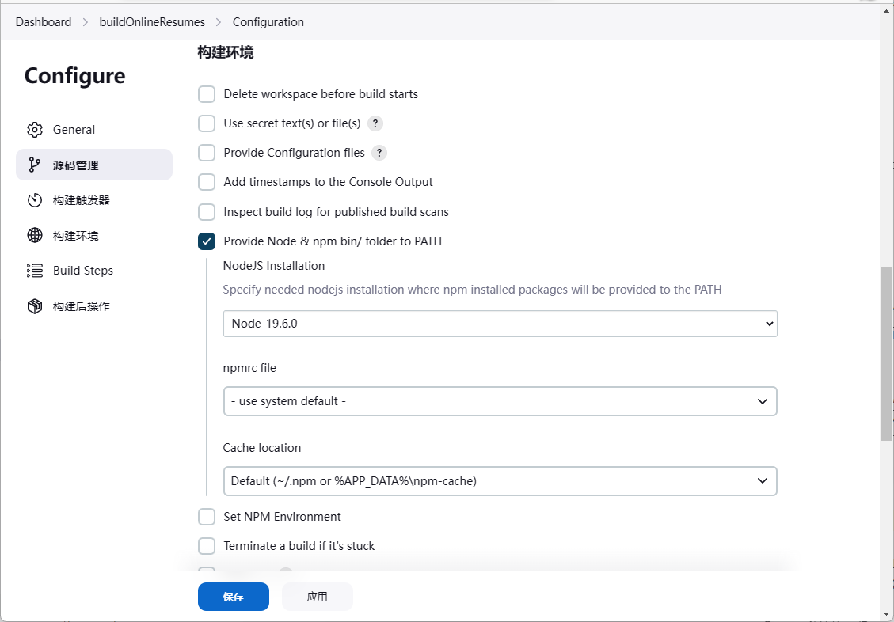

    图 5-32 `buildOnlineResumes`任务

2. 返回到`testOnlineResumes`任务的管理界面中，找到该页面中的“构建触发器”选项，并勾选该选项下面的“在其他项目完成构建时执行”选项，然后在弹出的表单中填入用于持续集成目标程序的任务名称，在这里就是之前创建的`buildOnlineResumes`任务，如图 5-33 所示。

    

    图 5-33 设置`testOnlineResumes`任务的触发器

现在，只要`buildOnlineResumes`任务完成构建动作，`testOnlineResumes`就会自动启动构建任务。这样一来，前者负责待测软件的自动化持续集成，后者负责自动化的集成测试，至此，本书就完成了一次基于持续集成方式的自动化测试演示。当然了，在实际生产环境中，这两个任务的设置过程都要比这里演示的复杂得多，读者如有需要，还需再仔细查阅 Jenkins 的官方文档，本书基于篇幅限制，就不再继续展开演示了。
