学习 Robot 框架

为了更好地让读者理解快速学习新框架的思路，笔者接下来会继续介绍另一个名为 Robot 的自动化测试框架，希望读者能参考本书从零开始讲解一个开发/测试框架的流程，从中总结出适合于自己的快速学习方法。

与 Selenium 框架相比，Robot 框架是一款更为通用的、可扩展的自动化测试框架，它最大的特点是支持关键字驱动的测试方法。这意味着，测试人员可以先基于该框架的扩展规则来引入其他用 Python 或 Java 实现的第三方测试扩展（包括 Selenium），并将这些扩展的住处编写成 HTML、TXT 等格式的关键字文档，就可以获得一款强大的测试工具了。之后，只需再以关键字的形式编写测试用例即可进行测试。总体而言，掌握 Robot 框架的学习重点就是要切实地理解关键字驱动的自动化测试方法，下面就来具体介绍一下这一测试方法及其背后的工作原理。

## 关键字驱动测试

在测试方法中，关键字驱动测试的主要构想是将程序员编写的自动化测试代码进行两次分离：第一次先将该测试代码中使用的具体测试数据剥离出来；第二次再从已剥离了数据的代码中将模仿人类行为的部分剥离出来。然后在工作时反过来基于具体的测试数据与指定的行为来生成对应的自动化测试代码。这样做将有利于人们更加便捷地进行自动化测试代码的管理，提高这些代码的复用性，让自动化测试的工具更容易被普通人理解并使用。

考虑到上述理论说明有些复杂，下面来举个简单的例子。如果读者编写了一个用于测试“用户登录”功能的自动化脚本，那么该脚本代码中用于测试的每一组用户名和密码都属于具体的测试数据，在设计基于关键字驱动的测试方法中，它们应该首先被剥离出去。然后在剩下的代码中，有包含“输入用户名和密码”、“点击登录按钮”等模仿人类操作的行为部分，也有“检查输入是否有效”、“检查登录是否成功”等执行目标程序流程的测试部分，而我们第二次分离工作要做到就是将模仿人类操作的行为部分从中剥离出来，并保存为与相应测试功能相关联的关键字。这样一来，我们在后续工作中就可以拿一组用户数据，加上指定的关键字让 Robot 这样的自动化工具自动生成测试代码了，譬如像表 3-1 中所描述的这样。

| 具体测试数据             | 关键字           | 生成的测试代码             |
| ------------------------ | ---------------- | -------------------------- |
| 用户张三（用户名，密码） | 输入用户名和密码 | 检查输入是否有效的测试代码 |
| 用户张三（用户名，密码） | 点击登录按钮     | 检查登录动作是否成功的测试代码 |

表 3-1：数据+关键字驱动的测试

从上述例子可以看出，关键字驱动测试的核心思路就是将自动化测试脚本中用于模仿人类操作的行为部分提取出来，作为一个以关键字形式存在的固定测试动作。这样就之后只需要提供具体的测试数据，就可以实现对于相应测试动作相应的自动化代码了。而这个提取行为部分的过程，在专业术语中被称之为“关键字封装”。

## 快速上手教程

在理解了 Robot 框架的基本工作原理之后，读者就可以开始学习如何在具体项目中引入该框架，并配置好使用该框架进行自动化测试所需要的相关工具了。对于一个新的开发框架，程序员们对它的上手过程基本都是从这一步开始的。

### 安装框架文件

正如之前所说，Robot 框架可以利用其扩展性引入 Selenium 框架一起搭配使用，因此在接下来的演示中，本书会选择继续在之前配置了 Selenium 框架的环境中介绍 Robot 框架的安装与配置方法，其具体步骤如下。

1. 确认当前计算机设备中已经安装了 Selenium 框架，以及与 Web 浏览器相匹配的 WebDriver 组件（关于这部分的具体操作，读者可复习本章在 3.1 节中的介绍）。

2. 在当前计算机设备中打开 Powershell 这样的命令行终端环境，并在其中执行`pip install robotframework`命令来安装 Robot 框架。在本书中，笔者安装的是 Robot Framework 6.0.2，如图 3-16 所示。

    

    图 3-16：安装 Robot 框架

待上述安装过程顺利完成之后，接下来要做的就是根据自己安装的框架版本来配置使用该框架的自动化测试环境了。

### 配置框架环境

为了更便捷地使用 Robot 框架，人们通常还会选择为其配置一款名叫 RIDE 的集成开发环境，这是一款基于 Python 语言实现的，专门面向 Robot 框架编写测试用例的软件。它的安装方式非常简单，读者只需继续在之前打开的命令行终端环境中执行`pip install robotframwork-ride`命令即可。在这里需要特别提醒的是：如果读者使用的是最新版本的 Python 运行时环境，其对应的 RIDE 版本可能还未被更新到 Pip 包管理器的软件仓库中。为了解决这一问题，读者可前往 GitHub 网站中搜索 robotframework/RIDE 项目，并根据其官方说明来安装该软件。总而言之，待该软件的安装过程完成之后，当前计算机的 Windows 桌面上就会出现一个如图 3-17 所示的图标。

图 3-17：RIDE 的图标

如果读者想验证 Robot 框架及其集成环境的安装是否成功，接下来可以通过试用 RIDE 来初步体验一下这个框架的功能，其具体步骤如下。

1. 在当前计算机的 Windows 桌面上用鼠标双击如图 3-17 所示的图标，稍等片刻就会打开 RIDE 的主界面，该界面的初始状态如图 3-18 所示。

    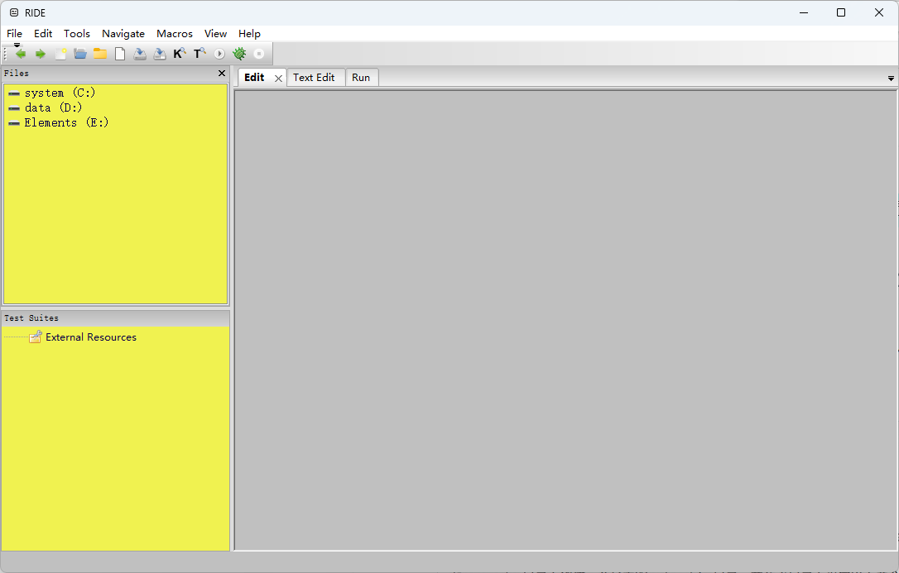

    图 3-18：RIDE 的初始界面

2. 在如图 3-18 所示界面的菜单栏中，通过依次用鼠标单击“File”→ “New Project”菜单项，创建一个名为`03_HelloRobot`的新项目，保存目录依然为之前约定的`配套资源/示例代码`目录，如图 3-19 所示。

    

    图 3-19：在 RIDE 中创建新项目

    在选择工程类型时，如果读者想创建的是一个多文件的项目，就选择“Directory”，否则就保持默认选项即可。

3. 待上述项目创建之后，读者就会在如图 3-20 所示的主界面中看到这个新项目了。在该界面中，除了顶部的菜单栏和工具栏之外，其工作区主要由三个窗格组成。左侧上半部的“Files”窗格可被视为是当前计算机设备的资源管理器，其中显示的是当前文件所在的目录；左侧下半部的“Test Suites”窗格可被视为是项目管理器，其中显示的是我们使用 RIDE 创建的项目及其相关资源；最后，右侧占大部分区域的窗格就是当前项目的主工作区。

    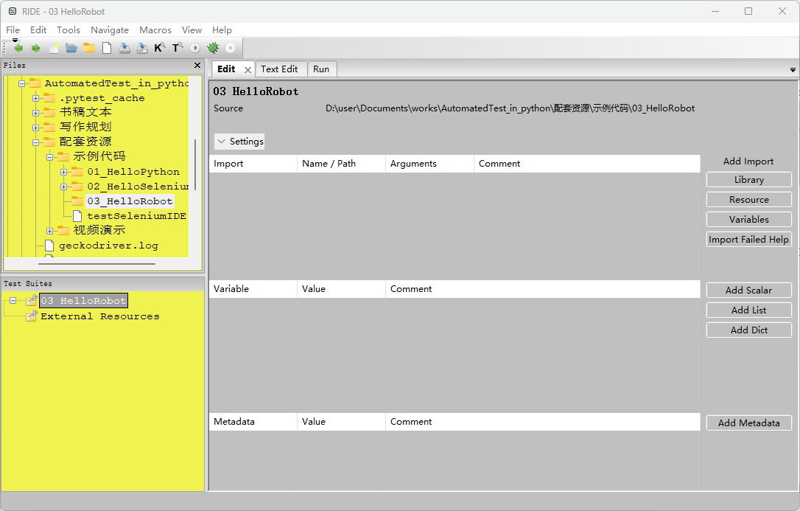

    图 3-20：RIDE 中的项目管理界面

4. 在 RIDE 中，下面的管理单元分为项目、测试套件和测试用例三个级别。因此读者接下来要做的就是在图 3-20 所示界面左侧的“Test Suites”窗格中用鼠标右键单击之前创建的`03_HelloRobot`项目，并在弹出的菜单中选择“New Suite”菜单项来新建一个新的测试套件。在这里，笔者将该套件命名为`testOpenBaidu`，如图 3-21 所示。

    

    图 3-21：在 RIDE 中创建测试套件

5. 继续在“Test Suites”窗格中用鼠标右键单击之前创建的`testOpenBaidu`测试套件，并在弹出的菜单中选择“New Test Case”菜单项来新建一个新的测试用例。在这里，笔者将该测试用例命名为`openBaiduCase`，如图 3-22 所示。

    

    图 3-22：在 RIDE 中创建测试用例

6. 在上述步骤完成之后，读者就会在 RIDE 的主界面中看到如图 3-23 所示的项目信息了。此刻，主界面右侧工作区呈现的就是当前测试用例的编辑界面。接下来，读者就需要在该界面中进行测试用例的具体设计了。

    

    图 3-23：RIDE 的用例编辑界面

7. 作为在 Robot 框架设计测试用例的第一步，读者首先要做的就是将 Selenium 框架作为第三方扩展引入到当前项目中。具体操作是：首先打开命令行终端环境并在其中执行`pip install robotframework-selenium2library`命令安装对应的插件。然后回到 RIDE 中，并在“Test Suites”窗格中用鼠标左键单击之前创建的`testOpenBaidu`测试套件，并在右侧主工作区中用鼠标左键单击“Add Import”栏下面的“Library”按钮，如图 3-24 所示。

    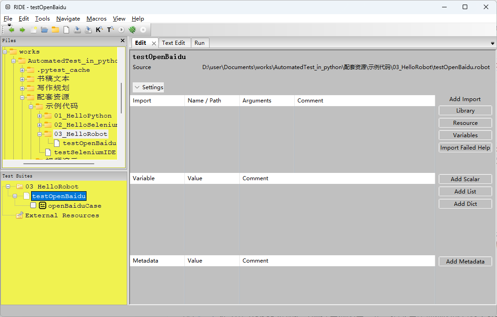

    图 3-24：RIDE 的套件编辑界面

8. 在弹出的如图 3-25 所示对话框中填写要导入的扩展为“Selenium2Library”（注意区分大小写），并用鼠标左键单击“OK”即可完成 Selenium 框架的导入。

    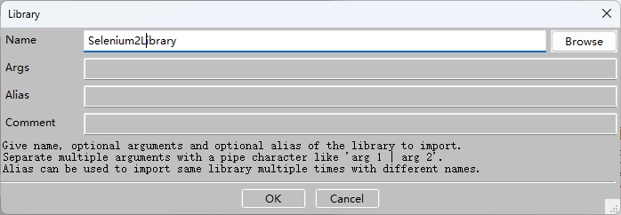

    图 3-25：导入 Selenium 扩展

    待扩展添加完成之后，我们就可以在如图 3-26 所示界面中看到该扩展了。如果该扩展的名称为黑色，即证明该扩展已经被成功导入。如果为红色，可能就遇到了一些路径问题，最直接的解决方法就是找到该扩展的安装目录（该目录通常位于`[Python安装目录]\lib\site-packages\`目录下），并在其中创建一个名为`GLOBAL_VARIABLES.py`的空文件即可。

    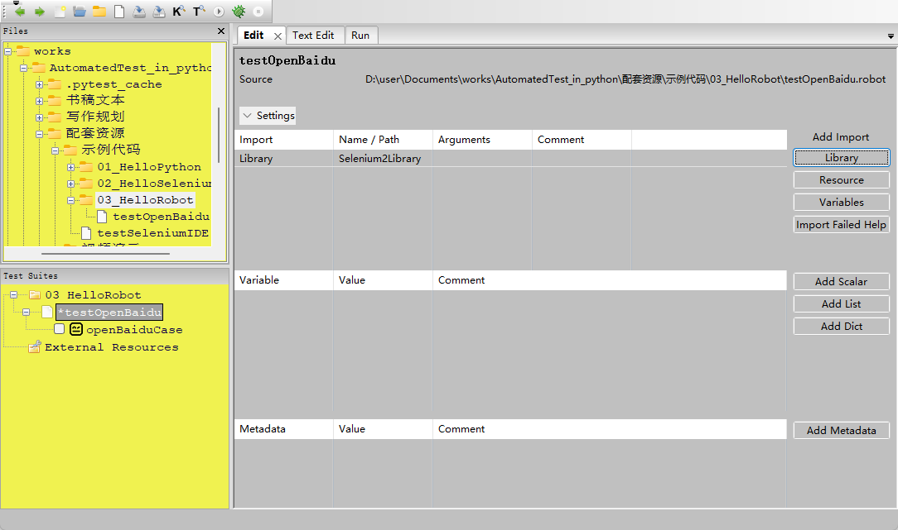

    图 3-26：RIDE 中的扩展列表

9. 在“Test Suites”窗格中用鼠标左键单击之前创建的`testOpenBaidu`测试用例，回到 RIDE 的用例编辑界面中，使用 Robot 框架的内置关键字编写如下测试剧本（在编写过程中，读者可以使用“Alt+Ctrl+Space”快捷键来查看当前可用的关键字），具体如图 3-27 所示。

    - 打开浏览器并访问百度的搜索；
    - 在搜索框中输入文字：robot framework
    - 用鼠标左键单击“百度一下”按钮；
    - 让浏览器窗口等待 20 秒；
    - 关闭浏览器；

    

    图 3-27：使用关键字编写测试用例

10. 在 RIDE 顶部的菜单栏中依次选择“Tools”→“Run Tests”即可启动当前的测试用例了。待测试用例执行完成之后，RIDE 右侧的主工作区中将会自动报告测试的结果，如图 3-28 所示。

    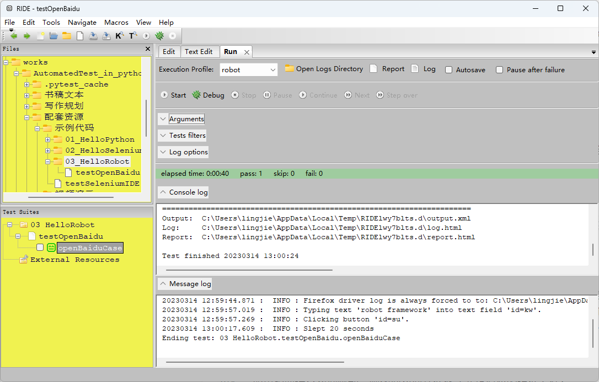

    图 3-28：测试用例的执行报告

至此，读者就完整地体验了在 RIDE 集成环境中基于 Robot+Selenium 框架，使用关键字编写测试用例的基本流程。从该流程中，我们可以明确地感受到关键字驱动的测试方法所能带来的便利性，以及整个测试过程的自动化程度。但这也带出了下一个要解决的问题：**测试人员在使用 Robot 框架编写测试用例时，究竟可以使用哪些关键字呢？**这就来到了程序员们快速学习一个新框架的最后一个步骤。

### 查阅官方文档

对于测试人员来说，学习使用 Robot 框架进自动化测试工作的第一步是掌握该框架提供的内置关键字。而想要了解这些内置关键字，最便捷的方法就是查阅 Robot 框架的官方文档，其步骤具体如下。

1. 在 Google、百度这样的搜索引擎中输入“robot framework”关键字，就可以快速找到并访问 Robot 框架提供的官方网站，如图 3-29 所示。

    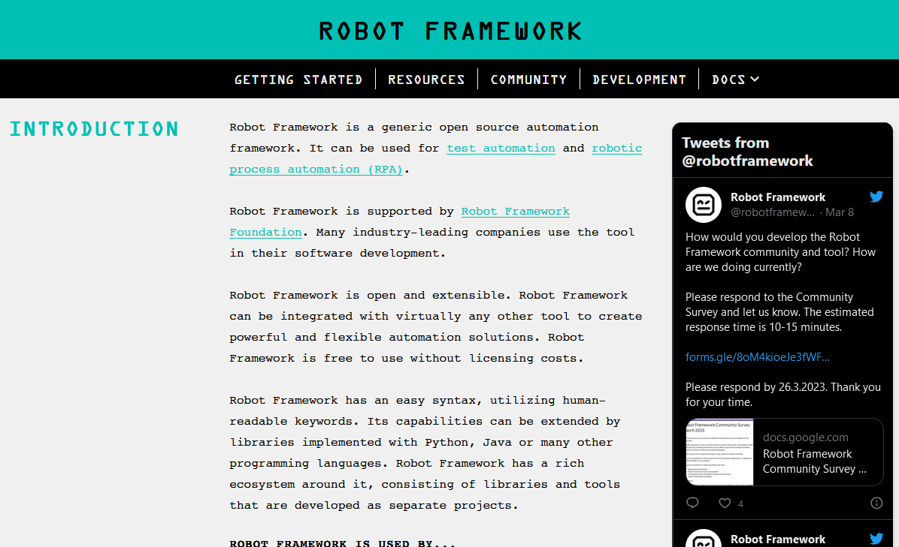

    图 3-29：Robot 框架的官方网站

2. 在图 3-29 所示页面的顶部导航栏中找到带有“DOCS”字样的链接，并在展开的菜单中选择“BuitIn Library”链接即可跳转到 Robot 框架的内置关键字文档首页了，如图 3-30 所示。

    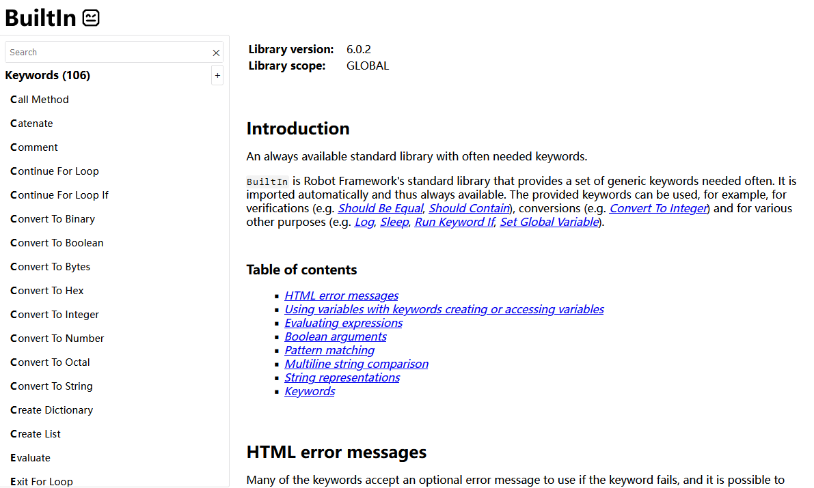

    图 3-30：Robot 框架的内置关键字文档

3. 从图 3-30 所示的文档中，读者可以看到 Robot 提供了 106 个内置关键字，这些关键字主要用于变量定义、循环控制、数据计算、进制转换、断言判断、日志输入/输出等基本测试功能。例如，如果读者想知道“Call Method”关键字的作用，以及使用时需要指定哪些参数，就可以使用该文档页面中的搜索功能来查看该关键字的详细说明，如图 3-31 所示。

    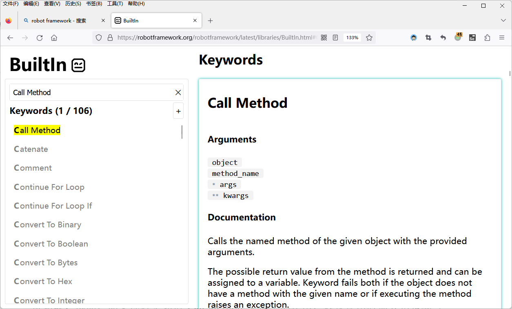

    图 3-31：Call Method 关键字的文档

在掌握了 Robot 框架的内置关键字之后，接下来该框架的标准库中提供的关键字。如果读者想查阅这部分关键字的文档，可在图 3-29 所示页面的顶部导航栏中找到带有“DOCS”字样的链接，并在展开的菜单中选择“Standard Library”链接即可跳转到 Robot 框架标准库中的关键字文档首页了，如图 3-32 所示。

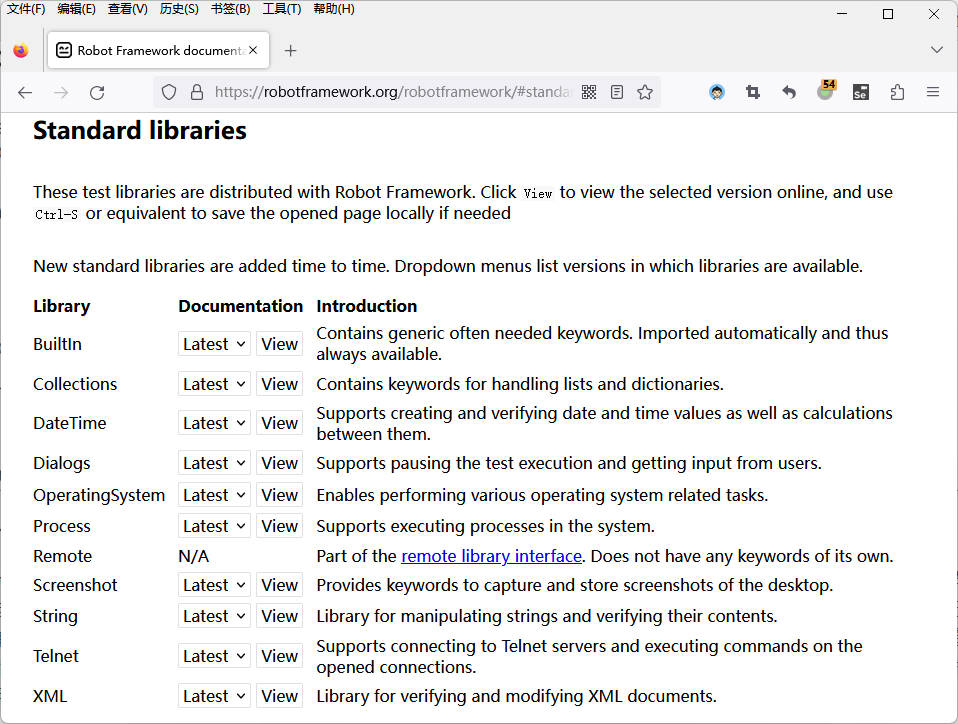

图 3-32：标准关键字文档

上述 11 个分组的关键字涵盖了程序员们在日常编程时会需要用到的测试功能。例如：Collections 组的关键字主要用于执行与列表、字典等与集合类操作相关的测试；DateTime 组的关键字主要用于与日期、时钟类型数据相关的测试等，读者可以根据自己的需要用鼠标单击相应的“view”链接，并查阅相关的文档。

如果读者还想要对更复杂的功能进行测试，那就需要专门学习经由第三方扩展导入的关键字了，而这需要查阅这些扩展提供的官方文档。例如，读者之前所使用的“Open Browser”、“Input Text”等关键字，都是借由 Selenium2Library 这个第三方扩展导入的、专用于 Web 前端测试的关键字。如果读者想查阅该扩展提供的关键字文档，可执行如下步骤。

1. 在 Google、百度这样的搜索引擎中输入“robot framework selenium2library”关键字，就可以快速找到并访问 Selenium2Library 项目提供的官方网站，如图 3-33 所示。

    

    图 3-33：Selenium2Library 项目的官方网站

2. 在图 3-33 所示页面中找到带有“Latest keyword documentation”字样的链接并用鼠标单击它，即可跳转到 Selenium2Library 扩展提供的关键字文档首页了，如图 3-34 所示。

    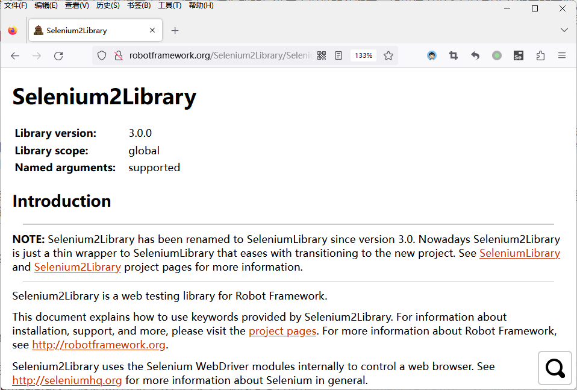

    图 3-34：Selenium2Library 的关键字文档

3. 在图 3-34 所示的文档界面中，读者可以用鼠标左键单击其底部的放大镜按钮，并使用其搜索功能快速定位到自己要查阅的关键字。例如，下面的图 3-35 中显示的就是“Open Browser”这个关键字的使用说明。

    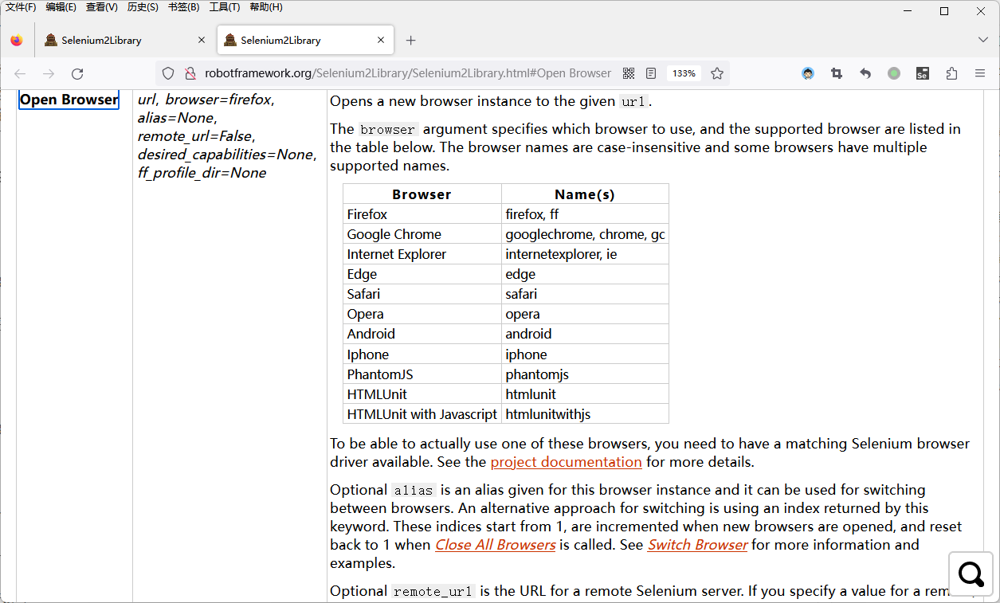

    图 3-35：Open Browser 关键字的使用说明

最后，在某些特殊情况下，读者也可以通过建立用户关键字的方式将自己编写的代码封装成可供 Robot 框架调用关键字。关于这部分的内容，读者也在 Robot 框架的官方网站上找到带有“DOCS”字样的链接，并在展开的菜单中选择“User Guide”链接，查阅其 2.7 节与用户关键字部分的内容，然后进行相关练习。例如，假设读者在这里需要将之前编写的`testGeckoDriver.py`脚本封装成一个名为“Test Geckodriver”的关键字，可执行以下步骤。

1. 回到 RIDE 中，并在“Test Suites”窗格中用鼠标左键单击之前创建的`testOpenBaidu`测试套件，并在右侧主工作区中用鼠标左键单击“Add Import”栏下面的“Library”按钮，然后再弹出的对话框中单击“Browse”，然后将之前编写的`testGeckoDriver.py`脚本作为扩展导入到当前测试套件中，其结果如图 3-36 所示。

    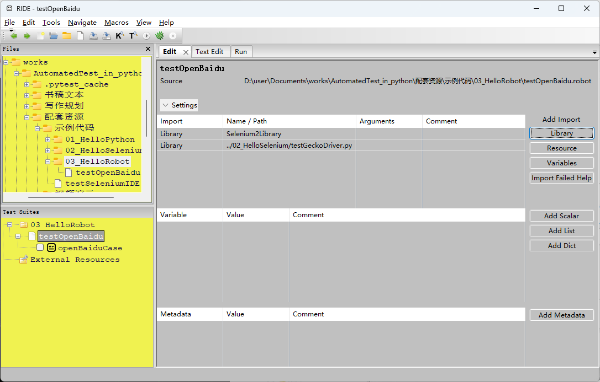

    图 3-36：在 RIDE 中导入自定义脚本

2. 继续在“Test Suites”窗格中用鼠标右键键单击之前创建的`testOpenBaidu`测试套件，并在弹出的菜单中选择“New User Keyword”菜单项来新建一个新的自定义关键字。在这里，笔者将该关键字命名为`Test Geckodriver`，并指定它有一个名为`${Url}`的参数，如图 3-37 所示。

    

    图 3-37：在 RIDE 中创建自定义关键字

3. 在“Test Suites”窗格中用鼠标左键单击刚创建的`Test Geckodriver`关键字，进入到该关键字的编辑界面中，然后在其中调用之前在`testGeckoDriver.py`脚本定义的函数，并设定其参数就是关键字接收到的参数：`${Url}`，如图 3-38 所示。

    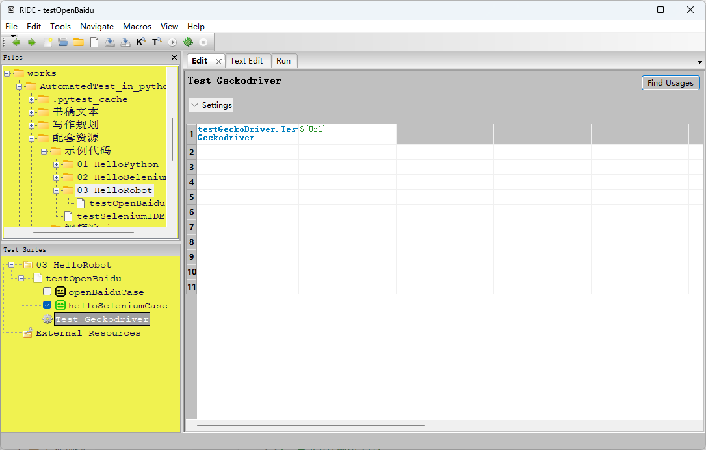

    图 3-38：在 RIDE 中编辑自定义关键字

4. 只要上述操作顺利，自定义关键字的操作就完成了。如果读者想验证一下该关键字是否可用，可继续在“Test Suites”窗格中用鼠标右键单击之前创建的`testOpenBaidu`测试套件，并在弹出的菜单中选择“New Test Case”菜单项，新建一个名为`helloSeleniumCase`的测试用例，并在该测试用例的编辑界面中调用`Test Geckodriver`关键字，并为其指定要访问的 URL 参数，如图 3-39 所示。

    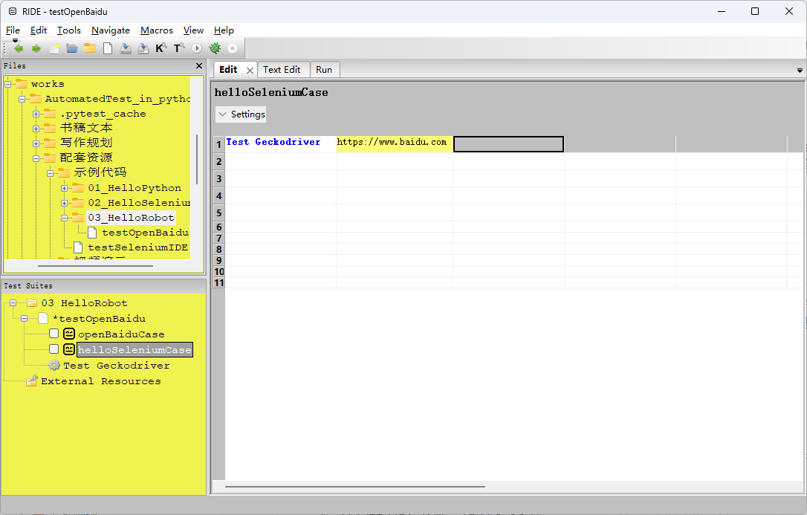

    图 3-39：在 RIDE 中调用自定义关键字

5. 最后只需在 RIDE 左侧的“Test Suites”窗格勾选`helloSeleniumCase`测试用例，并在其顶部的菜单栏中依次选择“Tools”→“Run Tests”即可启动该测试用例了，其测试报告如图 3-40 所示。

    

    图 3-40：验证自定义关键字的使用

关于上述内容的更详细说明，读者也在 Robot 框架的官方网站上找到带有“DOCS”字样的链接，并在展开的菜单中选择“User Guide”链接，查阅其 2.7 节与用户关键字部分的内容，然后进行相关练习。

## 培养自主学习的能力

需要再次强调的是，我们在这里虽然花了很多篇幅介绍了在 Web 前端测试领域较为流行的自动化测试框架及其使用方法，但笔者主要聚焦的是*可持续的自主学习能力*。毕竟，在如今的软件开发活与测试动中，程序员们可以选择的开发/测试框架不仅琳琅满目，选择众多，而且新陈代谢得极为快速。这意味着，即使本书很完善地介绍了当前最为流行的框架及其使用方法，很有可能等到它最终出版之时，人们已经有了更好的选择。所以**授之以鱼，不如授之以渔**，学习本章内容的真正目的应该是要培养读者“快速学习新框架”的能力，这需要掌握如何找到并查阅这些框架本身提供的官方文档，以便自行去了解这些框架的设计思路，并理解为什么决定开放那些接口给用户，为什么对用户隐藏那些实现。这就需要读者自己具备开发框架的能力。换句话说，虽然不必重复发明轮子，但一个优秀的工程师或设计师应该了解轮子是如何被发明的，这样才能清楚在怎么样的轮子上构建怎么样的车。

总而言之，对于如今的项软件工程师来说，在一个月内快速掌握某个新框架的能力远比之前已经掌握了多少个框架重要得多，例如当开发团队的管理员在面试新成员时，如果这位面试者有五年 A 框架的使用经验，那固然是很好，但团队中很多人都有，未必需要再多一个同类型的人才、但如果该面试者能在一个礼拜快速上手基于 Python 开发的任意一种框架，那么这位人才的重要性就会被凸显出来。
