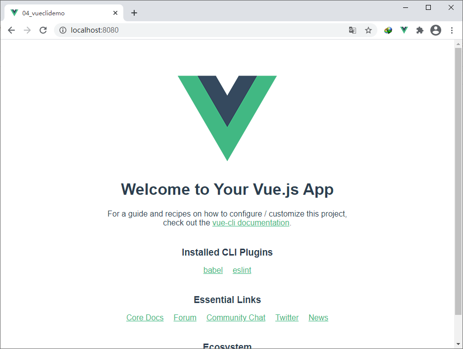
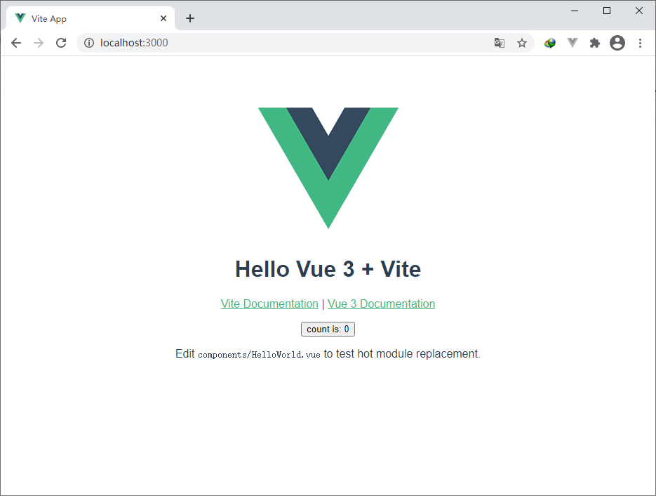

#!https://zhuanlan.zhihu.com/p/363513881
# vue-cli 与 Vite 学习笔记

## 项目脚手架

在学习了如何使用 Webpack 这类打包工具来实现项目的自动化打包之后，相信许多人心中一定产生了一个疑问：难道每一次创建项目都需要进行那么复杂配置工作吗？在这个配置过程中，程序员们不仅需要手动设置项目结构，安装项目中用到的各种框架、第三方库和 Webpack 组件，甚至有时候还需要手动解决这些框架、库与组件之间可能存在的版本兼容问题，工作之繁琐确实会让人望而却步。事实上，这些配置工作在具体的项目实践中通常也是利用特定的自动化工具来完成的。之所以不鼓励初学者一开始就使用这类自动化工具，主要是因为作为一个初学者，应该先亲自体验一遍前端项目的构建与配置过程，以便日后在使用脚手架工具来创建项目时能清晰地知道它为我们做了哪些事。只有这样，我们才有能力在项目出问题或发生其他变化时，根据实际情况来调整这些自动生成的配置。具体到基于 Vue.js 2.x 的项目中，程序员们通常是借助 vue-cli 这个由 Vue.js 官方开发团队提供的脚手架工具来创建项目的，下面就来具体介绍一下使用 vue-cli 构建 Vue.js 2.x 项目的基本步骤。

### 安装 vue-cli

和大多数基于 JavaScript 构建的软件工具一样，vue-cli 通常也是使用`npm install <软件包名>`命令来安装的。但与我们之前安装的框架、第三方库与 Webpack 组件不同的是，由于该工具是用来创建项目本身的，所以它的工作权限应该在被创建项目所在的权限层次之上，为此我们需要在安装命令中使用`--global`或`-g`参数来进行全局安装。具体安装方式就是计算机中的任意位置上打开命令行终端程序，并在其中输入如下命令：

```bash
npm install @vue/cli --global
```

待安装过程完成之后，我们可以使用`vue --version`命令来查看 vue-cli 工具的版本信息。这里需要特别说明的是，我们在这里使用的是 2.9.6 这个版本之后的 vue-cli，如果读者更习惯使用旧版本的 vue-cli，可以另外再通过执行`npm install @vue/cli-init --global`命令来安装其向后兼容的工具包。由于新版本的 vue-cli 生成的项目结构相较于老版本更为简单清晰，也更便于接下来要展开的项目结构详解工作，所以我们在这里将以 4.5.12 这个版本的 vue-cli 为准来展开讨论。

### 创建并初始化项目

在正确地安装完 vue-cli 之后，我们就可以使用`vue create <项目名称>`命令来创建并初始化一个基于 Vue.js 框架的前端项目了。需要特别说明的是，虽然`<项目名称>`在理论上可以是我们喜欢的任意名称，但它实际上应该要遵守程序员所在开发环境的命名规则，例如名称中不应该有大写字母。换而言之，如果我们想创建一个名为`04_vueclidemo`的示例项目，就需要在`code`目录下执行以下命令：

```bash
vue create 04_vueclidemo
```

在执行上述命令后，vue-cli 会用问答的形式让我们做一些选择：

- 首先，vue-cli 会要求选择新建项目时要使用的预置模板，这里将暂时先讨论 Vue.js 2.x 项目的默认模板。待下一章具体讨论项目实践时，我们再来介绍如何使用手动模式来配置项目，而对基于 Vue.js 3.x 的项目，我们将会在后面的内容中为读者介绍一个更为便捷的工具。

- 如果是第一次使用 vue-cli，它可能还会要求指定新项目的包管理器，这这里，我们就选择继续使用 NPM 包管理器了。

在回答完上述问题之后，vue-cli 就会自动去调用 NPM 包管理器来安装新项目所需要的全部组件。待一切安装过程完成时，读者就会看到命令行终端中输出如下信息：

```bash
 👉  Get started with the following commands:

 $ cd 04_vueclidemo
 $ npm run serve
```

上述信息提示了用户接下来要执行的操作命令，我们只需要根据提示进入到`04_vueclidemo`项目根目录中，并执行`npm run serve`命令来启动 vue-cli 为用户配置好的开发服务器，然后再根据其输出的信息用 Web 浏览器打开`http://localhost:8080/`这个 URL，届时就会看到一个依据项目模板构建的“Hello, World”示例程序，其效果如下图所示：



需要说明的是，由于`npm run serve`命令启动的是一个热部署的开发服务器，所以通常在项目中是看不到 Webpack 工具的输出文件的。如果希望像之前一样看到其打包之后产生的输出文件，我们就需要另外在项目的根目录下再执行`npm run build`命令，后者会在该目录下生成一个名为`dist`的目录，该目录中存放的就是我们想要查看的输出文件。

### 示例项目详解

下面，让我们来详细分析一下这个由 vue-cli 根据其 webpack 模板构建的示例项目，看看该脚手架工具究竟为我们生成了哪些东西，先从项目的整体目录结构开始。虽然用脚手架工具生成的项目有时会因 vue-cli 自身及其所用的 webpack 模板在版本上的不同而发生一些细微的变化，但我们在文件管理器这一类软件中看到的项目整体结构应该是大同小异的，下面是 vue-cil 4.5.12 使用 Vue.js 2.x 项目的默认模板生成的项目结构：

```bash
04_vuecliDemo
├─── dist                      # 存放项目输出文件的目录
├─── node_modules              # 存放项目依赖项的目录
├─── public                    # 存放不参与编译的资源文件的目录
│    ├─── favicon.icon         # 项目使用的图标文件
│    └─── index.html           # 项目的入口页面文件
├─── src                       # 存放项目源代码的目录
│    ├─── assets               # 存放将参与编译的资源文件的目录
│    │    └─── logo.png        # 示例图片类型的资源文件
│    ├─── components           # 存放自定义组件的目录
│    │    └─── HelloWorld.vue  # 自定义组件示例文件
│    ├─── App.vue              # 应用程序的根组件定义文件
│    └─── main.js              # 应用程序的入口文件
├─── babel.config.js           # babel 转译器的配置文件
├─── .gitignore                # 需要被 git 版本控制系统忽略的文件列表
├─── README.md                 # 项目的自述文件
├─── package-lock.json         # NPM 包管理器的锁定配置文件
└─── package.json              # NPM 包管理器的配置文件
```

虽然我们在上述结构示意图中用注释的形式详细说明了项目中每个目录和文件的作用，但在多数正常情况下，项目中的绝大部分文件是不需要程序员进行过多干预的，即使要解决一些配置问题，也只需要依据我们之前所学习的知识在相应的配置文件中做一些**谨慎的微调**即可，例如通过`package.json`调整项目中的组件依赖关系，通过自行创建一个名为`vue.config.js`文件来添加自定义的 Webpack 配置等。除了这些维护性工作之外，前端开发的主要工作都会在`src`目录中进行。下面就让我们重点来讨论一下该目录下的内容。首先要关注的是`main.js`文件，其中所编写的代码如下所示：

```JavaScript
import Vue from 'vue';
import App from './App.vue';

Vue.config.productionTip = false;

new Vue({
    render: h => h(App),
}).$mount('#app');
```

该文件定义的是整个由应用程序的入口模块，我们对它所做的事情也非常熟悉了。具体来说就是：上述代码会先引入 Vue.js 框架文件和一个名为`App.vue`的组件文件，并创建一个 Vue 对象实例。在这过程中，`App.vue`文件中定义组件会被注册到这个新建的 Vue 对象实例中，而后者会通过其`render`参数所设置的函数将`public`目录下的`index.html`中的`<div id='app'>`标签替换成`App`组件所对应的标签。接下来，让我们继续来查看定义了该组件的`App.vue`文件，其中所编写的代码如下所示：

```HTML
<template>
    <div id="app">
        
        <HelloWorld msg="Welcome to Your Vue.js App"/>
    </div>
</template>
<script>
    import HelloWorld from './components/HelloWorld.vue';

    export default {
        name: 'App',
        components: {
            HelloWorld
        }
    };
</script>
<style>
    #app {
        font-family: Avenir, Helvetica, Arial, sans-serif;
        -webkit-font-smoothing: antialiased;
        -moz-osx-font-smoothing: grayscale;
        text-align: center;
        color: #2c3e50;
        margin-top: 60px;
    }
</style>
```

在 Vue.js 项目实践中，程序员们通常会选择将用户界面中的组件组织成一个与 HTML DOM 相类似的树状结构。而`App.vue`文件中定义的就是整个用户界面的根组件。在该根组件的定义中，我们可以看到它又引入了一个名为`HelloWorld`的示例组件，并将它注册为自身的子组件。在今后的工作中，我们就可以依照根组件引入示例组件的方式在用户界面中添加自定义组件。例如，如果想将之前在[《Webpack简易教程》](https://zhuanlan.zhihu.com/p/361675202)中定义的`sayHello`组件加载到当前应用程序的用户界面中，我们就只需要执行以下步骤：

1. 安装项目的既定规范，将自定义组件所在的`sayHello.vue`文件存放到项目根目录下的`src/components`目录中。

2. 在`App.vue`文件中将根组件的定义内容修改如下：

   ```HTML
    <template>
        <div id="app">
            <h1>使用 vue-cli 构建项目</h1>
            <say-hello :who="who"/>
        </div>
    </template>
    <script>
        import sayHello from './components/sayHello';

        export default {
            name: 'App',
            components: {
                'say-hello': sayHello
            },
            data: function() {
                return {
                    who:'Vue'
                }
            }
        };
    </script>
    <style>
        #app {
            padding: 10px;
            background: black;
            color: floralwhite;
        }
    </style>
   ```

最后，如果在开发过程中需要用到图片、JSON 数据、独立的 CSS 样式等资源性文件，我们也同样应该按照项目规范将它们存放在项目根目录下的`src/assets`目录中，并且在条件允许的情况下，最好是能做到*分门别类*地存放这些文件。这里所谓的*分门别类*指的是：我们可以在`assets`目录下按照资源类型来创建一系列子文件夹以实现文件的分类存储。例如，图片文件可以存放在`assets/img`目录中，而 CSS 样式文件则可以存放在`assets/styles`目录中，以此类推。

## 前端构建工具

对基于 Vue.js 3.x 的项目来说，尤雨溪先生为其量身打造的 Vite 构建工具或许是一个更为便捷的选择。根据官方文档的说明，Vite 是一种全新的前端构建工具，读者在概念上可以将其理解为一套集成了开发服务器 + 打包工具的自动化项目构建工具，它相较于 vue-cli + Webpack 的组合主要具有以下优势:

- Vite 使用的是支持 ES6 模块机制的源码构建工具（即 ESBuild），其在构建效率上要明显好于使用 CommonJS 模块机制的 Webpack 这一类打包工具。当然了，在主流浏览器普遍支持 ES6 模块机制之前，使用 Webpack 这些工具也是一个合情合理的权宜之计，但如今这个问题已经得到了很大程度上的改善，也是时候有更好的选择了。

- 在使用 vue-cli + Webpack 这套组合工具的时候，由于我们启动的是基于 Webpack 这类打包工具的开发服务器，所以它每次都必须要先打包完成整个项目才能启动服务器，这通常需要花费不少时间，而且是项目的规模越大，服务器启动所花费的时间就越多，有时候甚至要等上十几分钟，这会严重影响我们的开发效率。而 Vite 则选择在一开始就将项目中的模块区分为**依赖项**和**项目源码**两大类，并根据*项目依赖项并不会经常发生变化*的特点对这两类模块加以分别处理，这样做就会大大加快开发服务器启动时间，我们的开发体验也会因此得到很大程度上的改善。

- vue-cli + Webpack 这套组合工具只能用于构建基于 Vue.js 框架的项目，而在 Vite 2.0 发布之后，这套工具已经对 Vue.js、React.js、Preact.js 等框架提供了支持，是一个更为通用的前端项目构建工具。学会了该工具的使用方式，也许就免去了我们学习其他框架专用工具的麻烦。

在了解了为什么在构建基于 Vue.js 3.x 的项目时 Vite 是一个更便捷的选择之后，下面就让我们通过构建示例项目来演示使用 Vite 构建项目的过程。首先，我们需要在`code`目录下执行`npm init @vitejs/app 05_vitejsDemo`命令，创建一个名为`05_vitejsDemo`的项目。同样地，在该目录执行过程中，它会以问答的形式要求我们做出一些选择：

- **Package name**：该问题要求确认项目的名称。在这里，我们可以修改名称，也可以直接敲回车键使用命令中指定的名称、
- **Select a template**：该问题要求选择一个用于构建项目要使用的模板，在这里，我们只需要在弹出的列表中选择`vue`模板即可。

在回答完上述问题之后，读者就会看到命令行终端中输出如下信息：

```bash
Done. Now run:    

cd 05_vitejsDemo
npm install     
npm run dev     
```

上述信息提示了用户接下来要执行的操作命令，我们只需要根据提示进入到`05_vitejsDemo`项目根目录中，并执行`npm install`和`npm run dev`这两个命令来安装项目依赖项并启动 Vite 的开发服务器，然后再根据其输出的信息用 Web 浏览器打开`http://localhost:3000/`这个 URL，届时就会看到一个依据项目模板构建的“Hello, World”示例程序，其效果如下图所示：



需要说明的是，如果读者使用的是 Windows 系统，在执行`npm run dev`命令时有可能会报出 ESBuild 程序不存在的错误，在这种情况下，我们只需要在项目根目录下执行`node .\node_modules\esbuild\install.js`命令手动安装一下该程序，然后再重新执行`npm run dev`命令即可。另外，基于与之前相同的理由，`npm run dev`命令启动的是一个热部署的开发服务器，所以通常在项目中是看不到项目构建结果的。如果希望像之前一样看到项目在构建过程中产生的文件，我们也需要另外在该项目的根目录下再执行`npm run build`命令，后者同样会生成一个名为`dist`的目录，该目录中存放的就是我们想要查看的文件。下面，让我们来看一下 Vite 生成项目的目录结构：

```bash
05_vitejsDemo
├─── dist                      # 存放项目输出文件的目录
├─── node_modules              # 存放项目依赖项的目录
├─── public                    # 存放不参与编译的资源文件的目录
│    └─── favicon.icon         # 项目使用的图标文件
├─── src                       # 存放项目源代码的目录
│    ├─── assets               # 存放将参与编译的资源文件的目录
│    │    └─── logo.png        # 示例图片类型的资源文件
│    ├─── components           # 存放自定义组件的目录
│    │    └─── HelloWorld.vue  # 自定义组件示例文件
│    ├─── App.vue              # 应用程序的根组件定义文件
│    └─── main.js              # 应用程序的入口文件
├─── vite.config.js            # Vite 的配置文件
├─── .gitignore                # 需要被 git 版本控制系统忽略的文件列表
├─── index.html                # 项目的入口页面文件
├─── package-lock.json         # NPM 包管理器的锁定配置文件
└─── package.json              # NPM 包管理器的配置文件
```

正如读者所见，Vite 所生成项目的目录结构与我们之前用 vue-cli 所生成的项目基本是相同的，只有配置文件变成了`vite.config.js`文件。需要说明的是，由于 Vite 使用的是 Rollup 这个打包工具及其插件体系，因此在具体的配置方法上会与 Webpack 存在着许多的不同之处，Rollup 更为强大的插件体系也赋予了 Vite 更灵活的扩展能力。我会另外专门写一篇文章来具体介绍 vite 的配置，这里考虑到篇幅的因素，就先暂且按下不表了，如果读者对此有兴趣，也可以先自行查阅 Vite 的官方文档。
