# Node.js 学习笔记

这篇笔记将用于记录个人在研究 Node.js 运行环境过程中所编写的代码示例与学习心得。为此，我会在`https://github.com/owlman/study_note`项目的`Programming/Client-Server/Runtime`目录下创建一个名为的`nodejs`目录，并在该目录下设置以下两个子目录：

- `notes`目录用于存放 Markdown 格式的笔记。
- `examples`目录则用于存放笔记中所记录的代码示例。

## 学习规划

- 学习基础：
  - 掌握与 HTML、CSS、JavaScript 相关的基础知识。
  - 了解与浏览器、服务器、数据库相关的基本知识。
  - 了解 B/S 分布式应用程序架构的基本原理。
- 学习资料：
  - 视频教程：
    [黑马程序员-Nodejs 教学课程](https://www.bilibili.com/video/av27670326?p=1)
  - 书籍教材：
    [《深入浅出 Node.js》](https://book.douban.com/subject/25768396/)
  - 线上文档：
    [Node.js 官方文档](http://nodejs.cn/api/)
  - 线上论坛：
    [cnode论坛](https://cnodejs.org/)
- 学习目标：
  - 开发一个 CMS 类型的后端应用。

## 第 1 部分：认识 Node.js

这一部分笔记将致力于对 Node.js 做一个概要认知，并搭建好学习 Node.js 的开发/调试环境。

### Node.js 是什么

Node.js 是一个 JavaScript 运行时环境，它移植了 Google Chrome 浏览器的 V8 引擎，通常被用作 JavaScript 代码在 Web 浏览器之外的宿主环境，这大幅度地扩展了 JavaScript 的使用范围，使其成为了一门近乎全能型的编程语言。

### Node.js 能做什么


### Node.js 的特性

Node.js 保留了 JavaScript 在 Web 浏览器端中所使用的大部分 API，Node.js 的作者 Ryan Dahl 并没有改变这门语言本身的任何执行特性，它的编程模型依旧将基于作用域和原型链这些概念，这让 Node.js 这个 JavaScript 的运行环境具备了以下这些与众不同的特性：

- **单一线程**：
  Node.js 沿用了 JavaScript 单一线程的执行特性。即在 Node.js 中，JavaScript 的执行线程与其他线程之间同样也是无法共享状态的。单一线程的最大好处是不用像多线程编程那样处理很容易产生 bug 的同步问题，它从根本上杜绝了死锁问题，也避免了线程上下文交换所带来的性能上的开销。当然了，单一线程的执行方式也有它自身的弱点，譬如，它无法充分发挥多核处理器的性能、一个错误就会导致整个程序崩溃，以及当某一任务执行大量计算时会因长期占用处理器而影响其他异步 I/O 的执行。

- **事件驱动**：
  在 Web 开发领域，JavaScript 如今在浏览器端正承担了越来越重要的角色，其事件驱动的编程模型也逐渐深入人心。当然了，这种编程模型虽然具有轻量级、松耦合等优势，但在多个异步任务的场景下，由于程序中的各个事件是彼此独立的，它们之间的协作就成为了一个需要我们费心解决的问题。

- **异步编程**：
  在 Node.js 中，大部分 I/O 操作都是以异步调用的方式来进行的。Node.js 的开发者们在其底层构建了许多异步 I/O 的 API，包括文件读取、网络请求等。这样一来，我们就可以很自然地在语言层面上实现并行的 I/O 操作，使得程序中的每个调用都无须等待之前的 I/O 调用结束，从而提高程序的执行效率。例如，如果我们想要读取两个相互不依赖的文件，如果采用的是异步 I/O，其耗费的时间只取决于读取较慢的那个文件，而如果采用同步 I/O 的话，其耗时就是两个文件的读取时间之和了，异步操作模型带来的优势是显而易见的。当然了，由于异步编程也会导致代码的编写顺序与其具体执行顺序的不一致，对于很多习惯同步思路编程的人来说，阅读和维护这样的代码会是一个不小的挑战。

### Node.js 的安装

Node.js 的安装主要有两种方式，通常在 Windows 和 MacOS 下，我们会采用下载`.msi`和`.pkg`格式的安装包，使用安装向导来进行安装。而在 Linux/Unix 这一类系统中，我们则往往会采用 apt 和 yum 这样的包管理器来安装。这两种方式都不复杂，下面以 Windows 和 Ubuntu 为代表，简单介绍一下这两种安装方法。

#### 使用安装包

如果想要在 Windows 下安装 Node.js，首先要打开 Node.js 的官网`https://nodejs.org/`，然后选择一个合适的版本。在其官网的首页中，我们会看到有 LTS 和 Current 两种版本可供下载。其中，LTS 版即受到长期支持的版本，其组件通常都经历过了充分的测试，比较稳定，适合于正式的生产开发。而 Current 版本则是最新的版本，通常包含了最新纳入的新特性，比较适合想对 Node.js 本身进行研究的朋友。


待下载完`.msi`格式的安装包之后，我们就可以打开安装包启动安装向导了。在安装的开始阶段，安装向导会要求我们设置一些选项，大多数时候只需采用默认选项，直接点击「Next」即可。只是在组件选择的页面中，需要注意一下，如果你对 Node.js 的组件并不熟悉，最好选择安装全部组件。另外，请记得点开下图中那个「add path」选项前面的`+`号，这样安装程序就会主动把 Node.js 和 NPM 这两个模块的命令路径添加到系统环境变量里，这对初学者来说是非常方便的。


待一切选项设置完成之后，我们就可以点击下面的「Install」即可完成安装。


如果一切顺利，我们在 Windows 中打开命令行终端环境，在其中输入`node -v`命令并回车之后，应该就会看到相关的版本信息。


#### 使用包管理器

在 Ubuntu 这种类 Linux/Unix 操作系统中，我们安装软件往往都会选择使用 apt 这一类的包管理器，简单而方便，依次执行以下命令即可：

```bash
 sudo apt update
 sudo apt install nodejs
 # 最新的 Node.js 已经集成了 npm，所以通常情况下是无需单独安装 npm 的。
 sudo apt install npm
```

除此之外，我们还能安装 n 管理器来管理 Node.js 的版本，其安装命令如下：

```bash
sudo npm install -g n
```

该工具的具体使用方式如下：

```bash
sudo n lts               # 长期支持
sudo n stable         # 稳定版
sudo n latest          # 最新版
sudo n 12.4.0         # 直接指定版本
sudo n                    # 使用上下键切换已有版本
```

如果一切顺利，我们打开 bash 这一类命令行终端，并在其中输入`node -v`命令并回车之后，应该就会看到相关的版本信息。

## 第 2 部分：基本使用

这一部分笔记将致力于记录为学习并掌握 JavaScript 在 Node.js 运行平台下的基本使用而编写的代码。

### 示例1. 跟大家说 Hello

由于 Node.js 只是 JavaScript 程序的运行时环境，所以它并不会限制 JavaScript 代码的具体运行形式。为了说明这一点，我接下来将使用四种形式来跟大家说"Hello"。首先，我会在`examples`目录下执行`mkdir 01_sayHello`命令，以创建用于存放这一组示例的目录。

#### 1. 终端输出

在终端输出信息需要调用`console.log()`方法，下面来创建第一个 Node.js 脚本，步骤如下：

1. 在`examples/01_sayHello`目录下执行`touch 01-sayHello.js`命令。
2. 执行`vim 01-sayHello.js`命令打开该脚本文件。
3. 在`01-sayHello.js`脚本文件中输入如下代码：

    ```JavaScript
    const name = 'owlman'
    console.log('你好！', name)  // 输出：你好！owlman
    ```

4. 保存文件后，在`examples/01_sayHello`目录下执行`node 01-sayHello.js`命令，就可以看到输出结果：

    

#### 2. 文件读写

用 Node.js 脚本读文本文件需要调用`fs.readFile()`方法，具体步骤如下：

1. 在`examples/01_sayHello`目录下执行`touch 01-readFile.js`命令。

2. 在`examples/01_sayHello`目录下执行`mkdir data`命令，创建用于存放文件的目录。

3. 在`examples/01_sayHello/data`目录下执行`touch text-data.txt`命令，并在其中输入以下内容：

    ```bash
    Hello，owlman，欢迎学习 Nodejs。

    接下来，请读取下面这首诗：

    朝辞白帝彩云间，
    千里江陵一日还。
    两岸猿声啼不住，
    轻舟已过万重山。
    ```

4. 在`examples/01_sayHello`目录下执行`vim 01-readFile.js`命令打开脚本文件，输入如下代码：

    ```JavaScript
    const fs = require('fs')
    fs.readFile('./data/text-data.txt', function(err, data) {
        if (err !== null ) {
           return console.error('错误信息：' + err.message)
        }
        console.log(data.toString())
    })
    ```

5. 保存文件后，在`examples/01_sayHello`目录下执行`node 01-readFile.js`命令，就可以看到相关内容已被输出到终端中：

    

用 Node.js 脚本写文本文件需要调用`fs.writeFile()`方法，具体步骤如下：

1. 在`examples/01_sayHello`目录下执行`touch 01-writeFile.js`命令。

2. 在`examples/01_sayHello`目录下执行`vim 01-writeFile.js`命令打开脚本文件，并输入如下代码：

    ```JavaScript
    const fs = require('fs')
    const str = '你好，Nodejs！'

    fs.writeFile('./data/output.txt', str, function(err) {
        if (err !== null ) {
           return console.error('错误信息：' + err.message)
        }
        console.log("文件写入成功!")
    })
    ```

3. 保存文件后，在`examples/01_sayHello`目录下执行`node 01-writeFile.js`命令，就可以看到相关内容已经被写入`output.txt`文件：

    

#### 3. Web 服务

用 Node.js 脚本创建 Web 服务需要用到`http`模块，具体步骤如下：

1. 在`examples/01_sayHello`目录下执行`touch 01-webServer.js`命令。

2. 执行`vim 01-webServer.js`命令打开脚本文件，输入如下代码：

    ```JavaScript
    const http = require('http')
    const server = http.createServer()

    server.on('request', function(req, res){
        res.end('<h1>你好，Nodejs！</h1>')
    })

    server.listen(8080, function(){
        console.log('请访问http://localhost:8080/，按Ctrl+C终止服务！')
    })
    ```

3. 保存文件后，在`examples/01_sayHello`目录下执行`node 01-webServer.js`命令，并用浏览器访问`http://localhost:8080/`，就可以看到一个显示`<h1>`标签的页面：

    

#### 4. TCP 服务

用 Node.js 构建 TCP 服务需要用到`net`模块，具体步骤如下：

1. 在`examples/01_sayHello`目录下执行`touch 01-tcpServer.js`命令。

2. 执行`vim 01-tcpServer.js`命令打开脚本文件，输入如下代码：

    ```JavaScript
    const net = require('net')
    const server = net.createServer(function (socket) {
        console.log('连接来自' + socket.remoteAddress)
        socket.end('你好，Nodejs！\n')
    })

    server.listen(7000, 'localhost', function(){
        console.log('TCP服务器监听 localhost 的 7000 端口，按 Ctrl+C 终止服务！')
    })
    ```

3. 保存文件后，在`examples/01_sayHello`目录下执行`node 01-tcpServer.js`命令，并用`telnet localhost 7000`命令测试该服务器，结果如下：

    

### 示例2. 自定义模块及其使用方式

这一部分示例将致力于演示 Node.js 的自定义模块语法以及部分 ES6 新增的语法。首先，我们要在`examples`目录下执行`mkdir 02_useModule`命令来创建用于存放这一组示例的目录。

#### 1. 单文件模块

1. 在`examples/02_useModule`目录下执行`touch 02-singleFile.js`命令,创建脚本文件，并输入如下代码：

    ```JavaScript
    class singleFile_module {
        constructor() {
            this.name = 'singleFile_module'
        }

        sayhello() {
            console.log('Hello', this.name)
        }
    }

    module.exports = singleFile_module
    ```

2. 在`examples/02_useModule`目录下执行`touch 02-test.js`命令,创建脚本文件，并输入如下代码：

    ```JavaScript
    const es5_syntax = require('./02-singleFile')
    const testobj = new singleFile_module()
    testobj.sayhello()
    ```

3. 保存文件后，在`examples/02_useModule`目录下执行`node 02-test.js`命令，结果如下：

    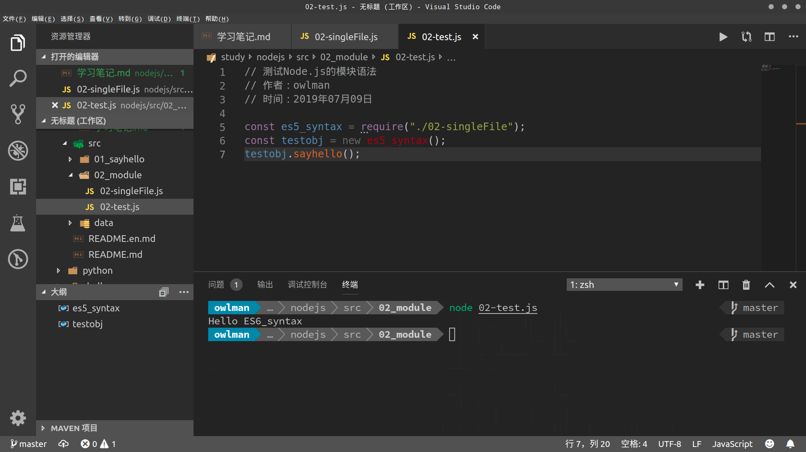

#### 2. 多文件模块

1. 在`examples/02_useModule`目录下执行`mkdir 02-multiFile`命令，并进入到该目录中执行`npm init -y`命令，创建模块目录。

2. 在`examples/02_useModule/02-multiFile`目录下执行`touch functions.js`命令，创建脚本文件，并输入如下代码：

    ```JavaScript
    function add(x,y){
        return x + y
    }

    exports.add = add
    ```

3. 在`examples/02_useModule/02-multiFile`目录下执行`touch dataObj.js`命令，创建脚本文件，并输入如下代码：

    ```JavaScript
    const name = 'multFile_module'

    exports.name = name
    ```

4. 在`examples/02_useModule/02-multiFile`目录下执行`touch index.js`命令，创建脚本文件，并输入如下代码：

    ```JavaScript
    const func = require('./functions')
    const str = require('./dataObj')

    class multiFile_module {
        constructor() {
            this.func = func.add
            this.name = str.name
        }

        sayhello() {
            console.log('Hello', this.name)
            console.log('x + y = ', this.func(10,5))
        }
    }

    module.exports = multiFile_module
    ```

5. 在`examples/02_useModule`目录下将`02-test.js`脚本修改如下：

    ```JavaScript
    const singleFile_module = require(`./02-singleFile`)
    const testobj = new singleFile_module()
    testobj.sayhello()

    const multiFile_module = require(`./02-multiFile`)
    const testobj2 = new multiFile_module()
    testobj2.sayhello()
    ```

6. 保存所有文件后，在`examples/02_useModule`目录下执行`node 02-test.js`命令，结果如下：

    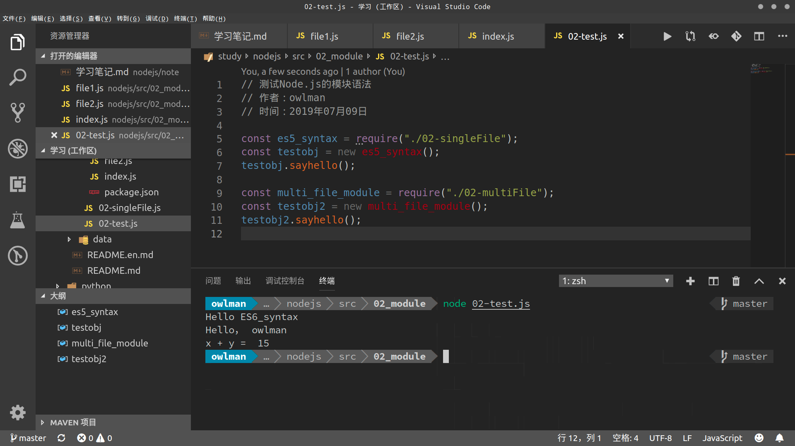

## 第 3 部分：构建 Web 服务

这一部分笔记将致力于记录为学习并掌握如何在 Node.js 运行平台下构建 Web 服务而编写的代码。

### 示例3. 构建 Web 服务器

这部分示例将致力于用 Node.js 模拟一个类似于 Apache 的 Web 服务器，处理浏览器端的请求，将相关的页面响应给浏览器。首先，我会要在`examples`目录下执行`mkdir 03_webSever`命令，以创建用于存放这一组示例的目录。然后执行以下步骤：

1. 在`examples/03_webSever`目录下执行`mkdir www`命令，创建网站目录，然后在其中创建`index.htm`和`login.htm`两个 HTML 文件以及一个名为`style.css`的 CSS 文件：
   - index.htm:

        ```HTML
        <!DOCTYPE html>
        <html lang="zh-cn">
            <head>
                <meta charset="utf-8" />
                <link rel="stylesheet" type="text/css" href="style.css" />
                <title>首页</title>
            </head>
            <body>
                <h1>你好,nodejs！</h1>
                <p> <a href="login.htm">请登录！</a> </p>
            </body>
        </html>
        ```

   - login.htm:

        ```HTML
        <!DOCTYPE html>
        <html lang="zh-cn">
            <head>
                <meta charset="utf-8" />
                <link rel="stylesheet" type="text/css" href="style.css" />
                <title>登录页面</title>
            </head>
            <body>
                <h1>你已经登录。。。</h1>
                <p> <a href="index.htm">回首页！</a> </p>
            </body>
        </html>
        ```

   - style.css:

        ```css
        body {
            background: gray;
        }
        ```

2. 在`examples/03_webSever`目录下执行`touch 03-webServer.js`命令，创建脚本文件，并输入如下代码：

    ```JavaScript
    const http = require('http')
    const fs = require('fs')
    const server = http.createServer()

    server.on('request', function(req, res) {
        const webRoot = './www'
        const url = req.url
        if ( url === '/' ) {
            url = '/index.htm'
        }

        fs.readFile(webRoot+url, function(err, data) {
            if ( err !== null ) {
                console.error('错误信息：' + err.message)
                return res.end('<h1>404 页面没找到！</h1>')
            }
            res.end(data)
        })
    })

    server.listen(8080, function(){
        console.log('请访问http://localhost:8080/，按Ctrl+C终止服务！')
    })
    ```

3. 保存所有文件后，在`examples/03_webSever`目录下执行`node 03-webServer.js`命令，然后打开浏览器并访问`http://localhost:8080/`，就会看到如下页面：

    

### 示例4. 使用`art-template`模版引擎生成网页

这一部分示例将以生成个人信息页面为例，演示在服务器端基于 Node.js 使用`art-template`模板引擎来生成网页。为此，我需要在`examples`目录下执行`mkdir 04_templatingEngine`命令来创建用于存放这一组示例的目录。

#### 1. 单模版渲染

首先来示范一下如何使用`art-template`模版引擎的渲染单一模版文件，请跟着以下步骤来构建示例：

1. 在`examples/04_templatingEngine`目录下执行`npm install art-template --save`命令，安装将`art-template`包安装到当前示例项目中。

2. 在`examples/04_templatingEngine`目录下执行`touch singleTpl.htm`命令，创建一个模版文件，并在其中输入以下代码：

    ```HTML
    <!DOCTYPE html>
    <html lang="zh-cn">
        <head>
            <meta charset="utf-8" />
            <link rel="stylesheet" type="text/css" href="style.css" />
            <title>{{ name }}的个人信息</title>
        </head>
        <body>
            <h1>{{ name }}的个人信息</h1>
            <table>
                <tr><td>姓名：</td><td>{{ name }}</td></tr>
                <tr><td>年龄：</td><td>{{ age }}</td></tr>
                <tr><td>性别：</td><td>{{ sex }}</td></tr>
                <tr>
                    <td>爱好：</td>
                    <td>{{ each items }} {{ $value }} {{ /each }}</td>
                </tr>
            </table>
        </body>
    </html>
    ```

3. 在`examples/04_templatingEngine`目录下执行`touch 04-useTemplating_engine.js`命令，创建一个脚本文件，具体如下：

    ```JavaScript
    const http = require('http')
    const fs = require('fs')
    const template = require('art-template')

    class human {
        constructor(name, age, sex, items=[])
        {
            this.name  = name
            this.age   = age
            this.sex   = sex
            this.items = items
        }
    }

    const server = http.createServer()

    server.on('request', function(req, res){
        const url = req.url
        let boy = null
        if ( url === '/' ) {
            boy = new human('凌杰', '37', '男', ['看书', '看电影','旅游'])
        } else if ( url === '/wang' ) {
            boy = new human('蔓儿', '25', '女', ['看书', '看电影','写作'])
        }

        if ( boy === null ) {
            return res.end('<h1>404 页面没找到！</h1>')
        }

        fs.readFile('./singleTpl.htm', function(err, data){
            if ( err !== null ) {
                return res.end('<h1>404 没找到模版文件！</h1>')
            }

            const strHtml = template.render(data.toString(), {
                name : boy.name,
                age  : boy.age,
                sex  : boy.sex,
                items: boy.items
            })

            res.end(strHtml)
        })
    })

    server.listen(8080, function(){
        console.log('请访问http://localhost:8080/，按Ctrl+C终止服务！')
    })
    ```

4. 保存所有文件后，在`examples/04_templatingEngine`目录下执行`node 04-useTemplating_engine.js`命令，然后打开浏览器并访问`http://localhost:8080/wang`，就会看到如下页面：

    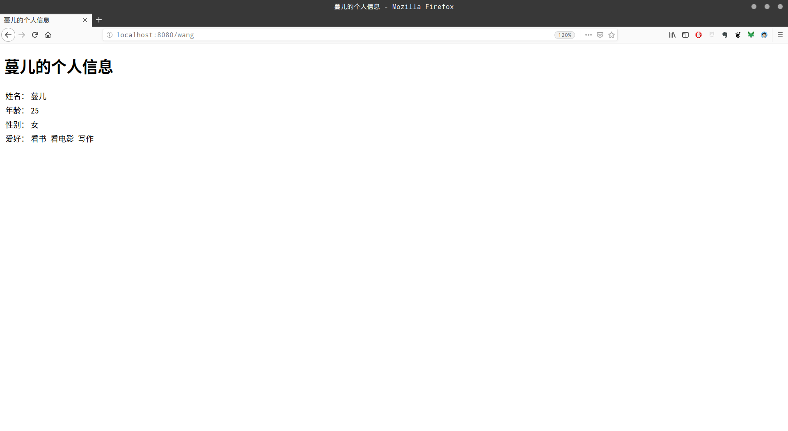

#### 2. 多模版组合渲染

在同一 Web 应用中，所有的页面通常都由相同的头部和底部元素，所以为了减少代码的冗余，提高重用率，开发者们通常会考虑将重复的部分独立成一个单独的模版文件，然后用相互包含的方式组合成页面。下面就继续以`art-template`模板引擎为例来演示一下如何将多个模版组合渲染成单一的 HTML 页面，其具体步骤如下：

1. 在`examples/04_templatingEngine`目录下执行`touch tpl1.art tpl2.art`命令，创建两个模版文件，然后在这两个文件中分别输入以下代码：

   - tpl1.art :

     ```HTML
     <header>
        <h1>查看个人信息</h1>
        <br>
     </header>
     ```

   - tpl2.art ：

     ```HTML
     <footer>
        <div>
            <p>&copy; 2016 owlman.org；本站系纯HTML5站点。</p>
        </div>
     </footer>
     ```

2. 在`examples/04_templatingEngine`目录下执行`touch multiTpl.htm`命令创建用于组合的 HTML 页面文件，并在其中输入以下代码：

   ```HTML
   <!DOCTYPE html>
   <html lang="zh-cn">
        <head>
            <meta charset="utf-8" />
            <link rel="stylesheet" type="text/css" href="style.css" />
            <title>查看个人信息</title>
        </head>
        <body>
            {{ include './tpl1.art' }}
            <h2>{{ name }}的个人信息</h2>
            <table>
                <tr><td>姓名：</td><td>{{ name }}</td></tr>
                <tr><td>年龄：</td><td>{{ age }}</td></tr>
                <tr><td>性别：</td><td>{{ sex }}</td></tr>
                <tr>
                    <td>爱好：</td>
                    <td>{{ each items }} {{ $value }} {{ /each }}</td>
                </tr>
            </table>
            {{ include './tpl2.art' }}
        </body>
    </html>
    ```

3. 在`examples/04_templatingEngine`目录下执行`cp 04-useTemplating_engine.js 04-useTemplating_engine2.js`命令，将之前的代码复制一份，并修改如下：
  
    ```JavaScript
    const http = require('http')
    const fs = require('fs')
    const template = require('art-template')

    template.defaults.root = __dirname // 配置模版的查找根目录

    class human {
        constructor(name, age, sex, items=[])
        {
            this.name  = name
            this.age   = age
            this.sex   = sex
            this.items = items
        }
    }

    const server = http.createServer()

    server.on('request', function(req, res){
        const url = req.url
        let boy = null
        if ( url === '/' ) {
            boy = new human('凌杰', '37', '男', ['看书', '看电影','旅游'])
        } else if ( url === '/wang' ) {
            boy = new human('蔓儿', '25', '女', ['看书', '看电影','写作'])
        }

        if ( boy === null ) {
            return res.end('<h1>404 页面没找到！</h1>')
        }

        fs.readFile('./multiTpl.htm', function(err, data){ // 修改了要读取的模版文件
            if ( err !== null ) {
                return res.end('<h1>404 没找到模版文件！</h1>')
            }

            const strHtml = template.render(data.toString(), {
                name : boy.name,
                age  : boy.age,
                sex  : boy.sex,
                items: boy.items
            })

            res.end(strHtml)
        })
    })

    server.listen(8080, function(){
        console.log('请访问http://localhost:8080/，按Ctrl+C终止服务！')
    })
    ```

4. 保存所有文件后，在`examples/04_templatingEngine`目录下执行`node 04-useTemplating_engine2.js`命令，然后打开浏览器并访问`http://localhost:8080/wang`，就会看到如下页面：

    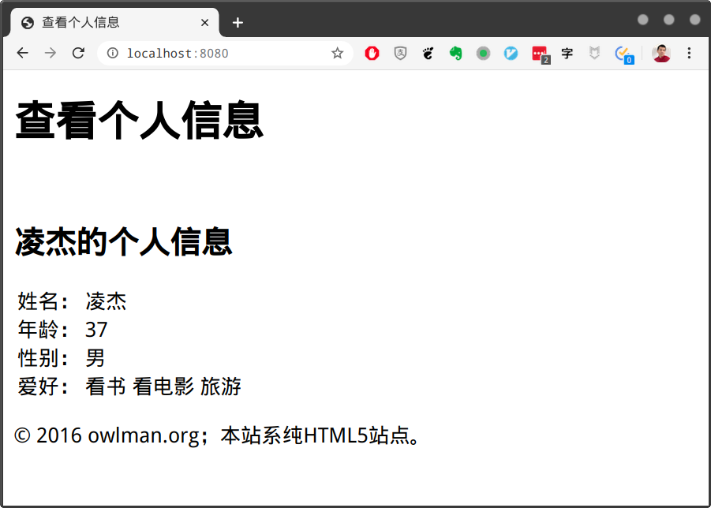

#### 3. 多模版继承渲染

当然，如果重复的元素只有头部和尾部的话，有时候使用模版继承语法来渲染页面会是一个更好的选择，下面就来继续演示一下`art-template`模板引擎的继承语法来渲染 HTML 页面，其具体步骤如下：

1. 在`examples/04_templatingEngine`目录下执行`touch baseTpl.art`命令，创建父模版文件，然后在该文件中输入以下代码：

   ```HTML
   <!DOCTYPE html>
   <html lang="zh-cn">
       <head>
           <meta charset="utf-8" />
           <link rel="stylesheet" type="text/css" href="style.css" />
           <title>{{ name }}的个人信息</title>
        </head>
        <body>
           <header>
              <h1>查看个人信息</h1>
              <br>
           </header>

            {{ block 'message' }}
            {{ /block }}

           <footer>
               <div>
                   <p>&copy; 2016 owlman.org；本站系纯HTML5站点。</p>
               </div>
           </footer>
        </body>
   </html>
   ```

2. 在`examples/04_templatingEngine`目录下执行`touch extendTpl.htm`命令，创建子模版文件，然后在该文件中输入以下代码：

   ```HTML
   {{ extend 'baseTpl.art' }}

   {{ block 'message' }}
   <h1>{{ name }}的个人信息</h1>
   <table>
       <tr><td>姓名：</td><td>{{ name }}</td></tr>
       <tr><td>年龄：</td><td>{{ age }}</td></tr>
       <tr><td>性别：</td><td>{{ sex }}</td></tr>
       <tr>
           <td>爱好：</td>
           <td>{{ each items }} {{ $value }} {{ /each }}</td>
       </tr>
   </table>
   {{ /block }}
   ```

3. 在`examples/04_templatingEngine`目录下执行`cp 04-useTemplating_engine.js 04-useTemplating_engine3.js`命令，将之前的代码复制一份，并修改如下：

   ```JavaScript
   // 用Node.js生成动态页面
   // 作者：owlman
   // 时间：2019年07月12日

   const http = require('http')
   const fs = require('fs')
   const template = require('art-template')

   template.defaults.root = __dirname

   class human {
       constructor(name, age, sex, items=[])
       {
           this.name  = name
           this.age   = age
           this.sex   = sex
           this.items = items
       }
   }

   const server = http.createServer()

   server.on('request', function(req, res) {
       const url = req.url
       let boy = null
       if (url === '/') {
           boy = new human('凌杰', '37', '男', ['看书', '看电影','旅游'])
       } else if (url === '/wang') {
           boy = new human('蔓儿', '25', '女', ['看书', '看电影','写作'])
       }

       if (boy === null) {
           return res.end('<h1>404 页面没找到！</h1>')
       }

       fs.readFile('./extendTpl.htm', function(err, data) {
           if ( err !== null ) {
              return res.end('<h1>404 没找到模版文件！</h1>')
           }

           const strHtml = template.render(data.toString(), {
               name : boy.name,
               age  : boy.age,
               sex  : boy.sex,
               items: boy.items
           })

           res.end(strHtml)
       })
   })

   server.listen(8080, function(){
       console.log('请访问http://localhost:8080/，按Ctrl+C终止服务！')
   })
   ```

4. 保存所有文件后，在`examples/04_templatingEngine`目录下执行`node 04-useTemplating_engine3.js`命令，然后打开浏览器并访问`http://localhost:8080/wang`，就会看到与之前相同的页面。

### 示例5. Web 表单处理

这一部分示例将致力于演示用 Node.js 处理 Web 表单，我们将会分别示范如何用`get`和`post`两种方法来处理表单的请求。首先，我们要在`examples`目录下执行`mkdir 05_webForm`命令来创建用于存放这一组示例的目录。

#### 1. get 方法

先用一个信息查询程序来演示一下如何处理使用`get`方法来发送请求的表单。首先，在`examples/05_webForm`目录下执行`mkdir get_form`命令，并执行以下步骤：

1. 在`examples/05_webForm/get_form`目录下执行`npm install art-template`命令，将`art-template`安装到当前示例项目中。

2. 在`examples/05_webForm/get_form`目录下执行`touch index.htm`，创建一个模版文件，具体如下：

    ```HTML
    <!DOCTYPE html>
    <html lang="zh-cn">
    <head>
        <meta charset="UTF-8">
        <title>个人信息查询</title>
    </head>
    <body>
        <h1>个人信息查询</h1>
        <form action="/query" method="GET">
            <label for="message">请输入要查询的姓名：</label>
            <input type="text" name="qname" />
            <input type="submit" value="查询" />
        </form>
        <br />
        {{ if name }}
            <table>
                <caption>{{ name }}的个人信息</caption>
                <tr><td>姓名：</td><td>{{ name }}</td></tr>
                <tr><td>年龄：</td><td>{{ age }}</td></tr>
                <tr><td>性别：</td><td>{{ sex }}</td></tr>
                <tr>
                    <td>爱好：</td>
                    <td>{{ each items }} {{ $value }} {{ /each }}</td>
                </tr>
            </table>
        {{ else if query_error }}
            <h2>没有找到相关信息！</h2>
        {{ /if }}
    </body>
    </html>
    ```

3. 在`examples/05_webForm/get_form`目录下执行`touch app.js`，创建一个脚本文件，具体如下：

    ```JavaScript
    const http = require('http')
    const fs = require('fs')
    const url = require('url')
    const template = require('art-template')

    class human {
        constructor(name, age, sex, items=[])
        {
            this.name  = name
            this.age   = age
            this.sex   = sex
            this.items = items
        }
    }

    const db = [
        new human('凌杰', '37', '男', ['看书', '看电影','旅游']),
        new human('蔓儿', '25', '女', ['看书', '看电影','写作']),
        new human('张语', '32', '女', ['看书', '旅游','绘画'])
    ]

    const server = http.createServer(function(req, res){
        const query = url.parse(req.url, true)
        let obj = null
        let query_error = false
        if ( query.pathname === '/' ) {
            query_error = false
        }
        else if (query.pathname === '/query') {
            for(let i = 0; i < db.length; ++i) {
                if (db[i].name == query.query["qname"]) {
                    obj = db[i]
                }
            }
            if ( obj === null ) {
                query_error = true
            }
        } else  {
            return res.end('<h1>404 页面没找到！</h1>')
        }

        fs.readFile('./index.htm', function(err, data){
            if ( err !== null ) {
                return res.end('<h1>404 没找到模版文件！</h1>')
            }

            let strHtml = null
            if ( obj !== null ) {
                strHtml = template.render(data.toString(), {
                    name : obj.name,
                    age  : obj.age,
                    sex  : obj.sex,
                    items: obj.items,
                    query_error: query_error
                })
            } else {
                strHtml = template.render(data.toString(), {
                    name : false,
                    query_error: query_error
                })
            }
            res.end(strHtml)
        })
    })

    server.listen(8080, function() {
        console.log('请访问http://localhost:8080/，按Ctrl+C终止服务！')
    })
    ```

4. 保存所有文件后，在`examples/05_webForm/get_form`目录下执行`node app.js`命令，结果如下：

    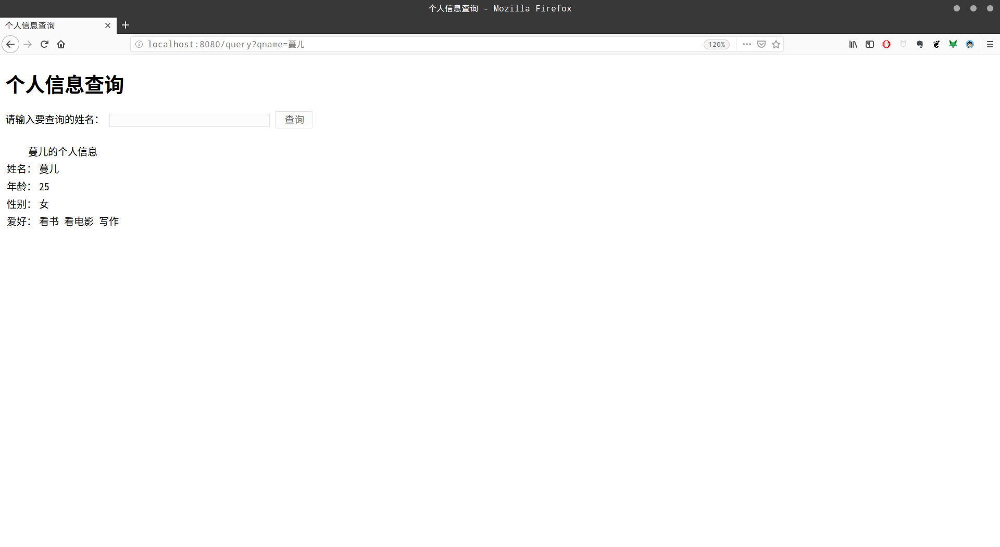

#### 2. post 方法

先来演示如何处理使用`post`方法来发送请求的表单。首先，在`examples/05_webForm`目录下执行`mkdir post_form`命令，并执行以下步骤：

1. 在`examples/05_webForm/get_form`目录下执行`npm install art-template`命令，将`art-template`安装到当前示例项目中。

2. 在`examples/05_webForm/post_form`目录下执行`touch index.htm`，创建一个模版文件，具体如下：

    ```HTML
    <!DOCTYPE html>
    <html lang="zh-cn">
    <head>
        <meta charset="UTF-8">
        <title>个人信息管理</title>
    </head>
    <body>
        <h1>个人信息管理</h1>
        <table>
            <caption>个人数据表</caption>
            <tr><th>姓名</th><th>年龄</th><th>性别</th><th>爱好</th></tr>
            {{ each db }}
            <tr>
                <td>{{ $value.name }} </td>
                <td>{{ $value.age }} </td>
                <td>{{ $value.sex }} </td>
                <td>{{ each $value.items }} {{ $value }} {{ /each }}</td>
            </tr>
            {{ /each }}
        </table>

        <form action="/add" method="POST">
        <table>
            <caption>录入新人员</caption>
            <tr><td>姓名：</td><td><input type="text" name="uname" /></td></tr>
            <tr><td>年龄：</td><td><input type="text" name="age"></td></tr>
            <tr><td>性别：</td><td><input type="text" name="sex"></td></tr>
            <tr><td>爱好：</td><td><input type="text" name="items"></td></tr>
        </table>
        <input type="submit" value="添加" />
        </form>
    </body>
    </html>
    ```

3. 在`examples/05_webForm/post_form`目录下执行`touch app.js`，创建一个脚本文件，具体如下：

    ```JavaScript
    const http = require('http')
    const fs = require('fs')
    const url = require('url')
    const querystring = require('querystring')
    const template = require('art-template')

    class human {
        constructor(name, age, sex, items=[])
        {
            this.name  = name
            this.age   = age
            this.sex   = sex
            this.items = items
        }
    }

    const db = [
        new human('凌杰', '37', '男', ['看书', '看电影','旅游']),
        new human('蔓儿', '25', '女', ['看书', '看电影','写作']),
        new human('张语', '32', '女', ['看书', '旅游','绘画'])
    ]

    const server = http.createServer(function(req, res){
        const query = url.parse(req.url, true)
        if ( query.pathname === '/' ) {
            fs.readFile('./index.htm', function(err, data) {
                if ( err !== null ) {
                    return res.end('<h1>404 没找到模版文件！</h1>')
                }

                const strHtml = template.render(data.toString(), {
                    "db": db
                })

                res.end(strHtml)
            })
        }
        else if ( query.pathname === '/add' ) {
            req.on('data', function(chunk) {
                const obj = querystring.parse(chunk.toString())
                db.push(new human(
                    obj['uname'],
                    obj['age'],
                    obj['sex'],
                    obj['items'].split('，'),
                ))
            })

            res.writeHead(302, {
                'location': `/`
            })

            res.end()
        } else  {
            return res.end('<h1>404 页面没找到！</h1>')
        }
    })

    server.listen(8080, function(){
        console.log('请访问http://localhost:8080/，按Ctrl+C终止服务！')
    })
    ```

4. 保存所有文件后，在`examples/05_webForm/post_form`目录下执行`node app.js`命令，结果如下：

    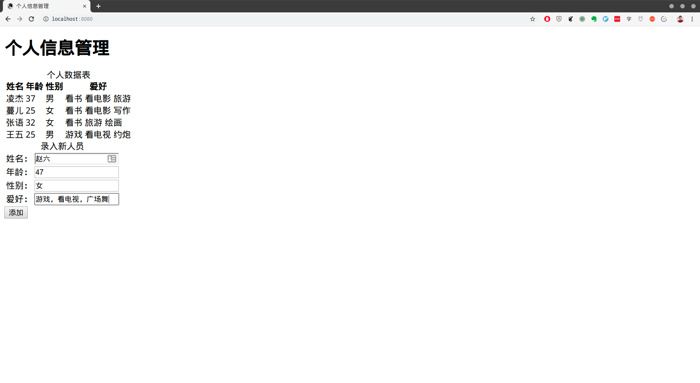

## 第 4 部分： 高级应用示例

这一部分笔记将致力于记录为学习并掌握如何在 Node.js 运行平台下使用数据库和 Express 框架而编写的代码。

### 示例6. 数据库读写

这部分示例将示范`SQLite3`、`MongoDB`这两种不同类型的数据库在 Node.js 中的使用方法。首先，我需要在`examples`目录下执行`mkdir 06_database`命令来创建用于存放这一组示例的目录。

#### 1. SQLite

`SQLite3`是一个轻量级的关系型数据库，我们在这里用它来示范 Node.js 对关系型数据库的处理。首先，在`examples/06_database`目录下执行`mkdir sqlite`命令，并执行以下步骤：

1. 在`examples/06_database/sqlite`目录下执行`npm install sqlite3`命令，将`sqlite3`安装到当前示例项目中。

2. 为控制程序按串行方式执行，需在`examples/06_database/sqlite`目录下执行`npm install async`命令，将`async`包安装到当前示例项目中。

3. 在`examples/06_database/sqlite`目录下执行`touch Sqlite.js`，创建一个脚本文件，具体如下：

    ```JavaScript
    const fs = require('fs')
    const sqlite3 = require('sqlite3').verbose()

    class SqliteDB {
        constructor(file) {
            this.db = new sqlite3.Database(file)
            const db_exist = fs.existsSync(file)

            if ( !db_exist ) {
                console.error('数据库文件创建成功！')
                fs.openSync(file, 'w')
            }
        }

        createTable(sql) {
            this.db.serialize(function() {
                this.run(sql, function(err) {
                    if( err !== null ) {
                        return console.error('错误信息：' + err.message)
                    }
                })
            })
        }

        insertData(sql, objects) {
            this.db.serialize(function() {
                const stmt = this.prepare(sql)
                for ( let i = 0; i < objects.length; ++i ) {
                    stmt.run(objects[i])
                }

                stmt.finalize()
            })
        }

        queryData(sql, callback, message) {
            this.db.all(sql, function(err, rows) {
                if( err !== null ) {
                    return console.error('错误信息：' + err.message)
                }

                if( callback ) {
                    callback(rows, message)
                }
            })
        }

        executeSql(sql) {
            this.db.run(sql, function(err) {
                if( err !== null ) {
                    return console.error('错误信息：' + err.message)
                }
            })
        }

        close() {
            this.db.close()
        }
    }

    module.exports = SqliteDB
    ```

4. 在`examples/06_database/sqlite`目录下执行`touch useSqlite.js`，创建一个脚本文件，具体如下：

    ```JavaScript
    const async = require('async')
    const SqliteDB = require('./Sqlite')
    const file = "HRDB.db"
    const sqliteDB = new SqliteDB(file)

    function dataDeal(objects, message) {
        console.log(message)
        for ( const i = 0; i < objects.length; ++i )  {
            console.log(objects[i])
       }
    }

    async.waterfall([
        function (callback) {
            // 创建表格
            const createTableSql = `
                create table if not exists HR_TABLE (
                    name  TEXT,
                    age   TEXT,
                    sex   TEXT,
                    items TEXT
                );`
            sqliteDB.createTable(createTableSql)
            callback()
        },

        function (callback) {
            // 插入数据
            const insertTileSql = `
                insert into HR_TABLE
                    (name, age, sex, items)
                    values(?, ?, ?, ?)`
            const arr = [
                ['凌杰', '24', '男', '看书, 看电影, 旅游'],
                ['蔓儿', '25', '女', '看书, 看电影, 写作'],
                ['张语', '32', '女', '看书, 旅游, 绘画']
            ]
            sqliteDB.insertData(insertTileSql, arr)
            callback()
        },

        function (callback) {
            // 查询数据
            const querySql = 'select * from HR_TABLE'
            sqliteDB.queryData(querySql, dataDeal, '初始数据')
            callback()
        },

        function (callback) {
            // 更新数据
            const updateSql = `update HR_TABLE set age = 37 where name = "凌杰"`
            sqliteDB.executeSql(updateSql)
            callback()
        },

        function (callback) {
            // 查询更新后的数据
            querySql = `select * from HR_TABLE`
            sqliteDB.queryData(querySql, dataDeal, '更新后数据')
            callback()
        },

        function (callback) {
            sqliteDB.close()
            callback()
        }
    ])
    ```

5. 保存所有文件后，在`examples/06_database/sqlite`目录下执行`node useSqlite.js`命令，结果如下：

    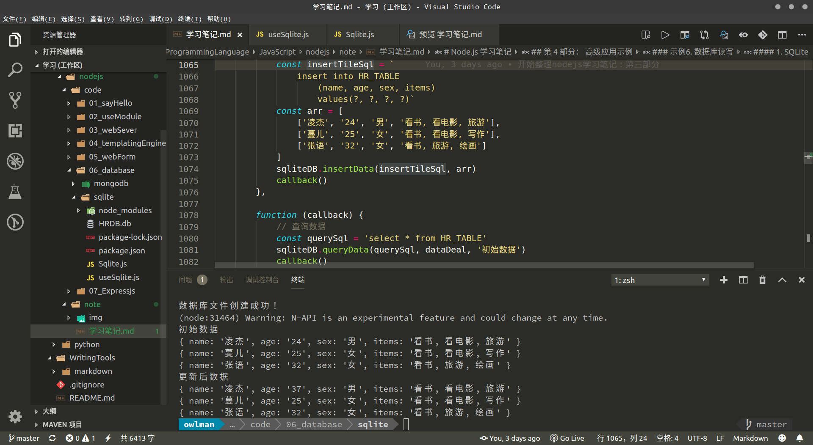

#### 2. MongoDB

`MongoDB`是非关系型数据库的一个典型代表，我们在这里用它来示范 Node.js 对非关系型数据库的处理。在 Node.js 中操作`MongoDB`数据库有两个扩展包可以选择，下面我们一一来演示。首先，在`examples/06_database`目录下执行`mkdir mongodb`命令，并执行以下步骤：

##### 使用`mongodb`包

1. 在`examples/06_database/mongodb`目录下执行`npm install mongodb`命令，将`mongodb`包安装到当前示例项目中。

2. 为控制程序按串行方式执行，需在`examples/06_database/mongodb`目录下执行`npm install async`命令，将`async`包安装到当前示例项目中。

3. 在`examples/06_database/mongodb`目录下执行`touch useMongodb.js`，创建一个脚本文件，具体如下：

    ```JavaScript
    const MongoClient = require('mongodb').MongoClient
    const async = require('async')
    const server = 'mongodb://localhost:27017'
    const dbName = 'hrdb'
    const collName = 'hr_table'
    const dbPath = server + '/' + dbName

    MongoClient.connect(dbPath, { useNewUrlParser: true },
                                        function(err, db) {
        if ( err !== null ) {
            return console.error('错误信息：' + err.message)
        }

        const dbo = db.db(dbName)
        console.log(dbName + '数据库创建成功')

        const collect = dbo.collection(collName)
        console.log(collName + '集合创建成功')

        async.series([
            // 控制程序串行执行

            function (callback) {
                // 插入单条数据
                const data = {
                    name  : '杨过',
                    age   : '42',
                    sex   : '男',
                    items : '看书, 喝酒, 习武'
                }

                collect.insertOne(data, function(err, res) {
                    if ( err !== null ) {
                        return console.error('错误信息：' + err.message)
                    }
                    console.log('单条数据插入成功')
                })
                callback()
            },

            function (callback) {
                // 插入多条数据
                const dataArray = [
                    {
                        name  : '小龙女',
                        age   : '24',
                        sex   : '男',
                        items : '看书, 唱歌, 习武'
                    },
                    {
                        name  : '郭靖',
                        age   : '52',
                        sex   : '男',
                        items : '看书, 喝酒, 习武'
                    },
                    {
                        name  : '黄蓉',
                        age   : '45',
                        sex   : '女',
                        items : '看书, 绘画, 习武'
                    },
                    {
                        name  : '雅典娜',
                        age   : '24',
                        sex   : '女',
                        items : '看书, 音乐, 被救'
                    }
                ]

                collect.insertMany(dataArray, function(err, res) {
                    if ( err !== null ) {
                        return console.error('错误信息：' + err.message)
                    }
                    console.log('数组插入成功')
                })
                callback()
            },

            function (callback) {
                // 列出所有数据
                collect. find({}).toArray(function(err, result) {
                    if ( err !== null ) {
                        return console.error('错误信息：' + err.message)
                    }
                    console.log('列出当前集合中的所有数据：')
                    console.log(result)
                })
                callback()
            },

            function (callback) {
                // 更新单一数据
                const whereData = {'name' : '小龙女'}
                const updataValue = { $set: { 'sex' : '女' } }
                collect.updateOne(whereData, updataValue,
                                                    function(err, res) {
                    if ( err !== null ) {
                        return console.error('错误信息：' + err.message)
                    }
                    console.log(whereData['name'] + "的数据更新成功")
                })
                callback()
            },

            function (callback) {
                // 查询指定数据
                const querystr = { 'name' : '小龙女' }
                collect. find(querystr).toArray(function(err, result) {
                    if ( err !== null ) {
                        return console.error('错误信息：' + err.message)
                    }
                    console.log('查看更新后的' + querystr['name'] + '的数据：')
                    console.log(result)
                })
                callback()
            },

            function (callback) {
                // 删除指定单一数据
                const whereData = { 'name' : '黄蓉' }
                collect.deleteOne(whereData,function(err, result) {
                    if ( err !== null ) {
                        return console.error('错误信息：' + err.message)
                    }
                    console.log(whereData['name'] + '的数据已被删除')
                })
                callback()
            },

            function (callback) {
                // 查询所有数据，并按name降序排列
                const isort = { name : -1 }
                collect. find({}).sort(isort).toArray(function(err, result) {
                    if ( err !== null ) {
                        return console.error('错误信息：' + err.message)
                    }
                    console.log('降序排列当前集合中的所有数据：')
                    console.log(result)
                })
                callback()
            },

            function (callback) {
                // 删除指定多条数据
                const whereData = { 'age' : '24' }
                collect.deleteMany(whereData,function(err, result) {
                    if ( err !== null ) {
                        return console.error('错误信息：' + err.message)
                    }
                    console.log('年龄为' + whereData['age'] + '的数据已被删除')
                })
                callback()
            },

            function (callback) {
                // 查询所有数据，并按name升序排列
                const isort = { name : 1 }
                collect. find({}).sort(isort).toArray(function(err, result) {
                    if ( err !== null ) {
                        return console.error('错误信息：' + err.message)
                    }
                    console.log('升序排列当前集合中的所有数据：')
                    console.log(result)
                })
                callback()
            },

            function (callback) {
                // 删除指定集合
                dbo.dropCollection(collName, function(err, delOK) {
                    if ( err !== null ) {
                        return console.error('错误信息：' + err.message)
                    }
                    if ( delOK !== null ) {
                        console.log(collName + "集合已删除！")  
                    }
                })
                callback()
            }
        ])

        db.close()
    })

    ```

4. 保存所有文件后，在`examples/06_database/mongodb`目录下执行`node useMongodb.js`命令，结果如下：

    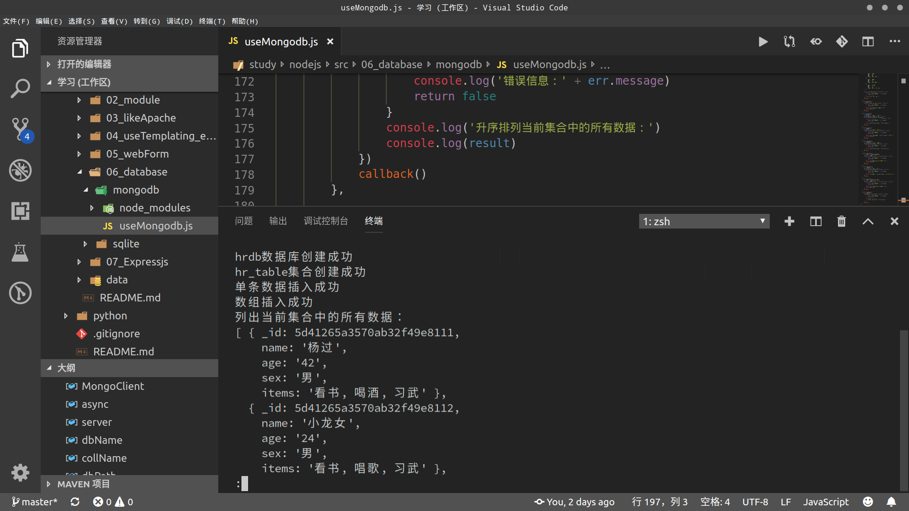

##### 使用`mongoose`包

1. 在`examples/06_database/mongodb`目录下执行`npm install mongoose`命令，将`mongoose`包安装到当前示例项目中。

2. 在`examples/06_database/mongodb`目录下执行`touch useMongoose.js`，创建一个脚本文件，具体如下：

    ```JavaScript
    const server = 'mongodb://localhost:27017'
    const dbName = 'hrdb'
    const collName = 'hr_table'
    const dbPath = server + '/' + dbName
    const mongoose = require('mongoose');
    const async = require('async')
    const Schema = mongoose.Schema
    const hrSchema = new Schema({
        name : {
            type : String,
            required: true
        },
        age : {
            type : String,
            required: true
        },
        sex : {
            type : String,
            required: true
        },
        items : {
            type : String,
            required: true
        }
    })
    const hrModel = new mongoose.model('Hrobj', hrSchema)
    mongoose.connect(dbPath, {useNewUrlParser: true});
    const conn = mongoose.connection
    conn.on('error', console.error.bind(console, '连接错误:'))
    conn.on('open', console.log.bind(console, '数据库连接成功'))
    conn.on('disconnected', console.log.bind(console, '断开数据库连接'))

    conn.once('open', function(){
        async.series([
            function(callback) {
                // 插入单条数据
                const someone = new hrModel ({
                    name  : '杨过',
                    age   : '42',
                    sex   : '男',
                    items : '看书, 喝酒, 习武'
                })
                someone.save(function(err, one){
                    callback(err, one.name+'的数据插入成功')
                })
            },

            function(callback) {
                hrModel.find(function(err, hrTable){
                    callback(err, '插入一条数据后的结果：' + hrTable)
                })
            },

            function(callback) {
                // 插入多条数据
                const dataArray = [
                    {
                        name  : '小龙女',
                        age   : '24',
                        sex   : '男',
                        items : '看书, 唱歌, 习武'
                    },
                    {
                        name  : '郭靖',
                        age   : '52',
                        sex   : '男',
                        items : '看书, 喝酒, 习武'
                    },
                    {
                        name  : '黄蓉',
                        age   : '45',
                        sex   : '女',
                        items : '看书, 绘画, 习武'
                    },
                    {
                        name  : '雅典娜',
                        age   : '24',
                        sex   : '女',
                        items : '看书, 音乐, 被救'
                    },
                    {
                        name  : '阿波罗',
                        age   : '24',
                        sex   : '女',
                        items : '看书, 音乐, 被救'
                    }
                ]

                hrModel.insertMany(dataArray, function(err) {
                    callback(err, '数组中的数据插入成功')
                })
            },

            function(callback) {
                hrModel.find(function(err, hrTable){
                    callback(err, '插入多条数据后的结果：' + hrTable)
                })
            },

            function(callback) {
                hrModel.updateMany({sex:'男'}, {sex:'女'}, function(err, one){
                    callback(err, '将所有男人改为女人')
                })
            },

            function(callback) {
                hrModel.updateOne({name:'阿波罗'}, {sex:'男'}, function(err, one){
                    callback(err, '将阿波罗的性别改为：男')
                })
            },

            function(callback) {
                hrModel.find({age:'24'}, function(err, hrTable){
                    callback(err, '所有年龄为24的数据：' + hrTable)
                })
            },

            function(callback) {
                hrModel.findOne({age:'24'}, function(err, hrTable){
                    callback(err, '第一个年龄为24的结果：' + hrTable)
                })
            },

            function(callback) {
                hrModel.deleteMany({age:'24'}, function(err, hrTable){
                    callback(err, '所有年龄为24数据已被删除')
                })
            },

            function(callback) {
                hrModel.find({age:'24'}, function(err, hrTable){
                    callback(err, '所有年龄为24的数据：' + hrTable)
                })
            },

            function(callback) {
                hrModel.deleteMany({}, function(err, hrTable){
                    callback(err, '所有数据已被删除')
                })
            },

            function(callback) {
                hrModel.find(function(err, hrTable){
                    callback(err, '删除所有数据后的结果：' + hrTable)
                })
            },

            function(callback) {
                mongoose.disconnect(function(err){
                    callback(err, '正在断开连接……')
                })
            }
        ], function(err, message) {
            if ( err !== null ) {
                return console.error('错误信息：' + err.message)
            }
            console.log(message)
        })
    })
    ```

3. 保存所有文件后，在`examples/06_database/mongodb`目录下执行`node useMongoose.js`命令，结果如下：

    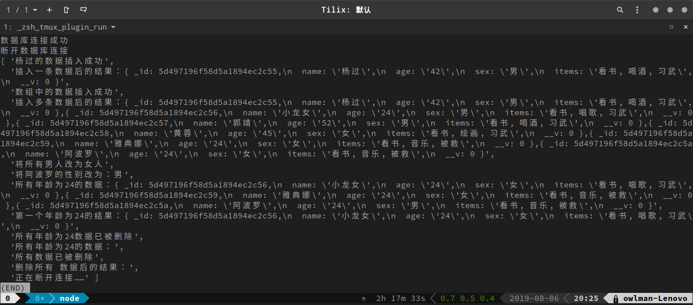

### 示例7. 使用 Express 框架

这部分示例将通过`你好，Express`、`留言板`和`学生管理`三个应用的实现来演示`Express`框架的基本使用。首先来搭建该示例项目的基本脚手架，为此我需要在`examples`目录下执行`mkdir 07_Expressjs`命令来创建用于存放这一组示例的目录，并执行一下步骤：

1. 在`examples/07_Expressjs`目录下执行`npm init --yes`命令来初始化本示例项目。

2. 在`examples/07_Expressjs`目录下执行`npm install express body-parser sqlite3 mongodb async art-template express-art-template --save`命令来安装本示例所要用到的扩展包。

3. 在`examples/07_Expressjs`目录下执行`mkdir views`命令来创建用于存放模板文件的目录。

4. 在`examples/07_Expressjs`目录下执行`mkdir public`命令创建`public`目录，并进入到该目录中，执行`mkdir DB css js img`命令来创建用于存放相应类型资源的目录。

5. 在`examples/07_Expressjs`目录下执行`touch index.js`命令，创建本示例的程序入口文件，具体代码如下：

    ```JavaScript
    const path = require('path')
    const express = require('express')
    const bodyParser =require('body-parser')
    const router = require(path.join(__dirname, 'router'))
    const app = express()

    // 配置public目录
    app.use('/public/', express.static(path.join(__dirname, 'public')))

    //配置body-parser中间件`，以便获取post请求数据。`
    app.use(bodyParser.urlencoded({extended : false}));
    app.use(bodyParser.json());

    // 配置模板引擎为art-template
    app.engine('htm', require('express-art-template'))
    app.set('views', path.join(__dirname, 'views'))
    app.set('view engine', 'art')

    // 调用路由表函数
    app.use(router)

    // 监听8080端口
    app.listen(8080, function(){
        console.log('请访问http://localhost:8080/，按Ctrl+C终止服务！')
    })
    ```

6. 在`examples/07_Expressjs`目录下执行`touch router.js`命令，创建本示例的程序路由文件，具体代码如下：

    ```JavaScript
    const path = require('path')
    const express = require('express')
    const sayHello = require(path.join(__dirname, 'sayHello'))
    const student = require(path.join(__dirname, 'student'))
    const board = require(path.join(__dirname, 'board'))

    const router = express.Router()

    // Hello，Express！
    sayHello(router)
    // 学生管理
    student(router)
    // 留言板
    board(router)

    module.exports = router
    ```

7. 在`examples/07_Expressjs`目录下执行`touch baseTpl.js`命令，创建该项目的基础模版文件，并在其中输入以下代码：

   ```HTML
    <!DOCTYPE html>
    <html lang="zh-CN">
        <head>
            <meta charset="utf-8">
            <meta http-equiv="X-UA-Compatible" content="IE=edge">
            <meta name="viewport" content="width=device-width, initial-scale=1">
            <meta name="description" content="">
            <meta name="author" content="">

            <!-- Bootstrap CSS -->
            <link href="https://cdn.bootcss.com/bootstrap/3.3.7/css/bootstrap.min.css" rel="stylesheet">

            <!-- 自定义 CSS -->
            <link href="/public/css/main.css" rel="stylesheet">

            <title>Express使用示例</title>
        </head>
        <body>
            <div class="container">
                <!-- 导航栏部分开始 -->
                <nav class="navbar navbar-default">
                    <div class="container-fluid">
                        <div class="navbar-header">
                            <button type="button" class="navbar-toggle collapsed" data-toggle="collapse" data-target="#navbar" aria-expanded="false" aria-controls="navbar">
                                <span class="sr-only">切换导航栏</span>
                                <span class="icon-bar"></span>
                                <span class="icon-bar"></span>
                                <span class="icon-bar"></span>
                            </button>
                            <a class="navbar-brand" href="#">Express使用示例</a>
                        </div>
                        {{ block 'navbar' }}
                        {{ /block }}
                    </div>
                </nav>
                <!-- 导航栏部分结束 -->
                <!-- 主体部分开始 -->
                {{ block 'main' }}
                {{ /block }}
                <!-- 主体部分结束 -->

            </div>
            <!-- Bootstrap的核心JavaScript
            ================================================== -->
            <script src="https://cdn.bootcss.com/jquery/1.12.4/jquery.min.js"></script>
            <script> window.jQuery || document.write('<script src="../../assets/js/vendor/jquery.min.js"><\/script>')</script>
            <script src="https://cdn.bootcss.com/bootstrap/3.3.7/js/bootstrap.min.js"></script>
        </body>
    </html>
   ```

8. 在`examples/07_Expressjs/public/css/`目录创建一个名为`main.css`的样式文件，内容如下：

    ```css
    body {
        padding-top: 10px;
    }
    ```

下面，我们要在这个脚手架上逐一来创建之前所说的三个应用示例。

#### 1. 你好，Express

接下来的应用示例主要用于示范如何用`Express`框架来创建一个 Web 应用程序。在这过程中，我将使用`art-template`作为构建页面的模板引擎。其主要步骤如下：

1. 在`examples/07_Expressjs/public/img/`目录下放置一张`Express`官网首页的截图，将其命名为`express.jpeg`。

2. 在`examples/07_Expressjs/views/`目录创建一个名为`hello.htm`的模版文件，内容如下：

    ```HTML
    {{ extend './baseTpl.art' }}

    {{ block 'navbar' }}
    <div id="navbar" class="collapse navbar-collapse">
        <ul class="nav navbar-nav">
            <li class="active"><a href="/">你好，Express！</a></li>
            <li><a href="/student">学生管理</a></li>
            <li><a href="/board">留言板</a></li>
        </ul>
    </div>
    {{ /block }}

    {{ block 'main' }}
    <div class="jumbotron">
        <h1>你好，{{ name }}！</h1>
        
    </div>
    {{ /block }}
    ```

3. 在`examples/07_Expressjs`目录下执行`mkdir sayHello`命令来创建该应用的目录，并在其中创建一个名为`index.js`的脚本文件，内容如下：

    ```JavaScript
    module.exports = function(app) {
        app.get('/', function (req, res) {
            res.render('hello.htm', {name : 'Express'})
        })
    }
    ```

4. 保存所有文件后，在`examples/07_Expressjs`目录下执行`node index.js`命令，结果如下：

    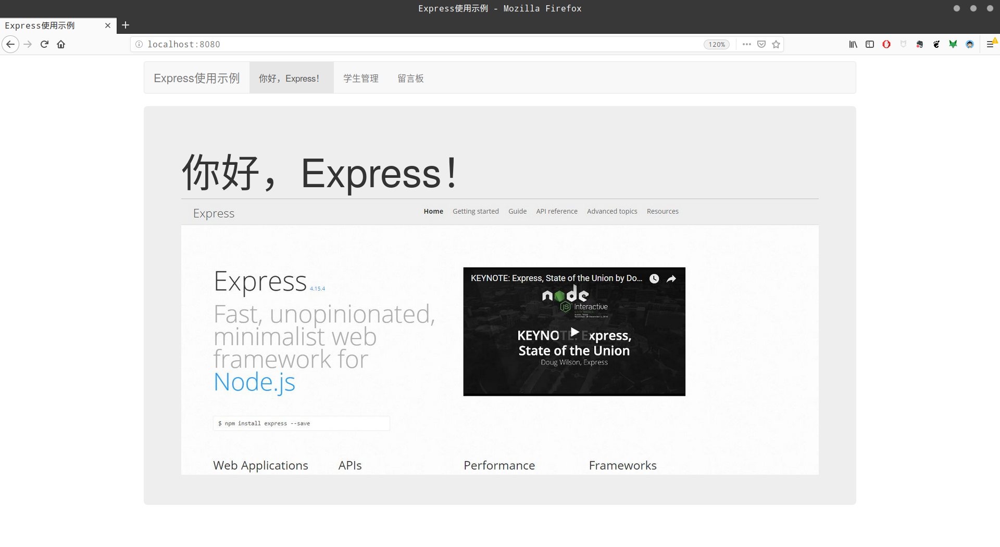

#### 2. 学生管理

这个应用示例主要用于演示如何用`Express`框架实现学生管理系统，并使用`SQLite3`作为数据库，其具体步骤如下：

1. 在`examples/07_Expressjs/views/`目录创建一个名为`student.htm`的模版文件，内容如下：

    ```HTML
    {{ extend './baseTpl.art' }}

    {{ block 'navbar' }}
    <div id="navbar" class="collapse navbar-collapse">
        <ul class="nav navbar-nav">
            <li><a href="/">你好，Express！</a></li>
            <li class="active"><a href="/student">学生管理</a></li>
            <li><a href="/board">留言板</a></li>
        </ul>
    </div>
    {{ /block }}

    {{ block 'main' }}
    <div class="jumbotron">
        <h2>学生信息表</h2>
        <a class="btn btn-success" href="/student/add">添加学生</a>
        <table class="table table-striped">
            <tr>
                <th>姓名</th>
                <th>年龄</th>
                <th>性别</th>
                <th>爱好</th>
                <th>操作</th>
            </tr>
            {{ each db }}
            <tr>
                <td>{{ $value.name }} </td>
                <td>{{ $value.age }} </td>
                <td>{{ $value.sex }} </td>
                <td>{{ $value.items }}</td>
                <td>
                    <a href="/student/edit?name={{ $value.name}}">编辑</a>
                    <a href="/student/delete?name={{ $value.name}}">删除</a>
                </td>
            </tr>
            {{ /each }}
        </table>
    </div>
    {{ /block }}
    ```

2. 在`examples/07_Expressjs/views/`目录创建一个名为`add.htm`的模版文件，内容如下：

    ```HTML
    {{ extend './baseTpl.art' }}

    {{ block 'navbar' }}
    <div id="navbar" class="collapse navbar-collapse">
        <ul class="nav navbar-nav">
            <li><a href="/">你好，Express！</a></li>
            <li class="active"><a href="/student">学生管理</a></li>
            <li><a href="/board">留言板</a></li>
        </ul>
    </div>
    {{ /block }}

    {{ block 'main' }}
    <div class="jumbotron">
        <h2>注册新学生：</h2>
        <form action="/student/add" method="POST" class="form-horizontal" role="form">
            <div class="form-group">
                <label for="firstname" class="col-sm-2 control-label">姓名：</label>
                <div class="col-sm-10">
                <input type="text" class="form-control" name="name" placeholder="请输入名字">
                </div>
            </div>
            <div class="form-group">
                <label for="lastname" class="col-sm-2 control-label">年龄：</label>
                <div class="col-sm-10">
                <input type="text" class="form-control" name="age" placeholder="请输入年龄">
                </div>
            </div>
            <div class="form-group">
                <label for="lastname" class="col-sm-2 control-label">性别：</label>
                <div class="col-sm-10">
                <input type="text" class="form-control" name="sex" placeholder="请输入性别">
                </div>
            </div>
            <div class="form-group">
                <label for="lastname" class="col-sm-2 control-label">爱好：</label>
                <div class="col-sm-10">
                <input type="text" class="form-control" name="items" placeholder="请输入爱好">
                </div>
            </div>
            <div class="form-group">
                <div class="col-sm-offset-2 col-sm-10">
                <button type="submit" class="btn btn-default">加入</button>
                </div>
            </div>
        </form>
    </div>
    {{ /block }}
    ```

3. 在`examples/07_Expressjs/views/`目录创建一个名为`edit.htm`的模版文件，内容如下：

    ```HTML
    {{ extend './baseTpl.art' }}

    {{ block 'navbar' }}
    <div id="navbar" class="collapse navbar-collapse">
        <ul class="nav navbar-nav">
            <li><a href="/">你好，Express！</a></li>
            <li class="active"><a href="/student">学生管理</a></li>
            <li><a href="/board">留言板</a></li>
        </ul>
    </div>
    {{ /block }}

    {{ block 'main' }}
    <div class="jumbotron">
        <h2>编辑 {{ name }} 的信息：</h2>
        <form action="/student/edit" method="POST" class="form-horizontal" role="form">
            <div class="form-group">
                <label for="firstname" class="col-sm-2 control-label">姓名：</label>
                <div class="col-sm-10">
                <input type="text" class="form-control" name="name" value="{{ name }}" placeholder="请输入名字">
                </div>
            </div>
            <div class="form-group">
                <label for="lastname" class="col-sm-2 control-label">年龄：</label>
                <div class="col-sm-10">
                <input type="text" class="form-control" name="age" value="{{ age }}" placeholder="请输入年龄">
                </div>
            </div>
            <div class="form-group">
                <label for="lastname" class="col-sm-2 control-label">性别：</label>
                <div class="col-sm-10">
                <input type="text" class="form-control" name="sex" value="{{ sex }}" placeholder="请输入性别">
                </div>
            </div>
            <div class="form-group">
                <label for="lastname" class="col-sm-2 control-label">爱好：</label>
                <div class="col-sm-10">
                <input type="text" class="form-control" name="items" value="{{ items }}" placeholder="请输入爱好">
                </div>
            </div>
            <div class="form-group">
                <div class="col-sm-offset-2 col-sm-10">
                <button type="submit" class="btn btn-default">更新数据</button>
                </div>
            </div>
        </form>
    </div>
    {{ /block }}
    ```

4. 在`examples/07_Expressjs`目录下执行`mkdir student`命令来创建该应用的目录，并在其中创建一个名为`index.js`和`Sqlite.js`的两个脚本文件，内容如下：

   - index.js

    ```JavaScript
    const fs = require('fs')
    const path = require('path')
    const async = require('async')
    const SqliteDB = require(path.join(__dirname,'Sqlite'))
    const dbPath = path.join(__dirname, '../public/DB/studentsDB.db')

    // 配置数据库
    if ( !fs.existsSync(dbPath) ) {
        const studentsDB = new SqliteDB(dbPath)

        async.series([
            function(callback) {
                const createTableSql = `
                create table if not exists STUDENT_TABLE (
                    name  TEXT,
                    age   TEXT,
                    sex   TEXT,
                    items TEXT
                )`
                studentsDB.createTable(createTableSql)
                callback()
            },

            function(callback) {
                const insertTileSql = `
                    insert into STUDENT_TABLE
                        (name, age, sex, items)
                        values(?, ?, ?, ?)`
                const arr = [
                    ['凌杰', '24', '男', '看书、看电影、旅游'],
                    ['蔓儿', '25', '女', '看书、看电影、写作'],
                    ['张语', '32', '女', '看书、旅游、绘画']
                ]
                studentsDB.insertData(insertTileSql, arr)  
                callback()
            }
        ])
        studentsDB.close()
    }

    module.exports = function(app) {
        app.get('/student', function (req, res) {
            const studentsDB = new SqliteDB(dbPath)

            const querySql = 'select * from STUDENT_TABLE'
            studentsDB.queryData(querySql, function(data) {
                if ( data === null ) {
                    return console.log('数据查询错误！')
                }
                res.render('student.htm', { db : data })
            })

            studentsDB.close()
        })

        app.get('/student/add', function  (req, res) {
            res.render('add.htm', { })
        })

        app.post('/student/add', function (req, res) {
            const studentsDB = new SqliteDB(dbPath)

            const arr = [
                [req.body['name'],req.body['age'],req.body['sex'],req.body['items']]
            ]

            const insertTileSql = `
                insert into STUDENT_TABLE
                    (name, age, sex, items)
                    values(?, ?, ?, ?)`
            studentsDB.insertData(insertTileSql, arr)

            studentsDB.close()
            res.redirect('/student')
        })

        app.get('/student/delete', function (req, res) {
            const studentsDB = new SqliteDB(dbPath)

            const deleteSql = `
                delete from STUDENT_TABLE where name = '`
                + req.query['name']
                + `'`
            studentsDB.executeSql(deleteSql)

            studentsDB.close()
            res.redirect('/student')
        })

        app.get('/student/edit', function (req, res) {
            const studentsDB = new SqliteDB(dbPath)

            const querySql = `
                select * from STUDENT_TABLE where name = '`
                + req.query['name']
                + `'`
            studentsDB.queryData(querySql, function(data) {
                if ( data === null ) {
                    return console.log('数据查询错误！')
                }
                res.render('edit.htm', {
                    name  : data[0]['name'],
                    age   : data[0]['age'],
                    sex   : data[0]['sex'],
                    items : data[0]['items']
                })
            })

            studentsDB.close()
        })

        app.post('/student/edit', function (req, res) {
            const studentsDB = new SqliteDB(dbPath)

            const updateSql =
                `update STUDENT_TABLE set name = '`
                + req.body['name']
                + `', `
                + `age = '`
                + req.body['age']
                + `', `
                + `sex = '`
                + req.body['sex']
                + `', `
                + `items = '`
                + req.body['items']
                + `' `
                + ` where name = '`
                + req.body['name']
                + `'`

            studentsDB.executeSql(updateSql)

            studentsDB.close()
            res.redirect('/student')
        })
    }
    ```

    - Sqlite.js

    ```JavaScript
    const fs = require('fs')
    const sqlite3 = require('sqlite3').verbose()

    class SqliteDB {
        constructor(file) {
            this.db = new sqlite3.Database(file)
            const db_exist = fs.existsSync(file)

            if ( !db_exist ) {
                fs.openSync(file, 'w')
            }
        }

        createTable(sql) {
            this.db.serialize(function() {
                this.run(sql, function(err) {
                    if( err !== null ) {
                        return console.error('错误信息：' + err.message)
                    }
                })
            })
        }

        insertData(sql, objects) {
            this.db.serialize(function() {
                const stmt = this.prepare(sql)
                for ( const i = 0; i < objects.length; ++i ) {
                    stmt.run(objects[i])
                }

                stmt.finalize()
            })
        }

        queryData(sql, callback) {
            this.db.all(sql, function(err, rows) {
                if( err !== null ) {
                    return console.error('错误信息：' + err.message)
                }

                if( callback ) {
                    callback(rows)
                }
            })
        }

        executeSql(sql) {
            this.db.run(sql, function(err) {
                if( err !== null ) {
                    return console.error('错误信息：' + err.message)
                }
            })
        }

        close() {
            this.db.close()
        }
    }

    module.exports = SqliteDB
    ```

5. 保存所有文件后，在`examples/07_Expressjs`目录下执行`node index.js`命令，结果如下：

    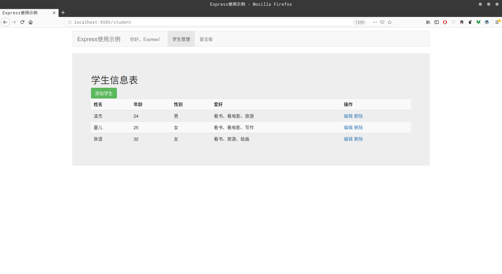

#### 3. 留言板

这个应用示例主要用于演示如何用`Express`框架实现留言板应用，并使用`MongoDB`作为数据库，其具体步骤如下：

1. 在`examples/07_Expressjs/views/`目录创建一个名为`board.htm`的模版文件，内容如下：

    ```HTML
    {{ extend './baseTpl.art' }}

    {{ block 'navbar' }}
    <div id="navbar" class="collapse navbar-collapse">
        <ul class="nav navbar-nav">
            <li><a href="/">你好，Express！</a></li>
            <li><a href="/student">学生管理</a></li>
            <li class="active"><a href="/board">留言板</a></li>
        </ul>
    </div>
    {{ /block }}

    {{ block 'main' }}
    <div class="jumbotron">
        <h2>留言板</h2>
        <form action="/board" method="POST" class="form-horizontal" role="form">
            <div class="form-group">
                <label for="firstname" class="col-sm-2 control-label">你的姓名：</label>
                <div class="col-sm-10">
                <input type="text" class="form-control" name="name" placeholder="请输入名字">
                </div>
            </div>
            <div class="form-group">
                <label for="lastname" class="col-sm-2 control-label">留言信息：</label>
                <div class="col-sm-10">
                <textarea class="form-control" name="message" placeholder="请输入留言"></textarea>
                </div>
            </div>
            <div class="form-group">
                <div class="col-sm-offset-2 col-sm-10">
                <button type="submit" class="btn btn-default">提交留言</button>
                </div>
            </div>
        </form>
    </div>
    <div class="jumbotron">
        <h3>最新留言（{{ num }} 则）：</h3>
        <table class="table">
            {{ each db }}
            <tr>
                <td>{{ $value.name }} </td>
                <td>{{ $value.message }} </td>
                <td>{{ $value.time }}</td>
            </tr>
            {{ /each }}
        </table>
    </div>
    {{ /block }}
    ```

2. 在`examples/07_Expressjs`目录下执行`mkdir board`命令来创建该应用的目录，并在其中创建一个名为`index.js`的脚本文件，内容如下：

    ```JavaScript
    const MongoClient = require('mongodb').MongoClient
    const async = require('async')
    const server = 'mongodb://localhost:27017'
    const dbName = 'boardDB'
    const collName = 'message_table'
    const dbPath = server + '/' + dbName

    module.exports = function(app) {
        app.get('/board', function (req, res) {
            MongoClient.connect(dbPath, { useNewUrlParser: true },
                                                function(err, db) {
                if ( err !== null ) {
                    return console.error('错误信息：' + err.message)
                }
                const dbo = db.db(dbName)
                const collect = dbo.collection(collName)
                collect. find({}).toArray(function(err, result) {
                    if ( err !== null ) {
                        return console.error('错误信息：' + err.message)
                    }
                    const num =result.length
                    res.render('board.htm', {
                        num : num,
                        db  : result
                    })
                })
            })
        })

        app.post('/board', function (req, res) {
            MongoClient.connect(dbPath, { useNewUrlParser: true },
                                                function(err, db) {
                if ( err !== null ) {
                    return console.error('错误信息：' + err.message)
                }
                const dbo = db.db(dbName)
                const collect = dbo.collection(collName)
                const data = {
                    name    : req.body['name'],
                    message : req.body['message'],
                    time    : Date()
                }
                collect.insertOne(data, function(err, res) {
                    if ( err !== null ) {
                        return console.error('错误信息：' + err.message)
                    }
                })
                res.redirect('/board')
            })
        })
    }
    ```

3. 保存所有文件后，在`examples/07_Expressjs`目录下执行`node index.js`命令，结果如下：

    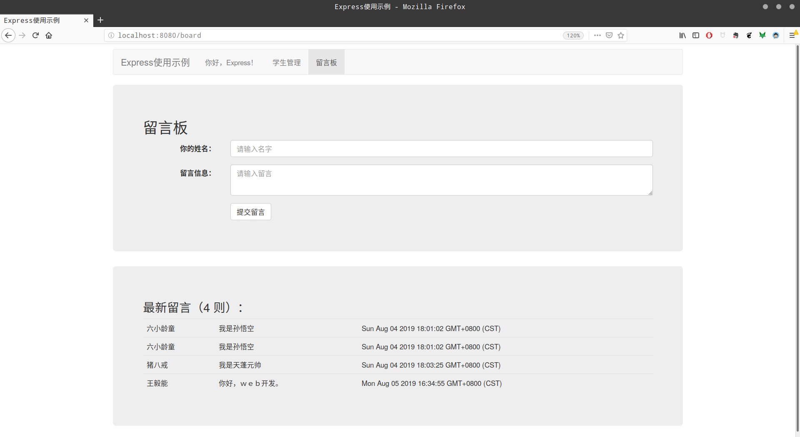
 