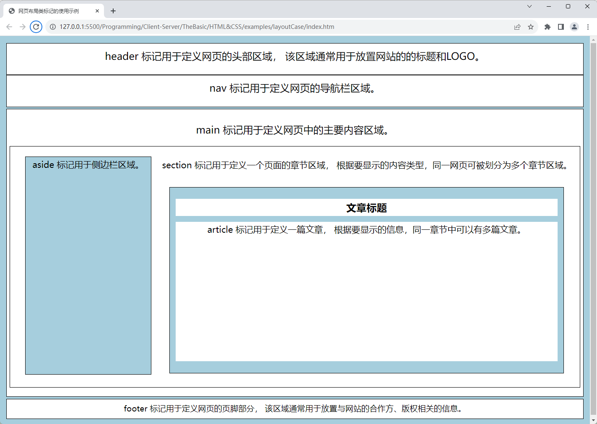
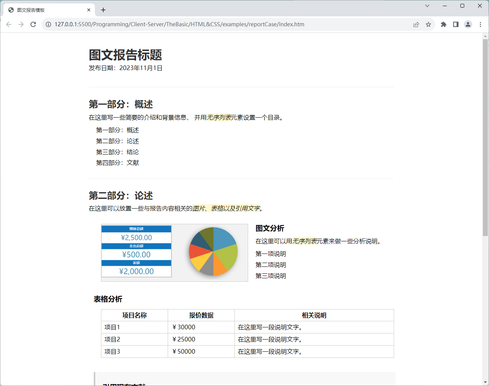
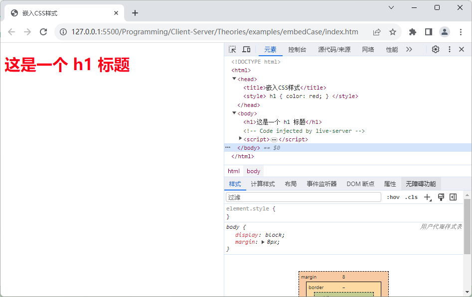

# HTML学习笔记

HTML（即Hyper Text Markup Language，通常被译为“超文本标记语言”）是一门用于描述网页的文档结构及其内容的标记语言，因此网页也通常被称作HTML文档。该标记语言的主要作用是网页描述成一个树状的数据结构，以便于网页可以将其解析成可被JavaScript、VBScript等网页脚本语言识别的对象模型，这样人们就可以用编写代码的方式来对网页进行操作了。在这篇笔记中，我们将基于HTML 5的标准来介绍相关的基础知识。后者赋予了HTML在面对富媒体、富应用以及富内容时强大的描述能力，这将有助于人们设计出信息量更为丰富的网页。

在使用HTML的过程中，网页设计者们将会需要用到一系列相互包裹的、用尖括号表示的HTML标记来描述网页的文档结构及其要显示的内容，且在大多数时候，HTML标记都是成对出现的，该标记要定义的内容会被放在这一对标记中间。换而言之，如果读者要使用一个名为tag的HTML标记，那么该标记的使用语法在大多数情况下是这样的：

```xml
<tag>
    需要使用tag标记定义的内容
</tag>
```

当然，少数情况下也会用到一些单一形式的HTML标记，我将会在后面的实例演示部分中结合具体情况来介绍这些标记的使用方法。下面，我们先来介绍一些在网页设计中最常用的HTML标记及其作用。本着从简单到复杂，逐步深入的学习原则，我们先从用于定义文档结构的标记开始介绍。

## 文档定义类标记

在HTML的标准规范中，文档定义类标记通常会位于HTML树状结构的根部，用于定义整个网页的文档结构。下面，我们来具体介绍一下这些标记及其使用方法：

- **`<!DOCTYPE>`**标记：该标记会被放置在被定义文档的第一行，以便用于指定该文档的类型。例如，如果我们要定义的是一个基于HTML 5标准的网页文档，那么该标记就应该是`<!DOCTYPE html>`。
- `<html>`标记：该标记是用于定义网页文档的总标记。这意味着，所有网页的定义代码都必须从一个`<html>`开始，并以一个`</html>`标记结束，其他所有的HTML标记都必须被放在这两个标记之间。
- `<head>`标记：该标记是用于定义网页头部信息的总标记。换而言之，网页文档中所有与头部信息相关的定义代码都必须从一个`<head>`开始，并以一个`</head>`标记结束，其他用于描述具体头信息的HTML标记都必须被放在这两个标记之间。在HTML的语义中，头部信息中主要提供了网页文档的元数据、外链文件、内嵌代码等信息。虽然这些信息通常不会在网页中直接显示，但由于它们可被Google之类搜索引擎，与网页浏览器相关的应用程序读取并进行相关的解析和渲染，所以我们经常会通过定义头部的方式来提高网页的可访问性、可读性以及可发现性。
- `<body>`标记：该标记是用于定义网页主体内容的总标记。换而言之，网页中所有与可显示内容相关的定义代码都必须从一个`<body>`开始，并以一个`</body>`标记结束，其他需要被显示在网页浏览器中的，用于表示文字、图片、用户界面元素的、与具体内容信息的HTML标记都必须被放在这两个标记之间。
- `<meta>`标记：该标记用于定义网页的具体元数据，例如我们可以用该标签将当前网页所使用的字符集定义为`UTF-8`。
- `<title>`标记：该标记用于定义网页文档的标题，该信息通常会显示在浏览器的标题栏中。
- `<link>`标记：该标记用于定义网页文档所要链接的外部信息，例如我们可以用该标签将要使用的外部CSS样式文件链接到该网页文档中。
  
下面，我们来具体示范一下如何使用上述标记来定义基于HTML 5标准的空白网页文档，其定义代码如下：

```html
<!DOCTYPE html>
<html lang="zh-CN">
    <head>
        <meta charset="utf-8">
        <title>HTML5 入门</title>
    </head>
    <body>
        <!-- 网页内容 -->
    </body>
</html>
```

## 页面布局类标记

和画家在拿到画布之后需要先进行针对整体的构图作业一样，网页设计师们在定义好一个网页文档的结构之后，接下来要完成的就是网页的整体布局设计了。在HTML 5标准发布之前，网页的布局工作基本上是依靠`<div>`标记来完成的。该标记的作用是在网页中定义一个块状显示元素，这是网页设计中会用到的、最基本的布局工具，例如在下面的代码中，读者将会看到一个`id="card"`的块状元素，它的功能在相关的CSS样式作用下在网页中显示一个类似名片的卡片形态。

```html
<!DOCTYPE html>
<html lang="zh-CN">
    <head>
        <meta charset="UTF-8">
        <!-- 搭配相关的CSS样式 -->
        <link rel="stylesheet" href="./styles/main.css">
        <title>一张名片</title>
    </head>
    <body>
        <div id="card">
            
            <h1>企业名称</h1> 
            <p>一段企业简介。</p>
            <ul>
                <li>电话：123-456-7890</li>
                <li>邮箱：message@snowbear.com</li>
                <li>地址：上海市浦东新区某某路X号</li>
            </ul>
        </div>
    </body>
</html>
```

然而，上面这种方式在应对相对复杂的布局需求时通常会出现某种程度上混乱，这将给HTML代码的可读性带来一些不良的影响，并进而会给网页的维护工作带来一些意想不到的麻烦。对此，读者只需想象一下，当同一个HTML文档中存在数十个甚至上百个时而并列、时而嵌套的`<div>`标签时会是什么情况，就不能理解自己会遇到什么麻烦了。为了更好地避免这一类的麻烦，HTML 5标准中新增了许多专用于网页布局的标记，下面来看一下这些标记的基本介绍与使用示范。

- `<header>`标记：该标记不仅可用于定义一个网页的头部区域，也可用于定义网页中某个局部区域的头部；
- `<main>`标记：该标记不仅可用于定义一个网页的主体区域，也可用于定义网页中某个局部区域的正文内容；
- `<aside>`标记：该标记不仅可用于定义一个页面的侧边栏区域，也可用于定义网页中某个局部区域的侧边栏；
- `<footer>`标记：该标记不仅可用于定义一个网页的页脚区域，也可用于定义网页中某个局部区域的底部；
- `<nav>`标记：该标记主要用于定义网站的导航栏，通常被放置在由`<header>`标记所定义的头部区域下方，或者`<aside>`标记所定义的侧边栏区域中，功能是为网站中的各个主要页面提供导航链接。
- `<section>`标记：该标记通常用于定义一个页面的信息展示区，就像一本书可以有多个章节一样，同一页面中也可以包含多个信息展示区；
- `<article>`标记：该标记通常用于定义一个具体的主题单元，该单元可以是一篇文章，也可以是一个视频/音频播放器或小程序。通常情况下，这些主题单元会被放置在由`<section>`标记所定义的内容展示区中，且同一内容展示区内可以有多个主题单元。

从本质上来说，HTML5中新增的这些布局类标记都可被视为`<div>`标记的别名，它们只不过是语义化了该标记的一些特定应用场景。这样做不仅有利于提高HTML代码的可读性，以便降低网页设计项目的维护难度，还能提升网页对搜索引擎的友好度，使得相关信息更容易被找到。下面，我们照例来示范一下这些标记的基本使用方法。

```HTML
<!DOCTYPE html>
<html lang="zh-CN">
    <head>
        <link rel="stylesheet" href="./styles/main.css">
        <title>网页布局类标记的使用示例</title>
    </head>
    <body>
        <header>
            header 标记用于定义网页的头部区域，
            该区域通常用于放置网站的的标题和LOGO。
        </header>
        <nav>nav 标记用于定义网页的导航栏区域。</nav>
        <main>
            <p>main 标记用于定义网页中的主要内容区域。</p> 
            <section>
                <aside>aside 标记用于侧边栏区域。</aside>
                <p>
                    section 标记用于定义一个页面的章节区域，
                    根据要显示的内容类型，同一网页可被划分为多个章节区域。
                </p>
                <article>
                    <!-- 定义文章标题的标记，h1-h6 -->
                    <h1>文章标题</h1>
                    <!--定义文章段落的标记 -->
                    <p>article 标记用于定义一篇文章，
                        根据要显示的信息，同一章节中可以有多篇文章。
                        </p>
                </article>
            </section>
        </main>            
        <footer>
            footer 标记用于定义网页的页脚部分，
            该区域通常用于放置与网站的合作方、版权相关的信息。
        </footer>
    </body>
</html>
```

在将上述HTML代码保存为网页文件之后，读者只需要给该网页配上一些可让布局效果可视化的CSS样式（这些样式代码被保存在本笔记文件所在目录下的`examples/layoutCase/styles`目录中），就可以在用网页浏览器中打开这个网页时看到如图1所示的布局效果。



图1：HTML5中的布局类标记

## 图文编排类标记

在完成了网页布局部分的工作之后，设计师们接下来的工作就是安排要显示在网页浏览器中的具体内容了。而在网页可显示的诸多元素中，最基本的就是图文类元素了，这类元素主要包括标题、段落。引用、列表、表格、链接、图片等。下面，我们就先来介绍一些常用于在网页中显示这类元素的HTML标记。

- `<h1>……<h6>`标记：该标记的作用是在网页中显示文本标题。根据HTML的语法规则，标题元素可以有六个级别，其中，`<h1>`标记定义的标题是最高级别的标题，而`<h6>`标记定义的标题是最低级别的标题。
- `<p>`标记：该标记的作用是在网页中定义一个文本段落元素。
- `<br>`标记：该标记的作用是在网页中定义一个换行元素，换而言之，该标记的作用是让浏览器在网页中显示一个换行符。 
- `<hr>`标记：该标记的作用是在网页中定义一条水平分割线，通常用于分隔网页中的多个章节区域。
- `<pre>`标记：该标记的作用是在网页中定义一个预格式文本元素，换而言之，该标记的作用是让浏览器将预格式文本中的所有空格、换行符、制表符等原样显示出来，而不会将它们转换为HTML代码中的空格、换行符等。
- `<blockquote>`标记：该标记的作用是在网页中定义一个引用文本元素，换而言之，该标记的作用是让浏览器将引用文本中的所有空格、换行符、制表符等原样显示出来，而不会将它们转换为HTML代码中的空格、换行符等。
- `<ul>`与`<li>`标记：这两个标记的作用是在网页中定义一个无序列表元素。
- `<ol>`与`<li>`标记：这两个标记的作用是在网页中定义一个无序列表元素。
- `<table>`标记：该标记的作用是在网页中定义一个表格元素，换而言之，网页中关于表格元素的所有定义代码都必须从一个`<table>`开始，并以一个`</table>`标记结束，其他用于描述表格行、单元格的HTML标记都必须被放在这两个标记之间。
- `<tr>`标记：该标记必须放在`<table>`和`</table>`这两个标记之间才能有效发挥作用。它的作用是定义表格的“行”元素，换而言之，表格中每一行的定义代码都必须从一个`<tr>`开始，并以一个`</tr>`标记结束，其中用于描述单元格的HTML标记都必须被放在这两个标记之间。
- `<th>`标记：该标记必须放在`<tr>`和`</tr>`这两个标记之间才能有效发挥作用。它的作用是定义表格标题行中的“单元格”元素，换而言之，表格标题行中每个单元格元素的定义代码都必须从一个`<th>`开始，并以一个`</th>`标记结束，其中用于显示具体信息的HTML标记都必须被放在这两个标记之间。
- `<td>`标记：该标记必须放在`<tr>`和`</tr>`这两个标记之间才能有效发挥作用。它的作用是定义表格中除标题行之外的“单元格”元素，换而言之，表格中除标题行之外的每个单元格元素的定义代码都必须从一个`<td>`开始，并以一个`</td>`标记结束，其中用于显示具体信息的HTML标记都必须被放在这两个标记之间。
- `<a>`标记：该标记的作用是在网页中定义一个超链接元素，换而言之，该标记的作用是让浏览器在网页中显示一个指向其他网页的超链接文本。
- ``标记：该标记的作用是在网页中定义一个图像元素，换而言之，该标记的作用是让浏览器在网页中显示一个图像。

下面，我们将通过模拟设计一个网页版的图文报告模板来示范一下上述HTML标记的使用方法，该示例会被保存在本笔记所在目录下的`examples/report`目录中，我在该目录中创建了一个名为`index.html`的HTML文件，并在其中输入了如下代码。

```html
<!DOCTYPE html>
<html lang="zh-CN">
    <head>
        <meta charset="UTF-8">
        <link rel="stylesheet" href="./styles/main.css">
        <title>图文报告模板</title>
    </head>
    <body>
        <header>
            <h1>图文报告标题</h1>
            <p>发布日期：2023年11月1日</p>
        </header>
        <main>
            <section>
                <h2>第一部分：概述</h2>
                <p>在这里写一些简要的介绍和背景信息，
                    并用无序列表元素设置一个目录。
                </p>
                <ul>
                    <li>第一部分：概述</li>
                    <li>第二部分：论述</li>
                    <li>第三部分：结论</li>
                    <li>第四部分：文献</li>
                </ul>    
            </section>
            <section>
                <h2>第二部分：论述</h2>
                <p>
                    在这里可以放置一些与报告内容相关的图片、表格以及引用文字。
                </p>
                <article>
                    
                    <div>
                        <h3>图文分析</h3>
                        <p>在这里可以用无序列表元素来做一些分析说明。</p>
                        <ul>
                            <li>第一项说明</li>
                            <li>第二项说明</li>
                            <li>第三项说明</li>
                        </ul>            
                    </div>
                </article>
                <article>
                    <h3>表格分析</h3>
                    <table>
                        <thead>
                            <tr>
                                <th>项目名称</th>
                                <th>报价数据</th>
                                <th>相关说明</th>
                            </tr>
                        </thead>
                        <tbody>
                            <tr>
                                <td>项目1</td>
                                <td>￥30000</td>
                                <td>在这里写一段说明文字。</td>
                            </tr>
                            <tr>
                                <td>项目2</td>
                                <td>￥25000</td>
                                <td>在这里写一段说明文字。</td>
                            </tr>
                            <tr>
                                <td>项目3</td>
                                <td>￥50000</td>
                                <td>在这里写一段说明文字。</td>
                            </tr>
                        </tbody>
                    </table>
                </article>
                <article>
                    <h3>引用现有文献</h3>
                    <blockquote>
                        <p>在这里可以使用引用元素援引一段现有文献中的重要文本或话语。</p>
                        <cite>— 引用来源</cite>
                    </blockquote>
                </article>                
            </section>
            <section>
                <h2>第三部分：结论</h2>
                <p>在这里可以用有序列表元素来做一个总结。</p>
                <ol>
                    <li>结论一：在这里写一段总结文字。</li>
                    <li>结论二：在这里写一段总结文字。</li>
                    <li>结论三：在这里写一段总结文字。</li>
                </ol>
            </section>
            <section>
                <h2>第四部分：文献</h2>
                <p>在这里可以用有序列表元素+超链接元素来列举报告的参考文献。</p>
                <ol>
                    <li><a href="https://www.example.com">参考文献1</a></li>
                    <li><a href="https://www.example.com">参考文献2</a></li>
                    <li><a href="https://www.example.com">参考文献3</a></li>
                </ol> 
            </section>
        </main>
        <footer>
            <p>&copy; 2023 图文报告公司</p>
        </footer>
    </body>
</html>
```

然后，我们使用网页浏览器打开该文件，就可以看到如下效果。



图2：HTML5中的图文类标记

## 元素嵌入类标记

在网页设计工作中，除了最基本的图文类元素之外，我们通常还会在当前网页中嵌入矢量图、CSS样式、脚本代码、视频、音频、小程序等特定数据类型的元素。这些元素也都有对应的HTML标记。下面，我们就分别来介绍一下这些HTML标记，以便读者可以根据项目需求自行选择适当的标记来丰富网页的功能。

### 嵌入矢量图

在HTML 5中，设计师们可以使用 `<svg>` 标记来在网页中嵌入矢量图元素。SVG是一套基于XML来实现的、用于描述矢量图形的标记语言，我们们可以利用这套标记语言在网页中创建复杂的图形元素。例如，如果读者想在网页中绘制一个绘制有红色圆形+黄色矩形的图案，就可以这样做：

```xml
<!DOCTYPE html>
<html lang="zh-CN">
    <head>
        <meta charset="UTF-8">
        <title>嵌入矢量图</title>
    </head>
    <body>
        <svg width="400" height="300">
            <!-- 在这里放置用于绘制SVG图形的标记 -->
            <circle cx="50" cy="50" r="40" 
                stroke="black" stroke-width="3" fill="red" />
            <rect x="100" y="100" width="200" height="100"
                stroke="black" stroke-width="3" fill="yellow" />
        </svg>
    </body>
</html>
```

上述代码示例被保存在本笔记所在目录下的`examples/embedCase`目录中，读者可以使用网页浏览器打开该文件，就可以看到如图3所示的效果。


下面，我们来详细介绍一下`<svg>` 标记的使用方法：

- `<svg>` 标记具有开始标记 `<svg>` 和结束标记 `</svg>`，在这两个标记之间的内容将被渲染为SVG图形。设计师们可以使用该标记的 `width` 和 `height` 属性来指定图形的宽度和高度。这决定了SVG画布的尺寸，所有的图形元素将在这个画布上绘制。

- SVG拥有一个独立的坐标系，其中 `(0,0)` 通常位于左上角。设计师们可以在SVG中使用坐标来放置和定位图形元素。`<svg>` 标记内的坐标系统是相对的，它们与 `width` 和 `height` 属性的值相关联。在 `<svg>` 标记内，设计师们可以使用一系列子标记来绘制不同的SVG图形元素，例如 `<circle>`、`<rect>`、`<line>`、`<path>` 等，这些子标记有各自的属性，可用于控制图形的外观和行为。

- 设计师们可以使用CSS样式来控制SVG图形元素的颜色、填充、描边等外观属性。这些样式可以通过在网页中嵌入内联样式或者引用外部CSS文件来进行定义。

- SVG 图形中也可以包含交互性功能，例如添加鼠标事件处理程序，使用户能够与图形进行互动。另外，SVG支持动画，设计师们可以使用 `<animate>` 标记或 JavaScript 来为图形元素添加动画效果。

- 设计师们可以将SVG图形嵌入到网页中，也可以通过外部文件引入 SVG 图形。这使得图形的重用和维护变得更加容易。

总而言之，`<svg>` 标记是一个可用于在网页中创建矢量图形和图表的强大工具，它提供了丰富的功能，包括绘制、样式、交互性和动画等。而且，SVG图形还可以在不失真的情况下缩放，适合多种不同的屏幕尺寸和分辨率。

### 嵌入媒体元素

在HTML 5中，设计师们可以使用 `<video>`、`<audio>`这两个标记来实现在网页中嵌入视频/音频元素，如今我们所熟悉的哔哩哔哩、喜马拉雅等视频/音频网站，就是基于这两个标记来实现的。下面，我们来分别介绍一下它们的使用方法：

- **`<video>`** 标记：该标记用于在网页文档中嵌入一个视频播放器，我们可以利用其`<source>`子标记的`src`属性来指定要播放的视频文件，例如像这样：

    ```html
    <!DOCTYPE html>
    <html>
        <head>
            <title>嵌入视频播放器</title>
        </head>
        <body>
            <video width="320" height="240" controls>
                <source src="movie.mp4" type="video/mp4">
                <p>你的浏览器不支持HTML 5的视频标签！</p>
            </video>
        </body>
    </html>
    ```

    在上述代码中，我们首先使用 `<video>` 标记定义了一个视频播放器，然后使用其 `width` 和 `height` 属性来指定视频播放器在网页中所要显示的高度和宽度，接着使用其 `<source>` 子标记的 `src` 属性来指定要播放的视频文件，最后使用其 `<p>` 子标记来指定当浏览器不支持HTML 5的视频标签时显示的文本信息。其效果如下所示：

    

- **`<audio>`** 标记：该标记用于在网页文档中嵌入一个音频播放器，我们可以利用其`<source>`子标记的`src`属性来指定要播放的音频文件，例如像这样：

    ```html
    <!DOCTYPE html>
    <html>
        <head>
            <title>嵌入音频播放器</title>
        </head>
        <body>
            <audio width="400" height="300" controls>
                <source src="horse.mp3" type="audio/mpeg">
                <p>你的浏览器不支持HTML 5的音频标签！</p>
            </audio>
        </body>
    </html>
    ```

    在上述代码中，我们首先使用 `<audio>` 标记定义了一个音频播放器，然后使用其 `width` 和 `height` 属性来指定音频播放器在网页中所要显示的高度和宽度，接着使用其 `<source>` 子标记的 `src` 属性来指定要播放的音频文件，最后使用其 `<p>` 子标记来指定当浏览器不支持HTML 5的音频标签时显示的文本信息。其效果如下所示：

    

### 嵌入CSS样式

在HTML 5中，除了使用`<link>`标记引入外部的CSS样式文件之外，设计师们也可以选择将只适用于当前网页的样式代码直接写在`<style>`和`</style>`这对标记之间，例如像下面这样：

```html
<!DOCTYPE html>
<html>
    <head>
        <title>嵌入CSS样式</title>
        <style>
            h1 {
                color: red;
            }
        </style>
    </head>
    <body>
        <h1>这是一个 h1 标题</h1>
    </body>
</html>
```

在上述代码中，我们首先使用 `<style>` 标记定义了一个CSS样式，然后在该标记内部使用CSS样式来指定当前网页中所有`<h1>`标记的字体颜色为红色，最后使用 `<h1>` 标记来指定当前网页中所有的标题文字。其效果如下所示：



### 嵌入脚本代码

在HTML 5中，设计师们可以使用 `<script>` 标记来在网页中嵌入脚本代码，例如我们可以选择将只适用于当前网页的JavaScript脚本代码直接写在`<script>`和`</script>`这对标记之间，或者使用该标签的`src`属性来引用外部JavaScript文件，例如像下面这样：

```html
<!DOCTYPE html>
<html>
    <head>
        <title>嵌入脚本代码</title>
        <script>
            function changeText() {
                document.getElementById("demo").innerHTML = "Hello World!";
            }
        </script>
    </head>
    <body>
        <h1>嵌入 JavaScript 脚本代码.</h1>
        <button type="button" onclick="changeText()">打个招呼！</button>
        <p>点击上面的按钮将会在下面显示“Hello World!”。</p>
        <p id="demo"></p>
    </body>
</html>
```

在上述代码中，我们首先使用 `<script>` 标记定义了一个JavaScript函数，然后在`<button>`标记内部将该函数注册为鼠标点击事件的处理函数，这样一来，当页面中的按钮被鼠标点击时，该函数就将会在`id="demo"`的段落区域中显示出“Hello World!”字样的文本。其效果如下所示：


### 嵌入其他元素

- `<iframe>`标记：该标记用于在网页文档中嵌入另一个网页，我们可以使用该标签的`src`属性来指定要嵌入网页的URL。例如：

    ```html
    <!DOCTYPE html>
    <html>
        <head>
            <title>嵌入另一个网页</title>
        </head>
        <body>
            <iframe src="res/html/example.htm" 
                        width="320" height="240">
            </iframe>
        </body>
    </html>
    ```

    在上述代码中，我们使用`<iframe>`标记在当前网页中嵌入了一个名为`example.htm`的网页，该网页的URL为`res/html/example.htm`，其效果如下所示：

    

    需要提醒读者的是，使用`<iframe>`标记时要注意安全性问题，我们原则上并不鼓励在网页设计中过多地使用该标记。即使在不得已使用时，我们也必须要确保嵌入的网页是可信的，以防止恶意代码或跨站脚本攻击。

- `<canvas>`标记：该标记用于在网页文档中嵌入可用于绘画的画布元素。在使用该元素时，我们通常会先使用该标签的`width`和`height`属性来设置画布的宽度和高度，然后使用JavaScript脚本进行绘画，例如像下面这样：

    ```html
    <!DOCTYPE html>
    <html>
        <head>
            <title>嵌入画布元素</title>
        </head>
        <body>
            <canvas id="canvas" width="320" height="240"></canvas>
            <script>
                const canvas = document.getElementById('canvas');
                const context = canvas.getContext('2d');
                context.fillStyle = '#FF0000';
                context.fillRect(0, 0, 150, 100);
            </script>
        </body>
    </html>
    ```

    上述代码在网页中的显示效果如下所示：

    

    请注意，`<canvas>`标记需要使用JavaScript来进行绘制，因此对于不熟悉JavaScript的开发者来说，可能需要学习一些基本的Canvas API知识。同时，不同的浏览器可能对Canvas API的支持程度有所不同，因此在使用时需要保持谨慎的态度，事前必须进行充分的兼容性测试。

## 人机交互类标记

自以AJAX技术为代表的Web2.0时代开始，随着网页日益成为了分布式应用程序的用户界面（因此它们有时也被称为应用程序的前端），学习*如何构建Web应用程序的用户界面，并赋予它良好的用户体验*也就日益成为了网页设计工作的重要组成部分。为了帮助设计师们更好地完成这一部分的工作，HTML 5中提供了一系列人机交互类的标记，以便用于构建应用程序的交互界面元素。下面，我们就来详细介绍一下这些标记以及它们的使用方法。

### 独立交互元素

同样本着从简单到复杂，逐步深入的学习原则，我们在这里也将会从一些可独立创建的交互元素开始，下面是用于创建这些元素的HTML标记。

- `<button>`标记：该标记可用于在网页中创建一个独立的按钮元素，其基本语法格式如下所示：

    ```html
    <button type="button" onclick="alert('Hello World!')">
        <!-- 这里可以设置按钮上要显示的文字或图形 -->
        <p>按钮</p>
    </button>
    ```

    在上述语法中，`type`属性用于指定按钮的类型，其取值可以是`button`、`submit`或`reset`，分别表示普通按钮、提交按钮和重置按钮，默认值为`button`。而`onclick`属性则用于指定按钮在被点击时所要执行的JavaScript脚本，其值既可以是JavaScript代码，也可以是JavaScript代码所在的URL。在这里，我们让它弹出一个带有“Hello World!”字样的信息提示框。最后，在`<button>`和`</button>`标记之间，我们可以设置用于显示在按钮上的提示信息，该信息可以是一段文本，也可以是一个图形，但必须要能说明该按钮元素的功能。

- `<progress>`标记：该标记可用于在网页中创建一个独立的进度条元素，其基本语法格式如下所示：

   ```html
   <progress id="task" value="0" max="100"></progress>
   <script>
       document.getElementById('task').value = 50;
   </script>
   ```

    在上述语法中，`value`属性用于指定进度条当前的进度值，而`max`属性则用于指定进度条的最大值。通常情况下，该标记要搭配某一个JavaScript函数使用，以便于根据指定的任务执行情况来动态地改变进度条的进度值。

- `<meter>`标记：该标记用于显示度量值或比例。可以使用`value`、`min`、`max`、`low`、`high`等属性来指定度量值的范围和当前值。例如：

   ```html
   <meter value="75" min="0" max="100">75%</meter>
   ```

- `<output>`标记：该标记用于显示计算结果或脚本输出。可以使用`for`属性将其与其他元素关联起来。例如：

   ```html
   <output for="range">0</output>
   <input type="range" id="range" min="0" max="100" oninput="output.value = range.value">
   ```

- `<textarea>`标记：该标记用于创建多行文本输入框。可以使用`rows`和`cols`属性指定文本框的行数和列数。例如：

   ```html
   <textarea name="message" rows="4" cols="50"></textarea>
   ```

- `<datalist>`和`<option>`标记：这两个标记用于创建自动完成的下拉列表。其中，`<datalist>`标记用于定义要创建的下拉列表，而`<option>`子标记则用于创建该下拉列表中的可选项，同一`<datalist>`标记中可包含多个`<option>`子标记。例如，如果我们想在网页中创建一个`id="fruits"`的下拉列表，其中包含三个可选项，分别为`Apple`、`Banana`和`Orange`，就可以这样做：
  
    ```html
    <!DOCTYPE html>
    <html>
        <head>
            <title>自动完成下拉列表</title>
        </head>
        <body>
            <input type="text" list="fruits">
            <datalist id="fruits">
                <option value="Apple">
                <option value="Banana">
                <option value="Orange">
            </datalist>
        </body>
    </html>
    ```

- `<details>`和`<summary>`标记：这两个标记用于创建可折叠的内容块。`<summary>`定义折叠块的摘要，`<details>`定义折叠块的内容。例如：

   ```html
   <details>
     <summary>Click to expand</summary>
     <p>Hidden content</p>
   </details>
   ```

这些标记和属性可以帮助开发者创建更丰富、交互性更强的用户界面，提供更好的用户体验。它们可以与CSS和JavaScript一起使用，以实现更多的交互效果和功能。

<!-- 以下为待整理 -->
- `<input>`标记：该标记用于在网页中创建一个输入框，其基本语法格式如下所示：

    ```html
    <input type="text" value="输入框" />
    ```

    其中，`type`属性用于指定输入框的类型，其值可以是`text`、`password`、`radio`、`checkbox`、`submit`、`reset`或`button`，分别用于创建文本输入框、密码输入框、单选框、复选框、提交按钮和重置按钮。

    ```html
    <!DOCTYPE html>
    <html>
        <head>
            <title>输入框标记</title>
        </head>
        <body>
            <input type="text" value="文本输入框" />
            <input type="password" value="密码输入框" />
            <input type="radio" value="单选框" />
            <input type="checkbox" value="复选框" />
            <input type="submit" value="提交按钮" />
            <input type="reset" value="重置按钮" />
        </body>
    </html>
    ```

- `<textarea>`标记：该标记用于在网页中创建一个文本区域，其基本语法格式如下所示：

    ```html
    <textarea rows="3" cols="20">文本区域</textarea>
    ```

    其中，`rows`属性用于指定文本区域中可以显示的行数，`cols`属性用于指定文本区域中可以显示的列数。

    ```html
    <!DOCTYPE html>
    <html>
        <head>
            <title>文本区域标记</title>
        </head>
        <body>
            <textarea rows="3" cols="20">文本区域</textarea>
        </body>
    </html>
    ```

### 表单交互元素

- `<form>`标记：该标记用于在网页中创建一个表单，其基本语法格式如下所示：

    ```html
    <form action="url" method="get/post">
        表单元素
    </form>
    ```
 
    其中，`action`属性用于指定表单提交的地址，`method`属性用于指定表单提交的方式，其值可以是`get`或`post`。

    ```html
    <!DOCTYPE html>
    <html>
        <head>
            <title>表单标记</title>
        </head>
        <body>
            <h1>登录界面表单示例</h1>
            <form method="post" action="http://www.baidu.com">
                <p>用户名：<input type="text" name="username" /></p>
                <p>密码：<input type="password" name="password" /></p>
                <p><input type="submit" value="登录" /></p>
            </form> 
        </body>
    </html>
    ```

- `<input>`子标记：该标记用于创建各种表单输入控件，如文本框、复选框、单选按钮、下拉列表等。可以使用不同的`type`属性来指定不同的输入类型。例如：

   ```html
   <input type="text" name="username" placeholder="Enter your username">
   <input type="checkbox" name="agree" id="agree">
   <label for="agree">I agree to the terms and conditions</label>
   <input type="radio" name="gender" value="male"> Male
   <input type="radio" name="gender" value="female"> Female
   <select name="country">
     <option value="us">United States</option>
     <option value="uk">United Kingdom</option>
     <option value="ca">Canada</option>
   </select>
   ```

----
#待整理
