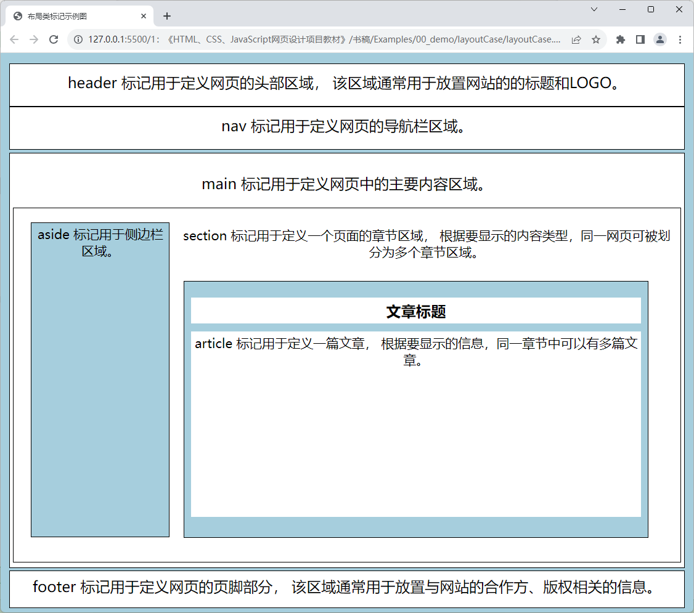
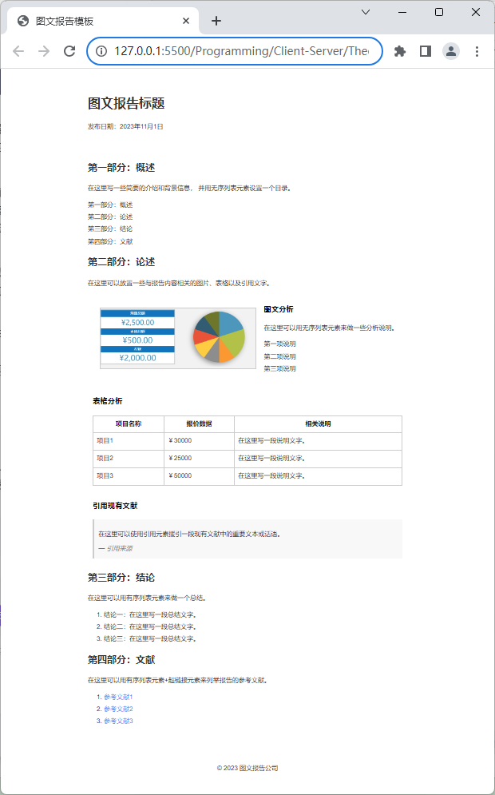

# 基于HTML&CSS的网页设计

## 基础知识部分

HTML和CSS是开发者们在网页设计工作中必然会用到的计算机标记语言，前者用于定义网页的内容结构，后者则用于定义网页的外观样式。所以在正式开展网页设计的的工作之前，初学者有必要先初步了解一下这两门语言以及它们现阶段各自所采用的标准版本，并掌握一些相关的基础知识。当然了，如果读者认为自己已经掌握了这部份知识，可自行跳过本节内容。

### 初识HTML标记

HTML（即Hyper Text Markup Language，通常被译为“超文本标记语言”）是一门用于描述网页的内容及其文档结构的标记语言，因此网页也通常被称作HTML文档。该标记语言的主要作用是网页文档描述成一个树状的数据结构，以便于网页浏览器可以将其解析成可被JavaScript、VBScript等网页脚本语言识别的对象模型，这样人们就可以用编写代码的方式来对网页进行操作了。在这里，笔记所涉及的所有知识都将基于HTML 5的标准来开展学习，该标准赋予了HTML在面对富媒体、富应用以及富内容时强大的描述能力，这将有助于我们设计出信息量更为丰富的网页。

在使用HTML的过程中，网页设计者们将会需要用到一系列相互包裹的、用尖括号表示的HTML标记来描述网页的内容及其文档结构，且在大多数时候，HTML标记都是成对出现的，该标记要定义的内容会被放在这一对标记中间。换而言之，如果读者要使用一个名为tag的HTML标记，那么该标记的使用语法在大多数情况下是这样的：

```xml
<tag>
    需要使用tag标记定义的内容
</tag>
```

当然，少数情况下也会用到一些单一形式的HTML标记，我将会在后面的实例演示部分中结合具体情况来介绍这些标记的使用方法，下面先来介绍一些在网页设计中最常用的HTML标记及其作用，先从用于定义网页文档的标记开始。

#### 文档定义类标记

在HTML的语义中，文档定义类标记的作用是定义网页文档的总体结构，因此这些标记通常会被放在网页文档的最前面，下面是一些常用的文档定义类标记及其作用：

- **`<!DOCTYPE>`**标记：该标记会被放置在被定义文档的第一行，以便用于指定该文档的类型。例如，如果我们要定义的是一个基于HTML 5标准的网页文档，那么该标记就应该是`<!DOCTYPE html>`。
- `<html>`标记：该标记是用于定义网页文档的总标记。这意味着，所有网页的定义代码都必须从一个`<html>`开始，并以一个`</html>`标记结束，其他所有的HTML标记都必须被放在这两个标记之间。
- `<head>`标记：该标记是用于定义网页头部信息的总标记。换而言之，网页文档中所有与头部信息相关的定义代码都必须从一个`<head>`开始，并以一个`</head>`标记结束，其他用于描述具体头信息的HTML标记都必须被放在这两个标记之间。在HTML的语义中，头部信息中主要提供了网页文档的元数据、外链文件、内嵌代码等信息。虽然这些信息通常不会在网页中直接显示，但由于它们可被Google之类搜索引擎，与网页浏览器相关的应用程序读取并进行相关的解析和渲染，所以我们经常会通过定义头部的方式来提高网页的可访问性、可读性以及可发现性。
- `<body>`标记：该标记是用于定义网页主体内容的总标记。换而言之，网页中所有与可显示内容相关的定义代码都必须从一个`<body>`开始，并以一个`</body>`标记结束，其他需要被显示在网页浏览器中的，用于表示文字、图片、用户界面元素的、与具体内容信息的HTML标记都必须被放在这两个标记之间。
- `<meta>`标记：该标记用于定义网页的具体元数据，例如我们可以用该标签将当前网页所使用的字符集定义为`UTF-8`。
- `<title>`标记：该标记用于定义网页文档的标题，该信息通常会显示在浏览器的标题栏中。
- `<link>`标记：该标记用于定义网页文档所要链接的外部信息，例如我们可以用该标签将要使用的外部CSS样式文件链接到该网页文档中。
  
下面，我们来具体示范一下如何使用上述标记来定义基于HTML 5标准的空白网页文档，其定义代码如下：

```html
<!DOCTYPE html>
<html lang="zh-CN">
    <head>
        <meta charset="utf-8">
        <title>HTML5 入门</title>
    </head>
    <body>
        <!-- 网页内容 -->
    </body>
</html>
```

#### 网页布局类标记

和画家在拿到画布之后需要先进行整体的构图工作一样，网页设计师们在定义好一个网页文档之后，接下来要完成的工作是网页的整体布局设计。在HTML 5标准发布之前，网页的布局工作基本上是依靠`<div>`标记来完成的。该标记的作用是在网页中定义一个块状显示元素，这是网页设计中会用到的、最基本的布局工具，例如在下面的代码中，读者将会看到一个`id="card"`的块状元素，它的功能在相关的CSS样式作用下在网页中显示一个类似名片的卡片形态。

```html
<!DOCTYPE html>
<html lang="zh-CN">
    <head>
        <meta charset="UTF-8">
        <!-- 搭配相关的CSS样式 -->
        <link rel="stylesheet" href="./styles/main.css">
        <title>一张名片</title>
    </head>
    <body>
        <div id="card">
            
            <h1>企业名称</h1> 
            <p>一段企业简介。</p>
            <ul>
                <li>电话：123-456-7890</li>
                <li>邮箱：message@snowbear.com</li>
                <li>地址：上海市浦东新区某某路X号</li>
            </ul>
        </div>
    </body>
</html>
```

然而，上面这种方式在网页布局相对复杂的情况下通常会出现某种程度上混乱，这将给项目代码的可读性带来一些不良的影响，进而给维护工作带来一些意想不到的麻烦。为了应对这类问题，HTML 5标准中新增了许多专用于网页布局的标记，下面来看一下这些标记的基本介绍与使用示范。

- `<header>`标记：该标记不仅可用于定义一个网页的头部区域，也可用于定义网页中某个局部区域的头部；
- `<aside>`标记：该标记不仅可用于定义一个页面的侧边栏区域，也可用于定义网页中某个局部区域的侧边栏；
- `<footer>`标记：该标记不仅可用于定义一个网页的页脚区域，也可用于定义网页中某个局部区域的底部；
- `<nav>`标记：该标记主要用于定义网站的导航栏，通常被放置在由`<header>`标记所定义的头部区域下方，或者`<aside>`标记所定义的侧边栏区域中，功能是为网站中的各个主要页面提供导航链接。
- `<section>`标记：该标记通常用于定义一个页面的信息展示区，就像一本书可以有多个章节一样，同一页面中也可以包含多个信息展示区；
- `<article>`标记：该标记通常用于定义一个具体的主题单元，该单元可以是一篇文章，也可以是一个视频/音频播放器或小程序。通常情况下，这些主题单元会被放置在由`<section>`标记所定义的内容展示区中，且同一内容展示区内可以有多个主题单元。

从本质上来说，HTML5中新增的这些布局类标记都可被视为`<div>`标记的别名，它们只不过是语义化了该标记的一些特定应用场景。这样做不仅有利于提高HTML代码的可读性，以便降低网页设计项目的维护难度，还能提升网页对搜索引擎的友好度，使得相关信息更容易被找到。下面，我们照例来示范一下这些标记的基本使用方法。

```HTML
<!DOCTYPE html>
<html lang="zh-CN">
    <head>
        <link rel="stylesheet" href="./styles/main.css">
        <title>布局类标记示例图</title>
    </head>
    <body>
        <header>
            header 标记用于定义网页的头部区域，
            该区域通常用于放置网站的的标题和LOGO。
        </header>
        <nav>nav 标记用于定义网页的导航栏区域。</nav>
        <section>
            <p>标记用于定义网页中的章节区域，
            根据要显示的内容类型，同一网页可被划分为多个章节区域。</p> 
            <aside>aside 标记用于侧边栏区域</aside>
            <article>
                article 标记用于定义一篇文章，
                根据要显示的信息，同一章节中可以有多篇文章。
                <!-- 定义文章标题的标记，h1-h6 -->
                <h1>文章标题</h1>
                <!--定义文章段落的标记 -->
                <p>这是一个段落。</p>
            </article>
        </section>            
        <footer>
            footer 标记用于定义网页的页脚部分，
            该区域通常用于放置与网站的合作方、版权相关的信息。
        </footer>
    </body>
</html>
```

在将上述HTML代码保存为网页文件之后，读者只需要给该网页配上一些可让布局效果可视化的CSS样式（这些样式代码被保存在本笔记文件所在目录下的`examples/layoutCase/styles`目录中），就可以在用网页浏览器中打开这个网页时看到如图1所示的布局效果。



图1：HTML5中的布局类标记

#### 文本信息类标记

当网页中要显示的信息更多时，网页设计师们还会用到用于显示表格和有序列表的元素，下面来进一步介绍一下用于显示这些元素的标记。

- `<h1>……<h6>`标记：该标记的作用是在网页中定义一级标题元素。例如在本章项目的代码中，读者将会看到我们用该标签在网页中显示了“凌雪冰熊咖啡屋”的字样。
- `<p>`标记：该标记的作用是在网页中定义一个文本段落元素。例如在本章项目的代码中，读者将会看到我们用该标签在网页中对“凌雪冰熊咖啡屋”做了简介。
- `<ul>`与`<li>`标记：这两个标记的作用是在网页中定义一个无序列表元素。例如在本章项目的代码中，读者将会看到我们用该标签在网页中显示了“凌雪冰熊咖啡屋”的地址、电话号码和电子邮件信息。
- `<table>`标记：该标记的作用是在网页中定义一个表格元素，换而言之，网页中关于表格元素的所有定义代码都必须从一个`<table>`开始，并以一个`</table>`标记结束，其他用于描述表格行、单元格的HTML标记都必须被放在这两个标记之间。
- `<tr>`标记：该标记必须放在`<table>`和`</table>`这两个标记之间才能有效发挥作用。它的作用是定义表格的“行”元素，换而言之，表格中每一行的定义代码都必须从一个`<tr>`开始，并以一个`</tr>`标记结束，其中用于描述单元格的HTML标记都必须被放在这两个标记之间。
- `<th>`标记：该标记必须放在`<tr>`和`</tr>`这两个标记之间才能有效发挥作用。它的作用是定义表格标题行中的“单元格”元素，换而言之，表格标题行中每个单元格元素的定义代码都必须从一个`<th>`开始，并以一个`</th>`标记结束，其中用于显示具体信息的HTML标记都必须被放在这两个标记之间。
- `<td>`标记：该标记必须放在`<tr>`和`</tr>`这两个标记之间才能有效发挥作用。它的作用是定义表格中除标题行之外的“单元格”元素，换而言之，表格中除标题行之外的每个单元格元素的定义代码都必须从一个`<td>`开始，并以一个`</td>`标记结束，其中用于显示具体信息的HTML标记都必须被放在这两个标记之间。
- `<ol>`与`<li>`标记：这两个标记的作用是在网页中定义一个无序列表元素。

下面来示范一下以上标记的使用方式，首先要示范的是用于显示表格元素的HTML标记：

```html
<table>
    <tr>
        <th>标题1</th>
        <th>标题2</th>
        <th>标题3</th>
    </tr>
    <tr>
        <td>第1行单元格1</td>
        <td>第1行单元格2</td>
        <td>第1行单元格3</td>
    </tr>
    <tr>
        <td>第2行单元格1</td>
        <td>第2行单元格2</td>
        <td>第2行单元格3</td>
    </tr>
</table>
```

接下来是用于显示有序列表元素的HTML标记，例如笔者可以把本章项目的实施步骤定义成如下有序列表元素：

```html
<ol>
    <li>建立源码管理机制</li>
    <li>定义网页的文档结构</li>
    <li>定义网页的外观样式</li>
</ol>
```

#### 代码内嵌类标记

- `<style>`标记：该标记用于在当前网页文档中内嵌CSS样式代码，也就是说，我们可以选择将只适用于当前网页的样式代码直接写在`<style>`和`</style>`这对标记之间。
- `<script>`标记：该标记用于在网页文档中内嵌脚本代码，例如我们可以选择将只适用于当前网页的JavaScript脚本代码直接写在`<script>`和`</script>`这对标记之间，或者使用该标签的`src`属性来引用外部JavaScript文件。

#### 用户交互类标记

## 初识CSS样式表

CSS（即Cascading Style Sheets，通常被译为“层叠样式表”）是一门用于定义网页外观样式的计算机语言。人们可以使用这门语言对网页中出现的图片、文本、按钮等元素进行像素级别的精确控制。在这本书中，所有项目都将按照CSS3这一最新标准来定义网页的外观样式。该标准新增了圆角效果、渐变效果、图形化边界、文字阴影、透明度设置、多背景图设置、可定制字体、媒体查询、多列布局以及弹性盒模型布局等诸多更为丰富的新样式特性，这将有助于我们设计出更为丰富多彩的网页。

### CSS基本语法

在CSS3标准制定的基本语法规则中，一段完整的样式定义通常由选择器、属性名称和属性值三个语法单元，以及在必要时才会添加的代码注释组成，其具体形式如下：

```css
[选择器1] {
    [属性名称1]: [属性值1];
    [属性名称]2: [属性值2];
    [属性名称3]: [属性值3];
    /* 注释：同一段样式定义中可设置多个属性 */    .
    [属性名称n]: [属性值n];
}
[选择器2] {
    [属性名称1]: [属性值1];
    [属性名称]2: [属性值2];
    [属性名称3]: [属性值3];
    [属性名称n]: [属性值n];
}
/* 注释：同一CSS文件中可包含多段样式定义 */
[选择器n] {
    [属性名称1]: [属性值1];
    [属性名称]2: [属性值2];
    [属性名称3]: [属性值3];
    [属性名称n]: [属性值n];
}
```

下面，让我们来详细介绍一下上述基本语法中使用到的语法单元及其各自的编写方式。

#### CSS选择器

`[选择器]`作为CSS样式语法的第一部分，主要作用是在 HTML 元素与CSS语句之间建立对应关系，以便对指定的HTML元素应用该选择器后面所定义的样式规则。而根据选择HTML元素的方式，CSS选择器可以被划分成几个不同的种类。只有切实地了解了这些不同种类的选择器，读者才能更容易正确得使用它们。接下来，我们先来介绍几种在网页设计工作中会用到的基本选择器。

- **基于标记名的选择器**：这是最简单的一种CSS选择器，它会匹配其关联HTML文档中的所有指定名称的标记。例如，如果读者想将HTML文档中所有`<h1>`标记中的字体都设置为蓝色，就可以这样做。

    ```css
    h1 { /* 只需直接指定要匹配的标记名称即可 */
      color: blue;
    }
    ```

- **基于id属性值的选择器**：这种CSS选择器会匹配其关联HTML文档中的所有指定了特定`id`属性值的标记。例如，如果读者想将HTML文档中所有`id="card"`的标记中的字体都设置为蓝色，就可以这样做。

    ```css
    #card { /* 只需在要匹配的id属性值之前加上一个“#”即可 */
        color: blue;
    }
    ```

- **基于class属性值的选择器**：这种CSS选择器会匹配其关联HTML文档中的所有指定了特定`class`属性值的标记。例如，如果读者想将HTML文档中所有`class="box"`的标记中的字体都设置为蓝色，就可以这样做。

    ```css
    .box { /* 只需在要匹配的class属性值之前加上一个“.”即可 */
        color: blue;
    }
    ```

- **基于特定标记+属性的选择器**：这种CSS选择器会匹配其关联HTML文档中的包含指定属性的特定标记。它的语法格式为：`标记名[属性名{=属性值}]`，其中`{=属性值}`的部分可以省略，例如像下面这样。

    ```css
    /* 匹配<a title=”属性值”>这个标记，这里的“属性值”可是任意字符串 */
    a[title] { 
        color: blue;
    }
    /* 匹配<a href="https://example.com">这个标记 */
    a[href="https://example.com"] {
        color: blue;
    }
    ```

- **基于伪类的选择器**： 这种CSS选择器主要用于样式化一个标记的特定状态。譬如，`<a>`标记的`:hover`伪类会在鼠标指针悬浮到该标记所在内容时发挥作用，如果读者想设置标记在该状态下的字体，就可以使用下面这个选择器来匹配它。

    ```css
    a:hover {
        color: blue;
    }
    ```

- 基于伪标记的选择器：这种CSS选择器主要用于匹配某个指定标记的某个部分而不是全部。譬如，::first-line这个伪标记会匹配指定标签下面的第一个子标签。举个例子，如果我们想选择`<p>`标记中的第一个子标记（假设其中有一个`<span>`标记），那就可以使用下面这个选择器来匹配它。

    ```css
    p::first-line {
        color: blue;
    }
    ```

#### CSS样式规则

在之前提到的CSS基本语法中，`[选择器]`以外的部分可被称为“样式规则”，而样式规则主要由一系列的`[属性名称]`和`[属性值]`构成，下面继续来介绍一下这两个语法单元：

- **属性名称**：`[属性名称]`的作用是指定被设置样式的具体项。在CSS代码中，一段样式定义可以指定的具体项取决于`[选择器]`单元所匹配的页面元素，例如，对于`<header>`、`<nav>`这一类页面元素来说，设计师们可以设置的常见具体样式项主要包括：
  - `height`：设置页面元素的垂直高度；
  - `width`：设置页面元素的水平宽度；
  - `margin`：设置页面元素的外边距；
  - `padding`：设置页面元素的内边距；
  - `font-size`：设置页面元素中文本的字体大小；
  - `border`：设置页面元素的边框；
  - `color`：设置页面元素中文本的字体颜色；
  - `background-color`：设置页面元素的背景颜色；

- **属性值**：`[属性值]`的作用是为`[属性名称]`所指定的样式项目设置具体的值，它的取值类型和范围取决于它要设置的`[属性名称]`，例如：
  - 对于`height`、`margin`之类的、与尺寸问题相关的`[属性名称]`，它的取值就是以`px`、`em`或`%`为单位的数字；
  - 对于`background-color`这种与颜色相关的`[属性名称]`，它的取值就是Hex、RGB之类的颜色编码，或者CSS预定义的颜色名称；
  - 对于`background-image`这种与多媒体文件相关的`[属性名称]`，它的取值就是用于表示该文件所在位置的字符串；

#### CSS代码注释

在CSS语法中，用于注释的语法单元通常以`/*`开始，以`*/`结束。它主要用于*在某段CSS代码的作用隐晦不明时*对其进行文字说明，以便增强代码的可读性，并不会被网页浏览器渲染。例如在之前那个用于示范布局类HTML标记的示例中，我们基于教学目的将它的CSS样式代码注释如下：[^1]

[^1]: 具体可参考本笔记文件所在目录下的`examples/layoutCase`目录中的示例。
  
```css
/* 只有`:root`伪类选择器的自定义属性可被全局使用，
* 一般选择器的自定义属性只能在被其匹配的元素中使用
*/
:root {
    --primary-bg-color: rgb(164, 205, 223);
}

/* 为了在后续代码中顺利使用相对尺寸单位，
*  在这里必须要先利用html根标记的选择器建立一个基准
*/
html {
    /* 将网页的基准高度设置为浏览器的视口高度*/
    height: 100%; 
    /* 将网页的基准宽度设置为浏览器的视口宽度 */
    width: 100%;
    /* 设置网页使用的默认字体大小为16个像素单位*/
    font-size: 16px;
}

/* 匹配body标签，用于定义整个网页所在区域的样式 */
body {
    /* 设置被匹配标签所在元素的高度：为网页基准高度的90% */
    height: 90%;
    /* 设置被匹配标签所在元素的背景色 */
    background-color: var(--primary-bg-color);
    /* 设置被匹配标签所在元素的内边距 */
    padding: 1vh 0.5vw;
}

/* 匹配header标签，用于定义网页头部区域的样式 */
header {
    height: 5%;
    background-color: white;
    padding: 1.5vh;
    font-size: 1.5rem;
    text-align: center;
    border: 1px solid;
}

/* 匹配nav标签，用于定义网页导航栏区域的样式 */
nav {
    height: 5%;
    background-color: white;
    padding: 1.5vh;
    border: 1px solid;
    font-size: 1.5rem;
    text-align: center;
}

/* 匹配section标签，用于定义网页主体区域的样式 */
section {
    height: 80%;
    background-color: white;
    margin: 0.5vh 0;
    padding: 1vh 0.5vw;
    font-size: 1.5em;
    border: 1px solid;
    text-align: center;
}

/* 匹配aside标签，用于定义网页侧边栏区域的样式 */
aside {
    float: left;
    height: 80%;
    width: 15%;
    background-color: var(--primary-bg-color);
    margin-left: 1.5vh;
    padding: 1.5vh;
    border: 1px solid;
    font-size: 1.5rem;
    text-align: center;
}

/* 匹配article标签，用于网页中某一特定内容区域的样式 */
article {
    float: left;
    height: 80%;
    width: 75%;
    background-color: var(--primary-bg-color);
    margin-left: 1.5vh;
    padding: 1.5vh;
    border: 1px solid;
    font-size: 1.5rem;
    text-align: center;
}
/* 匹配article标签下的h1标签 */
article h1 {
    height: 15%;
    background-color: white;
    margin: 1.5vh;
    padding: 0.5vh;
}
/* 匹配article标签下的p标签 */
article p {
    height: 65%;
    background-color: white;
    margin: 1.5vh;
    padding: 0.5vh;
}

/* 匹配footer标签，用于定义网页底部区域的样式 */
footer {
    height: 5%;
    background-color: white;
    padding: 1vh 0.5vw;
    border: 1px solid;
    font-size: 1.5rem;
    text-align: center;
}
```

以上就是CSS的基本语法，我们可以利用这套语法来创建一系列样式规则，以便完成对页面元素的外观设计。除此之外，CSS的强大之处还在于它的层叠性，这意味着网页设计师们可以使用不同的、可相互叠加的CSS样式规则来控制元素的外观，从而实现复杂而精致的网页设计效果。

## 尺寸问题与配色方案

在使用CSS规则定义网页样式的过程中，设计师们很大一部分的工作都与尺寸和配色问题有关，因为这两个问题涉及到如何在网页中呈现整体页面布局、图文信息以及用户交互界面等元素。下面先来介绍在网页设计工作中会涉及到的尺寸问题。

### 网页中的尺寸问题

在网页设计工作中，页面中各元素的尺寸设置是设计师们要解决的一个关键问题，因为这直接关系到布局类元素、图文类元素、用户交互类元素在网页上的位置与呈现范围，以及这些元素彼此之间的距离。为了解决好这个关键问题，设计师们在设置网页中各元素的尺寸时需要了解以下概念：

1. **设备分辨率**：这一尺寸概念主要用于量化显示设备（如计算机显示屏、手机屏幕等）所显示图像的精细程度，它的具体表达形式是`[水平分辨率]x[垂直分辨率]`。其中，`[水平分辨率]`是显示设备在水平方向上可显示的像素单位，而`[垂直分辨率]`则是它在垂直方向上可显示的像素单位。例如，如果某个显示设备在水平方向上可显示1920个像素单位，在垂直方向上可显示1080个像素单位，那么该设备的分辨率就可以被表示为`1920x1080`。
2. **视口尺寸**：视口这一概念主要指的是用户在网页浏览器中看到的有效可视区域，即浏览器窗口中刨除菜单栏、工具栏、侧边栏等软件本身的界面元素之外，真正用于显示网页内容的那个区域。每个浏览器都有自己不同的有效可视区域。在网页设计工作中，设计师们需要根据这些不同的视口尺寸来进行网页设计工作，以确保网页中显示的内容在各种视口尺寸上都能适应良好。
3. **布局尺寸**：这一尺寸概念主要用于确定网页中各个元素的相对尺寸和位置，其中的设置对象包括布局元素、文本标题与段落、图像、视频播放器等。在CSS代码中，设计师们通常会使用相对长度单位来设置这些元素在不同设备屏幕上的尺寸，以提高它们的适应性。
4. **字体尺寸**：这一尺寸概念主要用于确定字体在网页中的大小。在CSS代码中，设计师们通常使用相对长度单位来设置合适的字体大小，以确保网在不同设备屏幕上的可读性。
5. **内外边距尺寸**：这一尺寸概念主要用于设置网页中各元素内侧与外围的空白区域。在网页设计工作中，设计师们通常需要确保网页中存在着一些合理的空白区域，以提升网页的布局效果及其可读性。
6. **图像的尺寸及分辨率**：这一尺寸概念对于确保网页中的图像能适应不同的设备屏幕是至关重要的。在网页设计工作中，设计师们通常会使用响应式图像完成网页中与图像有关的设计，本书将会在下一章的项目中具体演示这部分知识的应用。

只要能综合利用好上述尺寸概念，网页设计师们就可以设计出能适应不同显示设备的网页，确保这些网页在多种设备与网页浏览器上都能够呈现出符合设计意图的视觉效果。为了能更好地实现这一目的，本书在这里建议读者尽可能使用以下相对长度单位来设置网页中的尺寸。

- `px`：这是CSS代码中使用的像素单位，它既不是一个确定的物理量，也不是一个点或者小方块，而是一个抽象概念，因此在CSS代码中使用像素概念时务必要考它具体的运行环境。默认情况下，一个CSS像素应该是等于一个物理像素的宽度。但在一些像素密度较高的显示设备上，一个CSS像素单位也有可能相当于多个物理像素的尺寸；
- `em`: 这是CSS代码中基于网页浏览器中默认字体高度的相对尺寸单位，由于目前主流网页浏览器的默认字体高度为`16px`，所以通常可以认为`1em`等于`16px`；
- `rem`：这是CSS代码中基于当前网页根元素（即`<html>`标记对应的元素）的字体高度来使用的相对尺寸单位。当然，在使用该尺寸单位之前，设计师们必须先确当前网页的根元素对字体高度做了明确的设置；
- `%`：这是CSS代码中当前元素相对于其外层元素的尺度单位，通常用于设置网页中布局尺寸的设计，当然了，在对当前元素使用这个尺度单位之前，设计师们必须先确保其外层元素的相关尺寸已经得到了明确的设置；
- `vm`：这是CSS代码中相对于浏览器视窗宽度的尺度单位，换而言之，`1vw`等于浏览器视窗宽度的`1%`;
- `vh`：这是CSS代码中相对于浏览器视窗高度的尺度单位，换而言之，`1vw`等于浏览器视窗高度的`1%`;

具体到在为移动端设备设计网页时，设计师们还需要更进一步考虑如何让网页动态适配各种大小不一的显示设备。正如读者所知，Apple、Google、三星以及华为等各大移动设备制造商如今在设备屏幕上的设计方案可谓是八仙过海、各显神通，且不说不同设备制造商之间产品的屏幕参数各不相同，就连出自同一设备制造商在每一年推出同品牌同系列的产品时的屏幕设计方案也都会存在些许差异。例如在下表中，我们可以看到当前一些主流品牌系列的手机屏幕情况：[^2]

| 设备名称                       | 操作系统 | 尺寸 (英寸) | 纵横比   | 分辨率（px）    |
| ------------------------------ | -------- | ----------- | -------- | -------------- |
| iPhone 12 Pro Max              | iOS      | 6.7         | 19 : 9   | 1284 x 2778    |
| iPhone 12 Pro                  | iOS      | 6.1         | 19 : 9   | 1170 x 2532    |
| iPhone 12 Mini                 | iOS      | 5.4         | 19 : 9   | 1080 x 2340    |
| iPhone 11 Pro                  | iOS      | 5.8         | 19 : 9   | 1125 x 2436    |
| iPhone 11 Pro Max              | iOS      | 6.5         | 19 : 9   | 1242 x 2688    |
| iPhone 11                      | iOS      | 6.1         | 19 : 9   | 828 x 1792     |
| iPhone SE（SE, 5S, 5C）        | iOS      | 4.0         | 16 : 9   | 640 x 1136     |
| Google Pixel 3,Lite            | Android  | 5.5         | 2:1      | 1080 x 2160    |
| Google Pixel                   | Android  | 5.0         | 16 : 9   | 1080 x 1920    |
| Samsung Galaxy A70，A80        | Android  | 6.7         | 20 : 9   | 1080 x 2400    |
| Samsung Galaxy A60             | Android  | 6.3         | 19.5 : 9 | 1080 x 2340    |
| Huawei P40 Pro+                | 鸿蒙 OS  | 6.58        | 11 : 5   | 1200 x 2640    |
| Huawei P40 Pro                 | 鸿蒙 OS  | 6.58        | 11 : 5   | 1200 x 2640    |

**表2**：当前主流手机屏幕的情况

[^2] 自iPhone 12发布之后。各大主流手机制造商在屏幕设计上的选择都逐渐趋于统一，因此这里对于那之后的产品就不再进行罗列了。

因此，设计师们在设计网页时首先做的就是让网页在被载入时自动获取当前网页浏览器的视口尺寸。为了完成好这项工作，我们在这里会推荐读者使用Google Chrome浏览器的调试工具来模拟各种移动端设备，具体方法是通过单击调试工具界面顶部工具栏中的移动设备图标（如图2所示）来打开该调试工具的移动端模式：



**图2**：Google Chrome调试工具的移动端模式

在启动调试工具的移动端模式之后，设计师们就可以通过上述图中移动端视图顶部的屏幕参数控制栏中具体调整自己所需要的视口尺寸。而关于对视口尺寸的自动感知问题，当今市面上流行着几种面向不同平台的解决方案，鉴于本书要讨论的是基于HTML5+CSS3的解决方案，所以下面还是来重点介绍一下这个解决方案的基本思路吧。

在基于HTML5+CSS3技术的解决方案中，让网页在各种移动设备上自动适配屏幕的工作通常被称作*响应式设计（Responsive Web Design，简称 RWD）*。RWD是由美国著名的网页设计师Ethan Marcotte在2010年5月首度提出的一种面向移动端应用的用户界面设计方式，这种设计方式致力于让基于HTML5来定义的网页自动检测移动端设备的视口尺寸，并根据该尺寸来调整网页中各界面元素的外观、大小以及布局方式。总体而言，这一设计方案大致上可以被视为是以下三种不同的技术搭配使用：

- **流体网格**：这项技术概念的核心是要求设计师们在进行网页设计时尽可能使用百分比、`rpx`或`rem`这样的相对单位，而不要使用像素点（即`px`）这样的绝对单位。
- **响应式图片**：这种图片应该可以使用百分比等相对单位来调整大小（最大到100%），这样做可以防止图片元素显示于它们的上层元素外。
- **媒体查询**：这项技术可以让应用程序的用户界面自动获取其当前所在的屏幕情况，并采用不同CSS规则定义其外观样式。

需要特别强调的是， RWD不是一项被Ethan Marcotte发明出来的、独立存在的全新技术，它本质上只是对现有技术的一种灵活运用，是一种从实践经验中总结的方法论。例如在设计页面的CSS样式时，读者可以像下面这样来定义该页面分别在窄屏和宽屏情况下的外观样式：

```CSS
/* 假设以下CSS代码已经关联到某一HTML文档上,
 * 并且该文档中存在着一个由<nav>标签定义的导航栏元素
 */
nav {
    float: right;
}

nav ul {
    padding: 0;
    margin: 0;
    list-style: none;
}

nav ul li {
    color: #a2a0a0;
    float: left;
    text-transform: uppercase;
    transition: background 0.5s ease;
}

nav ul li:hover {
    color: white;
    background: #aaa;
}

nav ul li.active {
    color: white;
    background: #343831;
}

nav ul li a {
    display: block;
    padding: 0 40rpx;
    line-height: 100rpx;
    color: inherit;
    cursor: pointer;
    transition: all 0.3s ease;
}

@media screen and (max-width: 768px) {
    nav {
        width: 100%;
        padding: 100rpx 0 30rpx;
    }

    nav ul li {
        float: none;
        border-bottom: 1rpx solid lightgray;
    }
}
```

在上述代码中，`@media`是CSS中的媒体查询指令，该指令可以让指定HTML文档中的导航栏元素在浏览器视口小于768个像素时采用面向移动端屏幕的布局方式。现如今，市面上主流的网页布局方式都基本是响应式的，而且如今的各种网页浏览器中也内置了一些新的机制，这些机制也进一步使得网页对移动端视口感知变得更加容易。例如在HTML5文档中，设计师们往往还会选择通过在`<head>`标签中加入`<meta name="viewport">`标签的方式来加强网页对视口尺寸的感知功能，例如像这样：

```HTML
<meta name="viewport" content="width=device-width,initial-scale=1">
```

在上述`<meta>`标签中，我们利用HTML5提供的`device-width`关键字将应用程序的视口宽度设定为当前设备的屏幕宽度，同时也将文档放大到其预期大小的100%，当然了，之所以要设置这个标签，主要是因为移动端的浏览器会倾向于在它们的视口宽度上说谎。众所周知，自从iPhone横空出世以来，人们开始在手机屏幕上查看网络信息。而由于在相当长的一段时间里，大多数网页并未对移动端做针对性优化的关系，移动端的浏览器通常选择默认的视口宽度设置960像素，并基于这个宽度来渲染网页，其渲染的效果就变成了其在PC端浏览器上的缩放版本，这种情况带来的用户体验是非常糟糕的。

更糟糕的是，如果是在网页的初始化阶段，上述基于媒体查询等技术所做的响应式设计在某些移动端浏览器中可能无法正常地发挥作用。在这种情况下，设计师们只需要在`<meta>`标签中加入`width=device-width`这样的设定，就可以让网页在初始化阶段自动获取到所在设备的实际视口尺寸，并用它覆写移动端浏览器默认的视口尺寸。这样一来，网页的初始化问题就可以得到很好的解决了。

### 网页配色方案的设计

下面来继续介绍另一个网页设计师们在网页设计工作中要解决的关键问题：设计网页的配色方案，该问题对于网站的用户体验和品牌标识具有着非常重要的影响。因此，在启动一个网页设计项目时，设计师们首要任务之一就是要为网站设计一个符合其所属企业或个人的配色方案，以便增强用户对相关品牌标识的认知和记忆。例如，如今的人看到黄底黑字的配色很容易联想到美团外卖，看到红加白的配色可能就会联想到蜜雪冰城等。为了能更好达成这一目的，读者在设计网站的配色方案时通常需要选择好其网页要使用的主要颜色、辅助颜色和背景颜色，而关于颜色的选择，设计师们通常会基于以下因素来完成他们的工作。

1. **品牌标识**：设计师们在为网站选择配色方案时通常都要与该网站所属企业或个人的品牌标识保持一致，这样做将有助于建立品牌的视觉一致性和识别度。
2. **色彩心理学**：设计师们需要了解不同颜色可以激发不同的情感和反应，以确保自己所选的配色方案与网站所要传递的信息内容在目标上保持一致。例如，蓝色通常与冷静和信任相关，红色可能传达激情和警戒。
3. **对比度和可读性**：在网页中，文本和背景之间的对比度对于文字的可读性至关重要。因此，设计师们在设计配色方案时需要让文本在颜色上与其背景之间形成足够的对比，以使提高文本的可读性。
4. **无障碍性**：为了确保网站对所有用户都友好，设计师们在设计配色方案时需要充分考虑颜色对于视力受损人士的可访问性。例如，选择对比度较大的颜色，以便视力受损用户也能轻松阅读和浏览内容。

在选择好配色方案之后，设计师们的下一个任务是将该配色方案编写成CSS样式代码。在这个任务中，设计师们首先需要将配色方案中的每个颜色进行编码，以便能被计算机及其软件识别并渲染在显示设备中。下面是几种在CSS样式代码中常用的颜色编码方式：

1. **RGB**：RGB是一种将红色、绿色和蓝色组合在一起来表示颜色的方法。每个颜色通道的取值范围是0到255，其中0表示没有颜色，255表示最大强度的颜色。通过调整三个通道的数值，可以创建各种不同的颜色。例如，纯红色可以表示为RGB(255, 0, 0)。
2. **Hex**：即十六进制颜色代码，这是一种使用六个字符（0-9和A-F）来表示颜色的方法。每个字符对应于RGB通道的强度值。前两个字符表示红色通道，中间两个字符表示绿色通道，最后两个字符表示蓝色通道。例如，纯红色可以表示为#FF0000。
3. **HSL**：HSL是一种使用色相、饱和度和亮度三个参数来表示颜色的方法。色相表示颜色在色轮上的位置，取值范围是0到360度。饱和度表示颜色的纯度或灰度程度，取值范围是0%到100%。亮度表示颜色的明亮程度，取值范围是0%到100%。通过调整这三个参数的值，可以创建各种不同的颜色。
4. **RGBA**：RGBA是一种与RGB类似的表示颜色的方法，但多了一个透明度通道。透明度通道的取值范围是0到1，其中0表示完全透明，1表示完全不透明。RGBA可以用于创建具有不同透明度的颜色，使得网页元素可以显示出层次感和透明效果。

在颜色在计算机中的编码方式之后，读者接下来要做的是将颜色编码定义成可在CSS样式代码中重复使用的变量（这在维护和修改样式时非常有用）。这个任务可以利用CSS提供的自定义属性来实现。在这里，本书会建议读者按照以下步骤来完成这个任务。

1. 首先定义一个名为`:root`的伪根类选择器，并将要使用的颜色编码设置成该选择器的自定义属性（只有`:root`伪类选择器的自定义属性可被全局使用，一般选择器的自定义属性只能在与之匹配的页面元素中被使用）。按照约定俗成，设计师们通常会使用`--`前缀来表示这些自定义颜色的名称。例如，读者可以先像下面这样在`:root`伪类选择器中定义了一个名为`--primary-bg-color`的自定义属性，并用RGB的编码方式将它的值设置成`rgb(164, 205, 223)`。

    ```css
    :root {
        --primary-bg-color: rgb(164, 205, 223);
    }
    ```

2. 接下来，读者就可以在整个CSS样式表中通过`var( --primary-bg-color)`的方式来使用这个自定义颜色了。通过这种方式，设计师们就可以轻松地在整个CSS样式文件中引用相同的颜色值，而不必多次输入Hex或RGB编码。如果需要更改颜色，只需在`:root`伪类中更新自定义属性的值即可，而不必在整个样式文件中查找并替换颜色值。例如，读者可以选择像下面这样将一系列页面元素的背景色（即这些元素的`background-color`）设置成这个自定义颜色。之后如果想修改这些页面元素的背景色，就只需要修改`:root`伪类的`--primary-bg-color`属性值即可。

    ```css
    body {
        /* 设置网页主体部分的背景色 */        
        background-color: var(--primary-bg-color);
    }

    #box {
         /* 设置网页中id=“box”的元素所使用的背景色 */
        background-color: var(--primary-bg-color);
    }

    .button {
         /* 设置网页中class="button"的元素所使用的背景色 */
        background-color: var(--primary-bg-color);
    }
    ```

当然了，考虑到CSS本身也为用户提供了一系列预定义的颜色名称，本书在这里会建议读者在对自己使用的颜色编码进行命名之前，最好先查看一下该颜色编码是否已经存在于CSS的预定义颜色表中（参见表1），以避免重复发明轮子，浪费了自己宝贵的时间。

| 颜色名称   | 颜色值       | 颜色名称   | 颜色值       | 颜色名称   | 颜色值       |
| ----------- | ------------ | ----------- | ------------ | ----------- | ------------ |
| AliceBlue   | #F0F8FF      | AntiqueWhite| #FAEBD7      | Aqua        | #00FFFF      |
| Aquamarine  | #7FFFD4      | Azure       | #F0FFFF      | Beige       | #F5F5DC      |
| Bisque      | #FFE4C4      | Black       | #000000      | BlanchedAlmond | #FFEBCD   |
| Blue        | #0000FF      | BlueViolet  | #8A2BE2      | Brown       | #A52A2A      |
| BurlyWood   | #DEB887      | CadetBlue   | #5F9EA0      | Chartreuse  | #7FFF00      |
| Chocolate   | #D2691E      | Coral       | #FF7F50      | CornflowerBlue | #6495ED   |
| Cornsilk    | #FFF8DC      | Crimson     | #DC143C      | Cyan        | #00FFFF      |
| DarkBlue    | #00008B      | DarkCyan    | #008B8B      | DarkGoldenRod | #B8860B   |
| DarkGray    | #A9A9A9      | DarkGreen   | #006400      | DarkKhaki   | #BDB76B      |
| DarkMagenta | #8B008B      | DarkOliveGreen | #556B2F   | DarkOrange  | #FF8C00      |
| DarkOrchid  | #9932CC      | DarkRed     | #8B0000      | DarkSalmon  | #E9967A      |
| DarkSeaGreen | #8FBC8F    | DarkSlateBlue | #483D8B    | DarkSlateGray | #2F4F4F    |
| DarkTurquoise | #00CED1    | DarkViolet  | #9400D3      | DeepPink    | #FF1493      |
| DeepSkyBlue | #00BFFF      | DimGray     | #696969      | DodgerBlue  | #1E90FF      |
| FireBrick   | #B22222      | FloralWhite | #FFFAF0      | ForestGreen | #228B22      |
| Fuchsia     | #FF00FF      | Gainsboro   | #DCDCDC      | GhostWhite  | #F8F8FF      |
| Gold        | #FFD700      | GoldenRod   | #DAA520      | Gray        | #808080      |
| Green       | #008000      | GreenYellow | #ADFF2F      | HoneyDew    | #F0FFF0      |
| HotPink     | #FF69B4      | IndianRed   | #CD5C5C      | Indigo      | #4B0082      |
| Ivory       | #FFFFF0      | Khaki       | #F0E68C      | Lavender    | #E6E6FA      |
| LavenderBlush | #FFF0F5    | LawnGreen   | #7CFC00      | LemonChiffon | #FFFACD    |
| LightBlue   | #ADD8E6      | LightCoral  | #F08080      | LightCyan   | #E0FFFF      |
| LightGoldenRodYellow | #FAFAD2 | LightGray   | #D3D3D3      | LightGreen  | #90EE90      |
| LightPink   | #FFB6C1      | LightSalmon | #FFA07A      | LightSeaGreen | #20B2AA    |
| LightSkyBlue | #87CEFA     | LightSlateGray | #778899   | LightSteelBlue | #B0C4DE   |
| LightYellow | #FFFFE0      | Lime        | #00FF00      | LimeGreen   | #32CD32      |
| Linen       | #FAF0E6      | Magenta     | #FF00FF      | Maroon      | #800000      |
| MediumAquaMarine | #66CDAA | MediumBlue  | #0000CD      | MediumOrchid | #BA55D3    |
| MediumPurple | #9370DB     | MediumSeaGreen | #3CB371   | MediumSlateBlue | #7B68EE   |
| MediumSpringGreen | #00FA9A | MediumTurquoise | #48D1CC  | MediumVioletRed | #C71585  |
| MidnightBlue | #191970    | MintCream   | #F5FFFA      | MistyRose   | #FFE4E1      |
| Moccasin    | #FFE4B5      | NavajoWhite | #FFDEAD      | Navy        | #000080      |
| OldLace     | #FDF5E6      | Olive       | #808000      | OliveDrab   | #6B8E23      |
| Orange      | #FFA500      | OrangeRed   | #FF4500      | Orchid      | #DA70D6      |
| PaleGoldenRod | #EEE8AA   | PaleGreen   | #98FB98      | PaleTurquoise | #AFEEEE    |
| PaleVioletRed | #DB7093   | PapayaWhip  | #FFEFD5      | PeachPuff   | #FFDAB9      |
| Peru        | #CD853F      | Pink        | #FFC0CB      | Plum        | #DDA0DD      |
| PowderBlue  | #B0E0E6      | Purple      | #800080      | RebeccaPurple | #663399    |
| Red         | #FF0000      | RosyBrown   | #BC8F8F      | RoyalBlue   | #4169E1      |
| SaddleBrown | #8B4513      | Salmon      | #FA8072      | SandyBrown  | #F4A460      |
| SeaGreen    | #2E8B57      | SeaShell    | #FFF5EE      | Sienna      | #A0522D      |
| Silver      | #C0C0C0      | SkyBlue     | #87CEEB      | SlateBlue   | #6A5ACD      |
| SlateGray   | #708090      | Snow        | #FFFAFA      | SpringGreen | #00FF7F      |
| SteelBlue   | #4682B4      | Tan         |

表1：CSS中的预定义颜色

在实际项目实践中，设计师常常会根据自己的偏好和项目的具体需求来搭配使用上面这些颜色表述方法，以便设计出可文档化的网页配色方案，比如使用RGB或Hex代码来表示颜色，同时使用HSL来调整颜色的亮度和饱和度。

----
#待整理
