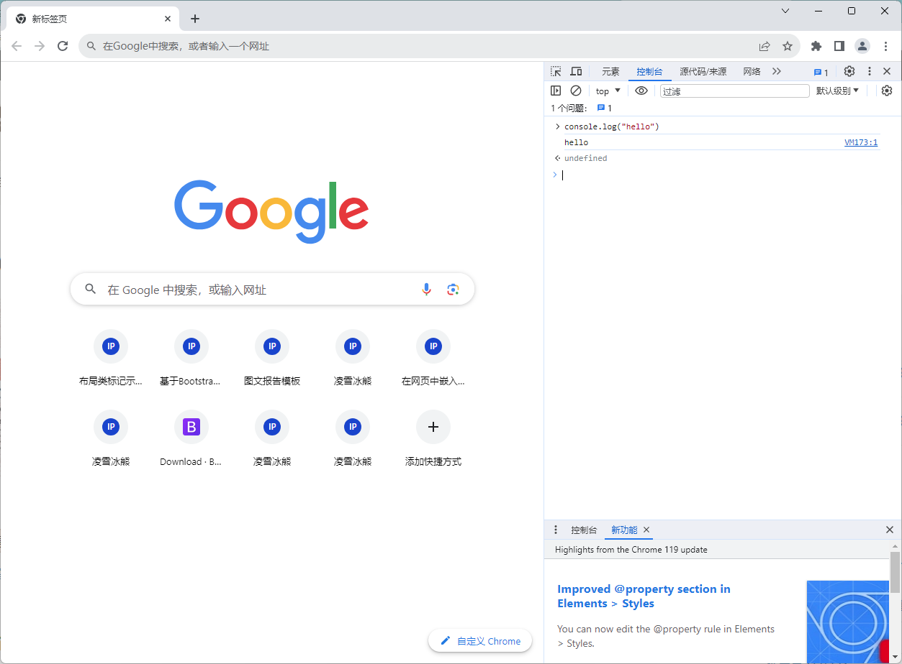

# JavaScript 学习笔记：基础篇

> 本文节选自笔者于 2021 年出版的[《JavaScript 全栈开发》](https://book.douban.com/subject/35493728/)一书。

在如今琳琅满目的编程语言中，JavaScript 是一个非常特殊的存在。如果从语言设计的角度来分析，JavaScript 应该被归类为基于原型的、解释型的高级编程语言。这也就是说，尽管 JavaScript 在语法上与 Java、C/C++ 非常相似，但在程序设计的思路上，它受 Self 和 Scheme 这类语言的影响恐怕会更多一些，因此在具体使用方式上可能更接近于后者。除此之外，JavaScript 还是一门支持多种编程范式的语言，它支持面向对象编程、指令式编程以及函数式编程，因而具有极为灵活的表达能力。

而在适用领域方面，如今的 JavaScript 也从最初的纯浏览器端脚本语言，逐步发展成了可在浏览器端、移动设备端、桌面应用端以及服务器端通用的强大编程语言。正是由于这门语言具有如此的使用深度和广度，以及在语法、设计理念上的复杂度，使得笔者认为在具体学习该语言之前，需要先用一点篇幅系统地介绍一下它的概况。

## 语言概况简介

如果仔细观察一下如今在世界范围内最受欢迎的那些 Web 应用程序，譬如 Twitter、Facebook 、YouTube、bilibili、新浪微博、淘宝等，就会发现它们能获得如此大的成功，主要是因为它们首先在 Web 浏览器端实现了与桌面应用相类似的人机交互体验，然后又在移动端也实现了同样良好的用户体验。但众所周知的是，在过去相当长的一段时间里，我们所知道的 Web 站点都只不过是一组依靠超链接简单串联在一起的 HTML 文档而已。这些文档既无数据处理能力，也无法响应用户的操作，简单到甚至都不能被称之为“程序”，充其量不过是一本被放在互联网上供人浏览的“书”罢了。大概正是因为如此，如今用来阅读 Web 页面的这个工具才会被叫做“浏览器”吧。然而，随着 Web 站点的业务需求与日俱增（例如电子商务、线上交友、视频分享等），开发者们越来越希望自己所创建的 Web 站点能具有更强大的数据交互功能，并能即时响应用户的操作。于是，JavaScript 应运而生了。

### 发展历程

当然，罗马不是一天建成的，JavaScript 这门语言也不是生来就如此强大的，设置它最初的设计目标只是想在 Web 浏览器中运行一些嵌入式脚本而已。JavaScript 的历史开始于 1995 年，当时世界上最成功的 Web 浏览器提供商 —— 网景公司聘请了一个名叫布兰登·艾克（Brendan Elch）的人，希望他研发一个能与 Java 语言搭配使用，语法上也与其相似的浏览器端脚本语言。后者也没有辜负网景公司的重托，本着速战速决的态度，仅用了十天就完成了该语言的原型设计，并在 Netscape Navigator 2.0 的 Beta 版中发布了它，当时这门语言的名称还是 LiveScript。等到同年的 12 月，网景公司在 Netscape Navigator 2.0 Beta 3 版发布时又将它重新名为 JavaScript，相传这样做的目的主要是想让这门新生的编程语言蹭一下 Java 的“热度”，相信他们当时可能也没有想到，这个名字反而在日后成为了大众对该语言的诸多误解之一，因为在事实上，Java 和 JavaScript 之间就像印度和印度尼西亚一样，并没有任何从属关系。

之后的事情大家就都耳熟能详了，网景公司凭借着 JavaScript 在 Web 浏览器市场上大获成功，这最终引起了微软公司的注意。为了与之竞争，微软公司随后在 Internet Explorer 3.0 浏览器上提供了自家的 JavaScript 实现，即 JScript。如果这能带来良性竞争，倒也不失为一件好事，但让人非常遗憾的是，当时微软公司在自己的版本中加入了很多 Internet Explorer（IE） 浏览器的专属特性。这些举措让不少基于 IE 浏览器设计的 Web 页面无法在非 IE 的浏览器中正常显示，结果就导致了它与网景公司之间的竞争，最终引燃了一场非常惨烈，且影响深远的浏览器大战（时间大约是在 1996 年到 2001 年间）。站在今天的角度回顾那段历史，我们会发现那场大战不只开启了开源运动的时代，也让 JavaScript 这门语言的标准化问题被提上了议事议程。

1996 年 11 月，为了反制微软的恶性竞争，同时也是为了使 JavaScript 语言的实现趋于标准化，网景公司正式向 ECMA （欧洲计算机制造商协会）提交语言标准。然后在次年的 6 月，ECMA 就以当下的 JavaScript 语言实现为基础制定了 ECMA-262 标准规范。自此之后，JavaScript 核心部分的实现也被称为 ECMAScript。截止到 2019 年 5 月，ECMA 一共更新了以下 9 个版本的标准规范：

| 版本 | 发表日期 | 相关说明 |
| ---- | -------- | -------- |
| 1    | 1997 年 6 月 | 随着第 1 版标准规范的发布，JavaScript 语言进入了标准化的时代。 |
| 2    | 1998 年 6 月 | 这一版修正了语言的编码格式，使其形式与 ISO/IEC16262 国际标准一致。 |
| 3    | 1999 年 12 月 | 这一版增加了新的控制指令、异常处理以及功能强大的正则表达式，优化了词法作用域链、错误定义，数据输出格式等特性。 |
| 4    | 2008 年 7 月（放弃） | 由于草案的目标过于激进，相关各方对于标准的方案出现了严重分歧，争论过于激烈，ECMA 最终决议放弃发布第 4 版的标准规范。 |
| 5    | 2009 年 12 月 | 这一版新增了“严格模式（strict mode）”，提供更彻底的错误检查，以避免结构出错。澄清了许多第 3 版标准中的模糊之处，并适应了与规范不一致的真实世界实现的行为。除此之外，这一版的 ECMAScript 中还增加了部分新的功能，譬如：getters 及 setters，支持 JSON 的解析和序列化等。 |
| 5.1  | 2011 年 6 月 | ECMAScript 的 5.1 版所做的修改主要为了与国际标准 ISO/IEC 16262:2011 保持一致。 |
| 6    | 2015 年 6 月 | ECMAScript 2015（ES2015），这一版最早被称作是 ECMAScript 6（ES6），这一版本的 ECMAScript 新增了类和模块的语法，以及包括迭代器，Python 风格的生成器和生成器表达式，箭头函数，二进制数据，静态类型数组，集合（maps，sets 和 weak maps），promise，reflection 和 proxies 在内的其他特性。 |
| 7    | 2016 年 6 月 | 即 ECMAScript 2016（ES2016），这一版小幅度地新增了一些新的语言特性。 |
| 8    | 2017 年 6 月 | 即 ECMAScript 2017（ES2017），这一版小幅度地新增了一些新的语言特性。 |
| 9    | 2018 年 6 月 | 即 ECMAScript 2018（ES2018），这一版新增了异步循环、生成器、新的正则表达式特性和 rest/spread 语法。 |

与所有编程语言的标准化工作一样，标准规范的制定与实际生产过程中的实现或多或少还是会存在着一些落差。目前市场上所使用的 ECMAScript 基本以 ES5、ES6 为主，下面我们就再通过一张表格来了解一下目前主流的 JavaScript 脚本引擎对这些不同版本标准规范的兼容性：

| 脚本引擎              | 代表性浏览器          | ES5  | ES6  | ES7  | ES7之后 |
| --------------------- | --------------------- | ---- | ---- | ---- | -------- |
| Chakra                | Microsoft Edge 18     | 100% | 96%  | 100% | 58%      |
| SpiderMonkey          | Firefox 63            | 100% | 98%  | 100% | 78%      |
| Chrome V8             | Google Chrome 70      | 100% | 98%  | 100% | 100%     |
| JavaScriptCore（Nitro） | Safari 12             | 99%  | 99%  | 100% | 90%      |

希望这个Markdown表格对你有帮助！如果你还有其他问题，请随时提问。
正是基于这样的现实，本书的内容也将会主要会以 ES5/ES6 为标准来展开。这样做既有助于读者理解 JavaScript 发展至今所形成的设计理念与编程思想，也有助于这门语言的初学者们快速上手并实验本书中所呈现的示例，而不必因为相关执行环境对标准的兼容度而发愁。

### 组成与特性

正如我们之前所说，JavaScript 最初只是一门依附于 Web 浏览器的脚本语言，但随着 Node.js 运行环境的出现，它如今已经发展成了横跨 Web 开发领域的前后端、移动设备端以及桌面应用端的全能型编程语言。所以，当我们讨论 JavaScript 这门语言的时候，必须要了解该语言除了核心部分的 ECMAScript 标准之外，还包含了其所在的宿主环境。

譬如，当我们讨论基于 Web 浏览器的 JavaScript 的时候，就应该知道这时候的讨论内容除了 ECMAScript 标准所规定的语法和基本对象之外，通常还会涉及到用于处理 Web 页面内容的文档对象模型（简称 DOM），和用于处理 Web 浏览器事务的浏览器对象模型（简称 BOM）。但到了 Node.js 运行环境中，DOM 和 BOM 就不存在了，这时候，我们需要关心的就是 Node.js 所提供的核心模块，以及各种特定用途的第三方模块了。

总而言之，JavaScript 这个术语所代表的已经不只是 ECMAScript 标准所规范的一门脚本语言了，它还会涉及到这门语言所在的宿主环境与应用框架，在之后学习 JavaScript 的过程中，我们会越来越意识到这一点的重要性，这种意识将有助于大家理解 JavaScript 在 Web 应用的前后端开发中扮演的不同角色，而不至于会产生混淆。

当然，我们在这里所说的“全能型编程语言”仅仅指的是 JavaScript 适用的领域很广，并非是认为可以用这门语言来解决所有的编程问题。JavaScript 自诞生以来一以贯之的设计理念让这门语言具备了一些与众不同的特性，这些特性基本上决定了它的编程思想以及专长的领域。下面，我们先来初步罗列一下这些特性：

- **动态化类型**：和大多数脚本语言一样，JavaScript 中的数据类型是直接取决于变量中的“值”的，变量本身没有数据类型上的约束，这是它们与编译型语言最大的区别之一。也就是说，JavaScript 中的同一个变量可以存储不同类型的值，例如，如果我们在 JavaScript 的代码中定义了一个名为`x`的变量，`x`的值是可以初始值为数字，然后在执行过程中被重新赋值为字符串的，JavaScript 的宿主环境会负责自动识别变量的类型。
- **多范式编程**：JavaScript 虽然在语法上与 Java、C/C++ 非常类似（例如 if-else、switch 条件语句、while、for 循环语句等），但在内在的设计哲学上，它则更接近于 Self 和 Scheme 这一类语言。也就是说，它既支持面向对象编程，也支持指令式编程和函数式编程，因而具有极为灵活的表达能力。
- **单线程执行**：由于最初脱胎于 Web 浏览器的关系，JavaScript 社区一直习惯采用单一线程的执行模式（尽管如今有了支持多线程的 Worker 组件），这一习惯即使到了 Node.js 运行环境中也基本如此。采用单一线程的最大好处是不用像多线程编程那样处理很容易产生 bug 的同步问题，这就从根本上杜绝了死锁问题，也避免了线程上下文交换所带来的性能上的开销。当然了，单一线程的执行方式也有它自身的弱点，譬如，它无法充分发挥多核处理器的性能、一个错误就会导致整个程序崩溃，以及执行大量计算时会因长期占用处理器而影响其他异步 I/O 的执行。
- **事件驱动**：在 Web 开发领域，JavaScript 之所以能在浏览器端扮演越来越重要的角色，很大程度上就是得益于其具有与桌面应用相似的事件驱动模型。当然，这种编程模型虽然具有轻量级、松耦合等优势，但在多个异步任务的场景下，由于程序中的各个事件是彼此独立的，它们之间的协作就成为了一个需要我们费心解决的问题。
- **异步编程**：在目前流行的 Vue、React 等 JavaScript 前端框架以及 Node.js 运行环境提供的接口中，我们都可以很容易地观察到，其大部分操作都是以异步调用的方式来进行的，而这些异步调用往往都会以回调函数的形式存在，这已经成为了使用 JavaScript 编程的一大特色。当然，虽然大家都认为回调函数是执行异步调用并接收其返回数据的最佳方式，但这种方式也会导致代码的编写顺序与其具体执行顺序的不一致，对于很多习惯同步思路编程的人来说，阅读这样的代码会是一个不小的挑战。另外在流程控制方面，也会由于程序中穿插了各种异步方法和回调函数，让代码在可读性上也远没有常规的同步方式那么一目了然，这也会给程序的调试和维护工作带来一定的麻烦。

### 适用领域

正如之前所说，如果想判断一门编程语言是否适用于某个领域，很大程度就要去分析该领域是否能发挥出语言的特性优势。既然我们已经对 JavaScript 的语言特性有了一定的了解，接下来就可以对这门语言的适用领域做一些分析了。这些分析将有助于初学者们明确 JavaScript 适合用来解决什么问题，不适合用来解决什么问题，以便厘清自己的学习需求和努力方向。现在，让我们先来罗列一下适合用 JavaScript 来解决的问题领域 ：

- **Web 浏览器端的应用**：JavaScript 在 Web 浏览器端的优势是最显而易见，且无可争议的，毕竟这门语言最初就是为解决这一领域的问题而设计的。正是由于 JavaScript 赋予了 Web 页面在浏览器端强大的用户交互能力，我们才迎来了电子商务、云端办公、社交网络等各路 Web 应用蓬勃发展的 Web 2.0 时代。
- **轻量级的服务器应用**：Node.js 运行环境的出现让 JavaScript 的适用领域得以扩展到了 Web 浏览器之外，其中很大的一块就是服务器端的应用。与 ASP、PHP 这些传统的服务器端脚本相比，JavaScript 支持事件驱动、异步编程的特性使它在实现轻量级数据密集型的服务器应用方面享有了一些高性能、高负载的优势。当然在另一方面，单线程执行和非阻塞 I/O 的特性也让该语言的能力在资源利用率和安全性方面受到了一些限制，使其不适合被用来实现需要大规模并行计算，或对数据安全有相当要求的应用。
- **轻量级的桌面应用**：Electron 框架的出现也让我们可以用 JavaScript 来实现一些适用于事件驱动、异步编程、非阻塞型 I/O 等特性的轻量级桌面应用，譬如目前流行的 VSCode、Atom 等代码编辑器都是基于这一框架的 JavaScript 应用。但同样是由于其单线程执行的特性使 JavaScript 无法充分利用多核处理器的计算资源，因而也不适合用来实现需要大规模并行计算的桌面应用。
- **富媒体式的应用**：在 HTML5 出现之前，市面上主要用于创作富媒体的应用程序（如 Flash）大多采用的都是 ActionScript 脚本，由于后者也是一种基于 ECMAScript 标准的脚本语言，所以，也可被视为是 JavaScript 的一种应用。当然，目前这种形式的应用正在逐渐被人遗忘，毕竟 HTML5 为我们提供了更好的选择。

除此之外，JavaScript 有时候还会被用来实现一些 Web 浏览器的扩展与插件、移动端的一些应用，甚至是一些用于系统管理的命令行脚本。总而言之，我们希望再三强调的是，虽然目前 JavaScript 已经发展成了一门无处不在的全能型编程语言，但还是得注意语言特性的发挥，能发挥出特性的优势才是它真正适用的领域，反之，不分场合地强行使用这门语言可能只会让我们弄巧成拙、事倍功半。

## 学习环境的搭建

在笔者个人看来，想要学好一门语言，无论是英语、汉语这样的人类语言还是 C/C++、Java、JavaScript 这样的编程语言，最好的办法就是尽可能地在实践中使用它们，在实际表达需求的驱动下模仿、试错并总结使用经验。所以在这本书中，我们并不打算提供任何可供下载的、并可直接复制/粘贴的代码。我们希望读者“自己动手”去模仿本书中提供的示例，亲手将自己想要执行的代码输入到计算机中，观察它们是如何工作的。然后，试着修改它们，并验证其结果是否符合预期。如果符合预期，就总结当下的经验，如果不符合预期，则去思考应该做哪些调整来令其符合预期。如此周而复始，才能让学习效果事半功倍。

当然，工欲善其事必先利其器，在进入具体的学习任务之前，我们需要先将 JavaScript 的执行环境搭建起来。众所周知，JavaScript 的执行环境主要分为 Web 浏览器环境和 Node.js 运行环境两种。目前，大部分开发人员都会将 Google Chrome 或 Mozilla Firefox 设为自己的默认 Web 浏览器，它们本身都自带了一款有非常不错的 JavaScript 执行/调试环境。其中，对于 Google Chrome 浏览器，我们只需在[该浏览器的官方下载页面](https://www.google.com/intl/zh-CN/chrome/)中下载并安装它，然后其主菜单中依次单击「更多工具」→「开发者工具」，然后在弹出的窗口单击「Console」选项卡，就可以看到如下图所示的 JavaScript 执行/调试环境了：

Mozilla Firefox 则是另一款可扩展的浏览器，在 Windows、Linux 以及 MacOS 这些主流操作系统上都有相应的版本，读者可根据自身所在的操作系统到[Firefox 浏览器的官方下载页面](http://www.mozilla.com/firefox/)中去下载并安装它。安装完成之后，我们可以在任何网页下按 F12 键或在菜单栏中依次单击「工具」→「Web开发者」→「Web控制台」，就可以看到如下图所示的 JavaScript 执行/调试环境了：

关于在浏览器中如何具体执行/调试 JavaScript 脚本，我们将会在本笔记的第二部分中具体讨论。在这里，读者暂时只需知道如何搭建并启动这个执行/调试环境即可。当然了，在笔者个人看来，如果不考虑 Web 浏览器特有的 BOM 和 DOM 组件，单纯只是学习 ECMAScript 的话，Node.js 应该被优先考虑，因为它可以让我们像使用 Shell、Ruby 或 Python 脚本一样直接在命令行终端中执行 JavaScript 指令和脚本文件，某种程度上更便于我们在初期的学习过程中随时查看代码的执行结果。

> 关于 Node.js 的安装与使用，读者可参考笔者笔记库中的《[[Node.js 学习笔记]]》一文。

## 基本语法学习

## 程序库的使用
