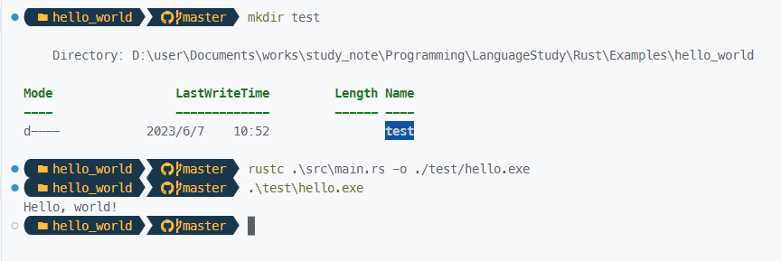

# Rust 学习笔记：快速上手篇

根据之前在《[[Rust 语言的学习路线图]]》一文中的规划，这篇学习笔记将用于记录本人在快速上手 Rust 编程语言时所记录的学习心得与代码实例。为此，我会在[本人的笔记库项目](https://github.com/owlman/study_note)的`Programming/LanguageStudy/Rust/`目录下创建以下两个子目录：

- `StudyNotes`目录：用于存放 Markdown 格式的笔记。
- `examples`目录：则用于存放笔记中所编写的代码实例。

## 开发环境配置

由于 Rust 的开发环境是基于 C/C++ 编译工具来构建的，这意味着在安装语言环境之前，我们的计算机上至少需要先安装一个 C/C++ 编译工具。换句话说，如果该计算机上使用的是类 UNIX 系统，它就需要先安装 GCC 或 clang。如果是 macOS 系统，则就需要先安装 Xcode。如果是 Windows 系统，则需要先安装 MinGW 之类的 C/C++ 编译工具。

### 安装开发工具

到目前为止，Rust 语言的开发工具大体上都是通过自动化脚本的形式来安装的。所以在确定安装了 C/C++ 编译工具之后，接下来要做的就是根据自己所在的操作系统来下载并执行用于安装 Rust 语言开发工具的脚本文件了。

- 如果想要在 Windows 系统下学习 Rust 语言，我们只需在搜索引擎中搜索“rust”关键字或直接在 Web 浏览器的地址栏中输入`https://www.rust-lang.org/`这个 URL 即可进入到 Rust 项目的官方网站，然后通过点击首页中的“install”链接，就会看到如下页面：

  

  在该页面中，我们可以根据自己所在的平台来下载 32 位或 64 位版本的安装脚本（通常是一个名为`rustup-init.exe`的二进制文件）。待下载完成之后，我们就可以双击执行该脚本文件，并遵循屏幕上的指示来安装（对于初学者，只需一路选择默认选项即可）。

- 如果想在类 UNIX 的系统环境（包括 WSL 环境)下学习 Rust 语言，我们只需直接在 Bash 之类的终端环境中执行下面的 Shell 代码，并遵循终端返回的指示信息来安装（对于初学者，只需一路选择默认选项即可）。

  ```bash
  # 可选步骤：设置国内下载镜像
  echo "export RUSTUP_DIST_SERVER=https://mirrors.ustc.edu.cn/rust-static" >> ~/.bashrc
  echo "export RUSTUP_UPDATE_ROOT=https://mirrors.ustc.edu.cn/rust-static/rustup" >> ~/.bashrc
  source .bashrc

  # 第一步：下载并执行安装脚本
  curl --proto '=https' --tlsv1.2 -sSf https://sh.rustup.rs | sh

  # 第二步：安装完毕后刷新环境变量
  source ~/.cargo/env
  ```

需要注意的是，我们在默认情况下安装的 Rust 开发环境是属于 stable 这一版本系列的。正如之前所说，这一系列的版本每六周迭代一次，在各方面的配置上都会偏向于确保生产环境的稳定性。但如果我们想使用 racer 这一类使用某些新特性的组件，就必须切换到配置方案更偏向于学习、研究性质的 nightly 版本。对于 Rust 开发工具的版本管理操作，我们通常需要用到 rustup 这一命令行工具。下面来示范一下该工具的具体使用方式。

```bash
# rustup install <版本号> 或 <版本系列名称>
# 如果想安装 1.68.0 版本的 Rust 语言环境，可执行命令：
rustup install 1.68.0
# 如果想安装语言环境的 nightly 系列中的最新版本，可执行命令：
rustup install nightly
# 如果想设置语言环境的默认版本，可执行命令：
rustup default nightly
# 如果想更新当前语言环境的版本，可执行命令：
rustup update
# 如果想删除当前版本的语言环境，可执行命令：
rustup self uninstall
```

待成功执行开发工具的安装操作之后，我们可通过在终端中执行`rustc -V`命令来验证安装状态。如果该命令输出了相应的版本信息，就证明 Rust 开发工具的安装和配置工作已经成功了一半了，接下来的任务是配置 Cargo 包管理器，并使用它来安装一些插件。

### 配置包管理器

在面向 Rust 语言的编程活动中，我们的项目通常是以“包”的形式来进行组织和管理的，目前 Rust 社区中共注册有 6.8 万个包，其中包括了该语言的基础库和各种第三方框架，总下载次数达到 95 亿次，下载次数较多的包涉及数值、解析器、字符解码、FFi 开发、序列化/反序列化等。关于这些包的管理与构建操作，我们通常需要用到 Cargo 这个命令行工具（这是一个内置在 Rust 开发工具中的包管理器）。下面，我们来具体介绍一下这个工具的具体方法、

如前所述，在开发 Rust 项目的过程中，我们通常需要使用 Cargo 包管理器来下载并管理当前项目所依赖的包，以及完成项目的构建工作。而 Cargo 在默认情况下链接的是`https://crates.io/`这个官方的程序仓库。由于众所周知的原因，这个服务器位于国外的官方仓库在可用性上非常容易受到各种不可抗力的影响，因此在正式使用该包管理器之前，我们最好还是先将其设置为位于国内的代理仓库。为此，读者需要将代理仓库的服务器地址写到 Cargo 的配置文件中（该配置文件就叫“config”，没有扩展名，通常情况下位于`${HOME}/.cargo/`目录中）。在这里，笔者将其具体配置如下：

```bash
[source.crates-io]
registry = "https://github.com/rust-lang/crates.io-index"
# 指定镜像
replace-with = 'sjtu'

# 清华大学
[source.tuna]
registry = "https://mirrors.tuna.tsinghua.edu.cn/git/crates.io-index.git"

# 中国科学技术大学
[source.ustc]
registry = "git://mirrors.ustc.edu.cn/crates.io-index"

# 上海交通大学
[source.sjtu]
registry = "https://mirrors.sjtug.sjtu.edu.cn/git/crates.io-index"

# rustcc 社区
[source.rustcc]
registry = "https://code.aliyun.com/rustcc/crates.io-index.git"
```

在配置完上述内容之后，我们可通过在终端中执行`cargo -V`命令来验证安装，如果该命令输出了相应的版本信息，就证明该工具已经完成了配置，并处于可用状态了。

### 配置代码编辑器

从理论的角度上来说，要想编写一个基于 Rust 语言开发的应用程序，通常只需要使用任意一款纯文本编辑器就可以了。但在具体的项目实践中，为了在工作过程中获得代码的语法高亮与智能补全等功能以提高编码体验，并能方便地使用各种强大的程序调试工具和版本控制工具，我们通常还是会选择使用一款专用的代码编辑器来编写代码。在这方面的工具选择上，笔者个人会推荐读者使用 Visual Studio Code 这一款编辑器（以下简称 VS Code 编辑器）。读者可以参考下面这篇笔记来学习这款编辑器的安装方法，以及如何将其打造成一款用于编写 Rust 应用程序的集成开发环境。

> 关联笔记：[[VS Code 编辑器的基本配置]]

除此之外，Atom 与 Sublime Text 这两款编辑器也与 VS Code 编辑器有着类似的插件生态系统和使用方式，如果读者喜欢的话，也可以使用它们来打造属于自己的项目开发工具，方法是大同小异的。

## 基本编程步骤

自《The C Programming Language》这本在程序设计领域的经典教材问世以来（中文版译为[《C 程序设计语言》](https://book.douban.com/subject/1139336/)），尝试在命令行终端环境中输出“Hello World”字样的信息已经成为了开发者们学习一门新的编程语言，或者验证该语言的开发环境是否已经完成配置的第一个演示程序。因为这样做不仅可以先让初学者对要学习的编程语言及其执行程序的方式有一个整体的印象，同时也为接下来的编程语言学习提供一个切入点。所以，现在就让我们闲话少说，正式从零开始构建一个 Rust 版的 Hello World 程序吧！

> 关联笔记：[[读《C 程序设计语言》：技术书籍的写作典范]]

### Hello World

在 Rust 官方提供的开发工具集中，Cargo 是初学者首先要学会使用的命令行工具，因为它除了是用于解决项目中依赖关系的包管理器之外，同时也是在我们开发项目时要使用的自动化构建工具（其功能类似于 Node.js 运行时环境中的 NPM）。下面，就让我们先来演示一下如何使用该工具创建并运行一个 Hello World 项目，以便初步了解开发一个 Rust 项目所要执行的基本步骤，具体如下。

1. 使用 Bash 或 Powershell 之类的命令行终端进入到之前在本篇笔记开头创建好的，计划用于存放代码示例的`examples`目录中，并执行`cargo new hello_world`命令来创建新项目。如果一切顺利，该命令的执行效果在 Powershell 中应该如下图所示。

    

   上述操作会在新建项目的根目录下自动生成一个名为`Cargo.toml`的文件，它是当前项目的配置文件，我们可以用它来配置项目的名称、版本号以及依赖包等选项，其初始内容如下。

    ```toml
    [package]
    name = "hello_world"
    version = "0.1.0"
    edition = "2021"

    # See more keys and their definitions at https://doc.rust-lang.org/cargo/reference/manifest.html

    [dependencies]
    ```

   除项目配置文件之外，上述操作也在项目根目录下自动生成了一个名叫`src`的目录，这是是用于存放项目源代码的地方，例如该目录下的`main.rs`文件，就是当前这个 Hello World 程序的源代码，其初始内容如下。

    ```rust
    //  main() 是程序的入口函数
    fn main() {
        // 调用一个用于在终端中输出一行字符串的宏
        println!("Hello, world!");
    }
    ```

    这段源代码也是我们在执行`cargo new`命令时自动生成的，其中使用`fn`关键字定义了一个`main()`函数，和大多数编程语言一样，`main()`函数是命令行界面程序的入口函数，即所有命令行界面程序的执行过程通常都会以该函数为起点。在`main()`函数中，我们调用了一个用于在命令行终端环境中输出一行字符串信息的宏：`println!()`。在 Rust 语言中，宏的名字都以`!`符号结尾，这种机制供了类似函数的功能，但没有运行时开销，与之相对的，需要付出一些代码在编译期展开的开销）。

    > 关联笔记：[[【翻译】Rust 语言中的宏：示例教程]]

2. 如果想要执行这个 Hello World 程序，我们就只需要在该项目的根目录下执行`cargo run`命令即可，该命令在 Powershell 中的执行效果如下图所示。

    

正如读者所见，上面这个 Hello World 项目的创建、编译以及演示操作都是使用 Cargo 这个自动化工具来完成的。下面，让我们来逐一介绍一下上述操作过程中所执行的命令。

- 首先是`cargo new [项目名称]`命令。该命令的职责是根据其默认的项目模板创建一个指定名称为`[项目名称]`的项目。通常情况下，该项目中会包含有一个文件名为`Cargo.toml`的项目配置文件，和一个用于存放项目源代码的`src`目录（该目录下会有一个名为`main.rs`的源码文件，其中包含的是 Hello World 程序的简单实现）。

- 接下来是`cargo run`命令。该命令其实执行的是两个操作：第一个操作是将源代码编译成可执行的二进制文件；第二个操作是在当前终端环境中执行该二进制文件，后者会输出“Hello, World”字样的信息。如果读者只想执行源代码的编译操作，也可以改为在相同的目录下执行`cargo build`命令，该命令的执行效果应如下图所示。

    

需要特别说明的是，这里执行的`Cargo build`命令也只是一个 Rust 项目的自动化构建命令，它其实也执行了两个操作：第一个操作是调用一个名为`rustc`的命令来执行编译动作，后者才是真正用于编译 Rust 源代码的编译器。第二个操作是将编译的结果保存到项目根目录下的`target/debug`目录中（如果该目录不存在，就先自动创建它）。在默认情况下，该命令编译的结果是带有调试信息的 Debug 版本，如果读者想生成体量更小的、不带调试信息的 Release 版本，就需要在执行`cargo run`或`cargo build`命令时加上`--release`参数，其在  Powershell 中的执行效果应如下图所示。


这一回，编译结果将会被保存在项目根目录下的`target/release`目录中。当然了，如果我们不想使用自动化工具来编译源代码，并自行决定编译结果的存储目录，也可以直接在命令行终端中手动调用`rustc`编译器，例如像这样。



在上述演示中，我们直接使用了`rustc`命令编译了`src/main.rs`文件中的代码，并使用`-o`参数为其指定了编译结果的文件名及其存储位置，其效果与`cargo build`命令基本系统，只是拥有了更大的自由度。虽然这两种方式都可以用于编译 Rust 项目，但通常情况下，我们会更推荐使用 Cargo 这种自动化工具来完成相关的任务。读者也将会在后面的演示项目中看到，后者在面对多文件编译的任务时能更方便地处理项目中复杂的依赖关系。

### 输入与输出

现在，读者已经初步接触了 Rust 项目的基本构建方法。接下来，为了巩固目前所学，我们可以尝试着将上面这个由 Cargo 自动生成的 Hello World 程序改造得更复杂一些，使它能根据用户输入的名字来输出相应的信息，其具体步骤如下。

1. 使用 Bash 或 Powershell 之类的命令行终端进入到之前准备好的、用于存放代码示例的`examples`目录中，并执行`cargo new input_output`命令来创建新项目。

2. 使用 VS Code 编辑器打开刚刚新建的项目，并在该项目的`src`目录下找到名为`main.rs`的源码文件，然后将其中的代码修改如下。

    ```rust
    // 引入标准库中的 I/O 模块
    use std::io::{self, Write};

    // 将相关操作封装成函数
    fn say_hello () {
        // 定义一个可变量，用于接受用户的输入
        let mut input = String::new();
        // 使用 print! 这个宏输出不带换行符的字符串信息
        print!("Please give me a name: ");
        // 刷新标准输出的缓存，以确保上面的字符串已经被输出到终端中
        io::stdout().flush().expect("output error!");
        // 使用 match 关键字匹配用户执行输入之后的状态
        //  io::stdin().read_line() 方法会从标准输入中获取到用户的输入
        match io::stdin().read_line(&mut input) {
            Ok(n) => { // 如果输入成功，执行如下代码
                println!("{} bytes read", n);
                // 定义一个不可变量，用于存储被处理后的信息
                // input.trim() 方法用于去除掉输入信息中的换行符
                let name = input.trim();
                println!("Hello, world! \nMy name is {}.", name);
            }
            Err(_) => { // 如果输入失败，执行如下代码
                println!("Input Error!");
            }
        }
    }

    fn main() {
        // 调用自定义函数
        say_hello();   
    }
    ```

3. 使用命令行终端进入到项目的根目录下并执行`cargo run`命令，然后在程序完成编译并运行之后，根据其输出的提示输入一个名字并按回车键即可，该操作过程在 Powershell 中的演示效果如下图所示。

    

下面，让我们来详细讲解一下`main.rs`文件中的源码，看看这一版的 Hello World 程序相较于之前做了哪些改动，具体如下。

1. 我们使用`use`关键字将 Rust 语言标准库中的`std::io`模块中定义的函数引入到了当前模块所在的命名空间中，以便可以调用`stdout()`和`stdin()`这两个函数来实现在命令行界面中的输入/输出（即I/O）。
2. 我们用`fn`关键字自定义了一个名为`say_hello()`的函数来专门执行与 Hello World 相关的操作，并在`main()`函数中调用它。这也是函数作为基本编程单元的功能：封装一组相关的操作以便可重复调用。
3. 在 Rust 语言中，我们使用`let`关键字来定义变量，在默认情况下变量是只读的。如果我们想定义一个可变的变量，就需要在`let`关键字后面再加上一个`mut`关键字。例如在上述代码中，`input`是一个可变的字符串类型的变量，它的值最初是一个空字符串，后来被赋予了用户输入的信息，而`name`则是一个只读变量，它在定义时被赋予了`input.trim()`这个调用返回的信息之后，值就不能再被修改了。关于这种不可变性的设计目的，我们将会留到《[[Rust 学习笔记：语法学习篇]]》中再展开具体讨论。
4. 在 Rust 语言中，标准库与第三方库都是以 crate 为单位存在，这是一种二进制格式的语言扩展包。在上述代码中，我们使用的`stdout`和`stdin`对象及其方法都是属于`std::io`这个 crate，它属于 Rust 语言标准库的一部分。关于在使用 Rust 编写应用程序时如何使用标准库以及第三方扩展库的问题，我们将会留到《[[Rust 学习笔记：扩展应用篇]]》中再展开具体讨论。
5. 在 Rust 语言中，许多对象的方法都会返回一个`Result`类型的枚举对象，该对象往往会与关键字`match` 搭配使用，组成一个用于处理运行时错误的模式匹配表达式，该表达式可以方便地根据`Result`对象的枚举值来执行不同的代码。`Result`对象的枚举值有`Ok`和`Err`两种，其中的`Ok`值表示操作成功，内部包含成功时产生的值。而`Err`值则意味着操作失败，并且包含失败的前因后果。

   除此之外，具体到`io::Result`类型的实例，它们通常都拥有`expect()`方法。当`io::Result`实例的值为`Err`时，`expect()`方法就会主动终止程序的运行，并显示被当做参数传递给该方法的字符串信息。例如在上述代码中，如果`io::stdout().flush()`方法返回的是`Err`，则可能是发生了底层操作系统错误，`expect()`方法就会在命令行终端中输出“output error!”这个字符串信息之后终止程序的运行。而如果`io::stdout().flush()`方法返回的是`Ok`，`expect()`方法就会获取到操作成功之后的值并原样返回。在上述代码中，这个值是用户输入的名字信息。

   关于`Result`类型的具体使用以及与之相关的错误处理机制，我们也会留到《[[Rust 学习笔记：语法学习篇]]》中再展开具体讨论。

现在，笔者已经对 Rust 语言的基本使用步骤做了一次鸟瞰性的概述，只要读者能掌握上述内容所涉及的知识点，就可以开始具体的语法学习了。接下来，笔者将会继续用《[[Rust 学习笔记：语法学习篇]]》、《[[Rust 学习笔记：扩展应用篇]]》、《[[Rust 学习笔记：项目实践篇]]》三篇笔记来记录后续的学习心得，敬请期待。

----
#待深入
