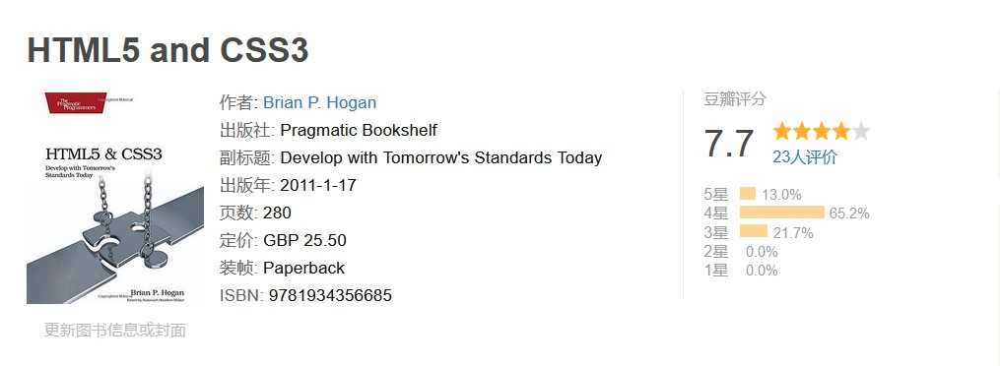
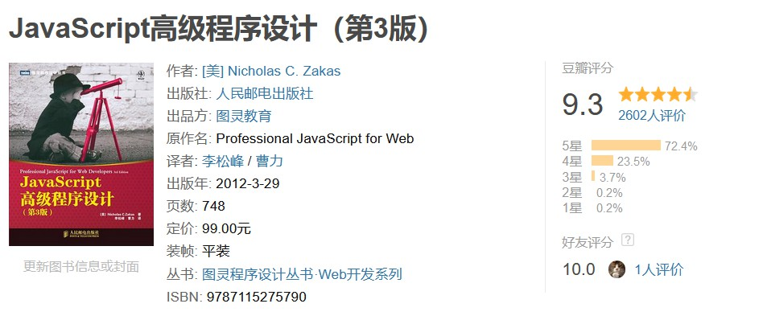
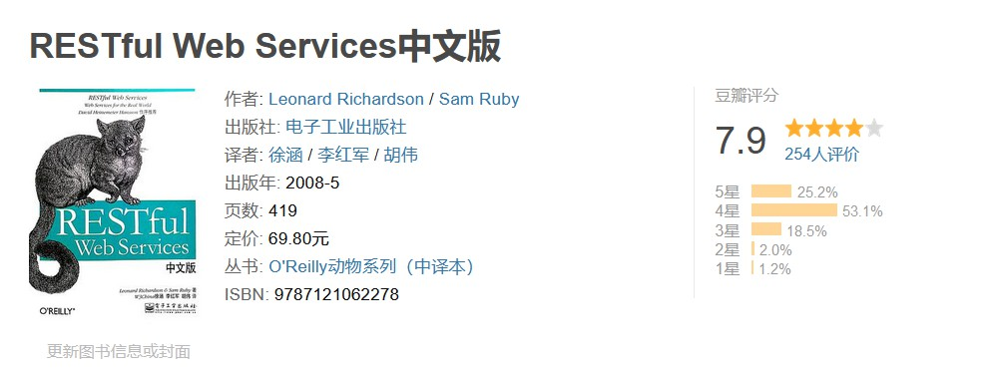
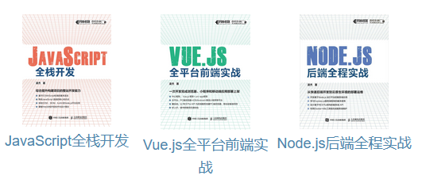

#! https://zhuanlan.zhihu.com/p/668995861
# 浏览器-服务器编程的学习路线图

从解决方案的角度上来说，我们如今在日常生活和工作中所使用的大部分网络应用程序，例如Twitter、Facebook、豆瓣、哔哩哔哩等，它们的核心部分所采用的都一种被称之为浏览器-服务器（即Browser/Server，简称B/S）的分布式应用程序架构。在这种架构之下，开发者们可以选择将应用程序中需要保障数据安全或者进行高速运算的那一部分部署在服务器上，以便享用服务器的高性能配置以及能就近维护的便利。然后基于网页浏览器来开发应用程序的用户界面，让它来执行需要与用户交互的那一部分任务。这样做既降低了应用程序部署与维护的成本，也在很大程度上减少了应用程序对用户那一侧的软硬件依赖。在这篇文章中，我们将聚焦基于这一架构的编程议题，并以推荐书目的形式来为读者规划在这一课题上的学习路线图，以供参考。

## B/S架构简介

在学习基于B/S架构的编程时，我们的首要任务就是要理清应用程序的浏览器部分与服务器部分在该架构下各自所承担的业务分工。虽然在手机、手表上都搭载了多核处理器的今天，各类型计算设备的性能事实上已经日渐趋同，浏览器与服务器之间的业务界线有时候也并非是绝对的，但从项目开发与维护的角度来说，做某种程度上的分工安排还是非常有必要的。以我个人的经验，B/S架构之下的业务分工通常是这样的：

- 浏览器部分在B/S架构下所承担的业务主要是与用户进行交互，其角色类似于银行的前台接待员，所以在术语上往往被称之为应用程序的“客户端”或“前端”。在通常情况下，应用程序的前端将负责渲染应用程序的用户操作界面、处理用户的操作、向服务器发送请求数据并接收来自服务器的响应数据、维持应用程序的运行状态，以求提供良好的用户体验。总而言之，这部分的开发与维护还将在很大程度上依赖于用户所在的软硬件环境。

- 服务器部分在 B/S架构下所承担的业务主要是数据的处理和维护，其角色类似银行金库的管理人员，所以在术语上往往被称之为应用程序的“服务端”或“后端”。在通常情况下，应用程序的后端将为用户提供只有大型计算机才具备的运算能力以及安全可靠的数据库服务，它会负责存储并处理来自应用程序客户端的请求数据，然后把响应数据返回给客户端，一般用于处理较为复杂的业务逻辑，包括执行与天体物理相关的运算任务、存储海量数据等。这部分的开发和维护通常可以不依赖于用户所在的软硬件环境。

当然，所有的事情都是一体两面的，B/S架构作为一种建构分布式应用程序的解决方案，除了享有上述优势的同时也是存在着一些劣势的。首先，由于应用程序的前后端之间是多对一的关系，这意味着应用程序的后端服务器可能会需要同时处理成千上万个前端请求，这对服务器的负载能力提出了较高的要求，因此维持后端程序的稳定性将会成为项目维护阶段的一大难题。其次，采用这种架构的应用程序在运行时也会严重依赖于用户所在的网络环境，一旦网络中的某个节点出了问题，例如发生防火墙屏蔽或域名劫持，整个程序就会立即陷入无法运行的尴尬境地。所以，开发者们在使用该架构来构建应用程序时必须要想好应对这些劣势的预先安排，例如制定服务器的负载策略、设置备用服务器或备用域名等。

## 学习路线规划

在了解了应用程序的前后端在B/S架构中各自承担的业务分工之后，我们就可以根据自己的工作需求来学习在该架构之下编程所需要学习的技能及其相关知识了。具体来说，如果想从事的是前端部分的开发工作，那么我们需要学习的就是如何基于网页浏览器技术来实现前端所要承担的业务，这其中包括网页设计、用户界面设计等方面的相关知识。而如果想从事的是后端部分的开发工作，那么我们需要学习的则是如何使用Python、Go等编程语言及其后端开发框架，并按照服务端API实现规范来开发应用程序的相关知识。下面，让我们基于上述建议来做一些具体的学习建议和书籍推荐，以供读者参考。

### 浏览器部分

如果读者想开发的是基于浏览器引擎技术的应用程序前端（包括基于Electron.js框架构建的PC/Mac 端桌面应用），那么，HTML和CSS这两门标记语言的使用方法是我们首先要学习的基础技能。其中：

- HTML是一门用于于定义文档结构的标记语言。这门语言的主要作用是将应用程序的用户界面（包括 Web 页面）描述成一个树状的数据结构，以便于网页浏览器或其他客户端框架将其解析成可被JavaScript、VBScript等编程语言直接操作的对象模型（即DOM）。目前，该语言的官方标准已经迭代到了HTML 5，该标准赋予了HTML强大的富媒体、富应用以及富内容的能力，是我们开发移动互联网应用的必要基础。
- CSS 是一门用于定义HTML/XML文档外观样式的标记语言。随着HTML/XML可用于定义一般应用程序的用户界面，CSS的作用领域也得到了相应的扩展。我们可以使用这门语言对用户界面中的图片、文本、按钮等元素进行像素级别的精确控制。目前，CSS的最新标准为 CSS3，该标准新增了圆角效果、渐变效果、图形化边界、文字阴影、透明度设置、多背景图设置、可定制字体、媒体查询、多列布局以及弹性盒模型布局等诸多更为丰富的新样式特性，有助于我们构建具有更良好用户体验的客户端界面。

在学习以上两门标记性语言时，我个人会推荐读者参考一下《HTML5 and CSS3》这本书。这本篇幅适中的教程将会帮助初学者们快速上手HTML 5和CSS 3所提供的、许多有用的新功能。例如在这本书中，我们将学会如何通过HTML 5提供的新标记来为指定内容创建更好的文档结构，为表单元素创建更好的界面，从而产生更干净、更容易阅读的代码，使人和程序都能理解。我们还会学习到如何在不使用Flash的情况下将音频、视频和矢量图嵌入到指定的页面。你会看到网络套接字、客户端存储、离线缓存和跨文档信息传递是如何减轻现代网络开发的痛苦的。除此之外，我们也会学习如何使用CSS 3来设计各种独具风格的用户界面。

> 关联笔记：[[HTML 学习笔记]] [[CSS 学习笔记]]

接下来是编程语言的部分，由于JavaScript在设计之初就是一门专用于操作 HTML/XML 文档对象的编程语言，这使得它在基于浏览器引擎技术的客户端开发领域取得了绝对优势的地位，因而自然也就成为了我们在这一领域的必修课。这门语言的主要职责是：

1. 利用该语言独有的异步操作特性来响应用户的操作，并根据这些操作向服务端发送请求及相关的数据。
2. 接收并处理来自服务端的响应数据，并根据处理的结果来渲染前端用户界面，以便将相关的信息反馈给用户。

> 关联笔记：[[JavaScript 学习笔记：基础篇]] [[JavaScript 学习笔记：进阶篇]]

目前，我们通常会以ECMAScript 5/6标准（以下简称ES5和ES6）为语言规范来使用JavaScript，尤其其中的 ES6 标准，它为这门语言新增了许多过去需要引入jQuery这样的第三方库才能使用到的API，这能帮助我们构建功能更为强大的应用程序客户端。对于该编程语言的学习，我个人会推荐读者花一点时间和耐心去阅读一下《JavaScript高级程序设计》这本书。

这本书的作者Nicholas Zakas是一位世界顶级的Web技术专家，现为雅虎公司界面呈现架构师，负责My Yahoo!和雅虎首页等大访问量站点的设计，之前也曾参与过许多世界级大公司的Web开发项目。他有足够的经验可以带领读者学习JavaScript这门语言的方方面面。当然了，这本书目前迭代到第三版，内容是基于ES5展开的。如果读者想了解ES6部分的内容，也可以去参考该作者的另一本小书：《深入理解ES6》。

在掌握了上述基本技能及其相关的基础知识之后，读者就可以根据自己要应对的具体工作场景来学习一些客户端开发框架了，学习的目的是提高我们在生产、科研条件下的工作效率。例如：

- 如果读者想开发企业级的 Web 2.0 应用的客户端，那么可以学习一下Vue.js、React.js等当下主流的前端开发框架。
  > 关联笔记：[[Vue.js 2.x 学习笔记]]
- 如果读者想将基于B/S框架的前端技术应用于PC和Mac上的桌面客户端开发，那么也可以学习一下Electron这个GUI开发框架。
  > 关联笔记：[[Electron 学习笔记]]
- 如果读者还想进一步扩展上述前端技术的使用范围，将其应用于移动端设备的客户端开发，那么也可以学习一下 uni-app、Taro 等跨平台的前端开发框架。
  > 关联笔记：[[uni-app 学习笔记]]

### 服务端部分

在B/S架构之下，应用程序的后端开发主要可分为*服务端动态页面*和*服务端API*两种解决方案，这两种方案在开发应用程序的服务端业务时会体现出截然不同的设计思维。下面，就让我们来分别介绍一下这两种不同形式的服务端业务逻辑，以便读者能了解它们各自拥有的优势与劣势，并根据自己的需要进行学习。

- **服务端动态页面**：在Web 2.0概念出现之前，我们使用PHP、ASP等构建的传统Web应用程序通常使用的都是服务端动态页面技术。这项技术最大的特点是，应用程序的服务端将会负责动态生成所有的HTML页面。也就是说，当我们使用PHP、ASP这样的编程语言编写好带有模板变量等占位符的HTML模板之后，将由应用程序的服务端来负责获取相关模板变量的值并将其填充到该模板中，以便将其动态渲染成实际可被Web浏览器解析的HTML页面。而作为应用程序的前端，网页浏览器实际上得到的只是一组静态的HTML+JavaScript+CSS源码文件。
  
  相信读者也应该或多或少地看出了动态页面这种服务端开发形式存在着一些局限性了。如果我们采用这种形式来开发基于 B/S架构的应用程序，就意味着服务端不仅要负责数据的增、删、改、查以及与之相关的大规模计算任务，还至少要负责一部分与人机交互相关的任务。这会给应用程序的项目开发与维护工作带来以下三个不利的影响。

  - 应用程序的客户都和服务端都得参与用户界面的构建，这种高耦合度的做法既不利于开发过程中的任务分工，也不利于应用程序后期的维护。
  - 由于应用程序的服务端要负责一部分的页面构建，所以用户在客户端上的每个操作可能都意味着要对服务端发出请求，并导致整个页面被重新刷新，这对于提高应用程序的用户体验是非常不利的。
  - 由于应用程序的服务端构建的是HTML页面，这就让网页浏览器成为了应用程序在客户端的唯一形式。如果想使用Android/iOS原生应用或微信小程序这样的客户端形式，那可能就要另行开发服务端实现了。

- **服务端API**：随着AJAX等Web 2.0技术，以及手机、平板等移动端设备的大量普及，业界针对上述问题提出了一种被称之为“服务端API”的全新解决方案。该方案主张将构建动态页面的任务完全交付给应用程序的客户端来执行，而服务端所要做的任务就是监听并解析客户端发来的请求，并根据解析的结果来进行数据的增、删、改、查操作及其相关的大规模计算，然后将得到的结果以某种特定的数据格式返回给客户端。到目前为止，业界流行的服务端API的实现方案主要有SOAP、XML-RPC和REST三种。总体而言，对基于服务端API来实现的应用程序来说，程序员们在开发和部署它们时通常会获得一系列明显的、相对于其他服务端解决方案的优势。在这里，我们可以简单地将这些优势归纳如下：

  - **接口统一**：这种服务形式致力于让应用程序的服务端以统一API的形式向其各种不同的客户端提供服务，这样就简化了系统架构，降低了客户端与服务端之间的耦合度，以便于程序员们在开发整个应用程序可进行模块化分工。
  - **分层系统**：这种服务形式有助于开发者们在服务端设计一个基于多台服务器的分层系统服务。这意味着，应用程序的客户端通常不需要知道自己连接的是最终的服务器，还是某台存在于资源请求路径上的某台缓存服务器。这更有利于我们在部署和维护应用程序时设置更为稳妥的服务器负载策略和其他安全性策略。
  - **便于缓存**：正是因为这种服务形式实现的是一个分层系统，所以我们在从客户端到服务端之间所经过的所有设备上都可以对一些特定的常用数据进行缓存，这种缓存可以在很大程度上提高服务端响应用户操作的速度。例如，我们可以在客户端对不经常变化的CSS样式文件进行缓存，以减少向服务端服务发送的请求数量，提升用户界面的加载速度。也可以在服务端某个节点中对经常要执行的数据库查询建立缓存，以提升其响应请求的速度。
  - **易于重构**：正是由于实现了客户端与服务端在业务逻辑上的分离，降低它们之间的耦合度，我们对服务端业务逻辑所进行的任何重构都基本上不会对客户端的实现产生影响，反之亦然。例如我们可以在用JavaScript基于Node.js运行环境编写的程序无法满足性能需求时，使用Python、Go等更适用于大规模科学运算的编程语言来重构服务端服务，这种重构不会影响到客户端的实现。

当然了，API这种服务端解决方案在具体开发过程中呈现出来的究竟是优势还是劣势，最终还得取决于开发者们的具体实现能力。例如，如果我们开发的服务端API与其客户端之间要使用HTTP这种无状态数据传输协议来进行通信，就需要明白：这样做虽然有助于减低服务器的负担，并让服务端的业务逻辑实现更为独立，但同时也意味着应用程序的服务端无法记录其客户端的运行状态，客户端必须自行利用相关机制（例如Sessions机制）来记录应用程序的运行状态，以便在必要时将运行状态通报给服务端，以减少一些不必要的响应数据，这算是在使用服务端API方案来设计应用程序时需要会设法解决一个问题。

综合上面的介绍，如果读者想要学习的是动态页面的服务端解决方案，个人会推荐从PHP这门经典的服务端脚本语言开始。在这种学习需求下，《Head First PHP & MySQL》会是一本非常值得一读的书。当然了，必须再次提醒的是，动态页面如今已经不是实现应用程序服务端的最佳方法了。

而在SOAP、XML-RPC和REST这三种当下主流的服务端API方案中，基于REST规范的解决方案相较于另外两种更为简洁，因此如今越来越多应用程序的服务端 API 都采用了该规范来进行设计和实现，例如，亚马逊就基于REST规范设计了其用于图书查询的Web服务，雅虎提供的Web服务也是基于REST规范来设计的。如果学习需求是基于REST规范的服务端解决方案，个人会推荐读者参考一下《RESTful Web Services》这本书。

这里需要特别说明的是，虽然上面这本书是使用Rudy为编程语言来讲解如何实现RESTful API的，但REST规范本身只是一种服务端API的设计方案，它与我们具体使用的编程语言是无关的，即使是用PHP这类传统的服务端脚本语言也是可以构建符合REST规范的服务端API的，只不过需要改变一下设计思路，记住现在服务端要响应给客户端的内容通常已经不再是由服务端代码在运行时动态构建的HTML页面，而是JSON、XML等格式的数据资源了。

> 关联笔记：[[RESTful API 设计规范]]  [[Node.js 学习笔记]]

## 结束语：如果想你成为全栈工程师

在文章的最后，让我们来讨论一下全栈开发的问题，并也请允许我为自己的拙作：《JavaScript 全栈开发》系列做个广告。因为这本书的起心动念就来自于某年某月某日在Facebook上看到的一张名为“如何成为全栈工程师”的图。该图中堆叠着一摞足足半人多高的书籍，其中除了最基本的、与HTML、CSS相关的书籍之外，还有介绍客户端编程的JavaScript、Swift等语言及其框架的书若干本，在服务器端使用的语言（例如Java、Go等）及其框架的书又是若干本，最后再加上关于MySQL、SQLite3这类数据库的以及关于Apache服务器的书。这样总体看下来，全栈开发的初学者要读的各类书籍大概率会累计到十几本以上，想一想都令人生畏。问题是，这真的是必要的吗？

诚然，时下的全栈工程师确实是一个热门且要求不低的求职方向。该方向要求程序员们必须了解一个互联网应用从客户端到服务端之间所涉及到的全部技术栈，因而被称之为“全栈”，但需要提醒读者的一件事是：这里所要求的“全栈”并不等同于“全知全能”。即在大多数情况下，全栈工程师在职场中的优势并不在于他一人能干完所有的事，这在现代互联网应用项目的开发中几乎是不可能的，做几倍的 996 工作量都不现实。毕竟，这类项目的开发通常是一个非常复杂的系统工程，需要团队合作。而学习过软件工程理论读者一定都知道，项目的规模越大，沟通成本就越高，全栈工程师真正的优势是他的技术视野。这其中的道理很简单，大型开发团队的沟通成本是非常巨大的，如果隶属于不同技术栈的程序员彼此不能理解对方的技术问题，各说各话，那么他们之间就一定会起冲突的。而如果团队之中存在着几位全栈工程师，这个问题就可以得到很好的解决，因为他们懂产品、懂设计、懂前端、懂后端，自然彼此都能听得懂。而且，全面的技术视野也有助于做出更加全面客观的技术架构和决策，从而对所在组织产生很大的正面影响。

所以，要想成为全栈工程师，最重要的任务是要扩展自己了解的技术栈，而不是去成为一个事必躬亲的全能超人。至少在我个人看来，在Node.js运行平台成功地将前端领域的王者 —— JavaScript语言扩展到后端之后，那张图中（或本文之前）所罗列的书中至少有一半与编程语言相关的问题完全是可以用一本全面介绍JavaScript的书来解决的。为了验证这一设想，我尝试着开始了之后长达十个月的创作。从2019年9 月16日动笔，到2020年7月22日完成初稿，我自己也没想到写这样一本小书竟然花了近一年的时间，以及需要花费我如此之多的体力，背伤如影随形，汗水日日如雨，实现理想之路从来不会畅行无阻，今日回首，一切依然都是值得的。

> 关联笔记：[[《JavaScript 全栈开发》出版感言]]  [[《Node.js 后端全程实战》自序]]

----
#已完成
