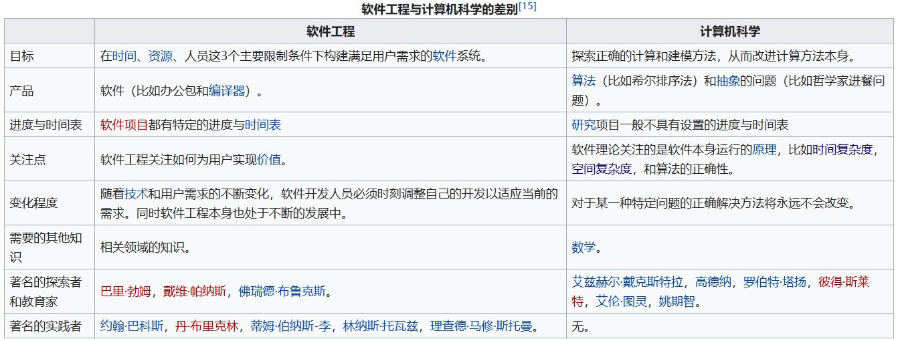

# 关于软件工程及其书籍推荐

提起“软件工程（Software Engineering）”这个词，人们想问的第一个问题通常会是：它在大学的专业设置上到底与“计算机科学（Computer science）”[^1]是什么关系？它们之间有什么区别？总体而言，计算机科学专业更倾向于培养精通计算机基础理论，以及相关技术使用方法的科研人员和教师队伍。而软件工程专业所培养的则更多地属于专职从事软件开发、测试、维护和软件项目管理的专门人才，它们之间的区别具体如下表格所示：

那么具体到软件开发这项工作本身，它到底是科研性质更多，还是工程性质更多呢？这一直以来都是业界争论不休的问题。因为在事实上，这项工作是两种性质都兼而有之的，但这并不意味着它们可以被互相混淆。大体上，我们可以认为软件工程相对于计算机科学和信息科学的关系，就如同传统意义上的工程学之于物理和化学的关系。按照 Wikipedia 提供的统计数据，美国大约有 40% 的软件工程师具有计算机科学专业的学位。估计这个比例在世界其他地方也基本大同小异。基本上，这些工程师们并不一定会需要掌握计算机科学领域的所有知识，但大概率每天都会使用到软件工程方面的知识。因此在这篇文章中，我们将聚焦于软件工程领域的讨论，并以推荐书目的形式来为读者规划在这一课题上的学习路线图，以供参考。

## 软件工程简介

软件工程作为一个学术概念，最早的起因是 1970-1990 这二十年间爆发的“软件危机”。在那段时间里，有一系列的软件项目因开发时间、成本开支等工程管理要素超出了预先的规划，从而导致了财产流失、人员伤亡等具有严重后果的悲惨结局。其中，最广为人知的案例是 Therac-25 事件。

> Therac-25 事件指的是在 1985 年到 1987 年之间发生的至少六起与一型名为 Therac-25 的放射性治疗仪器相关的医疗事故。事故原因就是该仪器在软件设计上存在着一种被称之为“竞争危害”[^2]的致命瑕疵，它会让病患接受到比正常剂量高一百倍的辐射，造成毫无必要的死亡或重伤。而归根究底，这些设计瑕疵就是源自于软件在工程质量管理上的缺失。

为了解决人们在软件开发时所遭遇到的问题，北大西洋公约组织在 1968 年举办了首次以软件的工程化为主题的学术会议。他们在该会议中提出了“软件开发应该是类似工程的活动”的主张，并正式创造了“软件工程”这个概念，以便用来界定实现软件的工程化生产所需要的相关知识。

软件工程这一概念自 1968 年正式提出至今，这段时间累积了大量的研究成果，广泛地进行大量的技术实践，借由学术界和产业界的共同努力，软件工程正逐渐发展成为一门专业学科。

## 学习路线规划

## 结束语

--- 以下为待整理的资料 ---

- 来自Wikipedia

软件工程（英语：software engineering[1]），是软件开发领域里对工程方法的系统应用。

1968年秋季，NATO（北约）的科技委员会召集了近50名一流的编程人员、计算机科学家和工业界巨头，讨论和制定摆脱“软件危机”的对策。在那次会议上第一次提出了软件工程（software engineering）这个概念，研究和应用如何以系统性的、规范化的、可定量的过程化方法去开发和维护软件，以及如何把经过时间考验而证明正确的管理技术和当前能够得到的最好的技术方法结合起来的学科。它涉及到程序设计语言、数据库、软件开发工具、系统平台、标准、设计模式等方面。其后的几十年里，各种有关软件工程的技术、思想、方法和概念不断被提出，软件工程逐步发展为一门独立的科学。

1993年，电气电子工程师学会（IEEE）给出了一个更加综合的定义："将系统化的、规范的、可度量的方法用于软件的开发、运行和维护的过程，即将工程化应用于软件开发中"。此后，IEEE多次给出软件工程的定义。

在现代社会中，软件应用于多个方面。典型的软件比如有电子邮件、嵌入式系统、人机界面、办公包、操作系统、网页、编译器、数据库、游戏等。同时，各个行业几乎都有计算机软件的应用，比如工业、农业、银行、航空、政府部门等。这些应用促进了经济和社会的发展，提高人们的工作效率，同时提升了生活质量。

软件工程师是对应用软件创造软件的人们的统称，软件工程师按照所处的领域不同可以分为系统分析师、系统架构师、前端和后端工程师、程序员、测试工程师、用户界面设计师等等。各种软件工程师人们俗称程序员。

名称由来与定义

软件工程包括两种构面：软件开发技术和软件项目管理。[1]

    软件开发技术：软件开发方法学、软件工具和软件工程环境。[1]
    软件项目管理：软件度量、项目估算、进度控制、人员组织、配置管理、项目项目等。[1]

定义

    关于软件工程的定义，在GB/T11457-2006《消息技术 软件工程术语》中将其定义为"应用计算机科学理论和技术以及工程管理原则和方法，按预算和进度，实现满足用户要求的软件产品的定义、开发、和维护的工程或进行研究的学科"。

包括：

    创立与使用健全的工程原则，以便经济地获得可靠且高效率的软件。[4]
    应用系统化，遵从原则，可被计量的方法来发展、操作及维护软件；也就是把工程应用到软件上。[5]
    与开发、管理及更新软件产品有关的理论、方法及工具。[6]
    一种知识或学科，目标是生产质量良好、准时交货、符合预算，并满足用户所需的软件。[7]
    实际应用科学知识在设计、建构计算机程序，与相伴而来所产生的文件，以及后续的操作和维护上。[8]
    使用与系统化生产和维护软件产品有关之技术与管理的知识，使软件开发与修改可在有限的时间与费用下进行。[9]
    建造由工程师团队所开发之大型软件系统有关的知识学科。[10]
    对软件分析、设计、实施及维护的一种系统化方法。[11]
    系统化地应用工具和技术于开发以计算机为主的应用。[12]
    软件工程是关于设计和开发优质软件。[13]

软件工程的核心知识（SWEBOK）

　ACM与IEEE Computer Society联合修定的SWEBOK[14]（Software Engineering Body of Knowledge）提到，软件工程领域中的核心知识包括：

    软件需求（Software requirements）
    软件设计（Software design）
    软件建构（Software construction）
    软件测试（Software test）
    软件维护与更新（Software maintenance）
    软件构型管理（Software Configuration Management, SCM）
    软件工程管理（Software Engineering Management）
    软件开发过程（Software Development Process）
    软件工程工具与方法（Software Engineering Tools and methods）
    软件质量（Software Quality）

- 主条目：没有银弹和人月神话

在1986年，IBM大型机之父佛瑞德·布鲁克斯发表了他的著名论文《没有银弹》，在这篇著名的论文中他断言：“在10年内无法找到解决软件危机的灵丹妙药”。从软件危机被提出以来。人们一直在查找解决它的方法。于是一系列的方法被提出并且加以应用。比如结构化程序设计，面向对象的开发，CMM，UML等等。佛瑞德·布鲁克斯著名作品还有《人月神话》。

布鲁克斯在《人月神话：软件项目管理之道（The Mythical Man-Month）》提到，将没有灵丹妙药（silver bullet）可以一蹴而就，开发软件的困难是内生的，只能渐进式的改善。整体环境没有改变以前，唯一可能的解，是依靠人的素质，培养优秀的工程师。[18]
软件工程与计算机程序设计

软件工程存在于各种应用中，存在于软件开发的各个方面。而程序设计通常包含了程序设计和编码的反复迭代的过程，它是软件开发的一个阶段。

软件工程力图对软件项目的各个方面作出指导，从软件的可行性分析直到软件完成以后的维护工作。软件工程认为软件开发与各种市场活动密切相关。比如软件的销售，用户培训，与之相关的软件和硬件安装等。软件工程的方法学认为一个独立的程序员不应当脱离团队而进行开发，同时程序的编写不能够脱离软件的需求，设计，以及客户的利益。

软件工程的发展是计算机程序设计工业化的体现。
软件开发过程
主条目：软件开发过程

软件开发过程是随着开发技术的演化而随之改进的。从早期的瀑布式（Waterfall）的开发模型到后来出现的螺旋式的迭代（Spiral）开发，以致最近开始兴起的敏捷软件开发（Agile），他们展示出了在不同的时代软件产业对于开发过程的不同的认识，以及对于不同类型项目的理解方法。

注意区分软件开发过程和软件过程改进之间的重要区别。诸如像ISO 15504, ISO 9000, CMM, CMMI这样的名词阐述的是一些软件过程改进框架，他们提供了一系列的标准和策略来指导软件组织如何提升软件开发过程的质量、软件组织的能力，而不是给出具体的开发过程的定义。

方法学

软件工程的方法有很多方面的意义。包括项目管理，分析，设计，程序的编写，测试和质量控制。

软件设计方法可以区别为重量级的方法和轻量级的方法。重量级的方法中产生大量的正式文档。

著名的重量级开发方法包括ISO 9000，CMM，和统一软件开发过程（RUP）。

轻量级的开发过程没有对大量正式文档的要求。著名的轻量级开发方法包括极限编程（XP）和敏捷过程（Agile Processes）。

根据《新方法学》这篇文章的说法，重量级方法呈现的是一种“防御型”的姿态。在应用“重量级方法”的软件组织中，由于软件项目经理不参与或者很少参与程序设计，无法从细节上把握项目进度，因而会对项目产生“恐惧感”，不得不要求程序员不断撰写很多“软件开发文档”。而轻量级方法则呈现“进攻型”的姿态，这一点从XP方法特别强调的四个准则—“沟通、简单、反馈和勇气”上有所体现。目前有一些人认为，“重量级方法”适合于大型的软件团队（数十人以上）使用，而“轻量级方法”适合小型的软件团队（几人、十几人）使用。当然，关于重量级方法和轻量级方法的优劣存在很多争论，而各种方法也在不断进化中。

一些方法论者认为人们在开发中应当严格遵循并且实施这些方法。但是一些人并不具有实施这些方法的条件。实际上，采用何种方法开发软件取决于很多因素，同时受到环境的制约。
软件工程的发展方向

“敏捷开发”（Agile Development）被认为是软件工程的一个重要的发展。它强调软件开发应当是能够对未来可能出现的变化和不确定性作出全面反应的。

敏捷开发被认为是一种“轻量级”的方法。在轻量级方法中最负盛名的应该是“极限编程”（Extreme Programming，简称为XP）。而与轻量级方法相对应的是“重量级方法”的存在。重量级方法强调以开发过程为中心，而不是以人为中心。重量级方法的例子比如CMM/PSP/TSP。

面向方面的程序设计（Aspect Oriented Programming，简称AOP）被认为是近年来软件工程的另外一个重要发展。这里的方面指的是完成一个功能的对象和函数的集合。在这一方面相关的内容有泛型编程（Generic Programming）和模板。

- 第一篇参考

作为计算机专业的学生，早年都学过一门叫做软件工程的课，背下来一些流水线式的项目开发阶段，首先是在项目定义阶段要做可行性分析、需求分析这些事，再来进入到开发阶段要做概要设计、详细设计、设计实现等步骤，最后是维护阶段的运行与维护。仿佛软件开发就像《摩登时代》里的工厂流水线，分工明确。井然有序。目的是让程序员成为流水线上的工人，使他们成为生产机器中的一个螺丝钉，无需创意，无需个性，只要够熟练就行。很多大型企业的开发项目也确实是按照这个路数走的，很多程序员被戏称【码农】也正是这个原因。

但是，等我工作了若干年之后再来看这套工程管理模型，感觉这基本上就是个【计划经济】。首先，绝大部分软件在开发初期根本不会有那么多人参与，通常是两三个人要做所有的事情。分那么多阶段，那么多工序是没有意义的。再来，就算是有了一定规模的公司，他们会让很多人参与一个项目，往往都是为了维护已有的软件，程序员的主要任务是维护该软件的版本，并在此基础上开发新的版本，在这种情况下，他们其实已经有了现成的开发框架，这些人只需要根据特定的需求将该框架填充成具体的专用软件即可。对于原框架来说，这更像是增加了一个特性分支。例如说，JetBrain 公司开发的 IntelliJ IDEA 是一个带有开放性插件体系的通用性 IDE，而 Android Studio则是一款专用于开发 Android 应用程序的 IDE，后者就是基于 IntelliJ IDEA 的插件体系开发出来的，换而言之，它可以被视为 IntelliJ IDEA 的一个特性分支。这种二次开发更像是某种意义上的维护工作，它的可行性、需求都是一目了然的，也不需要概要设计，只需要按照其原有的插件体系把特定功能实现即可。然后，bug 修复是这个项目的主要工作。所以，如何让那么多人一块有效地，有序地发现 bug，报告 bug，解决 bug 成为了主要问题。

上世纪的七十年代和八十年代爆发了两次所谓的[软件危机](https://zh.wikipedia.org/wiki/软件危机)。那时候的许多软件项目都出现了预算超支、发布时间严重拖延、质量管理缺失等问题。大量的项目因此而失败，问题很严重，以致于北约这样的组织都要开会来讨论这个问题。但这些高高在上的人物讨论出来的东西就是我们上面所说的软件工程理论。按照《人月神话》作者[布鲁克斯](https://zh.wikipedia.org/wiki/%E4%BD%9B%E7%91%9E%E5%BE%B7%C2%B7%E5%B8%83%E9%AD%AF%E5%85%8B%E6%96%AF)的说法，这需要大量的银弹，人员来支撑。这只有大型企业，科研机构才能做到。当然对于这些机构来说，这套理论确实能解决一些问题。尤其在互联网时代来临之前，这似乎也是我们唯一的选择。

但大型机构都存在官僚主义的问题，效率低下，随着时间的推移它们往往都会离人们的实际需求越来越远，就像是基督教的大教堂，高高在上，定期发布信息，内容庞杂而臃肿。对于以创意为主导的中小软件开发是毫无帮助。于是Linux之父林纳斯在独自开发Linux内核的过程中走出了一条新的道路：开源社区。简单来说，就是由软件项目的创始人开发出一个不成熟的初始版本，然后将其丢到一个开发者社区中，让其在开发者自发性的修改和分享中自然生长。最后，项目创始人会根据其生长情况将自己认可的部分纳入到项目的主分支中。这种乱中有序的组织形式让Linux项目获得了巨大的成功。给软件开发的工程实践提供了另一种选择。

上世纪九十年代末期，网景公司在与微软公司的浏览器大战中败下阵来，面临着公司的生存危机。他们决定试试开源的方式。《大教堂与集市》这本书就是在这样的时空环境下写就的。它的作者[埃里克雷蒙](https://zh.wikipedia.org/wiki/%E5%9F%83%E9%87%8C%E5%85%8B%C2%B7%E9%9B%B7%E8%92%99)就是网景公司践行开源运动时所聘请的顾问。这本书为开源运动奠定了理论基础。他系统阐述了互联网条件下的协作模式，同行审评的优势，回答了《人月神话》中提出的银弹问题，人员管理成本问题。如今，微软、苹果这些曾经的大教堂都纷纷进入了开源领域。开源软件作为软件工程的另一种组织形式已经毋庸置疑。

最后需要提醒的是，开源运动和[理查德斯托曼](https://zh.wikipedia.org/wiki/%E7%90%86%E6%9F%A5%E5%BE%B7%C2%B7%E6%96%AF%E6%89%98%E6%9B%BC)领导的自由软件运动不是一回事。开源运动更多的是一种软件的开发方式，虽然也强调开放源码、免费分享的黑客精神。但并不排斥世俗、商业。而自由软件运动则更像是一种意识形态的运动，非常的理想主义。非常激烈地反对商业化，有点乌托邦化。这客观上其实给源代码的分享带来了不少的阻力。

- 第二篇参考

如果读者是一位与计算机软件相关专业的大学生，大概率应该都学过一门叫做《软件工程》的课程。该课程中所传授的是往往就是业界最传统的、被称之为基于瀑布模型的软件生产方式。在这种生产方式中，一个软件从开始立项到最终交付，大致上需要依次经历需求、设计、编码、构建、测试、发布、部署和维护等若干个阶段，不同的阶段由不同的角色来负责，例如项目经理负责了解软件的需求和设计，开发人员负责软件的编码和构建工作，运维人员负责软件的部署和维护，测试人员负责软件的测试和质量检查等，整个过程就像是电影《摩登时代》里的工厂流水线，分工明确。井然有序。这样做的目的是让开发团队中的每一个人都成为某种标准生产流水线上的工人，使他们像螺丝钉一样工作，无需创意，无需个性，只要够熟练就行。直到今天，某些大型企业的软件开发项目也还是按照这个路数走的，但这种软件生产方式背后的管理理念显然是机械化生产时代的产物，它需要客户需求非常明确、开发时间非常充足，以便大家可以按部就班地执行各自的职责，但在实际生产环境中，客户需求往往是模糊不清且随时变化的，项目不是单向运作的，留给开发团队的时间也永远是不足的[^1]。如果我们在瞬息万变的互联网时代还继续采用这种方式从事软件生产，无疑会让开发团队的运作显得非常庞杂而僵化，并进一步导致软件的版本迭代周期长得让人难以接受。

更重要的是，这种自上而下的、计划性的软件生产方式还存在着在许多方面严重脱离现实的问题。首先，绝大部分软件在开发初期根本不会有那么多人参与，通常都是两三个人要做所有的事情。分那么多阶段，那么多工序是没有意义的。其次，在实际生产环境中，许多软件的开发任务通常都只是基于某个已有的软件框架来开发出新的产品，在这种情况下，软件的开发人员手里其实已经有了现成的开发框架，他们只需要根据特定的需求将该框架填充成具体的专用软件即可。对于原软件框架来说，这更像是给它增加一个特性分支的二次开发。例如大家都知道，JetBrain公司开发的IntelliJ IDEA是一个带有开放性插件体系的通用性IDE，而Android Studio则是一款专用于开发Android应用程序的IDE，后者就是基于IntelliJ IDEA的插件体系开发出来的，换而言之，它可以被视为IntelliJ IDEA的一个特性分支。这种二次开发更像是某种意义上的维护工作，它的可行性、需求都是一目了然的，也不需要概要设计，只需要按照其原有的插件体系把特定功能实现即可。然后，bug修复是这个项目的主要工作。所以，如何让那么多人一块有效地，有序地发现bug，报告bug，解决bug成为了主要问题。

敏捷软件开发

为了解决流水线式开发带来的上述问题，业界在上个世纪九十年代之后陆续提出了敏捷软件开发等一系列核心理念相似的软件生产方式。在这种生产方式中，一个软件的开发工作在其立项之初就会被分割成多个子项目，这些子项目通常由一个可快速部署的核心项子目和多个相互联系的分支子项目组成，它们是分别独立运作的，有各自的开发和测试过程。在整个生产过程中，最为关键的是要让其核心子项目所开发的软件尽快完成部署且交付给客户，并在此后的整个项目生命周期中一直处于可使用状态。

换而言之，敏捷软件开发的主张就是先快速开发一个能满足客户最基本需求的、可供交付使用的软件原型，然后通过快速迭代版本的方式来满足不断变化的客户需求，并同时修复软件中存在着各种bug、逐步提高其自身的性能和稳定性。这样一来，之前流水线式的生产流程就变成了一个周而复始的循环体系，开发人员在这个体系中需要各自独立完成各种不同的小目标，然后将所有的小目标合起来就能完成大目标。这样做可以让开发团队中的每个人职责分明，以便提高软件的整体生产效率，也确实能部分解决因开发周期过长而带来的各种成本问题。

但是，这些软件生产方式也会人带来工作视野上的局限性，且影响范围通常也只存在于开发人员之间，开发人员与运维人员之间依然是壁垒分明。例如，开发人员通常希望为了增加软件的功能而升级硬件设备，并做各种大胆的尝试，而运维人员则是往往希望节省开发成本，降低运维风险，轻易不会同意升级硬件设备，或反对做激进的行为。双方经常会为此争执不下，从而严重影响项目进度。

DevOps工作理念

为了进一步解决不同工作角色之间的协作问题，业界在2009年前后基于敏捷软件开发的理念进一步发展出了DevOps这个新的工作理念。从字面上来看，DevOps是Development和Operations这两个英文单词的组合词，所以它事实上可以被理解成是一套主张将开发（Dev）与运维（Ops）这两项工作一体化的软件生产理念，这套理念的核心内容是希望通过制定一整套自动化流程，以便让软件生产的整体过程更加快捷和可靠。具体来说，它想达成以下目标。

- 定义简洁明了的自动化工作流程。
- 让开发人员更多地控制生产过程。
- 实现开发与运维一体化的工作方式。
- 以更频繁的版本迭代来换取更低的成本。

需要特别强调的是，DevOps工作理念主张的并不是简单地在软件生产过程中将开发与运维这两项工作角色合二为一，这种简单粗暴地理解可能就是该工作理念一直以来难以被真正落实的主要原因。毕竟，传统的运维人员在工作思路上与开发人员是冲突的，对于他们来说稳定是压倒一切的，变化就意味着出问题，而DevOps工作理念的主张正是在快速迭代，频繁交付的工程中进行运维工作。所以，想要将这一工作理念真正落到实处，首先要完成的是思想解放。换而言之，我们要改变的并不仅仅是开发软件生产过程中的工作流程，更重要的是整个开发团队中的各个工作角色，从管理到开发、再到运维和测试都需要在思想观念上进行变革。如果不能做到这一点，即使将所有工作角色集于一人，不同工作之间的思维转换也依然会是个问题。

所以在真正落实DevOps工作理念时，我们往往需要重新制定软件项目工作流程中的一系列规范和标准。按照这些规范和标准，软件的运维工作需要在项目开发期间就积极介入到开发过程中，了解其使用的系统架构和技术路线，从而制定出与之相应的运维方案。而我们在开发一款软件的同时也需要认真考虑其在运维过程中会遇到的问题，并提供更有利于软件部署和后期维护的优化建议。总而言之，DevOps工作理念所主张的软件生产方式考验的不仅是软件开发的技术，更是项目的组织管理水平。相比流水线式的传统开发和以敏捷开发为代表的新方法，我们可以明显看出，DevOps工作理念的影响范围贯穿了软件的整个生命周期，而不再仅限于开发阶段了。

[^1]: 注：在中国，这一门专业通常被称之为“计算机科学与技术”。
[^2]: 注：竞争危害又被称之为竞态条件、竞争条件，它指的是一个系统或者进程的输出依赖于不受控制的事件出现顺序或者出现时机。此词源自于两个信号试着彼此竞争，来影响谁先输出。例如，如果计算机中的两个进程同时试图修改一个共享内存的内容，在没有并发控制的情况下，最后的结果依赖于两个进程的执行顺序与时机。而且如果发生了并发访问冲突，则最后的结果是不正确的。
