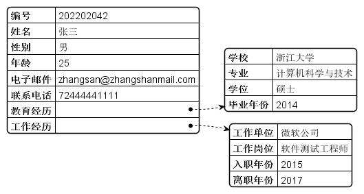
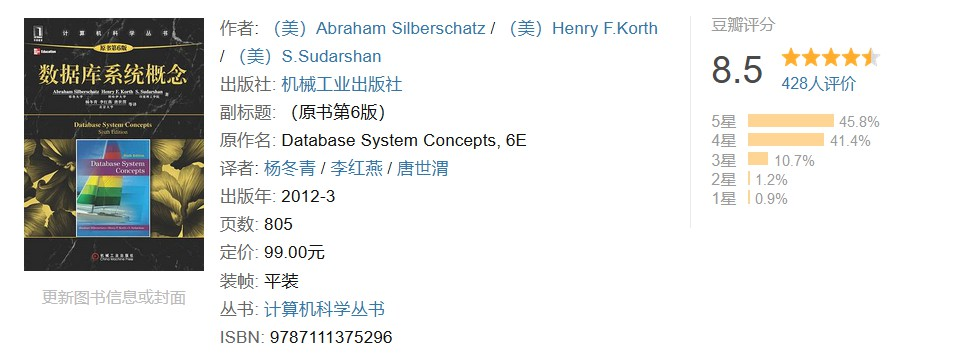

#! https://zhuanlan.zhihu.com/p/600878556
# 关于数据库及其书籍推荐

如今，我们常用“信息时代”这四个字来定义自己所生活的时代。这个时代最基本的特征之一就是人们每天都要处理并传递海量的信息，数据是信息在计算机设备中最基本的存储单元。但这些数据包含了数字、文字、图像、音频和视频等多种形式，它们通常在计算机中各有各的编码和存储方式，非常不利于进行成规模的统一处理。为了解决这一不利因素，人们发明出了一种被称之为**数据库（database）**的数据存储系统，以便用某种统一的结构化形式来存储海量的数据。在这篇文章中，我们将聚焦于数据库相关领域的讨论，并以推荐书目的形式来为读者规划在这一课题上的学习路线图，以供参考。

## 数据库概述

顾名思义，“数据库”就是一种可以让人们像管理物品仓库一样组织、增减并存储数据的专用软件系统，人们通常用它来解决大规模的数据存取问题。下面，就让我们从数据的*存储结构*的角度来解释一下数据库是如何解决问题的。

从概念上来说，对数据存储结构的描述主要有物理和逻辑两个不同层面上的表述形式，其中，数据在物理层面上的表述形式定义的是它在计算机存储设备上的存储方式，主要记录的是数据在存储设备中所占的空间大小和存储位置。在这种表述形式中，人们通常会用到以下术语。

- **位（bit）**：这是数据在物理层面上的最小存储单位，指的是单个二进制数字在存储设备中所占的空间大小。
- **字节（byte）**：8个位的数据所占的存储空间可称为一个字节，通常对应的是一个ASCII码字符。
- **字（word）**：若干个字节的数据所占的存储空间可称为一个字。一个字所含的二进制位数被称为字长，不同的计算机的字长是不同的，如今常见的计算机字长有16位、32位、64位、128位等。
- **块（block）**：这是内存储器和外存储器交换信息的最小单位，每个块的大小通常为256字节或512字节、1024 字节等。
- **卷（volume）**：这是一台输入输出设备所能装载的全部有用信息，例如我们既可以将磁带机的一盘磁带视为一卷，也可以将磁盘设备的一个盘组视为一卷。

而数据在逻辑层面的表述形式则是在定义人们在计算机中操作数据的方式，它的内容主要包含两个层次，一个层次是对现实世界的抽象化描述，另一个层次则是对数据库管理系统的技术支持。在这种表述形式中，人们通常会用到以下术语。

- **实体（entity）**：该术语主要用于描述现实世界中客观存在的东西，它既可以是具体的、有形的对象，也可以是抽象的、无形的对象。例如书、简历都可以被视为一个实体。
- **属性（attribute）**：该术语主要用于描述数据实体的各种特性，例如，书作为一个数据实体应该包括书名、书号、作者、出版社、出版日期、页数、价格等属性。
- **实体集（entities）**：该术语主要用于描述由属性完全相同的同类实体所组成的集合。例如，图书馆所有的书籍可被视为一个实体集，档案库中所有人的简历也可以被视为是一个实体集。
- **标识符（identifier）**：该术语主要指的是可用于在实体集中唯一地标识每个实体的属性或属性集。例如，书号属性就是书这个实体的标识符。

我们可以通过上述两种表述形式来描述现实世界中的数据在数据库中的存储结构，从而实现对这些数据统一而有效的存储。而对于数据库中数据的具体操纵和管理，我们就需要借助于另 一种被称作**数据库管理系统（Database Management System）**的大型软件系统来完成了，该软件系统能帮助人们像管理货物仓库中的货物一样来对数据库进行统一地管理，并保证数据在整个处理过程的安全性和完整性。它可以支持多个应用程序和用户用不同的方法在同时或不同时刻去建立，修改和询问数据库。如果读者想全面性地了解一下数据库管理系统的各种实现细节，我个人会推荐大家去阅读一下《数据库系统实现》这本书。

这本书是斯坦福大学在教授数据库系列课程时的御用教科书之一，书中对数据库管理系统的实现原理进行了深入阐述，并具体讨论了组成数据库管理系统的三个主要成分——存储管理器、查询处理器和事务管理器的实现技术。

## 学习路线规划

在了解了数据库的基本概念及其解决问题的思路之后，我们就可以根据自己的工作需求来学习这门专业所需要的相关知识了。下面，就让我们先从数据库的逻辑设计工作开始切入吧。

### 数据库的逻辑设计

众所周知，软件开发这项工作的本质就是将人们在现实世界中可以用中文、英文、阿拉伯文等自然语言描述的客观事物抽象成某种在计算机中可被编码的数据实体。例如在现实世界中，我们描述某个人的简历时应该会提供这份简历的编号、姓名、性别、年龄、教育经历、工作经历、电子邮件、联系电话等信息，那么到了数据库中，我们需要做的就是在计算机中抽象化出一个以这些信息为属性的数据实体。然后，服务端在获取到该数据实体时就会自动将其识别为一份属于某个人的简历数据，并在其符合查询要求时打包成响应数据返回给客户端。而客户端在拿到这份简历数据之后，就会自行将它们填充到指定的简历模板中，呈现给用户一个完整可用的简历文档。所以，我们在设计应用程序的第一步就是要按照用于描述简历这个实体的各项属性来设计它在数据库中的存储结构。

然而，如果我们只按照上述属性来设计简历在数据库中的存储结构的话，很快就会遇到亟待解决的第二个问题。那就是该实体的某部分属性本身也是一个包含了若干属性的实体，例如对于其“教育经历”属性，它本身也需要通过学校、专业、学位以及毕业年份等属性来描述。同样的，其“工作经历”属性也需要通过工作单位、工作岗位、入职年份与离职年份等属性来描述，它们在数据库中的存储结构应该被设计成简历主数据的子数据、例如，对于某个叫张三的人来说，其简历的主数据与子数据在数据库中的存储结构大致上应如下图所示。

当然了，在具体如何实现上述主数据和子数据的存储问题上，当前的数据库设计工作主要有关系型数据库与非关系型数据库两大类解决方案可供选择。下面，我们就分别来介绍一下这两大类解决方案。

### 关系型数据库设计

关系型数据库是以关系代数和集合论为理论基础来设计的数据管理系统，诞生于上世纪七十年代。在非关系型数据库出现之前，我们在实际开发中使用的绝大部分数据库，譬如企业级应用开发中常用的 Oracle、DB2，开源社区常用的 MySQL、PostgreSQL 以及嵌入式程序开发中常用的 SQLite 都属于关系型数据库。

在关系型数据库中，我们通常会用*表（table）*的结构来存储由属性系统的数据实体，表中的各个*字段（field）*对应的就是用于描述数据实体的各项属性。而该数据集合中的每一条数据也就成为了该表中的每一行*记录（record）*。然后，我们要做的就是使用设置*键值（key）*字段等方式在数据表之间建立起某种关联，以表示不同数据集合之间的“*关系（relation）*”。例如对于之前提到的简历这个实体，我们在关系型数据库中通常会先将它的主数据和子数据分别设计成`resumes`、`education`和`professional`这三张表，然后再为其中代表子数据的`education`和`professional`这两张表中各自增加一个可用作标识符的字段，以便在它们与代表主数据的表之间建立起关系，即在`resumes`表中，“教育经历”和“工作经历”这两个字段的值就变成了相关子数据在对应表中的唯一标识，这样三张表之间的关系就建立起来了。例如，张三的简历数据在关系型数据库中的存储应该如下图所示。

在上述数据库设计中，我们首先为`education`和`professional`这两张表各增加了一个名为“编号”的标识符字段，以作为它们各自的键值。然后，我们在`resumes`表中就只需要在“教育经历”和“工作经历”字段中分别填入相应的编号值（考虑到每个人可能都有多个学历和工作经历，所以这里应该是可以填写多个编号值的），就可以建立起这三张数据表之间的关系了。接下来，而我们也就可以根据这些数据表结构和它们之间的关系来对数据库进行操作了。

另外值得一提的是，关系型数据库中的数据操作通常都是通过 SQL 来完成的。SQL 是一种专用于描述关系型数据库中“表”的结构，以及表之间的“关系”的数据查询语言，目前主流的关系型数据库产品都提供了对 SQL 的支持，并且也都各自做了相应的扩展。在这里，如果读者系统性地学习关系型数据库的设计原则及其具体方法，我个人会推荐大家去阅读一下《数据库系统概念》这本书。

这本书是数据库系统方面的经典教材之一，其内容既包含数据库系统基本概念，又反映数据库技术新进展。它目前已被斯坦福大学、耶鲁大学、康奈尔大学等许多国际著名大学所采用，一直在学术界享有很高的权威地位。

### 非关系型数据库设计

非关系型数据库通常也被称为 NoSQL 数据库。NoSQL（Not Only SQL）数据库这一概念最早出现于 1998 年，后来逐步发展成了可以不使用 SQL 操作数据的非关系型数据库的统称。相对于传统的关系型数据库来说，NoSQL 数据库提供的是一种弱结构化的数据存取模式，通常不需要事先定义严格的数据表结构以及数据表之间的联系，它允许我们以一种更自由、更松散的方式来操作数据库中的数据。这样做的好处是让人们不再需要为了使用数据库而专门学习 SQL，并且它也提高了相关应用程序与数据库的交互效率，缺点是由于这类数据库本身对其存储数据的结构大多都缺乏强制性的约束，保持数据在结构上的一致性的任务就落在了使用它的应用程序的开发者身上，我们在选择这类数据库的时候需要谨记“能担负多大的责任才能享受多大自由”的原则，至少在程序设计领域，享受无能力承担相应责任的自由绝对会导致一场无法挽回的。

既然是关系型数据库之外数据库系统的统称，那么 NoSQL 数据库必然就有不同的分类。下面，就让我们来简单介绍一下这些分类：

- **以键/值对形式存储的数据库**：
  这一类数据库主要包括 LevelDB、Redis 等，其数据存储结构是一个散列表，以键/值对的形式来存取数据，其主要优势在于使用简单，且容易部署。

- **以列结构形式存储的数据库**：
  这一类数据库主要包括 Cassandra、HBase 等，它通常被用来应对分布式存储的海量数据。

- **以图结构形式存储的数据库**：
  这一类数据库主要包括 Neo4J、OrientDB 等，与列结构的数据库以及刚性结构的SQL数据库相比，它具有更为灵活的存取模型，并且能很方便地扩展到多个服务器上。

- **以文档形式存储的数据库**：
  这一类数据库主要包括 MongoDB、CouchDB 等，其灵感是来自于 Lotus Notes 办公软件，它本质上是一种针对文档的版本控制系统，而其文档本身则采用了某种类似于 JSON 的半结构化格式来存储数据，所以该类数据库也可以被视为以键/值对形式存储数据形式的一种升级。

在这里，如果读者系统性地了解非关系型数据库的核心概念及其具体使用方法，我个人会推荐大家去阅读一下《NoSQL 精粹》这本书。

这本书为正在考虑是否可以使用，以及如何使用 NoSQL 数据库的开发者提供了可靠的参考依据。它由世界级软件开发大师 Martin Fowler 与 Jolt 生产效率大奖图书作者 Pramod J. Sadalage 共同撰写。书中全方位比较了关系型数据库与 NoSQL 数据库的异同；分别以 Riak、MongoDB、Cassandra 和 Neo4J 为代表，详细讲解了键值数据库、文档数据库、列族数据库和图数据库这 4 大类 NoSQL 数据库的优劣势、用法和适用场合；深入探讨了实现 NoSQL 数据库系统的各种细节，以及与关系型数据库的混用。

## 结束语

最后需要说明的是，我们在这里所规划的只是学习数据库的基本路线。如果进入到具体的研究工作或软件开发中，读者还需要根据自己使用的数据库产品来阅读更具体的资料。例如，如果我们想使用像 MySQL、SQLite 这样的关系型数据库，那就需要去阅读一下《MySQL 必知必会》、《SQLite 权威指南》这样的书籍。而如果我们想使用 MongoDB、Redis 这样的非关系型数据库，那就需要去参考一些像《MongoDB 实战》、《Redis 开发与运维》这样的书籍。
