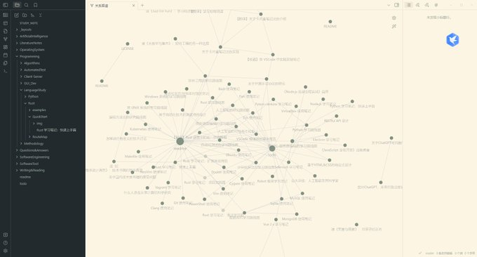

# 关于卡片盒笔记法的实践

这篇笔记将用于记录本人在实践卡片盒笔记法过程中所整理的心得体会，它将被保存在[本笔记库](https://github.com/owlman/study_note)项目的`Writing&Reading/WritingExperience/`目录下、这项关于写作方法论的研究源自于 2022 年 5 月 2 日，本人在看了来自马来西亚的视频博主[春小喜所做的科普](https://www.bilibili.com/video/BV16T4y197ka/)之后，觉得这种写作方法有助于提高非虚构类写作的能力，于是就决定开始阅读《卡片笔记写作法》这本书。起初读的是该书 kindle 电子版，因初读体验不错，后来又买了纸版进行重新细读和研究，历经一年多的学习与实践，现将个人的心得、体会以及使用的工具分享在这里。具体来说，我将会在这篇笔记中做以下议题的相关讨论。

- 关于卡片盒笔记法的参考资料；
- 卡片盒笔记法的来历及其作用；
- 卡片盒笔记法及其相关工具的实践心得；

## 参考资料

- 参考网站：
  - [Zettelkasten Knowledge and Information Management • Zettelkasten Method](https://zettelkasten.de/)
- 参考文献：
  - [Introduction to the Zettelkasten Method](https://zettelkasten.de/introduction/) （文章翻译：[[【翻译】关于卡片盒笔记法的介绍]]）；
  - [Learning How to Read](https://luhmann.surge.sh/learning-how-to-read) （文章翻译：[[【翻译】学习如何阅读]]）
- 参考书籍：
  - [《卡片笔记写作法》](https://book.douban.com/subject/35503571/)
- 参考视频：
  - [卡片盒笔记法的实战：flomo 版](https://www.bilibili.com/video/BV1H34y1B7FR/)
  - [Obsidian 的具体使用教程](https://www.bilibili.com/video/BV1H44y1n71k/)

## 术语列表
  
- **卡片盒笔记系统**：英文/德语：Zettelkasten，这是一种将笔记相互连接形成一个网状结构的超文本笔记系统。
- **卡片盒笔记法**：英文：Zettelkasten Method，建立卢曼笔记系统用到的一些具体方法。
- **笔记卡片**：英文/德语：Zettel，原指一张用来记录笔记的小纸片，现指使用卢曼笔记法记录的一条单独的笔记。
- **想法**：英文：Thought，卢曼笔记法要求每条笔记只记录一个 thought，thought 在中文中含义非常丰富，可以是一个术语、概念、理论、看法、点子，突然的灵感等等，这些在本文中统称为“想法”。
- **闪念笔记**：英文：Fleet Note，用于记录在脑海中一闪而过的想法和灵感的笔记。
- **文献笔记**：英文：Literature Note，用于记录在阅读过程中所理解的文献资料的笔记。
- **永久笔记**：英文：Permanent Note，用于记录某些永久性想法与观点的笔记。
- **思想之网**：英文：Web of Thought，由各种想法互相连接形成的网络，卢曼笔记系统就是一张思想之网。
- **链接**：英文：Link，名词，指代每条笔记卡片的 ID。
- **关联**：英文：Connect，动词，指在一条笔记与另一条笔记之间建立链接的动作/操作。

## 理解卡片盒笔记法

卡片盒笔记法是一整套成体系的、用于做笔记并以笔记形式来实现**知识管理**与**高效写作**的方法。该方法源自于德国当代著名社会学家[[尼克拉斯·卢曼]]（[关于他的维基百科](https://zh.wikipedia.org/wiki/%E5%B0%BC%E5%85%8B%E6%8B%89%E6%96%AF%C2%B7%E5%8D%A2%E6%9B%BC)），他是一位高产的写作者，一生不仅出版了 50 本书和 600 多篇文章，在身后留下的遗产里还有 150 多份未完成的手稿（其中不少手稿的篇幅达到了千页以上）。也就是说，卢曼的实际生产力是远超自己的出版作品数量的。而对于这样高产的写作能力，卢曼本人却将其归功于自己所使用的卡片盒笔记系统，这引发了人们对于该笔记系统及其使用方法的好奇心与研究热情。毕竟作为一个写作者，谁不想获得像卢曼一样的高生产力呢？

从组织结构上来看，卢曼所使用的卡片盒笔记系统是一个带有特殊线性（twist）特征的、纸质的卡片笔记集，它本质上是一个以“盒子”为单位来进行组织的超文本信息系统。该系统中，写作者们需要安排合理的时间和精力来浏览和整理自己平时所累积的笔记内容，并基于这些笔记来完成写作工作。根据总结，卢曼基于卡片盒笔记系统的写作方法，主要是按照以下 8 个步骤来进行的。

1. 平日里养成收集**闪念笔记**的习惯，目的是随时记录下我们脑海中亟待研究的问题，以及某些一闪而过的简单想法和写作灵感。
2. 养成在阅读资料时做**文献笔记**的习惯，目的是整理和消化我们所看过的论文、书籍及视频等文献资料，并同时做好这些文献资料的索引工作。
3. 定期将上述两种笔记整理成**永久笔记**。目的是记录我们的思考过程。在执行这一步骤时，我们需要用自己的语言整合闪念笔记与文献笔记，并形成有价值的想法。
4. 把永久笔记**加入到卡片盒中**，目的是将这张「新卡片」与卡片盒中其他概念相关的「旧卡片」关联起来。在执行这一步骤时，我们需要去思考如何在新的笔记与现有笔记之间构建双向的链接，以便逐步建立网状结构的笔记系统。
5. 从卡片盒里**发展出想法**，这一步需要我们定期复查自己的永久笔记，并从中制定出自己想要研究的各种方向，以便在日后的阅读、学习中有意识地加强对相关信息的获取。
6. 在卡片盒中**归纳主题**，这一步需要我们从卡片盒中归纳出已经能自成主题的笔记，并将它们打上相同的主题标签，然后根据后续的实际情况来调整主题的研究方向，既可以改变原有的观点，也可以加强原有的论述。
7. 待某一主题的笔记累积到足够多时，我们就可以考虑将这些相关的笔记**拼凑成某一论文和专著的草稿**。
8. **将草稿润饰成可发表的作品**，这一步需要我们调整草稿用词，将其逐步打磨成符合出版标准的专著。

总之，卡片盒笔记系统主要是一个用于辅助思考的个人知识管理工具，基于这一工具创建的笔记系统具有类似于 [维基百科（Wikipedia）](https://zh.wikipedia.org/) 的超文本特性，这种特性能将我们的思想观点、文献资料连接成一个网状结构的知识库。换而言之，卡片盒笔记法与其他笔记方法最大的不同是，它主张创建一个思想之网，而不是单纯地收集一个个孤立的、任意形式的笔记，它强调的是建立信息之间的联系（connection），而不是单纯的信息收集（collection）。

## 使用数字化工具

比卢曼幸运的是，我们所生活的是一个已经有了超链接的数字化时代，可以轻松使用软件工具来构建他所主张的这种超文本信息系统。但如果想使用软件来建立专属于自己的卡片盒笔记系统，我们所选择的软件应该具备以下基本功能：

1. **支持构建超文本系统**：这项功能必须要让人在阅读任何一篇笔记时都能借助于超链接直接跳转到任何与当前笔记相关联的其他笔记。
2. **支持全文搜索功能**：全文搜索功能相当于卢曼在他的卡片盒笔记系统中利用索引表提供的、进入系统的入口（全文搜索显然更强大）。
3. **支持沙盒功能**：卢曼建立他的卡片盒笔记系统时还具备了一个隐含设施，那就是他的办公桌。这个设施让他可以随意地调阅和整理自己的笔记卡片。数字化的卡片盒笔记系统不容易做到这一点，因此在选择构建该系统的软件时应注意笔记的可整理性，最好是一款支持纯文本格式和 Markdown 语法的笔记软件。

接下来，笔者将基于个人对卡片盒笔记法的实践经验来向大家推荐几款不错的笔记软件：

- [Flomo 卡片笔记](https://flomoapp.com/)：如果读者记笔记的主要工具是手机之类的移动端设备，且没有在本地存储笔记的需求，那么 Flomo 无疑是一款非常值得推荐的笔记软件，它是严格按照卡片盒笔记法的原则来进行设计的线上笔记系统，支持所有的移动端平台，使用方法简单、便捷，没有任何华而不实的多余功能，非常有助于我们随时随地拿起手机记下那些在脑海中一闪而过、稍纵即逝的想法和灵感。关于这款笔记的具体用法，读者可执行参考 Flomo 提供的[官方文档](https://help.flomoapp.com/)。

- [Obsidian 笔记系统](https://obsidian.md/)：如果读者记笔记的主要工具是Mac/PC之类的办公型设备，且希望将笔记以纯文本文件的格式储存在本地或指定的文件服务器中，那么 Obsidian 绝对是一款值得考虑的笔记系统，它很好地支持了 Markdown 语法，并提供了非常简单易用的超链接与全文搜索功能，非常有助于像笔者这样具有重度写作需求的人日常创建并管理文献笔记与永久笔记，更好地建立基于卡片盒笔记法的工作流程。

- [VSCode 的 Foam 插件](https://github.com/foambubble/foam)：如果读者的笔记系统中不只有 Markdown 格式的笔记文件，还包含一些用 Python、C 等编程语言编写的代码示例文件，为知名的代码编辑器 VSCode 安装一款叫做 Foam 的插件也是一个不错的选择，该插件能让我们在 VSCode 编辑器中使用到 Obsidian 的主要功能，包括方便的超链接功能，以及通过超链接构建的、可视化的思想之网等。关于该插件的具体使用方法，读者可参考我整理的另一篇笔记：《[[【收藏】在 VSCode 中实践双链笔记]]》。

需要注意的是，卡片盒笔记法的核心实践是建立笔记之间的关联，并利用这些关联让我们的思想之网成为有机增长的知识宝库，然后将知识回馈到写作过程中去，因此在选择构建卡片盒笔记法的软件时千万不要将精力放在如何让笔记看起来像真实的卡片，以及如何为这些卡片创建各种赏心悦目的模板等问题上来，这就本末倒置了，这也是我在这里不会推荐 Notion 这类笔记软件的原因，它功能虽然强大，但太折腾了。

最后，让我们来见证一下卡片盒笔记法所谓的、专属于笔者个人的“思想之网”在 Obsidian 笔记系统中的具现化效果。

<!--  -->

---
#已完成
