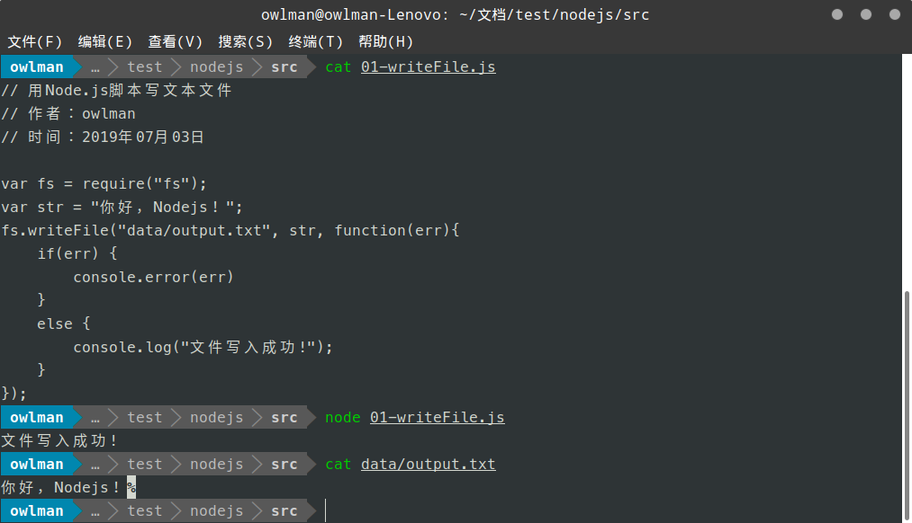

# Node.js学习笔记

## 学习计划

- 学习资料
  - 视频教程： [黑马程序员-nodejs教学课程](https://www.bilibili.com/video/av27670326?p=1)
  - 书籍教材： [《node.js实战》](https://book.douban.com/subject/25870705/)
  - 线上论坛： [cnode论坛](https://cnodejs.org/)
- 学习目标
  - 学习并体验全栈开发
  - 开发一个“网上书店”程序
  - 撰写《Web开发入门导引》
- 时间安排
  - 学习知识：预计花费三周，以视频教程为主线，以书籍教材为辅助，掌握Node.js的基本知识。
  - 开发程序：预计花费四周，开发一个基于Node.js的“网上书店”程序。
  - 撰写书籍：预计花费三月，以”网上书店“程序的开发过程为主轴，撰写一本名为《web入门开发导引》的书籍。

## Node.js概述

### Node.js是什么

Node.js是一个`JavaScript`运行时环境，它移植了Google chrome浏览器的v8引擎。作为在服务器端运行的`JavaScript`环境。

### Node.js能做什么


### Node.js的特性

Node.js保留了`JavaScript`在浏览器端中所使用的大部分API，Node.js的作者Ryan Dahl并没有改变这门语言本身的任何特性，它的编程模型依旧将基于作用域和原型链这些概念，这让Node.js在服务器端上的应用具备了以下这些与众不同的特性：

- **单一线程**：
  Node.js沿用了`JavaScript`单一线程的执行特性。即在Node.js中，`JavaScript`的执行线程与其他线程之间同样也是无法共享状态的。单一线程的最大好处是不用像多线程编程那样处理很容易产生bug的同步问题，它从根本上杜绝了死锁问题，也避免了线程上下文交换所带来的性能上的开销。当然了，单一线程的执行方式也有它自身的弱点，譬如，它无法充分发挥多核处理器的性能、一个错误就会导致整个程序崩溃，以及执行大量计算时会因长期占用处理器而影响其他异步I/O的执行。

- **事件驱动**：
  在Web开发领域，`JavaScript`如今在浏览器端正承担了越来越重要的角色，其事件驱动的编程模型也逐渐深入人心。当然了，这种编程模型虽然具有轻量级、松耦合等优势，但在多个异步任务的场景下，由于程序中的各个事件是彼此独立的，它们之间的协作就成为了一个需要我们费心解决的问题。

- **异步编程**：
  在Node.js中，大部分操作都是以异步调用的方式来进行的。Node.js的开发者们在其底层构建了许多异步I/O的API，包括文件读取、网络请求等。这样一来，我们就可以很自然地在语言层面上并行地执行I/O操作，这可以使得程序中的每个调用都无须等待之前的I/O调用结束，这带来了极大的效率提升。例如，如果我们想要读取两个相互不依赖的文件，如果采用的是异步I/O，其耗费的时间只取决于读取较慢的那个文件，而如果采用同步I/O的话，其耗时就是两个文件的读取时间之和了，异步操作模型带来的优势是显而易见的。

  除此之外，Node.js对回调函数的支持也是其一大特色。回调函数是执行异步调用并接收其返回数据的最佳方式，当然了，这种方式也会导致代码的编写顺序与其具体执行顺序的不一致，对于很多习惯同步思路编程的人来说，阅读这样的代码会是一个不小的挑战。另外在流程控制方面，也会由于程序中穿插了各种异步方法和回调函数，它也远没有常规的同步方式那么一目了然，这也会给我们对程序的理解和调试带来一定的麻烦。

### Node.js的安装

Node.js的安装主要有两种方式，通常在Windows和MacOS下，我们会采用下载`.msi`和`.pkg`格式的安装包，使用安装向导来进行安装。而在Linux和FreeBSD这一类系统中，我们则往往会采用apt和yum这样的包管理器来安装。这两种方式都不复杂，下面以Windows和Ubuntu为代表，简单介绍一下这两种安装方法。

#### 使用安装包

在Windows下想要安装Node.js，首先要选择一个合适的版本。打开Node.js的官网`https://nodejs.org/`，我们会看到有LTS和Current两种版本可供下载。LTS版即受到长期支持的版本，其组件通常都经历过了充分的测试，比较稳定，适合于正式的生产开发。而Current版本则是最新的版本，通常包含了最新纳入的新特性，比较适合想对Node.js本身进行研究的朋友。


下载完`.msi`格式的安装包之后，我们就可以打开安装包启动安装向导了。在安装的开始阶段，安装向导会要求我们设置一些选项，大多数时候只需采用默认选项，直接点击「Next」即可。只是在组件选择的页面中，需要注意一下，如果你对Node.js的组件并不熟悉，最好选择安装全部组件。另外，请记得点开下图中那个「add path」选项前面的+号，这样安装程序就会主动把NodeJS和NPM这两个模块的命令路径添加到系统环境变量里，这对初学者来说是非常方便的。


待一切选项设置完成之后，我们就可以点击下面的「Install」即可完成安装。


如果一切顺利，我们在Windows中打开`cmd`终端，在其中输入`node -v`命令并回车之后，应该就会看到相关的版本信息。


#### 使用包管理器

在Ubuntu这类Linux操作系统中，我们安装软件往往都会选择使用apt这一类的包管理器，简单而方便，依次执行以下命令即可：

```bash
 sudo apt update
 sudo apt install nodejs
 # 最新的Node.js已经集成了npm，所以某些情况下是无需单独安装npm的，这具体还要取决于你使用的软件源。
 sudo apt install npm
```

除此之外，我们还能安装n管理器来管理Node.js的版本，其安装命令如下：

```bash
sudo npm install -g n
```

该工具的具体使用方式如下：

```bash
sudo n lts            # 长期支持
sudo n stable         # 稳定版
sudo n latest         # 最新版
sudo n 12.4.0         # 直接指定版本
sudo n                # 使用上下键切换已有版本
```

同样的，如果一切顺利，我们打开命令行终端，并在其中输入`node -v`命令并回车之后，应该就会看到相关的版本信息。

## 编程实例

### 01. Hello world

由于Node.js只是`JavaScript`语言的运行时环境，所以它并不会限制`JavaScript`代码的具体运行形式。为了说明这一点，下面将使用四种形式来说“Hello”。

#### 1. 终端输出

创建第一个Node.js脚本，步骤如下：

1. 在`src`目录下执行`touch 01-sayHello.js`命令。
2. 执行`vim 01-sayHello.js`命令打开该脚本文件。
3. 在`01-sayHello.js`脚本文件中输入如下代码：

    ```JavaScript
    // 第一个Node.js脚本
    // 作者：owlman
    // 时间：2019年07月03日

    var name = "owlman";
    console.log("Hello " + name);
    ```

4. 保存文件后，在`src`目录下执行`node 01-sayHello.js`命令，结果如下：

    

#### 2. 文件读写

用Node.js脚本读文本文件，步骤如下：

1. 在`src`目录下执行`touch 01-readFile.js`命令。
2. 在`src/data`目录下执行`touch text-data.txt`命令，并在其中输入以下内容：

    ```bash
    Hello，owlman，欢迎学习Nodejs。

    接下来，请读取下面这首诗：

    朝辞白帝彩云间，
    千里江陵一日还。
    两岸猿声啼不住，
    轻舟已过万重山。
    ```

3. 执行`vim 01-readFile.js`命令打开脚本文件，输入如下代码：

    ```JavaScript
    // 用Node.js脚本读取文本文件
    // 作者：owlman
    // 时间：2019年07月03日

    var fs = require("fs");
    fs.readFile("data/text-data.txt", function(err, data) {
        if(err) {
            return console.error(err);
        }
        console.log(data.toString());
    });
    ```

4. 保存文件后，在`src`目录下执行`node 01-readFile.js`命令，结果如下：

    

用Node.js脚本写文本文件，步骤如下：

1. 在`src`目录下执行`touch 01-writeFile.js`命令。
2. 执行`vim 01-writeFile.js`命令打开脚本文件，输入如下代码：

    ```JavaScript
    // 用Node.js脚本写文本文件
    // 作者：owlman
    // 时间：2019年07月03日

    var fs = require("fs");
    var str = "你好，Nodejs！";
    fs.writeFile("data/output.txt", str, function(err){
        if(err) {
            console.error(err)
        }
        else {
            console.log("文件写入成功!");
        }
    });
    ```

3. 保存文件后，在`src`目录下执行`node 01-writeFile.js`命令，结果如下：

    

#### 3. Web服务

用Node.js脚本创建Web服务，步骤如下：

1. 在`src`目录下执行`touch 01-webServer.js`命令。
2. 执行`vim 01-webServer.js`命令打开脚本文件，输入如下代码：

    ```JavaScript
    // 用Node.js脚本构建Web服务器
    // 作者：owlman
    // 时间：2019年07月05日

    var http = require("http");
    var server = http.createServer();

    server.on("request", function(req, res){
        res.end("<h1>你好，Nodejs！</h1>");
    });

    server.listen(8080, function(){
        console.log("请访问http://localhost:8080/，按Ctrl+C终止服务！")
    });
    ```

3. 保存文件后，在`src`目录下执行`node 01-webServer.js`命令，并用浏览器访问`http://localhost:8080/`，结果如下：

    

#### 4. TCP服务

1. 在`src`目录下执行`touch 01-tcpServer.js`命令。
2. 执行`vim 01-tcpServer.js`命令打开脚本文件，输入如下代码：

    ```JavaScript
    // 用Node.js脚本构建TCP服务器
    // 作者：owlman
    // 时间：2019年07月05日

    var net = require('net');
    var server = net.createServer(function (socket) {
    console.log("连接来自" + socket.remoteAddress);
    socket.end("你好，Nodejs！\n");
    });

    server.listen(7000, "localhost", function(){
        console.log("TCP服务器监听 localhost 的 7000 端口，按 Ctrl+C 终止服务！");
    });

    ```

3. 保存文件后，在`src`目录下执行`node 01-tcpServer.js`命令，并用`telnet localhost 7000`命令测试该服务器，结果如下：

    

## 02. 模块的导入与导出

